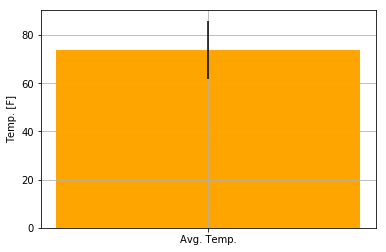

```python
import pandas as pd
import matplotlib.pyplot as plt
```


```python
import sqlalchemy
from sqlalchemy import create_engine, MetaData
from sqlalchemy.ext.declarative import declarative_base
from sqlalchemy import Column, Integer, String, Numeric, Text, Float
from sqlalchemy.ext.automap import automap_base
from sqlalchemy.orm import Session
from sqlalchemy import create_engine, inspect, func
import sqlite3
```


```python
Start_date="2011-05-10"
End_date="2011-05-22"
```


```python
engine1 = create_engine("sqlite:///measurements.sqlite")
engine2 = create_engine("sqlite:///stations.sqlite")
```


```python
conn1 = engine1.connect()
conn2 = engine2.connect()
```


```python
conn1.execute("select * from weather order by date desc limit 5").fetchall()
```


    [(2685, 'USC00519397', '2017-08-23', 0, 81),
     (7318, 'USC00514830', '2017-08-23', 0, 82),
     (10915, 'USC00519523', '2017-08-23', 0.08, 82),
     (18103, 'USC00516128', '2017-08-23', 0.45, 76),
     (2684, 'USC00519397', '2017-08-22', 0, 82)]


```python
Base1 = automap_base()
Base1.prepare(engine1, reflect=True)
Base1.classes.keys()
Base2 = automap_base()
Base2.prepare(engine2, reflect=True)
Base2.classes.keys()
```


    ['stations']


```python
Measurement = Base1.classes.weather
Stations= Base2.classes.stations
```


```python
session1 = Session(engine1) 
session2 = Session(engine2)
```


```python
# #Precipitation Analysis

# #Design a query to retrieve the last 12 months of precipitation data.
perc = session1.query(Measurement).filter(Measurement.date>='2016-08-23').all()
for el in perc:
    print("Station:{0} Date:{1} Percipitation: {2}".format(el.station,el.date,el.prcp))

```

    /anaconda3/lib/python3.6/site-packages/sqlalchemy/sql/sqltypes.py:603: SAWarning: Dialect sqlite+pysqlite does *not* support Decimal objects natively, and SQLAlchemy must convert from floating point - rounding errors and other issues may occur. Please consider storing Decimal numbers as strings or integers on this platform for lossless storage.
      'storage.' % (dialect.name, dialect.driver))


    Station:USC00519397 Date:2016-08-23 Percipitation: 0E-10
    Station:USC00519397 Date:2016-08-24 Percipitation: 0.0800000000
    Station:USC00519397 Date:2016-08-25 Percipitation: 0.0800000000
    Station:USC00519397 Date:2016-08-26 Percipitation: 0E-10
    Station:USC00519397 Date:2016-08-27 Percipitation: 0E-10
    Station:USC00519397 Date:2016-08-28 Percipitation: 0.0100000000
    Station:USC00519397 Date:2016-08-29 Percipitation: 0E-10
    Station:USC00519397 Date:2016-08-30 Percipitation: 0E-10
    Station:USC00519397 Date:2016-08-31 Percipitation: 0.1300000000
    Station:USC00519397 Date:2016-09-01 Percipitation: 0E-10
    Station:USC00519397 Date:2016-09-02 Percipitation: 0E-10
    Station:USC00519397 Date:2016-09-03 Percipitation: 0E-10
    Station:USC00519397 Date:2016-09-04 Percipitation: 0.0300000000
    Station:USC00519397 Date:2016-09-07 Percipitation: 0.0500000000
    Station:USC00519397 Date:2016-09-08 Percipitation: 0E-10
    Station:USC00519397 Date:2016-09-09 Percipitation: 0.0300000000
    Station:USC00519397 Date:2016-09-10 Percipitation: 0E-10
    Station:USC00519397 Date:2016-09-11 Percipitation: 0.0500000000
    Station:USC00519397 Date:2016-09-12 Percipitation: 0E-10
    Station:USC00519397 Date:2016-09-13 Percipitation: 0.0200000000
    Station:USC00519397 Date:2016-09-14 Percipitation: 1.3200000000
    Station:USC00519397 Date:2016-09-15 Percipitation: 0.4200000000
    Station:USC00519397 Date:2016-09-16 Percipitation: 0.0600000000
    Station:USC00519397 Date:2016-09-17 Percipitation: 0.0500000000
    Station:USC00519397 Date:2016-09-18 Percipitation: 0E-10
    Station:USC00519397 Date:2016-09-19 Percipitation: 0E-10
    Station:USC00519397 Date:2016-09-20 Percipitation: 0E-10
    Station:USC00519397 Date:2016-09-21 Percipitation: 0E-10
    Station:USC00519397 Date:2016-09-22 Percipitation: 0.0200000000
    Station:USC00519397 Date:2016-09-23 Percipitation: 0E-10
    Station:USC00519397 Date:2016-09-24 Percipitation: 0E-10
    Station:USC00519397 Date:2016-09-25 Percipitation: 0E-10
    Station:USC00519397 Date:2016-09-26 Percipitation: 0.0600000000
    Station:USC00519397 Date:2016-09-27 Percipitation: 0.0200000000
    Station:USC00519397 Date:2016-09-28 Percipitation: 0E-10
    Station:USC00519397 Date:2016-09-29 Percipitation: 0E-10
    Station:USC00519397 Date:2016-09-30 Percipitation: 0E-10
    Station:USC00519397 Date:2016-10-01 Percipitation: 0E-10
    Station:USC00519397 Date:2016-10-02 Percipitation: 0E-10
    Station:USC00519397 Date:2016-10-03 Percipitation: 0E-10
    Station:USC00519397 Date:2016-10-04 Percipitation: 0E-10
    Station:USC00519397 Date:2016-10-05 Percipitation: 0E-10
    Station:USC00519397 Date:2016-10-06 Percipitation: 0E-10
    Station:USC00519397 Date:2016-10-07 Percipitation: 0E-10
    Station:USC00519397 Date:2016-10-08 Percipitation: 0E-10
    Station:USC00519397 Date:2016-10-09 Percipitation: 0E-10
    Station:USC00519397 Date:2016-10-10 Percipitation: 0E-10
    Station:USC00519397 Date:2016-10-11 Percipitation: 0E-10
    Station:USC00519397 Date:2016-10-12 Percipitation: 0E-10
    Station:USC00519397 Date:2016-10-13 Percipitation: 0E-10
    Station:USC00519397 Date:2016-10-14 Percipitation: 0E-10
    Station:USC00519397 Date:2016-10-15 Percipitation: 0E-10
    Station:USC00519397 Date:2016-10-16 Percipitation: 0E-10
    Station:USC00519397 Date:2016-10-17 Percipitation: 0.0100000000
    Station:USC00519397 Date:2016-10-18 Percipitation: 0E-10
    Station:USC00519397 Date:2016-10-19 Percipitation: 0E-10
    Station:USC00519397 Date:2016-10-20 Percipitation: 0E-10
    Station:USC00519397 Date:2016-10-21 Percipitation: 0.0500000000
    Station:USC00519397 Date:2016-10-22 Percipitation: 0.1500000000
    Station:USC00519397 Date:2016-10-23 Percipitation: 0.0100000000
    Station:USC00519397 Date:2016-10-24 Percipitation: 0E-10
    Station:USC00519397 Date:2016-10-25 Percipitation: 0.0300000000
    Station:USC00519397 Date:2016-10-26 Percipitation: 0E-10
    Station:USC00519397 Date:2016-10-27 Percipitation: 0E-10
    Station:USC00519397 Date:2016-10-28 Percipitation: 0E-10
    Station:USC00519397 Date:2016-10-29 Percipitation: 0E-10
    Station:USC00519397 Date:2016-10-30 Percipitation: 0.2400000000
    Station:USC00519397 Date:2016-10-31 Percipitation: 0.0300000000
    Station:USC00519397 Date:2016-11-01 Percipitation: 0E-10
    Station:USC00519397 Date:2016-11-02 Percipitation: 0E-10
    Station:USC00519397 Date:2016-11-03 Percipitation: 0E-10
    Station:USC00519397 Date:2016-11-04 Percipitation: 0E-10
    Station:USC00519397 Date:2016-11-05 Percipitation: 0E-10
    Station:USC00519397 Date:2016-11-06 Percipitation: 0E-10
    Station:USC00519397 Date:2016-11-07 Percipitation: 0E-10
    Station:USC00519397 Date:2016-11-08 Percipitation: 0.0700000000
    Station:USC00519397 Date:2016-11-09 Percipitation: 0E-10
    Station:USC00519397 Date:2016-11-10 Percipitation: 0E-10
    Station:USC00519397 Date:2016-11-11 Percipitation: 0E-10
    Station:USC00519397 Date:2016-11-12 Percipitation: 0E-10
    Station:USC00519397 Date:2016-11-13 Percipitation: 0E-10
    Station:USC00519397 Date:2016-11-14 Percipitation: 0E-10
    Station:USC00519397 Date:2016-11-15 Percipitation: 0E-10
    Station:USC00519397 Date:2016-11-16 Percipitation: 0E-10
    Station:USC00519397 Date:2016-11-17 Percipitation: 0E-10
    Station:USC00519397 Date:2016-11-18 Percipitation: 0E-10
    Station:USC00519397 Date:2016-11-19 Percipitation: 0.0300000000
    Station:USC00519397 Date:2016-11-20 Percipitation: 0.0500000000
    Station:USC00519397 Date:2016-11-21 Percipitation: 0.0100000000
    Station:USC00519397 Date:2016-11-22 Percipitation: 0.1300000000
    Station:USC00519397 Date:2016-11-23 Percipitation: 0.1400000000
    Station:USC00519397 Date:2016-11-24 Percipitation: 0.0500000000
    Station:USC00519397 Date:2016-11-25 Percipitation: 0.0500000000
    Station:USC00519397 Date:2016-11-26 Percipitation: 0.0500000000
    Station:USC00519397 Date:2016-11-27 Percipitation: 0E-10
    Station:USC00519397 Date:2016-11-28 Percipitation: 0.0100000000
    Station:USC00519397 Date:2016-11-29 Percipitation: 0E-10
    Station:USC00519397 Date:2016-11-30 Percipitation: 0.1400000000
    Station:USC00519397 Date:2016-12-01 Percipitation: 0.1200000000
    Station:USC00519397 Date:2016-12-02 Percipitation: 0.0300000000
    Station:USC00519397 Date:2016-12-03 Percipitation: 0E-10
    Station:USC00519397 Date:2016-12-04 Percipitation: 0.0300000000
    Station:USC00519397 Date:2016-12-05 Percipitation: 0.4300000000
    Station:USC00519397 Date:2016-12-06 Percipitation: 0.0200000000
    Station:USC00519397 Date:2016-12-07 Percipitation: 0E-10
    Station:USC00519397 Date:2016-12-08 Percipitation: 0.0300000000
    Station:USC00519397 Date:2016-12-09 Percipitation: 0.5200000000
    Station:USC00519397 Date:2016-12-10 Percipitation: 0.0500000000
    Station:USC00519397 Date:2016-12-11 Percipitation: 0.0400000000
    Station:USC00519397 Date:2016-12-12 Percipitation: 0.0100000000
    Station:USC00519397 Date:2016-12-13 Percipitation: 0.0500000000
    Station:USC00519397 Date:2016-12-14 Percipitation: 0.0300000000
    Station:USC00519397 Date:2016-12-15 Percipitation: 0E-10
    Station:USC00519397 Date:2016-12-16 Percipitation: 0E-10
    Station:USC00519397 Date:2016-12-17 Percipitation: 0.0100000000
    Station:USC00519397 Date:2016-12-18 Percipitation: 0.1300000000
    Station:USC00519397 Date:2016-12-19 Percipitation: 0.0100000000
    Station:USC00519397 Date:2016-12-20 Percipitation: 0E-10
    Station:USC00519397 Date:2016-12-21 Percipitation: 0E-10
    Station:USC00519397 Date:2016-12-22 Percipitation: 0.0100000000
    Station:USC00519397 Date:2016-12-23 Percipitation: 0.0100000000
    Station:USC00519397 Date:2016-12-24 Percipitation: 0.0100000000
    Station:USC00519397 Date:2016-12-25 Percipitation: 0E-10
    Station:USC00519397 Date:2016-12-26 Percipitation: 0.0200000000
    Station:USC00519397 Date:2016-12-27 Percipitation: 0E-10
    Station:USC00519397 Date:2016-12-28 Percipitation: 0.0200000000
    Station:USC00519397 Date:2016-12-29 Percipitation: 0.0400000000
    Station:USC00519397 Date:2016-12-30 Percipitation: 0.1200000000
    Station:USC00519397 Date:2016-12-31 Percipitation: 0.0100000000
    Station:USC00519397 Date:2017-01-01 Percipitation: 0E-10
    Station:USC00519397 Date:2017-01-02 Percipitation: 0E-10
    Station:USC00519397 Date:2017-01-03 Percipitation: 0E-10
    Station:USC00519397 Date:2017-01-04 Percipitation: 0E-10
    Station:USC00519397 Date:2017-01-05 Percipitation: 0E-10
    Station:USC00519397 Date:2017-01-06 Percipitation: 0E-10
    Station:USC00519397 Date:2017-01-07 Percipitation: 0E-10
    Station:USC00519397 Date:2017-01-08 Percipitation: 0E-10
    Station:USC00519397 Date:2017-01-09 Percipitation: 0E-10
    Station:USC00519397 Date:2017-01-10 Percipitation: 0E-10
    Station:USC00519397 Date:2017-01-11 Percipitation: 0E-10
    Station:USC00519397 Date:2017-01-12 Percipitation: 0E-10
    Station:USC00519397 Date:2017-01-13 Percipitation: 0E-10
    Station:USC00519397 Date:2017-01-14 Percipitation: 0E-10
    Station:USC00519397 Date:2017-01-15 Percipitation: 0E-10
    Station:USC00519397 Date:2017-01-16 Percipitation: 0E-10
    Station:USC00519397 Date:2017-01-17 Percipitation: 0E-10
    Station:USC00519397 Date:2017-01-18 Percipitation: 0E-10
    Station:USC00519397 Date:2017-01-19 Percipitation: 0E-10
    Station:USC00519397 Date:2017-01-20 Percipitation: 0E-10
    Station:USC00519397 Date:2017-01-21 Percipitation: 0E-10
    Station:USC00519397 Date:2017-01-22 Percipitation: 0.1600000000
    Station:USC00519397 Date:2017-01-23 Percipitation: 0E-10
    Station:USC00519397 Date:2017-01-24 Percipitation: 0.0400000000
    Station:USC00519397 Date:2017-01-25 Percipitation: 0.0300000000
    Station:USC00519397 Date:2017-01-26 Percipitation: 0E-10
    Station:USC00519397 Date:2017-01-27 Percipitation: 0E-10
    Station:USC00519397 Date:2017-01-28 Percipitation: 0E-10
    Station:USC00519397 Date:2017-01-29 Percipitation: 0.1800000000
    Station:USC00519397 Date:2017-01-30 Percipitation: 0E-10
    Station:USC00519397 Date:2017-01-31 Percipitation: 0E-10
    Station:USC00519397 Date:2017-02-01 Percipitation: 0E-10
    Station:USC00519397 Date:2017-02-02 Percipitation: 0E-10
    Station:USC00519397 Date:2017-02-03 Percipitation: 0E-10
    Station:USC00519397 Date:2017-02-04 Percipitation: 0E-10
    Station:USC00519397 Date:2017-02-05 Percipitation: 0E-10
    Station:USC00519397 Date:2017-02-06 Percipitation: 0E-10
    Station:USC00519397 Date:2017-02-07 Percipitation: 0.5100000000
    Station:USC00519397 Date:2017-02-08 Percipitation: 0E-10
    Station:USC00519397 Date:2017-02-09 Percipitation: 0E-10
    Station:USC00519397 Date:2017-02-10 Percipitation: 0E-10
    Station:USC00519397 Date:2017-02-11 Percipitation: 0.3100000000
    Station:USC00519397 Date:2017-02-12 Percipitation: 2.6200000000
    Station:USC00519397 Date:2017-02-13 Percipitation: 0.0100000000
    Station:USC00519397 Date:2017-02-14 Percipitation: 0E-10
    Station:USC00519397 Date:2017-02-15 Percipitation: 0E-10
    Station:USC00519397 Date:2017-02-16 Percipitation: 0.0700000000
    Station:USC00519397 Date:2017-02-17 Percipitation: 0E-10
    Station:USC00519397 Date:2017-02-18 Percipitation: 0E-10
    Station:USC00519397 Date:2017-02-19 Percipitation: 0E-10
    Station:USC00519397 Date:2017-02-20 Percipitation: 0E-10
    Station:USC00519397 Date:2017-02-21 Percipitation: 0.0600000000
    Station:USC00519397 Date:2017-02-22 Percipitation: 0.0600000000
    Station:USC00519397 Date:2017-02-23 Percipitation: 0.0100000000
    Station:USC00519397 Date:2017-02-24 Percipitation: 0E-10
    Station:USC00519397 Date:2017-02-25 Percipitation: 0.0300000000
    Station:USC00519397 Date:2017-02-26 Percipitation: 0E-10
    Station:USC00519397 Date:2017-02-27 Percipitation: 0E-10
    Station:USC00519397 Date:2017-02-28 Percipitation: 0E-10
    Station:USC00519397 Date:2017-03-01 Percipitation: 1.1900000000
    Station:USC00519397 Date:2017-03-02 Percipitation: 0.7300000000
    Station:USC00519397 Date:2017-03-03 Percipitation: 0.4700000000
    Station:USC00519397 Date:2017-03-04 Percipitation: 0E-10
    Station:USC00519397 Date:2017-03-05 Percipitation: 0.3500000000
    Station:USC00519397 Date:2017-03-06 Percipitation: 0E-10
    Station:USC00519397 Date:2017-03-07 Percipitation: 0E-10
    Station:USC00519397 Date:2017-03-08 Percipitation: 0E-10
    Station:USC00519397 Date:2017-03-09 Percipitation: 0E-10
    Station:USC00519397 Date:2017-03-10 Percipitation: 0E-10
    Station:USC00519397 Date:2017-03-11 Percipitation: 0E-10
    Station:USC00519397 Date:2017-03-12 Percipitation: 0E-10
    Station:USC00519397 Date:2017-03-13 Percipitation: 0E-10
    Station:USC00519397 Date:2017-03-14 Percipitation: 0E-10
    Station:USC00519397 Date:2017-03-15 Percipitation: 0E-10
    Station:USC00519397 Date:2017-03-16 Percipitation: 0E-10
    Station:USC00519397 Date:2017-03-17 Percipitation: 0E-10
    Station:USC00519397 Date:2017-03-18 Percipitation: 0E-10
    Station:USC00519397 Date:2017-03-19 Percipitation: 0E-10
    Station:USC00519397 Date:2017-03-20 Percipitation: 0E-10
    Station:USC00519397 Date:2017-03-21 Percipitation: 0E-10
    Station:USC00519397 Date:2017-03-22 Percipitation: 0E-10
    Station:USC00519397 Date:2017-03-23 Percipitation: 0E-10
    Station:USC00519397 Date:2017-03-24 Percipitation: 0.0200000000
    Station:USC00519397 Date:2017-03-25 Percipitation: 0E-10
    Station:USC00519397 Date:2017-03-26 Percipitation: 0E-10
    Station:USC00519397 Date:2017-03-27 Percipitation: 0E-10
    Station:USC00519397 Date:2017-03-28 Percipitation: 0E-10
    Station:USC00519397 Date:2017-03-29 Percipitation: 0E-10
    Station:USC00519397 Date:2017-03-30 Percipitation: 0E-10
    Station:USC00519397 Date:2017-03-31 Percipitation: 0E-10
    Station:USC00519397 Date:2017-04-01 Percipitation: 0E-10
    Station:USC00519397 Date:2017-04-02 Percipitation: 0E-10
    Station:USC00519397 Date:2017-04-03 Percipitation: 0E-10
    Station:USC00519397 Date:2017-04-04 Percipitation: 0E-10
    Station:USC00519397 Date:2017-04-05 Percipitation: 0E-10
    Station:USC00519397 Date:2017-04-06 Percipitation: 0E-10
    Station:USC00519397 Date:2017-04-07 Percipitation: 0E-10
    Station:USC00519397 Date:2017-04-08 Percipitation: 0E-10
    Station:USC00519397 Date:2017-04-09 Percipitation: 0E-10
    Station:USC00519397 Date:2017-04-10 Percipitation: 0E-10
    Station:USC00519397 Date:2017-04-11 Percipitation: 0E-10
    Station:USC00519397 Date:2017-04-12 Percipitation: 0E-10
    Station:USC00519397 Date:2017-04-13 Percipitation: 0E-10
    Station:USC00519397 Date:2017-04-14 Percipitation: 0.2600000000
    Station:USC00519397 Date:2017-04-15 Percipitation: 0.0100000000
    Station:USC00519397 Date:2017-04-16 Percipitation: 0E-10
    Station:USC00519397 Date:2017-04-17 Percipitation: 0.0200000000
    Station:USC00519397 Date:2017-04-18 Percipitation: 0E-10
    Station:USC00519397 Date:2017-04-19 Percipitation: 0.0200000000
    Station:USC00519397 Date:2017-04-20 Percipitation: 0.0500000000
    Station:USC00519397 Date:2017-04-21 Percipitation: 0.2300000000
    Station:USC00519397 Date:2017-04-22 Percipitation: 0.3200000000
    Station:USC00519397 Date:2017-04-23 Percipitation: 0.0300000000
    Station:USC00519397 Date:2017-04-24 Percipitation: 0E-10
    Station:USC00519397 Date:2017-04-25 Percipitation: 0E-10
    Station:USC00519397 Date:2017-04-26 Percipitation: 0E-10
    Station:USC00519397 Date:2017-04-27 Percipitation: 0E-10
    Station:USC00519397 Date:2017-04-28 Percipitation: 0E-10
    Station:USC00519397 Date:2017-04-29 Percipitation: 0.1200000000
    Station:USC00519397 Date:2017-04-30 Percipitation: 0.8900000000
    Station:USC00519397 Date:2017-05-01 Percipitation: 0.2600000000
    Station:USC00519397 Date:2017-05-02 Percipitation: 0E-10
    Station:USC00519397 Date:2017-05-03 Percipitation: 0E-10
    Station:USC00519397 Date:2017-05-04 Percipitation: 0E-10
    Station:USC00519397 Date:2017-05-05 Percipitation: 0E-10
    Station:USC00519397 Date:2017-05-06 Percipitation: 0E-10
    Station:USC00519397 Date:2017-05-07 Percipitation: 0E-10
    Station:USC00519397 Date:2017-05-08 Percipitation: 0E-10
    Station:USC00519397 Date:2017-05-10 Percipitation: 0E-10
    Station:USC00519397 Date:2017-05-11 Percipitation: 0.0100000000
    Station:USC00519397 Date:2017-05-12 Percipitation: 0E-10
    Station:USC00519397 Date:2017-05-13 Percipitation: 0E-10
    Station:USC00519397 Date:2017-05-14 Percipitation: 0E-10
    Station:USC00519397 Date:2017-05-15 Percipitation: 0.0500000000
    Station:USC00519397 Date:2017-05-16 Percipitation: 0.0100000000
    Station:USC00519397 Date:2017-05-17 Percipitation: 0E-10
    Station:USC00519397 Date:2017-05-18 Percipitation: 0.0100000000
    Station:USC00519397 Date:2017-05-19 Percipitation: 0E-10
    Station:USC00519397 Date:2017-05-20 Percipitation: 0E-10
    Station:USC00519397 Date:2017-05-21 Percipitation: 0E-10
    Station:USC00519397 Date:2017-05-22 Percipitation: 0E-10
    Station:USC00519397 Date:2017-05-23 Percipitation: 0.0800000000
    Station:USC00519397 Date:2017-05-24 Percipitation: 0.1300000000
    Station:USC00519397 Date:2017-05-25 Percipitation: 0.1500000000
    Station:USC00519397 Date:2017-05-27 Percipitation: 0.0100000000
    Station:USC00519397 Date:2017-05-28 Percipitation: 0.0200000000
    Station:USC00519397 Date:2017-05-29 Percipitation: 0E-10
    Station:USC00519397 Date:2017-05-30 Percipitation: 0.2600000000
    Station:USC00519397 Date:2017-05-31 Percipitation: 0.0200000000
    Station:USC00519397 Date:2017-06-01 Percipitation: 0E-10
    Station:USC00519397 Date:2017-06-02 Percipitation: 0E-10
    Station:USC00519397 Date:2017-06-03 Percipitation: 0.0200000000
    Station:USC00519397 Date:2017-06-04 Percipitation: 0E-10
    Station:USC00519397 Date:2017-06-05 Percipitation: 0E-10
    Station:USC00519397 Date:2017-06-06 Percipitation: 0E-10
    Station:USC00519397 Date:2017-06-07 Percipitation: 0E-10
    Station:USC00519397 Date:2017-06-08 Percipitation: 0E-10
    Station:USC00519397 Date:2017-06-09 Percipitation: 0E-10
    Station:USC00519397 Date:2017-06-10 Percipitation: 0.0400000000
    Station:USC00519397 Date:2017-06-11 Percipitation: 0.0800000000
    Station:USC00519397 Date:2017-06-12 Percipitation: 0.0200000000
    Station:USC00519397 Date:2017-06-13 Percipitation: 0E-10
    Station:USC00519397 Date:2017-06-14 Percipitation: 0E-10
    Station:USC00519397 Date:2017-06-15 Percipitation: 0E-10
    Station:USC00519397 Date:2017-06-16 Percipitation: 0E-10
    Station:USC00519397 Date:2017-06-17 Percipitation: 0E-10
    Station:USC00519397 Date:2017-06-18 Percipitation: 0.0500000000
    Station:USC00519397 Date:2017-06-19 Percipitation: 0E-10
    Station:USC00519397 Date:2017-06-20 Percipitation: 0.0200000000
    Station:USC00519397 Date:2017-06-21 Percipitation: 0E-10
    Station:USC00519397 Date:2017-06-22 Percipitation: 0E-10
    Station:USC00519397 Date:2017-06-23 Percipitation: 0E-10
    Station:USC00519397 Date:2017-06-24 Percipitation: 0.0600000000
    Station:USC00519397 Date:2017-06-25 Percipitation: 0E-10
    Station:USC00519397 Date:2017-06-26 Percipitation: 0E-10
    Station:USC00519397 Date:2017-06-27 Percipitation: 0E-10
    Station:USC00519397 Date:2017-06-28 Percipitation: 0E-10
    Station:USC00519397 Date:2017-06-29 Percipitation: 0E-10
    Station:USC00519397 Date:2017-06-30 Percipitation: 0.0800000000
    Station:USC00519397 Date:2017-07-01 Percipitation: 0.0200000000
    Station:USC00519397 Date:2017-07-02 Percipitation: 0.0200000000
    Station:USC00519397 Date:2017-07-03 Percipitation: 0.0400000000
    Station:USC00519397 Date:2017-07-04 Percipitation: 0.0400000000
    Station:USC00519397 Date:2017-07-05 Percipitation: 0E-10
    Station:USC00519397 Date:2017-07-06 Percipitation: 0E-10
    Station:USC00519397 Date:2017-07-07 Percipitation: 0E-10
    Station:USC00519397 Date:2017-07-08 Percipitation: 0E-10
    Station:USC00519397 Date:2017-07-09 Percipitation: 0E-10
    Station:USC00519397 Date:2017-07-10 Percipitation: 0E-10
    Station:USC00519397 Date:2017-07-11 Percipitation: 0E-10
    Station:USC00519397 Date:2017-07-12 Percipitation: 0E-10
    Station:USC00519397 Date:2017-07-13 Percipitation: 0.0700000000
    Station:USC00519397 Date:2017-07-14 Percipitation: 0.0200000000
    Station:USC00519397 Date:2017-07-15 Percipitation: 0E-10
    Station:USC00519397 Date:2017-07-16 Percipitation: 0.0200000000
    Station:USC00519397 Date:2017-07-17 Percipitation: 0.0300000000
    Station:USC00519397 Date:2017-07-18 Percipitation: 0.0500000000
    Station:USC00519397 Date:2017-07-20 Percipitation: 0.0300000000
    Station:USC00519397 Date:2017-07-21 Percipitation: 0E-10
    Station:USC00519397 Date:2017-07-22 Percipitation: 0.0300000000
    Station:USC00519397 Date:2017-07-23 Percipitation: 0E-10
    Station:USC00519397 Date:2017-07-24 Percipitation: 0.0500000000
    Station:USC00519397 Date:2017-07-25 Percipitation: 0E-10
    Station:USC00519397 Date:2017-07-26 Percipitation: 0E-10
    Station:USC00519397 Date:2017-07-27 Percipitation: 0E-10
    Station:USC00519397 Date:2017-07-28 Percipitation: 0E-10
    Station:USC00519397 Date:2017-07-29 Percipitation: 0E-10
    Station:USC00519397 Date:2017-07-30 Percipitation: 0E-10
    Station:USC00519397 Date:2017-07-31 Percipitation: 0E-10
    Station:USC00519397 Date:2017-08-01 Percipitation: 0.0200000000
    Station:USC00519397 Date:2017-08-02 Percipitation: 0E-10
    Station:USC00519397 Date:2017-08-03 Percipitation: 0E-10
    Station:USC00519397 Date:2017-08-04 Percipitation: 0.0200000000
    Station:USC00519397 Date:2017-08-05 Percipitation: 0E-10
    Station:USC00519397 Date:2017-08-06 Percipitation: 0E-10
    Station:USC00519397 Date:2017-08-07 Percipitation: 0E-10
    Station:USC00519397 Date:2017-08-08 Percipitation: 0E-10
    Station:USC00519397 Date:2017-08-09 Percipitation: 0E-10
    Station:USC00519397 Date:2017-08-10 Percipitation: 0E-10
    Station:USC00519397 Date:2017-08-11 Percipitation: 0E-10
    Station:USC00519397 Date:2017-08-12 Percipitation: 0E-10
    Station:USC00519397 Date:2017-08-13 Percipitation: 0E-10
    Station:USC00519397 Date:2017-08-14 Percipitation: 0E-10
    Station:USC00519397 Date:2017-08-15 Percipitation: 0.0200000000
    Station:USC00519397 Date:2017-08-18 Percipitation: 0E-10
    Station:USC00519397 Date:2017-08-19 Percipitation: 0E-10
    Station:USC00519397 Date:2017-08-20 Percipitation: 0E-10
    Station:USC00519397 Date:2017-08-21 Percipitation: 0E-10
    Station:USC00519397 Date:2017-08-22 Percipitation: 0E-10
    Station:USC00519397 Date:2017-08-23 Percipitation: 0E-10
    Station:USC00513117 Date:2016-08-23 Percipitation: 0.1500000000
    Station:USC00513117 Date:2016-08-24 Percipitation: 2.1500000000
    Station:USC00513117 Date:2016-08-25 Percipitation: 0.0800000000
    Station:USC00513117 Date:2016-08-26 Percipitation: 0.0300000000
    Station:USC00513117 Date:2016-08-27 Percipitation: 0.1800000000
    Station:USC00513117 Date:2016-08-28 Percipitation: 0.1400000000
    Station:USC00513117 Date:2016-08-29 Percipitation: 0.1700000000
    Station:USC00513117 Date:2016-08-30 Percipitation: 0E-10
    Station:USC00513117 Date:2016-08-31 Percipitation: 0.1000000000
    Station:USC00513117 Date:2016-09-01 Percipitation: 0E-10
    Station:USC00513117 Date:2016-09-02 Percipitation: 0.0200000000
    Station:USC00513117 Date:2016-09-03 Percipitation: 0.0700000000
    Station:USC00513117 Date:2016-09-04 Percipitation: 0.0300000000
    Station:USC00513117 Date:2016-09-05 Percipitation: 0.1100000000
    Station:USC00513117 Date:2016-09-06 Percipitation: 0.0500000000
    Station:USC00513117 Date:2016-09-07 Percipitation: 0.1000000000
    Station:USC00513117 Date:2016-09-08 Percipitation: 0.2200000000
    Station:USC00513117 Date:2016-09-09 Percipitation: 0.0100000000
    Station:USC00513117 Date:2016-09-10 Percipitation: 0.0100000000
    Station:USC00513117 Date:2016-09-11 Percipitation: 0.1800000000
    Station:USC00513117 Date:2016-09-12 Percipitation: 0.0400000000
    Station:USC00513117 Date:2016-09-13 Percipitation: 0.3700000000
    Station:USC00513117 Date:2016-09-14 Percipitation: 0.9000000000
    Station:USC00513117 Date:2016-09-15 Percipitation: 0.1200000000
    Station:USC00513117 Date:2016-09-16 Percipitation: 0.0100000000
    Station:USC00513117 Date:2016-09-17 Percipitation: 0.0400000000
    Station:USC00513117 Date:2016-09-18 Percipitation: 0E-10
    Station:USC00513117 Date:2016-09-19 Percipitation: 0.0100000000
    Station:USC00513117 Date:2016-09-20 Percipitation: 0.0900000000
    Station:USC00513117 Date:2016-09-21 Percipitation: 0.0600000000
    Station:USC00513117 Date:2016-09-22 Percipitation: 0.0900000000
    Station:USC00513117 Date:2016-09-23 Percipitation: 0.1500000000
    Station:USC00513117 Date:2016-09-24 Percipitation: 0E-10
    Station:USC00513117 Date:2016-09-25 Percipitation: 0.0200000000
    Station:USC00513117 Date:2016-09-26 Percipitation: 0.0600000000
    Station:USC00513117 Date:2016-09-27 Percipitation: 0.1200000000
    Station:USC00513117 Date:2016-09-28 Percipitation: 0.0800000000
    Station:USC00513117 Date:2016-09-29 Percipitation: 0.4900000000
    Station:USC00513117 Date:2016-09-30 Percipitation: 0.3100000000
    Station:USC00513117 Date:2016-10-01 Percipitation: 0.1400000000
    Station:USC00513117 Date:2016-10-02 Percipitation: 0.0200000000
    Station:USC00513117 Date:2016-10-03 Percipitation: 0.0400000000
    Station:USC00513117 Date:2016-10-04 Percipitation: 0E-10
    Station:USC00513117 Date:2016-10-05 Percipitation: 0E-10
    Station:USC00513117 Date:2016-10-06 Percipitation: 0.0500000000
    Station:USC00513117 Date:2016-10-07 Percipitation: 0E-10
    Station:USC00513117 Date:2016-10-08 Percipitation: 0E-10
    Station:USC00513117 Date:2016-10-09 Percipitation: 0E-10
    Station:USC00513117 Date:2016-10-10 Percipitation: 0E-10
    Station:USC00513117 Date:2016-10-11 Percipitation: 0.0200000000
    Station:USC00513117 Date:2016-10-12 Percipitation: 0.0300000000
    Station:USC00513117 Date:2016-10-13 Percipitation: 0E-10
    Station:USC00513117 Date:2016-10-14 Percipitation: 0E-10
    Station:USC00513117 Date:2016-10-15 Percipitation: 0E-10
    Station:USC00513117 Date:2016-10-16 Percipitation: 0E-10
    Station:USC00513117 Date:2016-10-17 Percipitation: 0.0300000000
    Station:USC00513117 Date:2016-10-18 Percipitation: 0.0500000000
    Station:USC00513117 Date:2016-10-19 Percipitation: 0.0600000000
    Station:USC00513117 Date:2016-10-20 Percipitation: 0E-10
    Station:USC00513117 Date:2016-10-21 Percipitation: 0.1500000000
    Station:USC00513117 Date:2016-10-22 Percipitation: 0.1000000000
    Station:USC00513117 Date:2016-10-23 Percipitation: 0.0100000000
    Station:USC00513117 Date:2016-10-24 Percipitation: 0E-10
    Station:USC00513117 Date:2016-10-25 Percipitation: 0.0400000000
    Station:USC00513117 Date:2016-10-26 Percipitation: 0.0600000000
    Station:USC00513117 Date:2016-10-27 Percipitation: 0.1100000000
    Station:USC00513117 Date:2016-10-28 Percipitation: 0.0200000000
    Station:USC00513117 Date:2016-10-29 Percipitation: 0.0200000000
    Station:USC00513117 Date:2016-10-30 Percipitation: 0.1000000000
    Station:USC00513117 Date:2016-10-31 Percipitation: 0.0300000000
    Station:USC00513117 Date:2016-11-01 Percipitation: 0.0100000000
    Station:USC00513117 Date:2016-11-02 Percipitation: 0E-10
    Station:USC00513117 Date:2016-11-03 Percipitation: 0E-10
    Station:USC00513117 Date:2016-11-04 Percipitation: 0E-10
    Station:USC00513117 Date:2016-11-05 Percipitation: 0.0200000000
    Station:USC00513117 Date:2016-11-06 Percipitation: 0.0200000000
    Station:USC00513117 Date:2016-11-07 Percipitation: 0E-10
    Station:USC00513117 Date:2016-11-08 Percipitation: 0.1400000000
    Station:USC00513117 Date:2016-11-09 Percipitation: 0.0800000000
    Station:USC00513117 Date:2016-11-10 Percipitation: 0E-10
    Station:USC00513117 Date:2016-11-11 Percipitation: 0E-10
    Station:USC00513117 Date:2016-11-12 Percipitation: 0E-10
    Station:USC00513117 Date:2016-11-13 Percipitation: 0E-10
    Station:USC00513117 Date:2016-11-14 Percipitation: 0.0600000000
    Station:USC00513117 Date:2016-11-15 Percipitation: 0E-10
    Station:USC00513117 Date:2016-11-16 Percipitation: 0.1400000000
    Station:USC00513117 Date:2016-11-17 Percipitation: 0.0300000000
    Station:USC00513117 Date:2016-11-18 Percipitation: 0.0100000000
    Station:USC00513117 Date:2016-11-19 Percipitation: 0.1100000000
    Station:USC00513117 Date:2016-11-20 Percipitation: 0.1100000000
    Station:USC00513117 Date:2016-11-21 Percipitation: 0.0200000000
    Station:USC00513117 Date:2016-11-22 Percipitation: 0.4100000000
    Station:USC00513117 Date:2016-11-23 Percipitation: 0.0300000000
    Station:USC00513117 Date:2016-11-24 Percipitation: 0.2000000000
    Station:USC00513117 Date:2016-11-25 Percipitation: 0.0500000000
    Station:USC00513117 Date:2016-11-26 Percipitation: 0.0500000000
    Station:USC00513117 Date:2016-11-27 Percipitation: 0.0600000000
    Station:USC00513117 Date:2016-11-28 Percipitation: 0.0200000000
    Station:USC00513117 Date:2016-11-29 Percipitation: 0.0400000000
    Station:USC00513117 Date:2016-11-30 Percipitation: 0.0500000000
    Station:USC00513117 Date:2016-12-01 Percipitation: 0.3300000000
    Station:USC00513117 Date:2016-12-02 Percipitation: 0.3000000000
    Station:USC00513117 Date:2016-12-03 Percipitation: 0.0400000000
    Station:USC00513117 Date:2016-12-04 Percipitation: 0.1000000000
    Station:USC00513117 Date:2016-12-05 Percipitation: 0.3400000000
    Station:USC00513117 Date:2016-12-06 Percipitation: 0.0200000000
    Station:USC00513117 Date:2016-12-07 Percipitation: 0.1700000000
    Station:USC00513117 Date:2016-12-08 Percipitation: 0.0300000000
    Station:USC00513117 Date:2016-12-09 Percipitation: 0.3400000000
    Station:USC00513117 Date:2016-12-10 Percipitation: 0.0200000000
    Station:USC00513117 Date:2016-12-11 Percipitation: 0.0200000000
    Station:USC00513117 Date:2016-12-12 Percipitation: 0.0100000000
    Station:USC00513117 Date:2016-12-13 Percipitation: 0.1000000000
    Station:USC00513117 Date:2016-12-14 Percipitation: 0.0500000000
    Station:USC00513117 Date:2016-12-15 Percipitation: 0.0200000000
    Station:USC00513117 Date:2016-12-16 Percipitation: 0.0100000000
    Station:USC00513117 Date:2016-12-17 Percipitation: 0.1100000000
    Station:USC00513117 Date:2016-12-18 Percipitation: 0.2900000000
    Station:USC00513117 Date:2016-12-19 Percipitation: 0.2100000000
    Station:USC00513117 Date:2016-12-20 Percipitation: 0.0200000000
    Station:USC00513117 Date:2016-12-21 Percipitation: 0.0300000000
    Station:USC00513117 Date:2016-12-22 Percipitation: 0.1700000000
    Station:USC00513117 Date:2016-12-23 Percipitation: 0.1000000000
    Station:USC00513117 Date:2016-12-24 Percipitation: 0.1400000000
    Station:USC00513117 Date:2016-12-25 Percipitation: 0.0300000000
    Station:USC00513117 Date:2016-12-26 Percipitation: 0.2600000000
    Station:USC00513117 Date:2016-12-27 Percipitation: 0.0300000000
    Station:USC00513117 Date:2016-12-28 Percipitation: 0.0900000000
    Station:USC00513117 Date:2016-12-29 Percipitation: 0.1800000000
    Station:USC00513117 Date:2016-12-30 Percipitation: 0.2100000000
    Station:USC00513117 Date:2016-12-31 Percipitation: 0.6200000000
    Station:USC00513117 Date:2017-01-01 Percipitation: 0.2900000000
    Station:USC00513117 Date:2017-01-02 Percipitation: 0E-10
    Station:USC00513117 Date:2017-01-03 Percipitation: 0E-10
    Station:USC00513117 Date:2017-01-04 Percipitation: 0E-10
    Station:USC00513117 Date:2017-01-05 Percipitation: 0E-10
    Station:USC00513117 Date:2017-01-06 Percipitation: 0E-10
    Station:USC00513117 Date:2017-01-07 Percipitation: 0.0600000000
    Station:USC00513117 Date:2017-01-08 Percipitation: 0E-10
    Station:USC00513117 Date:2017-01-09 Percipitation: 0E-10
    Station:USC00513117 Date:2017-01-10 Percipitation: 0E-10
    Station:USC00513117 Date:2017-01-11 Percipitation: 0E-10
    Station:USC00513117 Date:2017-01-12 Percipitation: 0E-10
    Station:USC00513117 Date:2017-01-13 Percipitation: 0E-10
    Station:USC00513117 Date:2017-01-14 Percipitation: 0E-10
    Station:USC00513117 Date:2017-01-15 Percipitation: 0E-10
    Station:USC00513117 Date:2017-01-16 Percipitation: 0E-10
    Station:USC00513117 Date:2017-01-17 Percipitation: 0E-10
    Station:USC00513117 Date:2017-01-18 Percipitation: 0E-10
    Station:USC00513117 Date:2017-01-19 Percipitation: 0E-10
    Station:USC00513117 Date:2017-01-20 Percipitation: 0E-10
    Station:USC00513117 Date:2017-01-21 Percipitation: 0.0400000000
    Station:USC00513117 Date:2017-01-22 Percipitation: 0.0100000000
    Station:USC00513117 Date:2017-01-23 Percipitation: 0.0800000000
    Station:USC00513117 Date:2017-01-24 Percipitation: 0.1500000000
    Station:USC00513117 Date:2017-01-25 Percipitation: 0.1200000000
    Station:USC00513117 Date:2017-01-26 Percipitation: 0E-10
    Station:USC00513117 Date:2017-01-27 Percipitation: 0E-10
    Station:USC00513117 Date:2017-01-28 Percipitation: 0.1400000000
    Station:USC00513117 Date:2017-01-29 Percipitation: 0E-10
    Station:USC00513117 Date:2017-01-30 Percipitation: 0E-10
    Station:USC00513117 Date:2017-01-31 Percipitation: 0E-10
    Station:USC00513117 Date:2017-02-01 Percipitation: 0E-10
    Station:USC00513117 Date:2017-02-02 Percipitation: 0E-10
    Station:USC00513117 Date:2017-02-03 Percipitation: 0E-10
    Station:USC00513117 Date:2017-02-04 Percipitation: 0E-10
    Station:USC00513117 Date:2017-02-05 Percipitation: 0E-10
    Station:USC00513117 Date:2017-02-06 Percipitation: 0.1600000000
    Station:USC00513117 Date:2017-02-07 Percipitation: 1.0800000000
    Station:USC00513117 Date:2017-02-08 Percipitation: 1.0800000000
    Station:USC00513117 Date:2017-02-09 Percipitation: 0.0200000000
    Station:USC00513117 Date:2017-02-10 Percipitation: 0E-10
    Station:USC00513117 Date:2017-02-11 Percipitation: 1.0000000000
    Station:USC00513117 Date:2017-02-12 Percipitation: 1.0700000000
    Station:USC00513117 Date:2017-02-13 Percipitation: 2.9000000000
    Station:USC00513117 Date:2017-02-14 Percipitation: 0E-10
    Station:USC00513117 Date:2017-02-15 Percipitation: 0E-10
    Station:USC00513117 Date:2017-02-16 Percipitation: 0E-10
    Station:USC00513117 Date:2017-02-17 Percipitation: 0.8000000000
    Station:USC00513117 Date:2017-02-18 Percipitation: 0E-10
    Station:USC00513117 Date:2017-02-19 Percipitation: 0E-10
    Station:USC00513117 Date:2017-02-20 Percipitation: 0E-10
    Station:USC00513117 Date:2017-02-21 Percipitation: 0E-10
    Station:USC00513117 Date:2017-02-22 Percipitation: 0.0600000000
    Station:USC00513117 Date:2017-02-23 Percipitation: 0E-10
    Station:USC00513117 Date:2017-02-24 Percipitation: 0E-10
    Station:USC00513117 Date:2017-02-25 Percipitation: 0E-10
    Station:USC00513117 Date:2017-02-26 Percipitation: 0E-10
    Station:USC00513117 Date:2017-02-27 Percipitation: 0E-10
    Station:USC00513117 Date:2017-02-28 Percipitation: 0.1600000000
    Station:USC00513117 Date:2017-03-01 Percipitation: 2.2000000000
    Station:USC00513117 Date:2017-03-02 Percipitation: 1.4500000000
    Station:USC00513117 Date:2017-03-03 Percipitation: 0.5400000000
    Station:USC00513117 Date:2017-03-04 Percipitation: 0E-10
    Station:USC00513117 Date:2017-03-05 Percipitation: 0.1000000000
    Station:USC00513117 Date:2017-03-06 Percipitation: 0.5100000000
    Station:USC00513117 Date:2017-03-07 Percipitation: 0E-10
    Station:USC00513117 Date:2017-03-08 Percipitation: 0E-10
    Station:USC00513117 Date:2017-03-09 Percipitation: 0.8000000000
    Station:USC00513117 Date:2017-03-10 Percipitation: 0.1300000000
    Station:USC00513117 Date:2017-03-11 Percipitation: 0.0300000000
    Station:USC00513117 Date:2017-03-12 Percipitation: 0E-10
    Station:USC00513117 Date:2017-03-13 Percipitation: 0E-10
    Station:USC00513117 Date:2017-03-14 Percipitation: 0E-10
    Station:USC00513117 Date:2017-03-15 Percipitation: 0E-10
    Station:USC00513117 Date:2017-03-16 Percipitation: 0E-10
    Station:USC00513117 Date:2017-03-17 Percipitation: 0.1900000000
    Station:USC00513117 Date:2017-03-18 Percipitation: 0E-10
    Station:USC00513117 Date:2017-03-19 Percipitation: 0E-10
    Station:USC00513117 Date:2017-03-20 Percipitation: 0E-10
    Station:USC00513117 Date:2017-03-21 Percipitation: 0E-10
    Station:USC00513117 Date:2017-03-22 Percipitation: 0E-10
    Station:USC00513117 Date:2017-03-23 Percipitation: 0E-10
    Station:USC00513117 Date:2017-03-24 Percipitation: 0.6000000000
    Station:USC00513117 Date:2017-03-25 Percipitation: 0.1300000000
    Station:USC00513117 Date:2017-03-26 Percipitation: 0E-10
    Station:USC00513117 Date:2017-03-27 Percipitation: 0E-10
    Station:USC00513117 Date:2017-03-28 Percipitation: 0.0300000000
    Station:USC00513117 Date:2017-03-29 Percipitation: 0E-10
    Station:USC00513117 Date:2017-03-30 Percipitation: 0.0800000000
    Station:USC00513117 Date:2017-03-31 Percipitation: 0E-10
    Station:USC00513117 Date:2017-04-01 Percipitation: 0E-10
    Station:USC00513117 Date:2017-04-02 Percipitation: 0E-10
    Station:USC00513117 Date:2017-04-03 Percipitation: 0.0800000000
    Station:USC00513117 Date:2017-04-04 Percipitation: 0.0400000000
    Station:USC00513117 Date:2017-04-05 Percipitation: 0.0400000000
    Station:USC00513117 Date:2017-04-06 Percipitation: 0E-10
    Station:USC00513117 Date:2017-04-07 Percipitation: 0E-10
    Station:USC00513117 Date:2017-04-08 Percipitation: 0E-10
    Station:USC00513117 Date:2017-04-09 Percipitation: 0E-10
    Station:USC00513117 Date:2017-04-10 Percipitation: 0.0100000000
    Station:USC00513117 Date:2017-04-11 Percipitation: 0.0300000000
    Station:USC00513117 Date:2017-04-12 Percipitation: 0.0300000000
    Station:USC00513117 Date:2017-04-13 Percipitation: 0.2700000000
    Station:USC00513117 Date:2017-04-14 Percipitation: 0.6900000000
    Station:USC00513117 Date:2017-04-15 Percipitation: 0.4500000000
    Station:USC00513117 Date:2017-04-16 Percipitation: 0.4900000000
    Station:USC00513117 Date:2017-04-17 Percipitation: 0.4100000000
    Station:USC00513117 Date:2017-04-18 Percipitation: 0.0800000000
    Station:USC00513117 Date:2017-04-19 Percipitation: 0.0200000000
    Station:USC00513117 Date:2017-04-20 Percipitation: 0.3300000000
    Station:USC00513117 Date:2017-04-21 Percipitation: 1.1600000000
    Station:USC00513117 Date:2017-04-22 Percipitation: 1.0100000000
    Station:USC00513117 Date:2017-04-23 Percipitation: 0.0200000000
    Station:USC00513117 Date:2017-04-24 Percipitation: 0E-10
    Station:USC00513117 Date:2017-04-25 Percipitation: 0E-10
    Station:USC00513117 Date:2017-04-26 Percipitation: 0E-10
    Station:USC00513117 Date:2017-04-27 Percipitation: 0.1000000000
    Station:USC00513117 Date:2017-04-28 Percipitation: 2.6000000000
    Station:USC00513117 Date:2017-04-29 Percipitation: 0.3500000000
    Station:USC00513117 Date:2017-04-30 Percipitation: 1.2100000000
    Station:USC00513117 Date:2017-05-01 Percipitation: 0.0700000000
    Station:USC00513117 Date:2017-05-02 Percipitation: 0.0300000000
    Station:USC00513117 Date:2017-05-03 Percipitation: 0.0100000000
    Station:USC00513117 Date:2017-05-04 Percipitation: 0E-10
    Station:USC00513117 Date:2017-05-05 Percipitation: 0E-10
    Station:USC00513117 Date:2017-05-06 Percipitation: 0E-10
    Station:USC00513117 Date:2017-05-07 Percipitation: 0.0700000000
    Station:USC00513117 Date:2017-05-08 Percipitation: 0.2200000000
    Station:USC00513117 Date:2017-05-09 Percipitation: 1.6200000000
    Station:USC00513117 Date:2017-05-10 Percipitation: 0.0500000000
    Station:USC00513117 Date:2017-05-11 Percipitation: 0.0300000000
    Station:USC00513117 Date:2017-05-12 Percipitation: 0.0400000000
    Station:USC00513117 Date:2017-05-13 Percipitation: 0.0200000000
    Station:USC00513117 Date:2017-05-14 Percipitation: 0.0500000000
    Station:USC00513117 Date:2017-05-15 Percipitation: 0.0800000000
    Station:USC00513117 Date:2017-05-16 Percipitation: 0.0300000000
    Station:USC00513117 Date:2017-05-17 Percipitation: 0.0200000000
    Station:USC00513117 Date:2017-05-18 Percipitation: 0.0900000000
    Station:USC00513117 Date:2017-05-19 Percipitation: 0.0200000000
    Station:USC00513117 Date:2017-05-20 Percipitation: 0E-10
    Station:USC00513117 Date:2017-05-21 Percipitation: 0E-10
    Station:USC00513117 Date:2017-05-22 Percipitation: 0E-10
    Station:USC00513117 Date:2017-05-23 Percipitation: 0.0200000000
    Station:USC00513117 Date:2017-05-24 Percipitation: 0.5800000000
    Station:USC00513117 Date:2017-05-25 Percipitation: 0.3700000000
    Station:USC00513117 Date:2017-05-26 Percipitation: 0.0200000000
    Station:USC00513117 Date:2017-05-27 Percipitation: 0E-10
    Station:USC00513117 Date:2017-05-28 Percipitation: 0.2900000000
    Station:USC00513117 Date:2017-05-29 Percipitation: 0.0200000000
    Station:USC00513117 Date:2017-05-30 Percipitation: 0.2000000000
    Station:USC00513117 Date:2017-05-31 Percipitation: 0.1000000000
    Station:USC00513117 Date:2017-06-01 Percipitation: 0.0300000000
    Station:USC00513117 Date:2017-06-02 Percipitation: 0.1000000000
    Station:USC00513117 Date:2017-06-03 Percipitation: 0.2000000000
    Station:USC00513117 Date:2017-06-04 Percipitation: 0.1500000000
    Station:USC00513117 Date:2017-06-05 Percipitation: 0E-10
    Station:USC00513117 Date:2017-06-06 Percipitation: 0E-10
    Station:USC00513117 Date:2017-06-07 Percipitation: 0E-10
    Station:USC00513117 Date:2017-06-08 Percipitation: 0.0200000000
    Station:USC00513117 Date:2017-06-09 Percipitation: 0.0200000000
    Station:USC00513117 Date:2017-06-10 Percipitation: 0.2100000000
    Station:USC00513117 Date:2017-06-11 Percipitation: 0.2400000000
    Station:USC00513117 Date:2017-06-12 Percipitation: 0.1900000000
    Station:USC00513117 Date:2017-06-13 Percipitation: 0.3600000000
    Station:USC00513117 Date:2017-06-14 Percipitation: 0.2700000000
    Station:USC00513117 Date:2017-06-15 Percipitation: 0.1700000000
    Station:USC00513117 Date:2017-06-16 Percipitation: 0.0200000000
    Station:USC00513117 Date:2017-06-17 Percipitation: 0.3500000000
    Station:USC00513117 Date:2017-06-18 Percipitation: 0.2500000000
    Station:USC00513117 Date:2017-06-19 Percipitation: 0.0500000000
    Station:USC00513117 Date:2017-06-20 Percipitation: 0.0500000000
    Station:USC00513117 Date:2017-06-21 Percipitation: 0.0200000000
    Station:USC00513117 Date:2017-06-22 Percipitation: 0.1000000000
    Station:USC00513117 Date:2017-06-23 Percipitation: 0E-10
    Station:USC00513117 Date:2017-06-24 Percipitation: 0E-10
    Station:USC00513117 Date:2017-06-25 Percipitation: 0.0800000000
    Station:USC00513117 Date:2017-06-26 Percipitation: 0.0200000000
    Station:USC00513117 Date:2017-06-27 Percipitation: 0E-10
    Station:USC00513117 Date:2017-06-28 Percipitation: 0.0100000000
    Station:USC00513117 Date:2017-06-29 Percipitation: 0.0300000000
    Station:USC00513117 Date:2017-06-30 Percipitation: 0.0400000000
    Station:USC00513117 Date:2017-07-01 Percipitation: 0.0600000000
    Station:USC00513117 Date:2017-07-02 Percipitation: 0.0500000000
    Station:USC00513117 Date:2017-07-03 Percipitation: 0.1300000000
    Station:USC00513117 Date:2017-07-04 Percipitation: 0.0300000000
    Station:USC00513117 Date:2017-07-05 Percipitation: 0E-10
    Station:USC00513117 Date:2017-07-06 Percipitation: 0E-10
    Station:USC00513117 Date:2017-07-07 Percipitation: 0.0200000000
    Station:USC00513117 Date:2017-07-08 Percipitation: 0.0200000000
    Station:USC00513117 Date:2017-07-09 Percipitation: 0.0900000000
    Station:USC00513117 Date:2017-07-10 Percipitation: 0E-10
    Station:USC00513117 Date:2017-07-11 Percipitation: 0.0100000000
    Station:USC00513117 Date:2017-07-12 Percipitation: 0.0100000000
    Station:USC00513117 Date:2017-07-13 Percipitation: 0.3300000000
    Station:USC00513117 Date:2017-07-14 Percipitation: 0.0500000000
    Station:USC00513117 Date:2017-07-15 Percipitation: 0.0300000000
    Station:USC00513117 Date:2017-07-16 Percipitation: 0.0700000000
    Station:USC00513117 Date:2017-07-17 Percipitation: 0.1200000000
    Station:USC00513117 Date:2017-07-18 Percipitation: 0.0300000000
    Station:USC00513117 Date:2017-07-19 Percipitation: 0E-10
    Station:USC00513117 Date:2017-07-20 Percipitation: 0.1200000000
    Station:USC00513117 Date:2017-07-21 Percipitation: 0E-10
    Station:USC00513117 Date:2017-07-22 Percipitation: 0.0700000000
    Station:USC00513117 Date:2017-07-23 Percipitation: 0.0600000000
    Station:USC00513117 Date:2017-07-24 Percipitation: 0.5800000000
    Station:USC00513117 Date:2017-07-25 Percipitation: 0.0300000000
    Station:USC00513117 Date:2017-07-26 Percipitation: 0.0600000000
    Station:USC00513117 Date:2017-07-27 Percipitation: 0E-10
    Station:USC00513117 Date:2017-07-28 Percipitation: 0.1300000000
    Station:USC00513117 Date:2017-07-29 Percipitation: 0.0600000000
    Station:USC00513117 Date:2017-07-30 Percipitation: 0E-10
    Station:USC00513117 Date:2017-07-31 Percipitation: 0E-10
    Station:USC00514830 Date:2016-08-23 Percipitation: 0.0500000000
    Station:USC00514830 Date:2016-08-24 Percipitation: 2.2800000000
    Station:USC00514830 Date:2016-08-25 Percipitation: 0E-10
    Station:USC00514830 Date:2016-08-26 Percipitation: 0.0200000000
    Station:USC00514830 Date:2016-08-27 Percipitation: 0.0200000000
    Station:USC00514830 Date:2016-08-28 Percipitation: 0.1400000000
    Station:USC00514830 Date:2016-08-29 Percipitation: 0.0400000000
    Station:USC00514830 Date:2016-09-01 Percipitation: 0E-10
    Station:USC00514830 Date:2016-09-02 Percipitation: 0.1900000000
    Station:USC00514830 Date:2016-09-06 Percipitation: 0.0400000000
    Station:USC00514830 Date:2016-09-07 Percipitation: 0.2300000000
    Station:USC00514830 Date:2016-09-08 Percipitation: 0.0100000000
    Station:USC00514830 Date:2016-09-09 Percipitation: 0.2900000000
    Station:USC00514830 Date:2016-09-13 Percipitation: 0.3200000000
    Station:USC00514830 Date:2016-09-14 Percipitation: 1.8400000000
    Station:USC00514830 Date:2016-09-15 Percipitation: 0.0700000000
    Station:USC00514830 Date:2016-09-16 Percipitation: 0.0700000000
    Station:USC00514830 Date:2016-09-20 Percipitation: 0.2500000000
    Station:USC00514830 Date:2016-09-21 Percipitation: 0.0200000000
    Station:USC00514830 Date:2016-09-22 Percipitation: 0.1700000000
    Station:USC00514830 Date:2016-09-23 Percipitation: 0.1500000000
    Station:USC00514830 Date:2016-09-24 Percipitation: 0E-10
    Station:USC00514830 Date:2016-09-25 Percipitation: 0E-10
    Station:USC00514830 Date:2016-09-26 Percipitation: 0.0200000000
    Station:USC00514830 Date:2016-09-27 Percipitation: 0E-10
    Station:USC00514830 Date:2016-09-28 Percipitation: 0E-10
    Station:USC00514830 Date:2016-09-29 Percipitation: 0.2000000000
    Station:USC00514830 Date:2016-09-30 Percipitation: 0.0600000000
    Station:USC00514830 Date:2016-10-01 Percipitation: 0.0800000000
    Station:USC00514830 Date:2016-10-02 Percipitation: 0.0300000000
    Station:USC00514830 Date:2016-10-03 Percipitation: 0.0300000000
    Station:USC00514830 Date:2016-10-04 Percipitation: 0E-10
    Station:USC00514830 Date:2016-10-05 Percipitation: 0E-10
    Station:USC00514830 Date:2016-10-06 Percipitation: 0E-10
    Station:USC00514830 Date:2016-10-07 Percipitation: 0E-10
    Station:USC00514830 Date:2016-10-11 Percipitation: 0.0400000000
    Station:USC00514830 Date:2016-10-12 Percipitation: 0E-10
    Station:USC00514830 Date:2016-10-13 Percipitation: 0.0200000000
    Station:USC00514830 Date:2016-10-14 Percipitation: 0E-10
    Station:USC00514830 Date:2016-10-15 Percipitation: 0.0200000000
    Station:USC00514830 Date:2016-10-18 Percipitation: 0.0300000000
    Station:USC00514830 Date:2016-10-19 Percipitation: 0E-10
    Station:USC00514830 Date:2016-10-20 Percipitation: 0.0100000000
    Station:USC00514830 Date:2016-10-21 Percipitation: 0.0300000000
    Station:USC00514830 Date:2016-10-24 Percipitation: 0.0100000000
    Station:USC00514830 Date:2016-10-25 Percipitation: 0E-10
    Station:USC00514830 Date:2016-10-27 Percipitation: 0.2000000000
    Station:USC00514830 Date:2016-10-28 Percipitation: 0.0700000000
    Station:USC00514830 Date:2016-10-29 Percipitation: 0.2600000000
    Station:USC00514830 Date:2016-10-30 Percipitation: 0.1400000000
    Station:USC00514830 Date:2016-10-31 Percipitation: 0E-10
    Station:USC00514830 Date:2016-11-01 Percipitation: 0E-10
    Station:USC00514830 Date:2016-11-02 Percipitation: 0E-10
    Station:USC00514830 Date:2016-11-03 Percipitation: 0E-10
    Station:USC00514830 Date:2016-11-04 Percipitation: 0E-10
    Station:USC00514830 Date:2016-11-05 Percipitation: 0E-10
    Station:USC00514830 Date:2016-11-06 Percipitation: 0E-10
    Station:USC00514830 Date:2016-11-07 Percipitation: 0.1300000000
    Station:USC00514830 Date:2016-11-08 Percipitation: 0.0200000000
    Station:USC00514830 Date:2016-11-09 Percipitation: 0.1700000000
    Station:USC00514830 Date:2016-11-10 Percipitation: 0E-10
    Station:USC00514830 Date:2016-11-11 Percipitation: 0E-10
    Station:USC00514830 Date:2016-11-12 Percipitation: 0E-10
    Station:USC00514830 Date:2016-11-13 Percipitation: 0E-10
    Station:USC00514830 Date:2016-11-14 Percipitation: 0.0500000000
    Station:USC00514830 Date:2016-11-15 Percipitation: 0E-10
    Station:USC00514830 Date:2016-11-16 Percipitation: 0.1800000000
    Station:USC00514830 Date:2016-11-17 Percipitation: 0E-10
    Station:USC00514830 Date:2016-11-26 Percipitation: 0.0200000000
    Station:USC00514830 Date:2016-11-27 Percipitation: 0.0300000000
    Station:USC00514830 Date:2016-11-28 Percipitation: 0E-10
    Station:USC00514830 Date:2016-11-29 Percipitation: 0.0400000000
    Station:USC00514830 Date:2016-11-30 Percipitation: 0.0300000000
    Station:USC00514830 Date:2016-12-01 Percipitation: 0.0700000000
    Station:USC00514830 Date:2016-12-02 Percipitation: 0.4000000000
    Station:USC00514830 Date:2016-12-03 Percipitation: 0.2600000000
    Station:USC00514830 Date:2016-12-04 Percipitation: 0E-10
    Station:USC00514830 Date:2016-12-05 Percipitation: 0.2000000000
    Station:USC00514830 Date:2016-12-08 Percipitation: 0.0200000000
    Station:USC00514830 Date:2016-12-09 Percipitation: 0.2600000000
    Station:USC00514830 Date:2016-12-10 Percipitation: 0E-10
    Station:USC00514830 Date:2016-12-13 Percipitation: 0.3400000000
    Station:USC00514830 Date:2016-12-14 Percipitation: 0.1200000000
    Station:USC00514830 Date:2016-12-15 Percipitation: 0.0700000000
    Station:USC00514830 Date:2016-12-16 Percipitation: 0E-10
    Station:USC00514830 Date:2016-12-17 Percipitation: 0E-10
    Station:USC00514830 Date:2016-12-18 Percipitation: 0.0400000000
    Station:USC00514830 Date:2016-12-19 Percipitation: 0E-10
    Station:USC00514830 Date:2016-12-20 Percipitation: 0E-10
    Station:USC00514830 Date:2016-12-21 Percipitation: 0.0900000000
    Station:USC00514830 Date:2016-12-22 Percipitation: 0.0500000000
    Station:USC00514830 Date:2016-12-23 Percipitation: 0.0300000000
    Station:USC00514830 Date:2016-12-24 Percipitation: 0.1300000000
    Station:USC00514830 Date:2016-12-27 Percipitation: 0.0200000000
    Station:USC00514830 Date:2016-12-28 Percipitation: 0.0100000000
    Station:USC00514830 Date:2016-12-29 Percipitation: 0.5600000000
    Station:USC00514830 Date:2016-12-30 Percipitation: 0.2900000000
    Station:USC00514830 Date:2016-12-31 Percipitation: 0.3600000000
    Station:USC00514830 Date:2017-01-01 Percipitation: 0E-10
    Station:USC00514830 Date:2017-01-02 Percipitation: 0.0100000000
    Station:USC00514830 Date:2017-01-03 Percipitation: 0E-10
    Station:USC00514830 Date:2017-01-04 Percipitation: 0E-10
    Station:USC00514830 Date:2017-01-05 Percipitation: 0E-10
    Station:USC00514830 Date:2017-01-06 Percipitation: 0.5900000000
    Station:USC00514830 Date:2017-01-07 Percipitation: 0E-10
    Station:USC00514830 Date:2017-01-08 Percipitation: 0.0300000000
    Station:USC00514830 Date:2017-01-09 Percipitation: 0E-10
    Station:USC00514830 Date:2017-01-10 Percipitation: 0E-10
    Station:USC00514830 Date:2017-01-11 Percipitation: 0E-10
    Station:USC00514830 Date:2017-01-14 Percipitation: 0E-10
    Station:USC00514830 Date:2017-01-17 Percipitation: 0E-10
    Station:USC00514830 Date:2017-01-18 Percipitation: 0E-10
    Station:USC00514830 Date:2017-01-19 Percipitation: 0E-10
    Station:USC00514830 Date:2017-01-20 Percipitation: 0E-10
    Station:USC00514830 Date:2017-01-21 Percipitation: 0.0200000000
    Station:USC00514830 Date:2017-01-26 Percipitation: 0.0100000000
    Station:USC00514830 Date:2017-01-27 Percipitation: 0E-10
    Station:USC00514830 Date:2017-01-28 Percipitation: 0E-10
    Station:USC00514830 Date:2017-01-31 Percipitation: 0E-10
    Station:USC00514830 Date:2017-02-01 Percipitation: 0E-10
    Station:USC00514830 Date:2017-02-02 Percipitation: 0E-10
    Station:USC00514830 Date:2017-02-03 Percipitation: 0E-10
    Station:USC00514830 Date:2017-02-06 Percipitation: 0.0400000000
    Station:USC00514830 Date:2017-02-07 Percipitation: 0.9000000000
    Station:USC00514830 Date:2017-02-08 Percipitation: 0E-10
    Station:USC00514830 Date:2017-02-09 Percipitation: 0E-10
    Station:USC00514830 Date:2017-02-10 Percipitation: 0E-10
    Station:USC00514830 Date:2017-02-11 Percipitation: 2.3900000000
    Station:USC00514830 Date:2017-02-12 Percipitation: 1.9100000000
    Station:USC00514830 Date:2017-02-13 Percipitation: 0E-10
    Station:USC00514830 Date:2017-02-14 Percipitation: 0E-10
    Station:USC00514830 Date:2017-02-15 Percipitation: 0E-10
    Station:USC00514830 Date:2017-02-16 Percipitation: 0.6200000000
    Station:USC00514830 Date:2017-02-17 Percipitation: 0.0600000000
    Station:USC00514830 Date:2017-02-21 Percipitation: 0E-10
    Station:USC00514830 Date:2017-02-22 Percipitation: 0.1100000000
    Station:USC00514830 Date:2017-02-23 Percipitation: 0E-10
    Station:USC00514830 Date:2017-02-24 Percipitation: 0E-10
    Station:USC00514830 Date:2017-02-27 Percipitation: 0E-10
    Station:USC00514830 Date:2017-02-28 Percipitation: 0.0400000000
    Station:USC00514830 Date:2017-03-01 Percipitation: 1.1200000000
    Station:USC00514830 Date:2017-03-07 Percipitation: 0E-10
    Station:USC00514830 Date:2017-03-08 Percipitation: 0E-10
    Station:USC00514830 Date:2017-03-09 Percipitation: 0.5000000000
    Station:USC00514830 Date:2017-03-10 Percipitation: 0.1300000000
    Station:USC00514830 Date:2017-03-13 Percipitation: 0E-10
    Station:USC00514830 Date:2017-03-14 Percipitation: 0E-10
    Station:USC00514830 Date:2017-03-17 Percipitation: 0.0600000000
    Station:USC00514830 Date:2017-03-18 Percipitation: 0E-10
    Station:USC00514830 Date:2017-03-21 Percipitation: 0E-10
    Station:USC00514830 Date:2017-03-22 Percipitation: 0E-10
    Station:USC00514830 Date:2017-03-23 Percipitation: 0E-10
    Station:USC00514830 Date:2017-03-24 Percipitation: 0.1500000000
    Station:USC00514830 Date:2017-03-28 Percipitation: 0E-10
    Station:USC00514830 Date:2017-03-29 Percipitation: 0.0300000000
    Station:USC00514830 Date:2017-03-30 Percipitation: 0.0300000000
    Station:USC00514830 Date:2017-03-31 Percipitation: 0E-10
    Station:USC00514830 Date:2017-04-01 Percipitation: 0E-10
    Station:USC00514830 Date:2017-04-02 Percipitation: 0E-10
    Station:USC00514830 Date:2017-04-03 Percipitation: 0.0900000000
    Station:USC00514830 Date:2017-04-04 Percipitation: 0E-10
    Station:USC00514830 Date:2017-04-05 Percipitation: 0.0700000000
    Station:USC00514830 Date:2017-04-06 Percipitation: 0E-10
    Station:USC00514830 Date:2017-04-07 Percipitation: 0E-10
    Station:USC00514830 Date:2017-04-10 Percipitation: 0E-10
    Station:USC00514830 Date:2017-04-11 Percipitation: 0.1600000000
    Station:USC00514830 Date:2017-04-12 Percipitation: 0.2900000000
    Station:USC00514830 Date:2017-04-13 Percipitation: 0E-10
    Station:USC00514830 Date:2017-04-14 Percipitation: 0.2900000000
    Station:USC00514830 Date:2017-04-18 Percipitation: 0.1200000000
    Station:USC00514830 Date:2017-04-19 Percipitation: 0E-10
    Station:USC00514830 Date:2017-04-20 Percipitation: 0E-10
    Station:USC00514830 Date:2017-04-21 Percipitation: 1.0500000000
    Station:USC00514830 Date:2017-04-22 Percipitation: 0.7000000000
    Station:USC00514830 Date:2017-04-25 Percipitation: 0E-10
    Station:USC00514830 Date:2017-04-26 Percipitation: 0.1400000000
    Station:USC00514830 Date:2017-04-27 Percipitation: 0.0200000000
    Station:USC00514830 Date:2017-04-28 Percipitation: 0.0900000000
    Station:USC00514830 Date:2017-04-29 Percipitation: 0.9500000000
    Station:USC00514830 Date:2017-04-30 Percipitation: 1.1700000000
    Station:USC00514830 Date:2017-05-01 Percipitation: 0.0300000000
    Station:USC00514830 Date:2017-05-02 Percipitation: 0.0100000000
    Station:USC00514830 Date:2017-05-03 Percipitation: 0.0100000000
    Station:USC00514830 Date:2017-05-04 Percipitation: 0.0800000000
    Station:USC00514830 Date:2017-05-05 Percipitation: 0.2800000000
    Station:USC00514830 Date:2017-05-06 Percipitation: 0.0600000000
    Station:USC00514830 Date:2017-05-08 Percipitation: 0.9500000000
    Station:USC00514830 Date:2017-05-09 Percipitation: 0.5200000000
    Station:USC00514830 Date:2017-05-10 Percipitation: 0E-10
    Station:USC00514830 Date:2017-05-16 Percipitation: 0.0500000000
    Station:USC00514830 Date:2017-05-17 Percipitation: 0E-10
    Station:USC00514830 Date:2017-05-18 Percipitation: 0.1600000000
    Station:USC00514830 Date:2017-05-19 Percipitation: 0.0100000000
    Station:USC00514830 Date:2017-05-20 Percipitation: 0.0100000000
    Station:USC00514830 Date:2017-05-23 Percipitation: 0.1100000000
    Station:USC00514830 Date:2017-05-24 Percipitation: 0.1000000000
    Station:USC00514830 Date:2017-05-25 Percipitation: 0.0700000000
    Station:USC00514830 Date:2017-05-26 Percipitation: 0E-10
    Station:USC00514830 Date:2017-05-27 Percipitation: 0E-10
    Station:USC00514830 Date:2017-05-28 Percipitation: 0.0200000000
    Station:USC00514830 Date:2017-05-29 Percipitation: 0E-10
    Station:USC00514830 Date:2017-05-30 Percipitation: 0.0400000000
    Station:USC00514830 Date:2017-05-31 Percipitation: 0E-10
    Station:USC00514830 Date:2017-06-01 Percipitation: 0E-10
    Station:USC00514830 Date:2017-06-02 Percipitation: 0.1500000000
    Station:USC00514830 Date:2017-06-03 Percipitation: 0.1600000000
    Station:USC00514830 Date:2017-06-04 Percipitation: 0.0500000000
    Station:USC00514830 Date:2017-06-05 Percipitation: 0.0200000000
    Station:USC00514830 Date:2017-06-06 Percipitation: 0E-10
    Station:USC00514830 Date:2017-06-07 Percipitation: 0E-10
    Station:USC00514830 Date:2017-06-08 Percipitation: 0.0100000000
    Station:USC00514830 Date:2017-06-09 Percipitation: 0E-10
    Station:USC00514830 Date:2017-06-10 Percipitation: 0.5300000000
    Station:USC00514830 Date:2017-06-11 Percipitation: 0.1400000000
    Station:USC00514830 Date:2017-06-12 Percipitation: 0.3500000000
    Station:USC00514830 Date:2017-06-13 Percipitation: 0.1000000000
    Station:USC00514830 Date:2017-06-14 Percipitation: 0.2100000000
    Station:USC00514830 Date:2017-06-15 Percipitation: 0.3000000000
    Station:USC00514830 Date:2017-06-16 Percipitation: 0.0200000000
    Station:USC00514830 Date:2017-06-17 Percipitation: 0.0200000000
    Station:USC00514830 Date:2017-06-18 Percipitation: 0.1800000000
    Station:USC00514830 Date:2017-06-19 Percipitation: 0.1900000000
    Station:USC00514830 Date:2017-06-20 Percipitation: 0.1700000000
    Station:USC00514830 Date:2017-06-30 Percipitation: 0E-10
    Station:USC00514830 Date:2017-07-08 Percipitation: 0.0600000000
    Station:USC00514830 Date:2017-07-09 Percipitation: 0E-10
    Station:USC00514830 Date:2017-07-10 Percipitation: 0E-10
    Station:USC00514830 Date:2017-07-11 Percipitation: 0E-10
    Station:USC00514830 Date:2017-07-12 Percipitation: 0.0200000000
    Station:USC00514830 Date:2017-07-13 Percipitation: 0.3000000000
    Station:USC00514830 Date:2017-07-14 Percipitation: 0E-10
    Station:USC00514830 Date:2017-07-15 Percipitation: 0.0100000000
    Station:USC00514830 Date:2017-07-16 Percipitation: 0.1200000000
    Station:USC00514830 Date:2017-07-17 Percipitation: 0.1600000000
    Station:USC00514830 Date:2017-07-18 Percipitation: 0E-10
    Station:USC00514830 Date:2017-07-19 Percipitation: 0.0900000000
    Station:USC00514830 Date:2017-07-20 Percipitation: 0E-10
    Station:USC00514830 Date:2017-07-21 Percipitation: 0E-10
    Station:USC00514830 Date:2017-07-22 Percipitation: 0.1200000000
    Station:USC00514830 Date:2017-07-23 Percipitation: 0.0700000000
    Station:USC00514830 Date:2017-07-24 Percipitation: 1.1900000000
    Station:USC00514830 Date:2017-07-25 Percipitation: 0.1200000000
    Station:USC00514830 Date:2017-07-26 Percipitation: 0.0200000000
    Station:USC00514830 Date:2017-07-27 Percipitation: 0E-10
    Station:USC00514830 Date:2017-07-28 Percipitation: 0.1400000000
    Station:USC00514830 Date:2017-07-29 Percipitation: 0.0200000000
    Station:USC00514830 Date:2017-08-01 Percipitation: 0.1200000000
    Station:USC00514830 Date:2017-08-02 Percipitation: 0.0500000000
    Station:USC00514830 Date:2017-08-03 Percipitation: 0.0100000000
    Station:USC00514830 Date:2017-08-04 Percipitation: 0.0400000000
    Station:USC00514830 Date:2017-08-06 Percipitation: 0E-10
    Station:USC00514830 Date:2017-08-07 Percipitation: 0E-10
    Station:USC00514830 Date:2017-08-08 Percipitation: 0.1000000000
    Station:USC00514830 Date:2017-08-09 Percipitation: 0E-10
    Station:USC00514830 Date:2017-08-10 Percipitation: 0E-10
    Station:USC00514830 Date:2017-08-11 Percipitation: 0E-10
    Station:USC00514830 Date:2017-08-14 Percipitation: 0.0100000000
    Station:USC00514830 Date:2017-08-15 Percipitation: 0E-10
    Station:USC00514830 Date:2017-08-16 Percipitation: 0E-10
    Station:USC00514830 Date:2017-08-17 Percipitation: 0E-10
    Station:USC00514830 Date:2017-08-18 Percipitation: 0E-10
    Station:USC00514830 Date:2017-08-19 Percipitation: 0E-10
    Station:USC00514830 Date:2017-08-20 Percipitation: 0.0100000000
    Station:USC00514830 Date:2017-08-21 Percipitation: 0.0200000000
    Station:USC00514830 Date:2017-08-23 Percipitation: 0E-10
    Station:USC00517948 Date:2016-08-25 Percipitation: 0E-10
    Station:USC00517948 Date:2016-08-26 Percipitation: 0.0400000000
    Station:USC00517948 Date:2016-08-30 Percipitation: 0.0200000000
    Station:USC00517948 Date:2016-09-16 Percipitation: 0E-10
    Station:USC00517948 Date:2016-09-20 Percipitation: 0E-10
    Station:USC00517948 Date:2016-09-22 Percipitation: 0.0600000000
    Station:USC00517948 Date:2016-09-23 Percipitation: 0E-10
    Station:USC00517948 Date:2016-09-28 Percipitation: 0E-10
    Station:USC00517948 Date:2016-09-29 Percipitation: 0.0400000000
    Station:USC00517948 Date:2016-10-06 Percipitation: 0.0700000000
    Station:USC00517948 Date:2016-10-25 Percipitation: 0.4000000000
    Station:USC00517948 Date:2016-10-26 Percipitation: 0.2000000000
    Station:USC00517948 Date:2016-11-09 Percipitation: 0E-10
    Station:USC00517948 Date:2016-11-14 Percipitation: 0.0200000000
    Station:USC00517948 Date:2016-12-08 Percipitation: 0.2700000000
    Station:USC00517948 Date:2016-12-12 Percipitation: 0.0200000000
    Station:USC00517948 Date:2016-12-21 Percipitation: 0.0600000000
    Station:USC00517948 Date:2017-01-17 Percipitation: 0E-10
    Station:USC00517948 Date:2017-01-18 Percipitation: 0E-10
    Station:USC00517948 Date:2017-01-26 Percipitation: 0E-10
    Station:USC00517948 Date:2017-01-27 Percipitation: 0E-10
    Station:USC00517948 Date:2017-01-30 Percipitation: 0.0500000000
    Station:USC00517948 Date:2017-01-31 Percipitation: 0E-10
    Station:USC00517948 Date:2017-02-01 Percipitation: 0E-10
    Station:USC00517948 Date:2017-02-02 Percipitation: 0E-10
    Station:USC00517948 Date:2017-02-03 Percipitation: 0E-10
    Station:USC00517948 Date:2017-02-07 Percipitation: 0E-10
    Station:USC00517948 Date:2017-02-08 Percipitation: 0E-10
    Station:USC00517948 Date:2017-02-09 Percipitation: 0E-10
    Station:USC00517948 Date:2017-02-10 Percipitation: 0E-10
    Station:USC00517948 Date:2017-02-14 Percipitation: 0E-10
    Station:USC00517948 Date:2017-02-17 Percipitation: 0E-10
    Station:USC00517948 Date:2017-02-22 Percipitation: 0.1700000000
    Station:USC00517948 Date:2017-02-23 Percipitation: 0E-10
    Station:USC00517948 Date:2017-02-24 Percipitation: 0E-10
    Station:USC00517948 Date:2017-03-01 Percipitation: 2.4000000000
    Station:USC00517948 Date:2017-03-02 Percipitation: 0.4400000000
    Station:USC00517948 Date:2017-03-03 Percipitation: 0.1400000000
    Station:USC00517948 Date:2017-03-09 Percipitation: 0E-10
    Station:USC00517948 Date:2017-03-10 Percipitation: 0E-10
    Station:USC00517948 Date:2017-03-14 Percipitation: 0.0600000000
    Station:USC00517948 Date:2017-03-15 Percipitation: 0E-10
    Station:USC00517948 Date:2017-03-31 Percipitation: 0E-10
    Station:USC00517948 Date:2017-04-04 Percipitation: 0E-10
    Station:USC00517948 Date:2017-04-05 Percipitation: 0E-10
    Station:USC00517948 Date:2017-04-06 Percipitation: 0E-10
    Station:USC00517948 Date:2017-04-07 Percipitation: 0E-10
    Station:USC00517948 Date:2017-04-18 Percipitation: 0E-10
    Station:USC00517948 Date:2017-06-22 Percipitation: 0E-10
    Station:USC00517948 Date:2017-06-23 Percipitation: 0E-10
    Station:USC00517948 Date:2017-06-27 Percipitation: 0E-10
    Station:USC00517948 Date:2017-06-28 Percipitation: 0E-10
    Station:USC00517948 Date:2017-06-29 Percipitation: 0E-10
    Station:USC00517948 Date:2017-06-30 Percipitation: 0.1200000000
    Station:USC00517948 Date:2017-07-18 Percipitation: 0E-10
    Station:USC00517948 Date:2017-07-19 Percipitation: 0E-10
    Station:USC00517948 Date:2017-07-20 Percipitation: 0E-10
    Station:USC00517948 Date:2017-07-21 Percipitation: 0E-10
    Station:USC00517948 Date:2017-07-25 Percipitation: 0E-10
    Station:USC00517948 Date:2017-07-28 Percipitation: 0.0100000000
    Station:USC00519523 Date:2016-08-23 Percipitation: 0.0200000000
    Station:USC00519523 Date:2016-08-24 Percipitation: 1.2200000000
    Station:USC00519523 Date:2016-08-25 Percipitation: 0.2100000000
    Station:USC00519523 Date:2016-08-26 Percipitation: 0E-10
    Station:USC00519523 Date:2016-08-27 Percipitation: 0E-10
    Station:USC00519523 Date:2016-08-28 Percipitation: 0.1400000000
    Station:USC00519523 Date:2016-08-29 Percipitation: 0E-10
    Station:USC00519523 Date:2016-08-30 Percipitation: 0E-10
    Station:USC00519523 Date:2016-08-31 Percipitation: 0.2500000000
    Station:USC00519523 Date:2016-09-03 Percipitation: 0.0800000000
    Station:USC00519523 Date:2016-09-04 Percipitation: 0.7400000000
    Station:USC00519523 Date:2016-09-05 Percipitation: 0.0200000000
    Station:USC00519523 Date:2016-09-06 Percipitation: 0.0300000000
    Station:USC00519523 Date:2016-09-07 Percipitation: 0.1100000000
    Station:USC00519523 Date:2016-09-08 Percipitation: 0.0100000000
    Station:USC00519523 Date:2016-09-09 Percipitation: 0.2300000000
    Station:USC00519523 Date:2016-09-10 Percipitation: 0.1400000000
    Station:USC00519523 Date:2016-09-11 Percipitation: 0.1200000000
    Station:USC00519523 Date:2016-09-12 Percipitation: 0.1500000000
    Station:USC00519523 Date:2016-09-13 Percipitation: 0.4600000000
    Station:USC00519523 Date:2016-09-14 Percipitation: 1.1900000000
    Station:USC00519523 Date:2016-09-15 Percipitation: 0.1700000000
    Station:USC00519523 Date:2016-09-16 Percipitation: 0.0100000000
    Station:USC00519523 Date:2016-09-17 Percipitation: 0E-10
    Station:USC00519523 Date:2016-09-18 Percipitation: 0.0400000000
    Station:USC00519523 Date:2016-09-19 Percipitation: 0.0500000000
    Station:USC00519523 Date:2016-09-20 Percipitation: 0.0400000000
    Station:USC00519523 Date:2016-09-21 Percipitation: 0E-10
    Station:USC00519523 Date:2016-09-22 Percipitation: 0.0100000000
    Station:USC00519523 Date:2016-09-23 Percipitation: 0E-10
    Station:USC00519523 Date:2016-09-24 Percipitation: 0E-10
    Station:USC00519523 Date:2016-09-25 Percipitation: 0E-10
    Station:USC00519523 Date:2016-09-26 Percipitation: 0.3400000000
    Station:USC00519523 Date:2016-09-27 Percipitation: 0.0500000000
    Station:USC00519523 Date:2016-09-28 Percipitation: 0E-10
    Station:USC00519523 Date:2016-09-29 Percipitation: 0.1800000000
    Station:USC00519523 Date:2016-09-30 Percipitation: 0.1500000000
    Station:USC00519523 Date:2016-10-01 Percipitation: 0.0700000000
    Station:USC00519523 Date:2016-10-02 Percipitation: 0E-10
    Station:USC00519523 Date:2016-10-03 Percipitation: 0E-10
    Station:USC00519523 Date:2016-10-04 Percipitation: 0E-10
    Station:USC00519523 Date:2016-10-05 Percipitation: 0E-10
    Station:USC00519523 Date:2016-10-06 Percipitation: 0E-10
    Station:USC00519523 Date:2016-10-07 Percipitation: 0E-10
    Station:USC00519523 Date:2016-10-08 Percipitation: 0E-10
    Station:USC00519523 Date:2016-10-09 Percipitation: 0E-10
    Station:USC00519523 Date:2016-10-10 Percipitation: 0E-10
    Station:USC00519523 Date:2016-10-11 Percipitation: 0E-10
    Station:USC00519523 Date:2016-10-12 Percipitation: 0E-10
    Station:USC00519523 Date:2016-10-13 Percipitation: 0E-10
    Station:USC00519523 Date:2016-10-14 Percipitation: 0E-10
    Station:USC00519523 Date:2016-10-15 Percipitation: 0E-10
    Station:USC00519523 Date:2016-10-16 Percipitation: 0E-10
    Station:USC00519523 Date:2016-10-17 Percipitation: 0.1200000000
    Station:USC00519523 Date:2016-10-18 Percipitation: 0.0200000000
    Station:USC00519523 Date:2016-10-19 Percipitation: 0E-10
    Station:USC00519523 Date:2016-10-22 Percipitation: 0E-10
    Station:USC00519523 Date:2016-10-23 Percipitation: 0E-10
    Station:USC00519523 Date:2016-10-24 Percipitation: 0E-10
    Station:USC00519523 Date:2016-10-25 Percipitation: 0.1200000000
    Station:USC00519523 Date:2016-10-26 Percipitation: 0.0200000000
    Station:USC00519523 Date:2016-10-27 Percipitation: 0.0800000000
    Station:USC00519523 Date:2016-10-28 Percipitation: 0.0600000000
    Station:USC00519523 Date:2016-10-29 Percipitation: 0.0100000000
    Station:USC00519523 Date:2016-10-30 Percipitation: 0E-10
    Station:USC00519523 Date:2016-10-31 Percipitation: 0.1300000000
    Station:USC00519523 Date:2016-11-01 Percipitation: 0.0100000000
    Station:USC00519523 Date:2016-11-02 Percipitation: 0E-10
    Station:USC00519523 Date:2016-11-03 Percipitation: 0E-10
    Station:USC00519523 Date:2016-11-04 Percipitation: 0E-10
    Station:USC00519523 Date:2016-11-05 Percipitation: 0.0200000000
    Station:USC00519523 Date:2016-11-06 Percipitation: 0E-10
    Station:USC00519523 Date:2016-11-07 Percipitation: 0E-10
    Station:USC00519523 Date:2016-11-08 Percipitation: 0.1500000000
    Station:USC00519523 Date:2016-11-09 Percipitation: 0E-10
    Station:USC00519523 Date:2016-11-10 Percipitation: 0E-10
    Station:USC00519523 Date:2016-11-11 Percipitation: 0E-10
    Station:USC00519523 Date:2016-11-12 Percipitation: 0E-10
    Station:USC00519523 Date:2016-11-13 Percipitation: 0E-10
    Station:USC00519523 Date:2016-11-14 Percipitation: 0E-10
    Station:USC00519523 Date:2016-11-15 Percipitation: 0E-10
    Station:USC00519523 Date:2016-11-16 Percipitation: 0.0700000000
    Station:USC00519523 Date:2016-11-17 Percipitation: 0E-10
    Station:USC00519523 Date:2016-11-18 Percipitation: 0.0200000000
    Station:USC00519523 Date:2016-11-19 Percipitation: 0.1300000000
    Station:USC00519523 Date:2016-11-20 Percipitation: 0.4000000000
    Station:USC00519523 Date:2016-11-21 Percipitation: 0.0700000000
    Station:USC00519523 Date:2016-11-22 Percipitation: 0.3100000000
    Station:USC00519523 Date:2016-11-23 Percipitation: 0.0300000000
    Station:USC00519523 Date:2016-11-24 Percipitation: 0.2100000000
    Station:USC00519523 Date:2016-11-25 Percipitation: 0.1100000000
    Station:USC00519523 Date:2016-11-26 Percipitation: 0.0300000000
    Station:USC00519523 Date:2016-11-27 Percipitation: 0E-10
    Station:USC00519523 Date:2016-11-28 Percipitation: 0E-10
    Station:USC00519523 Date:2016-11-29 Percipitation: 0.0600000000
    Station:USC00519523 Date:2016-11-30 Percipitation: 0E-10
    Station:USC00519523 Date:2016-12-01 Percipitation: 0.1600000000
    Station:USC00519523 Date:2016-12-02 Percipitation: 0.0100000000
    Station:USC00519523 Date:2016-12-03 Percipitation: 0.0200000000
    Station:USC00519523 Date:2016-12-04 Percipitation: 0.3200000000
    Station:USC00519523 Date:2016-12-05 Percipitation: 0.4500000000
    Station:USC00519523 Date:2016-12-06 Percipitation: 0E-10
    Station:USC00519523 Date:2016-12-07 Percipitation: 0.0700000000
    Station:USC00519523 Date:2016-12-08 Percipitation: 0.0100000000
    Station:USC00519523 Date:2016-12-11 Percipitation: 0.0600000000
    Station:USC00519523 Date:2016-12-12 Percipitation: 0E-10
    Station:USC00519523 Date:2016-12-13 Percipitation: 0.1500000000
    Station:USC00519523 Date:2016-12-14 Percipitation: 0.0500000000
    Station:USC00519523 Date:2016-12-15 Percipitation: 0E-10
    Station:USC00519523 Date:2016-12-16 Percipitation: 0E-10
    Station:USC00519523 Date:2016-12-17 Percipitation: 0.1600000000
    Station:USC00519523 Date:2016-12-18 Percipitation: 0.2700000000
    Station:USC00519523 Date:2016-12-19 Percipitation: 0.0200000000
    Station:USC00519523 Date:2016-12-20 Percipitation: 0.0100000000
    Station:USC00519523 Date:2016-12-21 Percipitation: 0.0600000000
    Station:USC00519523 Date:2016-12-22 Percipitation: 0.1400000000
    Station:USC00519523 Date:2016-12-23 Percipitation: 0.0200000000
    Station:USC00519523 Date:2016-12-24 Percipitation: 0.0600000000
    Station:USC00519523 Date:2016-12-25 Percipitation: 0E-10
    Station:USC00519523 Date:2016-12-26 Percipitation: 0.0600000000
    Station:USC00519523 Date:2016-12-27 Percipitation: 0E-10
    Station:USC00519523 Date:2016-12-28 Percipitation: 0.0600000000
    Station:USC00519523 Date:2016-12-29 Percipitation: 0.0500000000
    Station:USC00519523 Date:2016-12-30 Percipitation: 0.0700000000
    Station:USC00519523 Date:2017-01-04 Percipitation: 0.1800000000
    Station:USC00519523 Date:2017-01-05 Percipitation: 0.4200000000
    Station:USC00519523 Date:2017-01-06 Percipitation: 0.0100000000
    Station:USC00519523 Date:2017-01-07 Percipitation: 0E-10
    Station:USC00519523 Date:2017-01-08 Percipitation: 0E-10
    Station:USC00519523 Date:2017-01-09 Percipitation: 0E-10
    Station:USC00519523 Date:2017-01-10 Percipitation: 0E-10
    Station:USC00519523 Date:2017-01-16 Percipitation: 0E-10
    Station:USC00519523 Date:2017-01-19 Percipitation: 0E-10
    Station:USC00519523 Date:2017-01-20 Percipitation: 0E-10
    Station:USC00519523 Date:2017-01-21 Percipitation: 0.1100000000
    Station:USC00519523 Date:2017-01-22 Percipitation: 0.0400000000
    Station:USC00519523 Date:2017-01-23 Percipitation: 0E-10
    Station:USC00519523 Date:2017-01-24 Percipitation: 0.0800000000
    Station:USC00519523 Date:2017-01-25 Percipitation: 0E-10
    Station:USC00519523 Date:2017-01-26 Percipitation: 0E-10
    Station:USC00519523 Date:2017-01-27 Percipitation: 0E-10
    Station:USC00519523 Date:2017-01-30 Percipitation: 0E-10
    Station:USC00519523 Date:2017-01-31 Percipitation: 0E-10
    Station:USC00519523 Date:2017-02-01 Percipitation: 0E-10
    Station:USC00519523 Date:2017-02-02 Percipitation: 0E-10
    Station:USC00519523 Date:2017-02-03 Percipitation: 0E-10
    Station:USC00519523 Date:2017-02-04 Percipitation: 0E-10
    Station:USC00519523 Date:2017-02-05 Percipitation: 0E-10
    Station:USC00519523 Date:2017-02-06 Percipitation: 0E-10
    Station:USC00519523 Date:2017-02-07 Percipitation: 1.8000000000
    Station:USC00519523 Date:2017-02-08 Percipitation: 0E-10
    Station:USC00519523 Date:2017-02-09 Percipitation: 0E-10
    Station:USC00519523 Date:2017-02-10 Percipitation: 0E-10
    Station:USC00519523 Date:2017-02-11 Percipitation: 5.0400000000
    Station:USC00519523 Date:2017-02-12 Percipitation: 0.0700000000
    Station:USC00519523 Date:2017-02-13 Percipitation: 0E-10
    Station:USC00519523 Date:2017-02-16 Percipitation: 0.6700000000
    Station:USC00519523 Date:2017-02-17 Percipitation: 0.0600000000
    Station:USC00519523 Date:2017-02-18 Percipitation: 0.0100000000
    Station:USC00519523 Date:2017-02-22 Percipitation: 0.1300000000
    Station:USC00519523 Date:2017-02-23 Percipitation: 0E-10
    Station:USC00519523 Date:2017-02-24 Percipitation: 0E-10
    Station:USC00519523 Date:2017-02-27 Percipitation: 0E-10
    Station:USC00519523 Date:2017-02-28 Percipitation: 0E-10
    Station:USC00519523 Date:2017-03-01 Percipitation: 0.5900000000
    Station:USC00519523 Date:2017-03-02 Percipitation: 1.4800000000
    Station:USC00519523 Date:2017-03-03 Percipitation: 0.2500000000
    Station:USC00519523 Date:2017-03-04 Percipitation: 0E-10
    Station:USC00519523 Date:2017-03-10 Percipitation: 0E-10
    Station:USC00519523 Date:2017-03-11 Percipitation: 0E-10
    Station:USC00519523 Date:2017-03-12 Percipitation: 0E-10
    Station:USC00519523 Date:2017-03-13 Percipitation: 0E-10
    Station:USC00519523 Date:2017-03-14 Percipitation: 0E-10
    Station:USC00519523 Date:2017-03-15 Percipitation: 0E-10
    Station:USC00519523 Date:2017-03-16 Percipitation: 0E-10
    Station:USC00519523 Date:2017-03-17 Percipitation: 0.3500000000
    Station:USC00519523 Date:2017-03-18 Percipitation: 0E-10
    Station:USC00519523 Date:2017-03-19 Percipitation: 0E-10
    Station:USC00519523 Date:2017-03-20 Percipitation: 0E-10
    Station:USC00519523 Date:2017-03-21 Percipitation: 0E-10
    Station:USC00519523 Date:2017-03-22 Percipitation: 0E-10
    Station:USC00519523 Date:2017-03-23 Percipitation: 0.0200000000
    Station:USC00519523 Date:2017-03-24 Percipitation: 0.0700000000
    Station:USC00519523 Date:2017-03-25 Percipitation: 0.4300000000
    Station:USC00519523 Date:2017-03-26 Percipitation: 0E-10
    Station:USC00519523 Date:2017-03-27 Percipitation: 0E-10
    Station:USC00519523 Date:2017-03-28 Percipitation: 0E-10
    Station:USC00519523 Date:2017-03-29 Percipitation: 0.0800000000
    Station:USC00519523 Date:2017-03-30 Percipitation: 0E-10
    Station:USC00519523 Date:2017-03-31 Percipitation: 0E-10
    Station:USC00519523 Date:2017-04-01 Percipitation: 0E-10
    Station:USC00519523 Date:2017-04-02 Percipitation: 0E-10
    Station:USC00519523 Date:2017-04-03 Percipitation: 0E-10
    Station:USC00519523 Date:2017-04-04 Percipitation: 0E-10
    Station:USC00519523 Date:2017-04-05 Percipitation: 0E-10
    Station:USC00519523 Date:2017-04-06 Percipitation: 0E-10
    Station:USC00519523 Date:2017-04-07 Percipitation: 0E-10
    Station:USC00519523 Date:2017-04-10 Percipitation: 0E-10
    Station:USC00519523 Date:2017-04-11 Percipitation: 0E-10
    Station:USC00519523 Date:2017-04-12 Percipitation: 0E-10
    Station:USC00519523 Date:2017-04-13 Percipitation: 0E-10
    Station:USC00519523 Date:2017-04-14 Percipitation: 0.3600000000
    Station:USC00519523 Date:2017-04-15 Percipitation: 0E-10
    Station:USC00519523 Date:2017-04-16 Percipitation: 0E-10
    Station:USC00519523 Date:2017-04-17 Percipitation: 0.3000000000
    Station:USC00519523 Date:2017-04-18 Percipitation: 0.1500000000
    Station:USC00519523 Date:2017-04-19 Percipitation: 0E-10
    Station:USC00519523 Date:2017-04-20 Percipitation: 0.3500000000
    Station:USC00519523 Date:2017-04-21 Percipitation: 2.3600000000
    Station:USC00519523 Date:2017-04-25 Percipitation: 0E-10
    Station:USC00519523 Date:2017-04-26 Percipitation: 0.0100000000
    Station:USC00519523 Date:2017-04-27 Percipitation: 0E-10
    Station:USC00519523 Date:2017-04-28 Percipitation: 0E-10
    Station:USC00519523 Date:2017-04-29 Percipitation: 6.2500000000
    Station:USC00519523 Date:2017-04-30 Percipitation: 1.3100000000
    Station:USC00519523 Date:2017-05-01 Percipitation: 0.0700000000
    Station:USC00519523 Date:2017-05-02 Percipitation: 0E-10
    Station:USC00519523 Date:2017-05-03 Percipitation: 0E-10
    Station:USC00519523 Date:2017-05-04 Percipitation: 0E-10
    Station:USC00519523 Date:2017-05-05 Percipitation: 0E-10
    Station:USC00519523 Date:2017-05-06 Percipitation: 0E-10
    Station:USC00519523 Date:2017-05-07 Percipitation: 0E-10
    Station:USC00519523 Date:2017-05-08 Percipitation: 0E-10
    Station:USC00519523 Date:2017-05-09 Percipitation: 0.6800000000
    Station:USC00519523 Date:2017-05-10 Percipitation: 0.0600000000
    Station:USC00519523 Date:2017-05-11 Percipitation: 0E-10
    Station:USC00519523 Date:2017-05-12 Percipitation: 0E-10
    Station:USC00519523 Date:2017-05-13 Percipitation: 0E-10
    Station:USC00519523 Date:2017-05-14 Percipitation: 0E-10
    Station:USC00519523 Date:2017-05-15 Percipitation: 0.0600000000
    Station:USC00519523 Date:2017-05-16 Percipitation: 0E-10
    Station:USC00519523 Date:2017-05-17 Percipitation: 0E-10
    Station:USC00519523 Date:2017-05-18 Percipitation: 0.4600000000
    Station:USC00519523 Date:2017-05-21 Percipitation: 0E-10
    Station:USC00519523 Date:2017-05-22 Percipitation: 0E-10
    Station:USC00519523 Date:2017-05-23 Percipitation: 0E-10
    Station:USC00519523 Date:2017-05-24 Percipitation: 0.6100000000
    Station:USC00519523 Date:2017-05-25 Percipitation: 0.5500000000
    Station:USC00519523 Date:2017-05-26 Percipitation: 0E-10
    Station:USC00519523 Date:2017-05-27 Percipitation: 0E-10
    Station:USC00519523 Date:2017-05-28 Percipitation: 0E-10
    Station:USC00519523 Date:2017-05-29 Percipitation: 0E-10
    Station:USC00519523 Date:2017-05-30 Percipitation: 0.1100000000
    Station:USC00519523 Date:2017-05-31 Percipitation: 0E-10
    Station:USC00519523 Date:2017-06-01 Percipitation: 0E-10
    Station:USC00519523 Date:2017-06-02 Percipitation: 0E-10
    Station:USC00519523 Date:2017-06-03 Percipitation: 0.1500000000
    Station:USC00519523 Date:2017-06-04 Percipitation: 0E-10
    Station:USC00519523 Date:2017-06-05 Percipitation: 0E-10
    Station:USC00519523 Date:2017-06-06 Percipitation: 0E-10
    Station:USC00519523 Date:2017-06-07 Percipitation: 0E-10
    Station:USC00519523 Date:2017-06-08 Percipitation: 0E-10
    Station:USC00519523 Date:2017-06-09 Percipitation: 0E-10
    Station:USC00519523 Date:2017-06-10 Percipitation: 0.1300000000
    Station:USC00519523 Date:2017-06-11 Percipitation: 0.2500000000
    Station:USC00519523 Date:2017-06-12 Percipitation: 0.1400000000
    Station:USC00519523 Date:2017-06-13 Percipitation: 0.0300000000
    Station:USC00519523 Date:2017-06-14 Percipitation: 0.0600000000
    Station:USC00519523 Date:2017-06-15 Percipitation: 0E-10
    Station:USC00519523 Date:2017-06-16 Percipitation: 0E-10
    Station:USC00519523 Date:2017-06-17 Percipitation: 0E-10
    Station:USC00519523 Date:2017-06-18 Percipitation: 0E-10
    Station:USC00519523 Date:2017-06-19 Percipitation: 0.0100000000
    Station:USC00519523 Date:2017-06-22 Percipitation: 0E-10
    Station:USC00519523 Date:2017-06-23 Percipitation: 0.0500000000
    Station:USC00519523 Date:2017-06-24 Percipitation: 0E-10
    Station:USC00519523 Date:2017-06-25 Percipitation: 0E-10
    Station:USC00519523 Date:2017-06-26 Percipitation: 0E-10
    Station:USC00519523 Date:2017-06-27 Percipitation: 0E-10
    Station:USC00519523 Date:2017-06-28 Percipitation: 0E-10
    Station:USC00519523 Date:2017-06-29 Percipitation: 0E-10
    Station:USC00519523 Date:2017-06-30 Percipitation: 0.0700000000
    Station:USC00519523 Date:2017-07-03 Percipitation: 0.0200000000
    Station:USC00519523 Date:2017-07-06 Percipitation: 0E-10
    Station:USC00519523 Date:2017-07-07 Percipitation: 0E-10
    Station:USC00519523 Date:2017-07-08 Percipitation: 0E-10
    Station:USC00519523 Date:2017-07-09 Percipitation: 0E-10
    Station:USC00519523 Date:2017-07-10 Percipitation: 0E-10
    Station:USC00519523 Date:2017-07-11 Percipitation: 0E-10
    Station:USC00519523 Date:2017-07-12 Percipitation: 0E-10
    Station:USC00519523 Date:2017-07-13 Percipitation: 0.1100000000
    Station:USC00519523 Date:2017-07-14 Percipitation: 0E-10
    Station:USC00519523 Date:2017-07-15 Percipitation: 0E-10
    Station:USC00519523 Date:2017-07-16 Percipitation: 0E-10
    Station:USC00519523 Date:2017-07-17 Percipitation: 0E-10
    Station:USC00519523 Date:2017-07-18 Percipitation: 0E-10
    Station:USC00519523 Date:2017-07-19 Percipitation: 0E-10
    Station:USC00519523 Date:2017-07-20 Percipitation: 0.3300000000
    Station:USC00519523 Date:2017-07-21 Percipitation: 0E-10
    Station:USC00519523 Date:2017-07-22 Percipitation: 0E-10
    Station:USC00519523 Date:2017-07-25 Percipitation: 0.0500000000
    Station:USC00519523 Date:2017-07-26 Percipitation: 0E-10
    Station:USC00519523 Date:2017-07-27 Percipitation: 0E-10
    Station:USC00519523 Date:2017-07-28 Percipitation: 0E-10
    Station:USC00519523 Date:2017-07-29 Percipitation: 0E-10
    Station:USC00519523 Date:2017-07-30 Percipitation: 0E-10
    Station:USC00519523 Date:2017-07-31 Percipitation: 0E-10
    Station:USC00519523 Date:2017-08-01 Percipitation: 0E-10
    Station:USC00519523 Date:2017-08-02 Percipitation: 0E-10
    Station:USC00519523 Date:2017-08-03 Percipitation: 0E-10
    Station:USC00519523 Date:2017-08-04 Percipitation: 0E-10
    Station:USC00519523 Date:2017-08-06 Percipitation: 0E-10
    Station:USC00519523 Date:2017-08-07 Percipitation: 0E-10
    Station:USC00519523 Date:2017-08-08 Percipitation: 0E-10
    Station:USC00519523 Date:2017-08-10 Percipitation: 0E-10
    Station:USC00519523 Date:2017-08-11 Percipitation: 0E-10
    Station:USC00519523 Date:2017-08-12 Percipitation: 0E-10
    Station:USC00519523 Date:2017-08-13 Percipitation: 0E-10
    Station:USC00519523 Date:2017-08-14 Percipitation: 0.0800000000
    Station:USC00519523 Date:2017-08-15 Percipitation: 0.0600000000
    Station:USC00519523 Date:2017-08-16 Percipitation: 0.0700000000
    Station:USC00519523 Date:2017-08-17 Percipitation: 0.0500000000
    Station:USC00519523 Date:2017-08-22 Percipitation: 0E-10
    Station:USC00519523 Date:2017-08-23 Percipitation: 0.0800000000
    Station:USC00519281 Date:2016-08-23 Percipitation: 1.7900000000
    Station:USC00519281 Date:2016-08-24 Percipitation: 2.1500000000
    Station:USC00519281 Date:2016-08-25 Percipitation: 0.0600000000
    Station:USC00519281 Date:2016-08-26 Percipitation: 0.0100000000
    Station:USC00519281 Date:2016-08-27 Percipitation: 0.1200000000
    Station:USC00519281 Date:2016-08-28 Percipitation: 0.6000000000
    Station:USC00519281 Date:2016-08-29 Percipitation: 0.3500000000
    Station:USC00519281 Date:2016-08-30 Percipitation: 0E-10
    Station:USC00519281 Date:2016-08-31 Percipitation: 0.2400000000
    Station:USC00519281 Date:2016-09-01 Percipitation: 0.0200000000
    Station:USC00519281 Date:2016-09-02 Percipitation: 0.0100000000
    Station:USC00519281 Date:2016-09-03 Percipitation: 0.1200000000
    Station:USC00519281 Date:2016-09-04 Percipitation: 0.1400000000
    Station:USC00519281 Date:2016-09-05 Percipitation: 0.0300000000
    Station:USC00519281 Date:2016-09-06 Percipitation: 0.1100000000
    Station:USC00519281 Date:2016-09-07 Percipitation: 0.1600000000
    Station:USC00519281 Date:2016-09-08 Percipitation: 0.0700000000
    Station:USC00519281 Date:2016-09-09 Percipitation: 0.1600000000
    Station:USC00519281 Date:2016-09-10 Percipitation: 0.0900000000
    Station:USC00519281 Date:2016-09-11 Percipitation: 0.3000000000
    Station:USC00519281 Date:2016-09-12 Percipitation: 0.3100000000
    Station:USC00519281 Date:2016-09-13 Percipitation: 0.3400000000
    Station:USC00519281 Date:2016-09-14 Percipitation: 2.3300000000
    Station:USC00519281 Date:2016-09-15 Percipitation: 0.8300000000
    Station:USC00519281 Date:2016-09-16 Percipitation: 0.0600000000
    Station:USC00519281 Date:2016-09-17 Percipitation: 0.3600000000
    Station:USC00519281 Date:2016-09-18 Percipitation: 0.0700000000
    Station:USC00519281 Date:2016-09-19 Percipitation: 0.0100000000
    Station:USC00519281 Date:2016-09-20 Percipitation: 0.2200000000
    Station:USC00519281 Date:2016-09-21 Percipitation: 0.0700000000
    Station:USC00519281 Date:2016-09-22 Percipitation: 0.3400000000
    Station:USC00519281 Date:2016-09-23 Percipitation: 0.9400000000
    Station:USC00519281 Date:2016-09-24 Percipitation: 0.0100000000
    Station:USC00519281 Date:2016-09-25 Percipitation: 0.0300000000
    Station:USC00519281 Date:2016-09-26 Percipitation: 0.1700000000
    Station:USC00519281 Date:2016-09-27 Percipitation: 0.1700000000
    Station:USC00519281 Date:2016-09-28 Percipitation: 0E-10
    Station:USC00519281 Date:2016-09-29 Percipitation: 0.5900000000
    Station:USC00519281 Date:2016-09-30 Percipitation: 0.2500000000
    Station:USC00519281 Date:2016-10-01 Percipitation: 0.1400000000
    Station:USC00519281 Date:2016-10-02 Percipitation: 0.0600000000
    Station:USC00519281 Date:2016-10-03 Percipitation: 0.1600000000
    Station:USC00519281 Date:2016-10-04 Percipitation: 0.0300000000
    Station:USC00519281 Date:2016-10-05 Percipitation: 0.0100000000
    Station:USC00519281 Date:2016-10-06 Percipitation: 0E-10
    Station:USC00519281 Date:2016-10-07 Percipitation: 0E-10
    Station:USC00519281 Date:2016-10-08 Percipitation: 0E-10
    Station:USC00519281 Date:2016-10-09 Percipitation: 0E-10
    Station:USC00519281 Date:2016-10-10 Percipitation: 0E-10
    Station:USC00519281 Date:2016-10-11 Percipitation: 0.2800000000
    Station:USC00519281 Date:2016-10-12 Percipitation: 0.0300000000
    Station:USC00519281 Date:2016-10-13 Percipitation: 0E-10
    Station:USC00519281 Date:2016-10-14 Percipitation: 0E-10
    Station:USC00519281 Date:2016-10-15 Percipitation: 0.0400000000
    Station:USC00519281 Date:2016-10-16 Percipitation: 0E-10
    Station:USC00519281 Date:2016-10-17 Percipitation: 0.0100000000
    Station:USC00519281 Date:2016-10-18 Percipitation: 0.0200000000
    Station:USC00519281 Date:2016-10-19 Percipitation: 0.1100000000
    Station:USC00519281 Date:2016-10-20 Percipitation: 0E-10
    Station:USC00519281 Date:2016-10-21 Percipitation: 0E-10
    Station:USC00519281 Date:2016-10-22 Percipitation: 0.1500000000
    Station:USC00519281 Date:2016-10-23 Percipitation: 0.0200000000
    Station:USC00519281 Date:2016-10-24 Percipitation: 0.0800000000
    Station:USC00519281 Date:2016-10-25 Percipitation: 0.1100000000
    Station:USC00519281 Date:2016-10-26 Percipitation: 0.0100000000
    Station:USC00519281 Date:2016-10-27 Percipitation: 0.2200000000
    Station:USC00519281 Date:2016-10-28 Percipitation: 0.0500000000
    Station:USC00519281 Date:2016-10-29 Percipitation: 0.1000000000
    Station:USC00519281 Date:2016-10-30 Percipitation: 0.1600000000
    Station:USC00519281 Date:2016-10-31 Percipitation: 0.0700000000
    Station:USC00519281 Date:2016-11-01 Percipitation: 0.1000000000
    Station:USC00519281 Date:2016-11-02 Percipitation: 0E-10
    Station:USC00519281 Date:2016-11-03 Percipitation: 0E-10
    Station:USC00519281 Date:2016-11-04 Percipitation: 0E-10
    Station:USC00519281 Date:2016-11-05 Percipitation: 0.0300000000
    Station:USC00519281 Date:2016-11-06 Percipitation: 0.0100000000
    Station:USC00519281 Date:2016-11-07 Percipitation: 0E-10
    Station:USC00519281 Date:2016-11-08 Percipitation: 0.2100000000
    Station:USC00519281 Date:2016-11-09 Percipitation: 0.1100000000
    Station:USC00519281 Date:2016-11-10 Percipitation: 0E-10
    Station:USC00519281 Date:2016-11-11 Percipitation: 0E-10
    Station:USC00519281 Date:2016-11-12 Percipitation: 0E-10
    Station:USC00519281 Date:2016-11-13 Percipitation: 0E-10
    Station:USC00519281 Date:2016-11-14 Percipitation: 0E-10
    Station:USC00519281 Date:2016-11-15 Percipitation: 0E-10
    Station:USC00519281 Date:2016-11-16 Percipitation: 0.2400000000
    Station:USC00519281 Date:2016-11-17 Percipitation: 0.0100000000
    Station:USC00519281 Date:2016-11-18 Percipitation: 0E-10
    Station:USC00519281 Date:2016-11-19 Percipitation: 0.1100000000
    Station:USC00519281 Date:2016-11-20 Percipitation: 0.3900000000
    Station:USC00519281 Date:2016-11-21 Percipitation: 0.1100000000
    Station:USC00519281 Date:2016-11-22 Percipitation: 2.0500000000
    Station:USC00519281 Date:2016-11-23 Percipitation: 0.2500000000
    Station:USC00519281 Date:2016-11-24 Percipitation: 0.3000000000
    Station:USC00519281 Date:2016-11-25 Percipitation: 0.0800000000
    Station:USC00519281 Date:2016-11-26 Percipitation: 0.0600000000
    Station:USC00519281 Date:2016-11-27 Percipitation: 0.1700000000
    Station:USC00519281 Date:2016-11-28 Percipitation: 0E-10
    Station:USC00519281 Date:2016-11-29 Percipitation: 0.0900000000
    Station:USC00519281 Date:2016-11-30 Percipitation: 0.0500000000
    Station:USC00519281 Date:2016-12-01 Percipitation: 0.3700000000
    Station:USC00519281 Date:2016-12-02 Percipitation: 0.3500000000
    Station:USC00519281 Date:2016-12-03 Percipitation: 0.7700000000
    Station:USC00519281 Date:2016-12-04 Percipitation: 0.0400000000
    Station:USC00519281 Date:2016-12-05 Percipitation: 0.2200000000
    Station:USC00519281 Date:2016-12-06 Percipitation: 0E-10
    Station:USC00519281 Date:2016-12-07 Percipitation: 0.1200000000
    Station:USC00519281 Date:2016-12-08 Percipitation: 0.0700000000
    Station:USC00519281 Date:2016-12-09 Percipitation: 0.3100000000
    Station:USC00519281 Date:2016-12-10 Percipitation: 0.0200000000
    Station:USC00519281 Date:2016-12-11 Percipitation: 0E-10
    Station:USC00519281 Date:2016-12-12 Percipitation: 0E-10
    Station:USC00519281 Date:2016-12-13 Percipitation: 0.0400000000
    Station:USC00519281 Date:2016-12-14 Percipitation: 0.9200000000
    Station:USC00519281 Date:2016-12-15 Percipitation: 0.1400000000
    Station:USC00519281 Date:2016-12-16 Percipitation: 0.0300000000
    Station:USC00519281 Date:2016-12-17 Percipitation: 0.0700000000
    Station:USC00519281 Date:2016-12-18 Percipitation: 0.1600000000
    Station:USC00519281 Date:2016-12-19 Percipitation: 0.0300000000
    Station:USC00519281 Date:2016-12-20 Percipitation: 0E-10
    Station:USC00519281 Date:2016-12-21 Percipitation: 0.1100000000
    Station:USC00519281 Date:2016-12-22 Percipitation: 0.8600000000
    Station:USC00519281 Date:2016-12-23 Percipitation: 0.2400000000
    Station:USC00519281 Date:2016-12-24 Percipitation: 0.2000000000
    Station:USC00519281 Date:2016-12-25 Percipitation: 0.0200000000
    Station:USC00519281 Date:2016-12-26 Percipitation: 0.2200000000
    Station:USC00519281 Date:2016-12-27 Percipitation: 0.0500000000
    Station:USC00519281 Date:2016-12-28 Percipitation: 0.0900000000
    Station:USC00519281 Date:2016-12-29 Percipitation: 0.5200000000
    Station:USC00519281 Date:2016-12-30 Percipitation: 0.2900000000
    Station:USC00519281 Date:2016-12-31 Percipitation: 0.2500000000
    Station:USC00519281 Date:2017-01-01 Percipitation: 0.0300000000
    Station:USC00519281 Date:2017-01-02 Percipitation: 0.0100000000
    Station:USC00519281 Date:2017-01-03 Percipitation: 0E-10
    Station:USC00519281 Date:2017-01-04 Percipitation: 0E-10
    Station:USC00519281 Date:2017-01-05 Percipitation: 0.0600000000
    Station:USC00519281 Date:2017-01-06 Percipitation: 0.1000000000
    Station:USC00519281 Date:2017-01-07 Percipitation: 0E-10
    Station:USC00519281 Date:2017-01-08 Percipitation: 0E-10
    Station:USC00519281 Date:2017-01-09 Percipitation: 0E-10
    Station:USC00519281 Date:2017-01-10 Percipitation: 0E-10
    Station:USC00519281 Date:2017-01-11 Percipitation: 0E-10
    Station:USC00519281 Date:2017-01-12 Percipitation: 0E-10
    Station:USC00519281 Date:2017-01-13 Percipitation: 0E-10
    Station:USC00519281 Date:2017-01-14 Percipitation: 0.0100000000
    Station:USC00519281 Date:2017-01-15 Percipitation: 0E-10
    Station:USC00519281 Date:2017-01-16 Percipitation: 0E-10
    Station:USC00519281 Date:2017-01-17 Percipitation: 0E-10
    Station:USC00519281 Date:2017-01-18 Percipitation: 0E-10
    Station:USC00519281 Date:2017-01-19 Percipitation: 0.0200000000
    Station:USC00519281 Date:2017-01-20 Percipitation: 0E-10
    Station:USC00519281 Date:2017-01-21 Percipitation: 0.0300000000
    Station:USC00519281 Date:2017-01-22 Percipitation: 0.0900000000
    Station:USC00519281 Date:2017-01-23 Percipitation: 0.0100000000
    Station:USC00519281 Date:2017-01-24 Percipitation: 0.1300000000
    Station:USC00519281 Date:2017-01-25 Percipitation: 0.7900000000
    Station:USC00519281 Date:2017-01-26 Percipitation: 0E-10
    Station:USC00519281 Date:2017-01-27 Percipitation: 0.0300000000
    Station:USC00519281 Date:2017-01-28 Percipitation: 0E-10
    Station:USC00519281 Date:2017-01-29 Percipitation: 0.2600000000
    Station:USC00519281 Date:2017-01-30 Percipitation: 0E-10
    Station:USC00519281 Date:2017-01-31 Percipitation: 0E-10
    Station:USC00519281 Date:2017-02-01 Percipitation: 0E-10
    Station:USC00519281 Date:2017-02-02 Percipitation: 0E-10
    Station:USC00519281 Date:2017-02-03 Percipitation: 0E-10
    Station:USC00519281 Date:2017-02-04 Percipitation: 0E-10
    Station:USC00519281 Date:2017-02-05 Percipitation: 0E-10
    Station:USC00519281 Date:2017-02-06 Percipitation: 0.1800000000
    Station:USC00519281 Date:2017-02-07 Percipitation: 1.3200000000
    Station:USC00519281 Date:2017-02-08 Percipitation: 0E-10
    Station:USC00519281 Date:2017-02-09 Percipitation: 0E-10
    Station:USC00519281 Date:2017-02-10 Percipitation: 0E-10
    Station:USC00519281 Date:2017-02-11 Percipitation: 1.7300000000
    Station:USC00519281 Date:2017-02-12 Percipitation: 2.9800000000
    Station:USC00519281 Date:2017-02-13 Percipitation: 0.0100000000
    Station:USC00519281 Date:2017-02-14 Percipitation: 0E-10
    Station:USC00519281 Date:2017-02-15 Percipitation: 0.0100000000
    Station:USC00519281 Date:2017-02-16 Percipitation: 0.7300000000
    Station:USC00519281 Date:2017-02-17 Percipitation: 0.1300000000
    Station:USC00519281 Date:2017-02-18 Percipitation: 0E-10
    Station:USC00519281 Date:2017-02-19 Percipitation: 0.0900000000
    Station:USC00519281 Date:2017-02-20 Percipitation: 0E-10
    Station:USC00519281 Date:2017-02-21 Percipitation: 0E-10
    Station:USC00519281 Date:2017-02-22 Percipitation: 0.0600000000
    Station:USC00519281 Date:2017-02-23 Percipitation: 0E-10
    Station:USC00519281 Date:2017-02-24 Percipitation: 0E-10
    Station:USC00519281 Date:2017-02-25 Percipitation: 0E-10
    Station:USC00519281 Date:2017-02-26 Percipitation: 0E-10
    Station:USC00519281 Date:2017-02-27 Percipitation: 0E-10
    Station:USC00519281 Date:2017-02-28 Percipitation: 0.0400000000
    Station:USC00519281 Date:2017-03-01 Percipitation: 2.1200000000
    Station:USC00519281 Date:2017-03-02 Percipitation: 1.8800000000
    Station:USC00519281 Date:2017-03-03 Percipitation: 0.2700000000
    Station:USC00519281 Date:2017-03-04 Percipitation: 0E-10
    Station:USC00519281 Date:2017-03-05 Percipitation: 0.4100000000
    Station:USC00519281 Date:2017-03-06 Percipitation: 0.0300000000
    Station:USC00519281 Date:2017-03-07 Percipitation: 0E-10
    Station:USC00519281 Date:2017-03-08 Percipitation: 0E-10
    Station:USC00519281 Date:2017-03-09 Percipitation: 0.6500000000
    Station:USC00519281 Date:2017-03-10 Percipitation: 0.0300000000
    Station:USC00519281 Date:2017-03-11 Percipitation: 0.0100000000
    Station:USC00519281 Date:2017-03-12 Percipitation: 0E-10
    Station:USC00519281 Date:2017-03-13 Percipitation: 0E-10
    Station:USC00519281 Date:2017-03-14 Percipitation: 0E-10
    Station:USC00519281 Date:2017-03-15 Percipitation: 0.0600000000
    Station:USC00519281 Date:2017-03-16 Percipitation: 0E-10
    Station:USC00519281 Date:2017-03-17 Percipitation: 0.1200000000
    Station:USC00519281 Date:2017-03-18 Percipitation: 0E-10
    Station:USC00519281 Date:2017-03-19 Percipitation: 0E-10
    Station:USC00519281 Date:2017-03-20 Percipitation: 0.0200000000
    Station:USC00519281 Date:2017-03-21 Percipitation: 0.0900000000
    Station:USC00519281 Date:2017-03-22 Percipitation: 0E-10
    Station:USC00519281 Date:2017-03-23 Percipitation: 0E-10
    Station:USC00519281 Date:2017-03-24 Percipitation: 0.1200000000
    Station:USC00519281 Date:2017-03-25 Percipitation: 0.9300000000
    Station:USC00519281 Date:2017-03-26 Percipitation: 0E-10
    Station:USC00519281 Date:2017-03-27 Percipitation: 0.0100000000
    Station:USC00519281 Date:2017-03-28 Percipitation: 0E-10
    Station:USC00519281 Date:2017-03-29 Percipitation: 0.0100000000
    Station:USC00519281 Date:2017-03-30 Percipitation: 0.0400000000
    Station:USC00519281 Date:2017-03-31 Percipitation: 0.0100000000
    Station:USC00519281 Date:2017-04-01 Percipitation: 0.2100000000
    Station:USC00519281 Date:2017-04-02 Percipitation: 0E-10
    Station:USC00519281 Date:2017-04-03 Percipitation: 0.2600000000
    Station:USC00519281 Date:2017-04-04 Percipitation: 0.0900000000
    Station:USC00519281 Date:2017-04-05 Percipitation: 0.1000000000
    Station:USC00519281 Date:2017-04-06 Percipitation: 0.0600000000
    Station:USC00519281 Date:2017-04-07 Percipitation: 0E-10
    Station:USC00519281 Date:2017-04-08 Percipitation: 0E-10
    Station:USC00519281 Date:2017-04-09 Percipitation: 0E-10
    Station:USC00519281 Date:2017-04-10 Percipitation: 0.0100000000
    Station:USC00519281 Date:2017-04-11 Percipitation: 0.0300000000
    Station:USC00519281 Date:2017-04-12 Percipitation: 0.1100000000
    Station:USC00519281 Date:2017-04-13 Percipitation: 0.5900000000
    Station:USC00519281 Date:2017-04-14 Percipitation: 2.3000000000
    Station:USC00519281 Date:2017-04-15 Percipitation: 0.3800000000
    Station:USC00519281 Date:2017-04-16 Percipitation: 0.4700000000
    Station:USC00519281 Date:2017-04-17 Percipitation: 1.0400000000
    Station:USC00519281 Date:2017-04-18 Percipitation: 2.0300000000
    Station:USC00519281 Date:2017-04-19 Percipitation: 0.0200000000
    Station:USC00519281 Date:2017-04-20 Percipitation: 0.0500000000
    Station:USC00519281 Date:2017-04-21 Percipitation: 1.7400000000
    Station:USC00519281 Date:2017-04-22 Percipitation: 1.5800000000
    Station:USC00519281 Date:2017-04-23 Percipitation: 0.0600000000
    Station:USC00519281 Date:2017-04-24 Percipitation: 0.0100000000
    Station:USC00519281 Date:2017-04-25 Percipitation: 0E-10
    Station:USC00519281 Date:2017-04-26 Percipitation: 0.0200000000
    Station:USC00519281 Date:2017-04-27 Percipitation: 0.1900000000
    Station:USC00519281 Date:2017-04-28 Percipitation: 0.7600000000
    Station:USC00519281 Date:2017-04-29 Percipitation: 0.3700000000
    Station:USC00519281 Date:2017-04-30 Percipitation: 1.0400000000
    Station:USC00519281 Date:2017-05-01 Percipitation: 0.1300000000
    Station:USC00519281 Date:2017-05-02 Percipitation: 0.0100000000
    Station:USC00519281 Date:2017-05-03 Percipitation: 0.0100000000
    Station:USC00519281 Date:2017-05-04 Percipitation: 0E-10
    Station:USC00519281 Date:2017-05-05 Percipitation: 0E-10
    Station:USC00519281 Date:2017-05-06 Percipitation: 0E-10
    Station:USC00519281 Date:2017-05-07 Percipitation: 0.0200000000
    Station:USC00519281 Date:2017-05-08 Percipitation: 0.7300000000
    Station:USC00519281 Date:2017-05-09 Percipitation: 1.5800000000
    Station:USC00519281 Date:2017-05-10 Percipitation: 0.2000000000
    Station:USC00519281 Date:2017-05-11 Percipitation: 0.1200000000
    Station:USC00519281 Date:2017-05-12 Percipitation: 0.0200000000
    Station:USC00519281 Date:2017-05-13 Percipitation: 0.1200000000
    Station:USC00519281 Date:2017-05-14 Percipitation: 0.1700000000
    Station:USC00519281 Date:2017-05-15 Percipitation: 0.0900000000
    Station:USC00519281 Date:2017-05-16 Percipitation: 0.0300000000
    Station:USC00519281 Date:2017-05-17 Percipitation: 0.0700000000
    Station:USC00519281 Date:2017-05-18 Percipitation: 0.1300000000
    Station:USC00519281 Date:2017-05-19 Percipitation: 0.0100000000
    Station:USC00519281 Date:2017-05-20 Percipitation: 0.0200000000
    Station:USC00519281 Date:2017-05-21 Percipitation: 0.0100000000
    Station:USC00519281 Date:2017-05-22 Percipitation: 0.0600000000
    Station:USC00519281 Date:2017-05-23 Percipitation: 0.0600000000
    Station:USC00519281 Date:2017-05-24 Percipitation: 0.3000000000
    Station:USC00519281 Date:2017-05-25 Percipitation: 0.2000000000
    Station:USC00519281 Date:2017-05-26 Percipitation: 0E-10
    Station:USC00519281 Date:2017-05-27 Percipitation: 0E-10
    Station:USC00519281 Date:2017-05-28 Percipitation: 0.0800000000
    Station:USC00519281 Date:2017-05-29 Percipitation: 0.4000000000
    Station:USC00519281 Date:2017-05-30 Percipitation: 1.1200000000
    Station:USC00519281 Date:2017-05-31 Percipitation: 0.2500000000
    Station:USC00519281 Date:2017-06-01 Percipitation: 0E-10
    Station:USC00519281 Date:2017-06-02 Percipitation: 0.0900000000
    Station:USC00519281 Date:2017-06-03 Percipitation: 0.0800000000
    Station:USC00519281 Date:2017-06-04 Percipitation: 0.1300000000
    Station:USC00519281 Date:2017-06-05 Percipitation: 0.0500000000
    Station:USC00519281 Date:2017-06-06 Percipitation: 0E-10
    Station:USC00519281 Date:2017-06-07 Percipitation: 0E-10
    Station:USC00519281 Date:2017-06-08 Percipitation: 0E-10
    Station:USC00519281 Date:2017-06-09 Percipitation: 0.0200000000
    Station:USC00519281 Date:2017-06-10 Percipitation: 0.6200000000
    Station:USC00519281 Date:2017-06-11 Percipitation: 0.7400000000
    Station:USC00519281 Date:2017-06-12 Percipitation: 0.2400000000
    Station:USC00519281 Date:2017-06-13 Percipitation: 0.2400000000
    Station:USC00519281 Date:2017-06-14 Percipitation: 0.2200000000
    Station:USC00519281 Date:2017-06-15 Percipitation: 0.5500000000
    Station:USC00519281 Date:2017-06-16 Percipitation: 0.0600000000
    Station:USC00519281 Date:2017-06-17 Percipitation: 0.0700000000
    Station:USC00519281 Date:2017-06-18 Percipitation: 0.2400000000
    Station:USC00519281 Date:2017-06-19 Percipitation: 0.0800000000
    Station:USC00519281 Date:2017-06-20 Percipitation: 0E-10
    Station:USC00519281 Date:2017-06-21 Percipitation: 0.1900000000
    Station:USC00519281 Date:2017-06-22 Percipitation: 0.0600000000
    Station:USC00519281 Date:2017-06-23 Percipitation: 0.1200000000
    Station:USC00519281 Date:2017-06-24 Percipitation: 0.3600000000
    Station:USC00519281 Date:2017-06-25 Percipitation: 0.0200000000
    Station:USC00519281 Date:2017-06-26 Percipitation: 0.0600000000
    Station:USC00519281 Date:2017-06-27 Percipitation: 0.0100000000
    Station:USC00519281 Date:2017-06-28 Percipitation: 0E-10
    Station:USC00519281 Date:2017-06-29 Percipitation: 0E-10
    Station:USC00519281 Date:2017-06-30 Percipitation: 0.0100000000
    Station:USC00519281 Date:2017-07-01 Percipitation: 0.0800000000
    Station:USC00519281 Date:2017-07-02 Percipitation: 0.1500000000
    Station:USC00519281 Date:2017-07-03 Percipitation: 0.1500000000
    Station:USC00519281 Date:2017-07-04 Percipitation: 0.0800000000
    Station:USC00519281 Date:2017-07-05 Percipitation: 0E-10
    Station:USC00519281 Date:2017-07-06 Percipitation: 0E-10
    Station:USC00519281 Date:2017-07-07 Percipitation: 0.1800000000
    Station:USC00519281 Date:2017-07-08 Percipitation: 0E-10
    Station:USC00519281 Date:2017-07-09 Percipitation: 0.1100000000
    Station:USC00519281 Date:2017-07-10 Percipitation: 0.0200000000
    Station:USC00519281 Date:2017-07-11 Percipitation: 0.0200000000
    Station:USC00519281 Date:2017-07-12 Percipitation: 0.2800000000
    Station:USC00519281 Date:2017-07-13 Percipitation: 0.3200000000
    Station:USC00519281 Date:2017-07-14 Percipitation: 0.2000000000
    Station:USC00519281 Date:2017-07-15 Percipitation: 0.0500000000
    Station:USC00519281 Date:2017-07-16 Percipitation: 0.1000000000
    Station:USC00519281 Date:2017-07-17 Percipitation: 0.2100000000
    Station:USC00519281 Date:2017-07-18 Percipitation: 0.0500000000
    Station:USC00519281 Date:2017-07-19 Percipitation: 0.0500000000
    Station:USC00519281 Date:2017-07-20 Percipitation: 0.0600000000
    Station:USC00519281 Date:2017-07-21 Percipitation: 0.0300000000
    Station:USC00519281 Date:2017-07-22 Percipitation: 0.2000000000
    Station:USC00519281 Date:2017-07-23 Percipitation: 0.2000000000
    Station:USC00519281 Date:2017-07-24 Percipitation: 0.6100000000
    Station:USC00519281 Date:2017-07-25 Percipitation: 0.1100000000
    Station:USC00519281 Date:2017-07-26 Percipitation: 0.1200000000
    Station:USC00519281 Date:2017-07-27 Percipitation: 0.0100000000
    Station:USC00519281 Date:2017-07-28 Percipitation: 0.0900000000
    Station:USC00519281 Date:2017-07-29 Percipitation: 0.2300000000
    Station:USC00519281 Date:2017-07-30 Percipitation: 0E-10
    Station:USC00519281 Date:2017-07-31 Percipitation: 0E-10
    Station:USC00519281 Date:2017-08-04 Percipitation: 0E-10
    Station:USC00519281 Date:2017-08-05 Percipitation: 0.0600000000
    Station:USC00519281 Date:2017-08-06 Percipitation: 0E-10
    Station:USC00519281 Date:2017-08-13 Percipitation: 0E-10
    Station:USC00519281 Date:2017-08-14 Percipitation: 0E-10
    Station:USC00519281 Date:2017-08-15 Percipitation: 0.3200000000
    Station:USC00519281 Date:2017-08-16 Percipitation: 0.1200000000
    Station:USC00519281 Date:2017-08-17 Percipitation: 0.0100000000
    Station:USC00519281 Date:2017-08-18 Percipitation: 0.0600000000
    Station:USC00516128 Date:2016-08-23 Percipitation: 0.7000000000
    Station:USC00516128 Date:2016-08-24 Percipitation: 1.4500000000
    Station:USC00516128 Date:2016-08-25 Percipitation: 0.1100000000
    Station:USC00516128 Date:2016-08-28 Percipitation: 2.0700000000
    Station:USC00516128 Date:2016-08-29 Percipitation: 0.9000000000
    Station:USC00516128 Date:2016-08-30 Percipitation: 0.0500000000
    Station:USC00516128 Date:2016-08-31 Percipitation: 2.4600000000
    Station:USC00516128 Date:2016-09-01 Percipitation: 0.0100000000
    Station:USC00516128 Date:2016-09-02 Percipitation: 0.0300000000
    Station:USC00516128 Date:2016-09-03 Percipitation: 1.0000000000
    Station:USC00516128 Date:2016-09-04 Percipitation: 0.4400000000
    Station:USC00516128 Date:2016-09-05 Percipitation: 0.1800000000
    Station:USC00516128 Date:2016-09-06 Percipitation: 1.0000000000
    Station:USC00516128 Date:2016-09-07 Percipitation: 1.3500000000
    Station:USC00516128 Date:2016-09-08 Percipitation: 0.1500000000
    Station:USC00516128 Date:2016-09-09 Percipitation: 0.3500000000
    Station:USC00516128 Date:2016-09-10 Percipitation: 1.1600000000
    Station:USC00516128 Date:2016-09-11 Percipitation: 0.6000000000
    Station:USC00516128 Date:2016-09-12 Percipitation: 1.0400000000
    Station:USC00516128 Date:2016-09-13 Percipitation: 1.2000000000
    Station:USC00516128 Date:2016-09-14 Percipitation: 6.7000000000
    Station:USC00516128 Date:2016-09-15 Percipitation: 3.3500000000
    Station:USC00516128 Date:2016-09-16 Percipitation: 0.6100000000
    Station:USC00516128 Date:2016-09-17 Percipitation: 0.2300000000
    Station:USC00516128 Date:2016-09-18 Percipitation: 0.4200000000
    Station:USC00516128 Date:2016-09-19 Percipitation: 0.2500000000
    Station:USC00516128 Date:2016-09-20 Percipitation: 0.4300000000
    Station:USC00516128 Date:2016-09-21 Percipitation: 1.0200000000
    Station:USC00516128 Date:2016-09-22 Percipitation: 0.7500000000
    Station:USC00516128 Date:2016-09-23 Percipitation: 0.3300000000
    Station:USC00516128 Date:2016-09-24 Percipitation: 0.2700000000
    Station:USC00516128 Date:2016-09-25 Percipitation: 0.0400000000
    Station:USC00516128 Date:2016-09-26 Percipitation: 1.0200000000
    Station:USC00516128 Date:2016-09-27 Percipitation: 1.0000000000
    Station:USC00516128 Date:2016-09-28 Percipitation: 0.0500000000
    Station:USC00516128 Date:2016-09-29 Percipitation: 1.4900000000
    Station:USC00516128 Date:2016-09-30 Percipitation: 0.3800000000
    Station:USC00516128 Date:2016-10-01 Percipitation: 1.0200000000
    Station:USC00516128 Date:2016-10-02 Percipitation: 0.6100000000
    Station:USC00516128 Date:2016-10-03 Percipitation: 0.4600000000
    Station:USC00516128 Date:2016-10-04 Percipitation: 3.4600000000
    Station:USC00516128 Date:2016-10-05 Percipitation: 0.8100000000
    Station:USC00516128 Date:2016-10-06 Percipitation: 0.0400000000
    Station:USC00516128 Date:2016-10-07 Percipitation: 0.0100000000
    Station:USC00516128 Date:2016-10-08 Percipitation: 0.0400000000
    Station:USC00516128 Date:2016-10-09 Percipitation: 0E-10
    Station:USC00516128 Date:2016-10-10 Percipitation: 0E-10
    Station:USC00516128 Date:2016-10-11 Percipitation: 0.3500000000
    Station:USC00516128 Date:2016-10-12 Percipitation: 0.0200000000
    Station:USC00516128 Date:2016-10-13 Percipitation: 0.0600000000
    Station:USC00516128 Date:2016-10-14 Percipitation: 0E-10
    Station:USC00516128 Date:2016-10-15 Percipitation: 0.3300000000
    Station:USC00516128 Date:2016-10-16 Percipitation: 0E-10
    Station:USC00516128 Date:2016-10-17 Percipitation: 0.3800000000
    Station:USC00516128 Date:2016-10-18 Percipitation: 0.4800000000
    Station:USC00516128 Date:2016-10-19 Percipitation: 0E-10
    Station:USC00516128 Date:2016-10-20 Percipitation: 1.0000000000
    Station:USC00516128 Date:2016-10-21 Percipitation: 0.0900000000
    Station:USC00516128 Date:2016-10-22 Percipitation: 1.3700000000
    Station:USC00516128 Date:2016-10-23 Percipitation: 0.2400000000
    Station:USC00516128 Date:2016-10-24 Percipitation: 0.7000000000
    Station:USC00516128 Date:2016-10-25 Percipitation: 0.4000000000
    Station:USC00516128 Date:2016-10-26 Percipitation: 0E-10
    Station:USC00516128 Date:2016-10-27 Percipitation: 1.2500000000
    Station:USC00516128 Date:2016-10-28 Percipitation: 0.3700000000
    Station:USC00516128 Date:2016-10-29 Percipitation: 0.2500000000
    Station:USC00516128 Date:2016-10-30 Percipitation: 0.9500000000
    Station:USC00516128 Date:2016-10-31 Percipitation: 1.3500000000
    Station:USC00516128 Date:2016-11-01 Percipitation: 0.0900000000
    Station:USC00516128 Date:2016-11-02 Percipitation: 0.0400000000
    Station:USC00516128 Date:2016-11-03 Percipitation: 0.0200000000
    Station:USC00516128 Date:2016-11-04 Percipitation: 0.0600000000
    Station:USC00516128 Date:2016-11-05 Percipitation: 0.3800000000
    Station:USC00516128 Date:2016-11-06 Percipitation: 0.0500000000
    Station:USC00516128 Date:2016-11-07 Percipitation: 0.0500000000
    Station:USC00516128 Date:2016-11-08 Percipitation: 0.5300000000
    Station:USC00516128 Date:2016-11-09 Percipitation: 0.0400000000
    Station:USC00516128 Date:2016-11-10 Percipitation: 0.0100000000
    Station:USC00516128 Date:2016-11-11 Percipitation: 0E-10
    Station:USC00516128 Date:2016-11-12 Percipitation: 0E-10
    Station:USC00516128 Date:2016-11-13 Percipitation: 0E-10
    Station:USC00516128 Date:2016-11-14 Percipitation: 0.0200000000
    Station:USC00516128 Date:2016-11-15 Percipitation: 0.0500000000
    Station:USC00516128 Date:2016-11-16 Percipitation: 0.9100000000
    Station:USC00516128 Date:2016-11-17 Percipitation: 0.0200000000
    Station:USC00516128 Date:2016-11-21 Percipitation: 2.8700000000
    Station:USC00516128 Date:2016-11-22 Percipitation: 2.1100000000
    Station:USC00516128 Date:2016-11-23 Percipitation: 0.2200000000
    Station:USC00516128 Date:2016-11-24 Percipitation: 0.7200000000
    Station:USC00516128 Date:2016-11-25 Percipitation: 1.0300000000
    Station:USC00516128 Date:2016-11-26 Percipitation: 0.3000000000
    Station:USC00516128 Date:2016-11-27 Percipitation: 0.2900000000
    Station:USC00516128 Date:2016-11-28 Percipitation: 0.6900000000
    Station:USC00516128 Date:2016-11-29 Percipitation: 0.2000000000
    Station:USC00516128 Date:2016-11-30 Percipitation: 0.7900000000
    Station:USC00516128 Date:2016-12-01 Percipitation: 0.7200000000
    Station:USC00516128 Date:2016-12-02 Percipitation: 1.2700000000
    Station:USC00516128 Date:2016-12-03 Percipitation: 1.6200000000
    Station:USC00516128 Date:2016-12-04 Percipitation: 0.3100000000
    Station:USC00516128 Date:2016-12-05 Percipitation: 1.6000000000
    Station:USC00516128 Date:2016-12-06 Percipitation: 0E-10
    Station:USC00516128 Date:2016-12-07 Percipitation: 0.0200000000
    Station:USC00516128 Date:2016-12-08 Percipitation: 0.0300000000
    Station:USC00516128 Date:2016-12-09 Percipitation: 0.4200000000
    Station:USC00516128 Date:2016-12-10 Percipitation: 0.0400000000
    Station:USC00516128 Date:2016-12-11 Percipitation: 0.1300000000
    Station:USC00516128 Date:2016-12-12 Percipitation: 0.0100000000
    Station:USC00516128 Date:2016-12-13 Percipitation: 0.0900000000
    Station:USC00516128 Date:2016-12-14 Percipitation: 0.3300000000
    Station:USC00516128 Date:2016-12-15 Percipitation: 0.0300000000
    Station:USC00516128 Date:2016-12-16 Percipitation: 0E-10
    Station:USC00516128 Date:2016-12-19 Percipitation: 0.1500000000
    Station:USC00516128 Date:2016-12-20 Percipitation: 0E-10
    Station:USC00516128 Date:2016-12-21 Percipitation: 0.5500000000
    Station:USC00516128 Date:2016-12-22 Percipitation: 1.2400000000
    Station:USC00516128 Date:2016-12-23 Percipitation: 0.8300000000
    Station:USC00516128 Date:2016-12-24 Percipitation: 1.0800000000
    Station:USC00516128 Date:2016-12-25 Percipitation: 0.3800000000
    Station:USC00516128 Date:2016-12-26 Percipitation: 1.4800000000
    Station:USC00516128 Date:2016-12-27 Percipitation: 0.1400000000
    Station:USC00516128 Date:2016-12-28 Percipitation: 0.1400000000
    Station:USC00516128 Date:2016-12-29 Percipitation: 1.0300000000
    Station:USC00516128 Date:2016-12-30 Percipitation: 2.3700000000
    Station:USC00516128 Date:2016-12-31 Percipitation: 0.9000000000
    Station:USC00516128 Date:2017-01-01 Percipitation: 0.0300000000
    Station:USC00516128 Date:2017-01-02 Percipitation: 0E-10
    Station:USC00516128 Date:2017-01-03 Percipitation: 0E-10
    Station:USC00516128 Date:2017-01-04 Percipitation: 0E-10
    Station:USC00516128 Date:2017-01-05 Percipitation: 0.4700000000
    Station:USC00516128 Date:2017-01-06 Percipitation: 0.1000000000
    Station:USC00516128 Date:2017-01-07 Percipitation: 0E-10
    Station:USC00516128 Date:2017-01-08 Percipitation: 0.0300000000
    Station:USC00516128 Date:2017-01-09 Percipitation: 0E-10
    Station:USC00516128 Date:2017-01-10 Percipitation: 0E-10
    Station:USC00516128 Date:2017-01-11 Percipitation: 0E-10
    Station:USC00516128 Date:2017-01-12 Percipitation: 0E-10
    Station:USC00516128 Date:2017-01-13 Percipitation: 0E-10
    Station:USC00516128 Date:2017-01-14 Percipitation: 0E-10
    Station:USC00516128 Date:2017-01-15 Percipitation: 0.0100000000
    Station:USC00516128 Date:2017-01-16 Percipitation: 0E-10
    Station:USC00516128 Date:2017-01-17 Percipitation: 0E-10
    Station:USC00516128 Date:2017-01-18 Percipitation: 0.0700000000
    Station:USC00516128 Date:2017-01-19 Percipitation: 0E-10
    Station:USC00516128 Date:2017-01-20 Percipitation: 0E-10
    Station:USC00516128 Date:2017-01-21 Percipitation: 0.0800000000
    Station:USC00516128 Date:2017-01-22 Percipitation: 0.7200000000
    Station:USC00516128 Date:2017-01-23 Percipitation: 0.8500000000
    Station:USC00516128 Date:2017-01-24 Percipitation: 1.8500000000
    Station:USC00516128 Date:2017-01-25 Percipitation: 2.6400000000
    Station:USC00516128 Date:2017-01-26 Percipitation: 0.1000000000
    Station:USC00516128 Date:2017-01-27 Percipitation: 0.0300000000
    Station:USC00516128 Date:2017-01-28 Percipitation: 0E-10
    Station:USC00516128 Date:2017-01-29 Percipitation: 0.5500000000
    Station:USC00516128 Date:2017-01-30 Percipitation: 0E-10
    Station:USC00516128 Date:2017-01-31 Percipitation: 0E-10
    Station:USC00516128 Date:2017-02-01 Percipitation: 0E-10
    Station:USC00516128 Date:2017-02-02 Percipitation: 0E-10
    Station:USC00516128 Date:2017-02-05 Percipitation: 0E-10
    Station:USC00516128 Date:2017-02-06 Percipitation: 0E-10
    Station:USC00516128 Date:2017-02-07 Percipitation: 1.7900000000
    Station:USC00516128 Date:2017-02-08 Percipitation: 0E-10
    Station:USC00516128 Date:2017-02-09 Percipitation: 0E-10
    Station:USC00516128 Date:2017-02-10 Percipitation: 0E-10
    Station:USC00516128 Date:2017-02-11 Percipitation: 0.7300000000
    Station:USC00516128 Date:2017-02-12 Percipitation: 1.8300000000
    Station:USC00516128 Date:2017-02-13 Percipitation: 0E-10
    Station:USC00516128 Date:2017-02-14 Percipitation: 0.0100000000
    Station:USC00516128 Date:2017-02-15 Percipitation: 0.0700000000
    Station:USC00516128 Date:2017-02-16 Percipitation: 0.1300000000
    Station:USC00516128 Date:2017-02-19 Percipitation: 0.1000000000
    Station:USC00516128 Date:2017-02-20 Percipitation: 0E-10
    Station:USC00516128 Date:2017-02-21 Percipitation: 0.0700000000
    Station:USC00516128 Date:2017-02-22 Percipitation: 0.3200000000
    Station:USC00516128 Date:2017-02-23 Percipitation: 0E-10
    Station:USC00516128 Date:2017-02-24 Percipitation: 0E-10
    Station:USC00516128 Date:2017-02-25 Percipitation: 0.1200000000
    Station:USC00516128 Date:2017-02-26 Percipitation: 0E-10
    Station:USC00516128 Date:2017-02-27 Percipitation: 0E-10
    Station:USC00516128 Date:2017-02-28 Percipitation: 0.5800000000
    Station:USC00516128 Date:2017-03-01 Percipitation: 2.0000000000
    Station:USC00516128 Date:2017-03-02 Percipitation: 0.5800000000
    Station:USC00516128 Date:2017-03-03 Percipitation: 0.5600000000
    Station:USC00516128 Date:2017-03-04 Percipitation: 0E-10
    Station:USC00516128 Date:2017-03-05 Percipitation: 0.3500000000
    Station:USC00516128 Date:2017-03-06 Percipitation: 0E-10
    Station:USC00516128 Date:2017-03-07 Percipitation: 0E-10
    Station:USC00516128 Date:2017-03-08 Percipitation: 0E-10
    Station:USC00516128 Date:2017-03-09 Percipitation: 0.0100000000
    Station:USC00516128 Date:2017-03-10 Percipitation: 0E-10
    Station:USC00516128 Date:2017-03-11 Percipitation: 0E-10
    Station:USC00516128 Date:2017-03-14 Percipitation: 0E-10
    Station:USC00516128 Date:2017-03-15 Percipitation: 0E-10
    Station:USC00516128 Date:2017-03-16 Percipitation: 0E-10
    Station:USC00516128 Date:2017-03-19 Percipitation: 0E-10
    Station:USC00516128 Date:2017-03-20 Percipitation: 0E-10
    Station:USC00516128 Date:2017-03-21 Percipitation: 0E-10
    Station:USC00516128 Date:2017-03-22 Percipitation: 0E-10
    Station:USC00516128 Date:2017-03-23 Percipitation: 0.0300000000
    Station:USC00516128 Date:2017-03-24 Percipitation: 0.1700000000
    Station:USC00516128 Date:2017-03-25 Percipitation: 0.4800000000
    Station:USC00516128 Date:2017-03-26 Percipitation: 0E-10
    Station:USC00516128 Date:2017-03-27 Percipitation: 0E-10
    Station:USC00516128 Date:2017-03-28 Percipitation: 0.6800000000
    Station:USC00516128 Date:2017-03-29 Percipitation: 0.0700000000
    Station:USC00516128 Date:2017-04-01 Percipitation: 0.2000000000
    Station:USC00516128 Date:2017-04-02 Percipitation: 0E-10
    Station:USC00516128 Date:2017-04-03 Percipitation: 0.2300000000
    Station:USC00516128 Date:2017-04-04 Percipitation: 0.0200000000
    Station:USC00516128 Date:2017-04-05 Percipitation: 0.4500000000
    Station:USC00516128 Date:2017-04-06 Percipitation: 0E-10
    Station:USC00516128 Date:2017-04-09 Percipitation: 0E-10
    Station:USC00516128 Date:2017-04-10 Percipitation: 0E-10
    Station:USC00516128 Date:2017-04-11 Percipitation: 0.2500000000
    Station:USC00516128 Date:2017-04-12 Percipitation: 0.6500000000
    Station:USC00516128 Date:2017-04-13 Percipitation: 0.2300000000
    Station:USC00516128 Date:2017-04-14 Percipitation: 2.8200000000
    Station:USC00516128 Date:2017-04-15 Percipitation: 0.9000000000
    Station:USC00516128 Date:2017-04-16 Percipitation: 0.1100000000
    Station:USC00516128 Date:2017-04-17 Percipitation: 1.3000000000
    Station:USC00516128 Date:2017-04-18 Percipitation: 0.9800000000
    Station:USC00516128 Date:2017-04-19 Percipitation: 0.1400000000
    Station:USC00516128 Date:2017-04-20 Percipitation: 0E-10
    Station:USC00516128 Date:2017-04-21 Percipitation: 1.8400000000
    Station:USC00516128 Date:2017-04-22 Percipitation: 1.3500000000
    Station:USC00516128 Date:2017-04-23 Percipitation: 0.3500000000
    Station:USC00516128 Date:2017-04-24 Percipitation: 0.0500000000
    Station:USC00516128 Date:2017-04-25 Percipitation: 0E-10
    Station:USC00516128 Date:2017-04-26 Percipitation: 0.2200000000
    Station:USC00516128 Date:2017-04-27 Percipitation: 0.1100000000
    Station:USC00516128 Date:2017-04-28 Percipitation: 0.7900000000
    Station:USC00516128 Date:2017-04-29 Percipitation: 0E-10
    Station:USC00516128 Date:2017-04-30 Percipitation: 0.8000000000
    Station:USC00516128 Date:2017-05-01 Percipitation: 0.2500000000
    Station:USC00516128 Date:2017-05-02 Percipitation: 0E-10
    Station:USC00516128 Date:2017-05-05 Percipitation: 0.1000000000
    Station:USC00516128 Date:2017-05-06 Percipitation: 0E-10
    Station:USC00516128 Date:2017-05-07 Percipitation: 0.0300000000
    Station:USC00516128 Date:2017-05-08 Percipitation: 1.1100000000
    Station:USC00516128 Date:2017-05-09 Percipitation: 0.2300000000
    Station:USC00516128 Date:2017-05-10 Percipitation: 0.5500000000
    Station:USC00516128 Date:2017-05-11 Percipitation: 0.4400000000
    Station:USC00516128 Date:2017-05-12 Percipitation: 0.1000000000
    Station:USC00516128 Date:2017-05-13 Percipitation: 0.1000000000
    Station:USC00516128 Date:2017-05-14 Percipitation: 1.0000000000
    Station:USC00516128 Date:2017-05-15 Percipitation: 0.6000000000
    Station:USC00516128 Date:2017-05-16 Percipitation: 0.3000000000
    Station:USC00516128 Date:2017-05-17 Percipitation: 0.0600000000
    Station:USC00516128 Date:2017-05-18 Percipitation: 0E-10
    Station:USC00516128 Date:2017-05-21 Percipitation: 0E-10
    Station:USC00516128 Date:2017-05-22 Percipitation: 0.3000000000
    Station:USC00516128 Date:2017-05-23 Percipitation: 0.4400000000
    Station:USC00516128 Date:2017-05-24 Percipitation: 2.1700000000
    Station:USC00516128 Date:2017-05-25 Percipitation: 0.8800000000
    Station:USC00516128 Date:2017-05-26 Percipitation: 0E-10
    Station:USC00516128 Date:2017-05-27 Percipitation: 0.5000000000
    Station:USC00516128 Date:2017-05-28 Percipitation: 0E-10
    Station:USC00516128 Date:2017-06-01 Percipitation: 0.0100000000
    Station:USC00516128 Date:2017-06-04 Percipitation: 0.8200000000
    Station:USC00516128 Date:2017-06-05 Percipitation: 0.0100000000
    Station:USC00516128 Date:2017-06-06 Percipitation: 0E-10
    Station:USC00516128 Date:2017-06-07 Percipitation: 0.0100000000
    Station:USC00516128 Date:2017-06-08 Percipitation: 0E-10
    Station:USC00516128 Date:2017-06-11 Percipitation: 0.7000000000
    Station:USC00516128 Date:2017-06-12 Percipitation: 0.8100000000
    Station:USC00516128 Date:2017-06-13 Percipitation: 0.6500000000
    Station:USC00516128 Date:2017-06-14 Percipitation: 0.8100000000
    Station:USC00516128 Date:2017-06-15 Percipitation: 1.6900000000
    Station:USC00516128 Date:2017-06-16 Percipitation: 0.1000000000
    Station:USC00516128 Date:2017-06-17 Percipitation: 0.1000000000
    Station:USC00516128 Date:2017-06-18 Percipitation: 0.7000000000
    Station:USC00516128 Date:2017-06-19 Percipitation: 0.4000000000
    Station:USC00516128 Date:2017-06-20 Percipitation: 0.3100000000
    Station:USC00516128 Date:2017-06-21 Percipitation: 0.3000000000
    Station:USC00516128 Date:2017-06-22 Percipitation: 0.2800000000
    Station:USC00516128 Date:2017-06-23 Percipitation: 0.5000000000
    Station:USC00516128 Date:2017-06-24 Percipitation: 0.2200000000
    Station:USC00516128 Date:2017-06-25 Percipitation: 0.5000000000
    Station:USC00516128 Date:2017-06-26 Percipitation: 0.0200000000
    Station:USC00516128 Date:2017-06-27 Percipitation: 0.1000000000
    Station:USC00516128 Date:2017-06-28 Percipitation: 0.0200000000
    Station:USC00516128 Date:2017-06-29 Percipitation: 0.0400000000
    Station:USC00516128 Date:2017-06-30 Percipitation: 0.2000000000
    Station:USC00516128 Date:2017-07-01 Percipitation: 0.1000000000
    Station:USC00516128 Date:2017-07-02 Percipitation: 0.5000000000
    Station:USC00516128 Date:2017-07-03 Percipitation: 0.4000000000
    Station:USC00516128 Date:2017-07-04 Percipitation: 0E-10
    Station:USC00516128 Date:2017-07-05 Percipitation: 0E-10
    Station:USC00516128 Date:2017-07-06 Percipitation: 0.0200000000
    Station:USC00516128 Date:2017-07-07 Percipitation: 0.3000000000
    Station:USC00516128 Date:2017-07-08 Percipitation: 0.0200000000
    Station:USC00516128 Date:2017-07-09 Percipitation: 0E-10
    Station:USC00516128 Date:2017-07-10 Percipitation: 0.0200000000
    Station:USC00516128 Date:2017-07-11 Percipitation: 0E-10
    Station:USC00516128 Date:2017-07-12 Percipitation: 0.0500000000
    Station:USC00516128 Date:2017-07-13 Percipitation: 0.6800000000
    Station:USC00516128 Date:2017-07-14 Percipitation: 0.6800000000
    Station:USC00516128 Date:2017-07-15 Percipitation: 0.1000000000
    Station:USC00516128 Date:2017-07-16 Percipitation: 0.5000000000
    Station:USC00516128 Date:2017-07-17 Percipitation: 0.3900000000
    Station:USC00516128 Date:2017-07-18 Percipitation: 2.4000000000
    Station:USC00516128 Date:2017-07-19 Percipitation: 0.2700000000
    Station:USC00516128 Date:2017-07-20 Percipitation: 0.7000000000
    Station:USC00516128 Date:2017-07-21 Percipitation: 0.1000000000
    Station:USC00516128 Date:2017-07-22 Percipitation: 4.0000000000
    Station:USC00516128 Date:2017-07-23 Percipitation: 0.8000000000
    Station:USC00516128 Date:2017-07-24 Percipitation: 0.8400000000
    Station:USC00516128 Date:2017-07-25 Percipitation: 0.3000000000
    Station:USC00516128 Date:2017-07-26 Percipitation: 0.3000000000
    Station:USC00516128 Date:2017-07-27 Percipitation: 0E-10
    Station:USC00516128 Date:2017-07-28 Percipitation: 0.4000000000
    Station:USC00516128 Date:2017-07-29 Percipitation: 0.3000000000
    Station:USC00516128 Date:2017-07-30 Percipitation: 0.3000000000
    Station:USC00516128 Date:2017-07-31 Percipitation: 0E-10
    Station:USC00516128 Date:2017-08-02 Percipitation: 0.2500000000
    Station:USC00516128 Date:2017-08-03 Percipitation: 0.0600000000
    Station:USC00516128 Date:2017-08-07 Percipitation: 0.0500000000
    Station:USC00516128 Date:2017-08-08 Percipitation: 0.3400000000
    Station:USC00516128 Date:2017-08-09 Percipitation: 0.1500000000
    Station:USC00516128 Date:2017-08-10 Percipitation: 0.0700000000
    Station:USC00516128 Date:2017-08-12 Percipitation: 0.1400000000
    Station:USC00516128 Date:2017-08-14 Percipitation: 0.2200000000
    Station:USC00516128 Date:2017-08-15 Percipitation: 0.4200000000
    Station:USC00516128 Date:2017-08-16 Percipitation: 0.4200000000
    Station:USC00516128 Date:2017-08-17 Percipitation: 0.1300000000
    Station:USC00516128 Date:2017-08-19 Percipitation: 0.0900000000
    Station:USC00516128 Date:2017-08-21 Percipitation: 0.5600000000
    Station:USC00516128 Date:2017-08-22 Percipitation: 0.5000000000
    Station:USC00516128 Date:2017-08-23 Percipitation: 0.4500000000


```python
# Select only the date and prcp values.
# perc = session1.query(Measurement.date,Measurement.prcp).filter(Measurement.date>='2016-08-23',Measurement.station=='USC00519397').all()
perc = session1.query(Measurement.date,Measurement.prcp).filter(Measurement.date>='2016-08-23').all()
```


```python
# Load the query results into a Pandas DataFrame and set the index to the date column.
myDict = {'date':[],'prcp':[]}
for el in perc:
#     print("Date:{0} Percipitation: {1}".format(el.date,el.prcp))
    myDict['date'].append(el.date)
    myDict['prcp'].append(float(el.prcp))
# df = pd.DataFrame.from_dict(data=myDict)
df = pd.DataFrame(data=myDict)
df.set_index('date')
df.head()
```


<div>
<style scoped>
    .dataframe tbody tr th:only-of-type {
        vertical-align: middle;
    }

    .dataframe tbody tr th {
        vertical-align: top;
    }

    .dataframe thead th {
        text-align: right;
    }
</style>
<table border="1" class="dataframe">
  <thead>
    <tr style="text-align: right;">
      <th></th>
      <th>date</th>
      <th>prcp</th>
    </tr>
  </thead>
  <tbody>
    <tr>
      <th>0</th>
      <td>2016-08-23</td>
      <td>0.00</td>
    </tr>
    <tr>
      <th>1</th>
      <td>2016-08-24</td>
      <td>0.08</td>
    </tr>
    <tr>
      <th>2</th>
      <td>2016-08-25</td>
      <td>0.08</td>
    </tr>
    <tr>
      <th>3</th>
      <td>2016-08-26</td>
      <td>0.00</td>
    </tr>
    <tr>
      <th>4</th>
      <td>2016-08-27</td>
      <td>0.00</td>
    </tr>
  </tbody>
</table>
</div>


```python
# Plot the results using the DataFrame plot method
df.plot(kind="bar", label='Percipitation', figsize=(200,100))
plt.xticks(range(len(df['date'])),df['date'])
plt.legend()
plt.show()

```


```python
df.describe()
```


<div>
<style scoped>
    .dataframe tbody tr th:only-of-type {
        vertical-align: middle;
    }

    .dataframe tbody tr th {
        vertical-align: top;
    }

    .dataframe thead th {
        text-align: right;
    }
</style>
<table border="1" class="dataframe">
  <thead>
    <tr style="text-align: right;">
      <th></th>
      <th>prcp</th>
    </tr>
  </thead>
  <tbody>
    <tr>
      <th>count</th>
      <td>2021.000000</td>
    </tr>
    <tr>
      <th>mean</th>
      <td>0.177279</td>
    </tr>
    <tr>
      <th>std</th>
      <td>0.461190</td>
    </tr>
    <tr>
      <th>min</th>
      <td>0.000000</td>
    </tr>
    <tr>
      <th>25%</th>
      <td>0.000000</td>
    </tr>
    <tr>
      <th>50%</th>
      <td>0.020000</td>
    </tr>
    <tr>
      <th>75%</th>
      <td>0.130000</td>
    </tr>
    <tr>
      <th>max</th>
      <td>6.700000</td>
    </tr>
  </tbody>
</table>
</div>


```python
# Design a query to calculate the total number of stations.
NumberOfstations = session2.query(func.count(Stations.station))
for el in NumberOfstations:
    print('No. of Stations: {0}'.format(el[0]))
```

    No. of Stations: 9


```python
# List the stations and observation counts in descending order
output = session1.query(Measurement.station,func.count(Measurement.date)).group_by(Measurement.station).order_by(func.count(Measurement.date).desc())
for el in output:
    print('Station {0} has {1} observations'.format(el[0],el[1]))
```

    Station USC00519281 has 2772 observations
    Station USC00513117 has 2696 observations
    Station USC00519397 has 2685 observations
    Station USC00519523 has 2572 observations
    Station USC00516128 has 2484 observations
    Station USC00514830 has 1937 observations
    Station USC00511918 has 1932 observations
    Station USC00517948 has 683 observations
    Station USC00518838 has 342 observations


```python
# Which station has the highest number of observations?
output2 = session1.query(Measurement.station).group_by(Measurement.station).order_by(func.count(Measurement.date).desc()).limit(1)
for el in output2:
    print('Max. No. of observations belongs to {0}'.format(el[0]))

```

    Max. No. of observations belongs to USC00519281


```python
# Design a query to retrieve the last 12 months of temperature observation data (tobs).
tobs1 = session1.query(Measurement).filter(Measurement.date>='2016-08-23').all()
for el in tobs1:
    print("Station:{0} Date:{1} Temperature: {2}".format(el.station,el.date,el.tobs))

```

    Station:USC00519397 Date:2016-08-23 Temperature: 81
    Station:USC00519397 Date:2016-08-24 Temperature: 79
    Station:USC00519397 Date:2016-08-25 Temperature: 80
    Station:USC00519397 Date:2016-08-26 Temperature: 79
    Station:USC00519397 Date:2016-08-27 Temperature: 77
    Station:USC00519397 Date:2016-08-28 Temperature: 78
    Station:USC00519397 Date:2016-08-29 Temperature: 78
    Station:USC00519397 Date:2016-08-30 Temperature: 79
    Station:USC00519397 Date:2016-08-31 Temperature: 80
    Station:USC00519397 Date:2016-09-01 Temperature: 81
    Station:USC00519397 Date:2016-09-02 Temperature: 80
    Station:USC00519397 Date:2016-09-03 Temperature: 79
    Station:USC00519397 Date:2016-09-04 Temperature: 75
    Station:USC00519397 Date:2016-09-07 Temperature: 76
    Station:USC00519397 Date:2016-09-08 Temperature: 80
    Station:USC00519397 Date:2016-09-09 Temperature: 79
    Station:USC00519397 Date:2016-09-10 Temperature: 78
    Station:USC00519397 Date:2016-09-11 Temperature: 76
    Station:USC00519397 Date:2016-09-12 Temperature: 78
    Station:USC00519397 Date:2016-09-13 Temperature: 78
    Station:USC00519397 Date:2016-09-14 Temperature: 75
    Station:USC00519397 Date:2016-09-15 Temperature: 79
    Station:USC00519397 Date:2016-09-16 Temperature: 80
    Station:USC00519397 Date:2016-09-17 Temperature: 79
    Station:USC00519397 Date:2016-09-18 Temperature: 81
    Station:USC00519397 Date:2016-09-19 Temperature: 77
    Station:USC00519397 Date:2016-09-20 Temperature: 77
    Station:USC00519397 Date:2016-09-21 Temperature: 78
    Station:USC00519397 Date:2016-09-22 Temperature: 76
    Station:USC00519397 Date:2016-09-23 Temperature: 82
    Station:USC00519397 Date:2016-09-24 Temperature: 81
    Station:USC00519397 Date:2016-09-25 Temperature: 78
    Station:USC00519397 Date:2016-09-26 Temperature: 80
    Station:USC00519397 Date:2016-09-27 Temperature: 80
    Station:USC00519397 Date:2016-09-28 Temperature: 79
    Station:USC00519397 Date:2016-09-29 Temperature: 80
    Station:USC00519397 Date:2016-09-30 Temperature: 80
    Station:USC00519397 Date:2016-10-01 Temperature: 80
    Station:USC00519397 Date:2016-10-02 Temperature: 79
    Station:USC00519397 Date:2016-10-03 Temperature: 79
    Station:USC00519397 Date:2016-10-04 Temperature: 79
    Station:USC00519397 Date:2016-10-05 Temperature: 80
    Station:USC00519397 Date:2016-10-06 Temperature: 80
    Station:USC00519397 Date:2016-10-07 Temperature: 79
    Station:USC00519397 Date:2016-10-08 Temperature: 78
    Station:USC00519397 Date:2016-10-09 Temperature: 76
    Station:USC00519397 Date:2016-10-10 Temperature: 75
    Station:USC00519397 Date:2016-10-11 Temperature: 80
    Station:USC00519397 Date:2016-10-12 Temperature: 80
    Station:USC00519397 Date:2016-10-13 Temperature: 79
    Station:USC00519397 Date:2016-10-14 Temperature: 80
    Station:USC00519397 Date:2016-10-15 Temperature: 79
    Station:USC00519397 Date:2016-10-16 Temperature: 78
    Station:USC00519397 Date:2016-10-17 Temperature: 78
    Station:USC00519397 Date:2016-10-18 Temperature: 80
    Station:USC00519397 Date:2016-10-19 Temperature: 81
    Station:USC00519397 Date:2016-10-20 Temperature: 79
    Station:USC00519397 Date:2016-10-21 Temperature: 77
    Station:USC00519397 Date:2016-10-22 Temperature: 79
    Station:USC00519397 Date:2016-10-23 Temperature: 78
    Station:USC00519397 Date:2016-10-24 Temperature: 77
    Station:USC00519397 Date:2016-10-25 Temperature: 77
    Station:USC00519397 Date:2016-10-26 Temperature: 78
    Station:USC00519397 Date:2016-10-27 Temperature: 77
    Station:USC00519397 Date:2016-10-28 Temperature: 78
    Station:USC00519397 Date:2016-10-29 Temperature: 77
    Station:USC00519397 Date:2016-10-30 Temperature: 76
    Station:USC00519397 Date:2016-10-31 Temperature: 77
    Station:USC00519397 Date:2016-11-01 Temperature: 77
    Station:USC00519397 Date:2016-11-02 Temperature: 77
    Station:USC00519397 Date:2016-11-03 Temperature: 77
    Station:USC00519397 Date:2016-11-04 Temperature: 77
    Station:USC00519397 Date:2016-11-05 Temperature: 76
    Station:USC00519397 Date:2016-11-06 Temperature: 75
    Station:USC00519397 Date:2016-11-07 Temperature: 71
    Station:USC00519397 Date:2016-11-08 Temperature: 71
    Station:USC00519397 Date:2016-11-09 Temperature: 71
    Station:USC00519397 Date:2016-11-10 Temperature: 71
    Station:USC00519397 Date:2016-11-11 Temperature: 72
    Station:USC00519397 Date:2016-11-12 Temperature: 71
    Station:USC00519397 Date:2016-11-13 Temperature: 72
    Station:USC00519397 Date:2016-11-14 Temperature: 77
    Station:USC00519397 Date:2016-11-15 Temperature: 77
    Station:USC00519397 Date:2016-11-16 Temperature: 77
    Station:USC00519397 Date:2016-11-17 Temperature: 77
    Station:USC00519397 Date:2016-11-18 Temperature: 77
    Station:USC00519397 Date:2016-11-19 Temperature: 75
    Station:USC00519397 Date:2016-11-20 Temperature: 76
    Station:USC00519397 Date:2016-11-21 Temperature: 76
    Station:USC00519397 Date:2016-11-22 Temperature: 75
    Station:USC00519397 Date:2016-11-23 Temperature: 72
    Station:USC00519397 Date:2016-11-24 Temperature: 74
    Station:USC00519397 Date:2016-11-25 Temperature: 75
    Station:USC00519397 Date:2016-11-26 Temperature: 73
    Station:USC00519397 Date:2016-11-27 Temperature: 76
    Station:USC00519397 Date:2016-11-28 Temperature: 75
    Station:USC00519397 Date:2016-11-29 Temperature: 68
    Station:USC00519397 Date:2016-11-30 Temperature: 75
    Station:USC00519397 Date:2016-12-01 Temperature: 75
    Station:USC00519397 Date:2016-12-02 Temperature: 72
    Station:USC00519397 Date:2016-12-03 Temperature: 69
    Station:USC00519397 Date:2016-12-04 Temperature: 71
    Station:USC00519397 Date:2016-12-05 Temperature: 68
    Station:USC00519397 Date:2016-12-06 Temperature: 67
    Station:USC00519397 Date:2016-12-07 Temperature: 69
    Station:USC00519397 Date:2016-12-08 Temperature: 73
    Station:USC00519397 Date:2016-12-09 Temperature: 70
    Station:USC00519397 Date:2016-12-10 Temperature: 70
    Station:USC00519397 Date:2016-12-11 Temperature: 70
    Station:USC00519397 Date:2016-12-12 Temperature: 66
    Station:USC00519397 Date:2016-12-13 Temperature: 67
    Station:USC00519397 Date:2016-12-14 Temperature: 70
    Station:USC00519397 Date:2016-12-15 Temperature: 66
    Station:USC00519397 Date:2016-12-16 Temperature: 62
    Station:USC00519397 Date:2016-12-17 Temperature: 71
    Station:USC00519397 Date:2016-12-18 Temperature: 73
    Station:USC00519397 Date:2016-12-19 Temperature: 69
    Station:USC00519397 Date:2016-12-20 Temperature: 77
    Station:USC00519397 Date:2016-12-21 Temperature: 74
    Station:USC00519397 Date:2016-12-22 Temperature: 71
    Station:USC00519397 Date:2016-12-23 Temperature: 72
    Station:USC00519397 Date:2016-12-24 Temperature: 74
    Station:USC00519397 Date:2016-12-25 Temperature: 74
    Station:USC00519397 Date:2016-12-26 Temperature: 74
    Station:USC00519397 Date:2016-12-27 Temperature: 74
    Station:USC00519397 Date:2016-12-28 Temperature: 71
    Station:USC00519397 Date:2016-12-29 Temperature: 73
    Station:USC00519397 Date:2016-12-30 Temperature: 69
    Station:USC00519397 Date:2016-12-31 Temperature: 66
    Station:USC00519397 Date:2017-01-01 Temperature: 62
    Station:USC00519397 Date:2017-01-02 Temperature: 66
    Station:USC00519397 Date:2017-01-03 Temperature: 63
    Station:USC00519397 Date:2017-01-04 Temperature: 62
    Station:USC00519397 Date:2017-01-05 Temperature: 63
    Station:USC00519397 Date:2017-01-06 Temperature: 64
    Station:USC00519397 Date:2017-01-07 Temperature: 66
    Station:USC00519397 Date:2017-01-08 Temperature: 60
    Station:USC00519397 Date:2017-01-09 Temperature: 64
    Station:USC00519397 Date:2017-01-10 Temperature: 63
    Station:USC00519397 Date:2017-01-11 Temperature: 78
    Station:USC00519397 Date:2017-01-12 Temperature: 67
    Station:USC00519397 Date:2017-01-13 Temperature: 67
    Station:USC00519397 Date:2017-01-14 Temperature: 65
    Station:USC00519397 Date:2017-01-15 Temperature: 66
    Station:USC00519397 Date:2017-01-16 Temperature: 67
    Station:USC00519397 Date:2017-01-17 Temperature: 66
    Station:USC00519397 Date:2017-01-18 Temperature: 72
    Station:USC00519397 Date:2017-01-19 Temperature: 73
    Station:USC00519397 Date:2017-01-20 Temperature: 71
    Station:USC00519397 Date:2017-01-21 Temperature: 72
    Station:USC00519397 Date:2017-01-22 Temperature: 72
    Station:USC00519397 Date:2017-01-23 Temperature: 72
    Station:USC00519397 Date:2017-01-24 Temperature: 69
    Station:USC00519397 Date:2017-01-25 Temperature: 72
    Station:USC00519397 Date:2017-01-26 Temperature: 71
    Station:USC00519397 Date:2017-01-27 Temperature: 65
    Station:USC00519397 Date:2017-01-28 Temperature: 64
    Station:USC00519397 Date:2017-01-29 Temperature: 67
    Station:USC00519397 Date:2017-01-30 Temperature: 67
    Station:USC00519397 Date:2017-01-31 Temperature: 68
    Station:USC00519397 Date:2017-02-01 Temperature: 70
    Station:USC00519397 Date:2017-02-02 Temperature: 61
    Station:USC00519397 Date:2017-02-03 Temperature: 65
    Station:USC00519397 Date:2017-02-04 Temperature: 72
    Station:USC00519397 Date:2017-02-05 Temperature: 73
    Station:USC00519397 Date:2017-02-06 Temperature: 76
    Station:USC00519397 Date:2017-02-07 Temperature: 64
    Station:USC00519397 Date:2017-02-08 Temperature: 62
    Station:USC00519397 Date:2017-02-09 Temperature: 61
    Station:USC00519397 Date:2017-02-10 Temperature: 71
    Station:USC00519397 Date:2017-02-11 Temperature: 69
    Station:USC00519397 Date:2017-02-12 Temperature: 68
    Station:USC00519397 Date:2017-02-13 Temperature: 74
    Station:USC00519397 Date:2017-02-14 Temperature: 75
    Station:USC00519397 Date:2017-02-15 Temperature: 75
    Station:USC00519397 Date:2017-02-16 Temperature: 71
    Station:USC00519397 Date:2017-02-17 Temperature: 71
    Station:USC00519397 Date:2017-02-18 Temperature: 68
    Station:USC00519397 Date:2017-02-19 Temperature: 69
    Station:USC00519397 Date:2017-02-20 Temperature: 71
    Station:USC00519397 Date:2017-02-21 Temperature: 70
    Station:USC00519397 Date:2017-02-22 Temperature: 72
    Station:USC00519397 Date:2017-02-23 Temperature: 74
    Station:USC00519397 Date:2017-02-24 Temperature: 70
    Station:USC00519397 Date:2017-02-25 Temperature: 64
    Station:USC00519397 Date:2017-02-26 Temperature: 65
    Station:USC00519397 Date:2017-02-27 Temperature: 72
    Station:USC00519397 Date:2017-02-28 Temperature: 74
    Station:USC00519397 Date:2017-03-01 Temperature: 66
    Station:USC00519397 Date:2017-03-02 Temperature: 73
    Station:USC00519397 Date:2017-03-03 Temperature: 69
    Station:USC00519397 Date:2017-03-04 Temperature: 74
    Station:USC00519397 Date:2017-03-05 Temperature: 71
    Station:USC00519397 Date:2017-03-06 Temperature: 69
    Station:USC00519397 Date:2017-03-07 Temperature: 68
    Station:USC00519397 Date:2017-03-08 Temperature: 71
    Station:USC00519397 Date:2017-03-09 Temperature: 72
    Station:USC00519397 Date:2017-03-10 Temperature: 68
    Station:USC00519397 Date:2017-03-11 Temperature: 71
    Station:USC00519397 Date:2017-03-12 Temperature: 74
    Station:USC00519397 Date:2017-03-13 Temperature: 71
    Station:USC00519397 Date:2017-03-14 Temperature: 71
    Station:USC00519397 Date:2017-03-15 Temperature: 71
    Station:USC00519397 Date:2017-03-16 Temperature: 70
    Station:USC00519397 Date:2017-03-17 Temperature: 72
    Station:USC00519397 Date:2017-03-18 Temperature: 69
    Station:USC00519397 Date:2017-03-19 Temperature: 73
    Station:USC00519397 Date:2017-03-20 Temperature: 75
    Station:USC00519397 Date:2017-03-21 Temperature: 75
    Station:USC00519397 Date:2017-03-22 Temperature: 74
    Station:USC00519397 Date:2017-03-23 Temperature: 70
    Station:USC00519397 Date:2017-03-24 Temperature: 73
    Station:USC00519397 Date:2017-03-25 Temperature: 76
    Station:USC00519397 Date:2017-03-26 Temperature: 76
    Station:USC00519397 Date:2017-03-27 Temperature: 75
    Station:USC00519397 Date:2017-03-28 Temperature: 77
    Station:USC00519397 Date:2017-03-29 Temperature: 76
    Station:USC00519397 Date:2017-03-30 Temperature: 77
    Station:USC00519397 Date:2017-03-31 Temperature: 76
    Station:USC00519397 Date:2017-04-01 Temperature: 76
    Station:USC00519397 Date:2017-04-02 Temperature: 76
    Station:USC00519397 Date:2017-04-03 Temperature: 77
    Station:USC00519397 Date:2017-04-04 Temperature: 76
    Station:USC00519397 Date:2017-04-05 Temperature: 78
    Station:USC00519397 Date:2017-04-06 Temperature: 77
    Station:USC00519397 Date:2017-04-07 Temperature: 77
    Station:USC00519397 Date:2017-04-08 Temperature: 77
    Station:USC00519397 Date:2017-04-09 Temperature: 72
    Station:USC00519397 Date:2017-04-10 Temperature: 75
    Station:USC00519397 Date:2017-04-11 Temperature: 79
    Station:USC00519397 Date:2017-04-12 Temperature: 78
    Station:USC00519397 Date:2017-04-13 Temperature: 77
    Station:USC00519397 Date:2017-04-14 Temperature: 75
    Station:USC00519397 Date:2017-04-15 Temperature: 73
    Station:USC00519397 Date:2017-04-16 Temperature: 74
    Station:USC00519397 Date:2017-04-17 Temperature: 74
    Station:USC00519397 Date:2017-04-18 Temperature: 75
    Station:USC00519397 Date:2017-04-19 Temperature: 74
    Station:USC00519397 Date:2017-04-20 Temperature: 78
    Station:USC00519397 Date:2017-04-21 Temperature: 73
    Station:USC00519397 Date:2017-04-22 Temperature: 76
    Station:USC00519397 Date:2017-04-23 Temperature: 77
    Station:USC00519397 Date:2017-04-24 Temperature: 77
    Station:USC00519397 Date:2017-04-25 Temperature: 77
    Station:USC00519397 Date:2017-04-26 Temperature: 77
    Station:USC00519397 Date:2017-04-27 Temperature: 78
    Station:USC00519397 Date:2017-04-28 Temperature: 76
    Station:USC00519397 Date:2017-04-29 Temperature: 72
    Station:USC00519397 Date:2017-04-30 Temperature: 63
    Station:USC00519397 Date:2017-05-01 Temperature: 75
    Station:USC00519397 Date:2017-05-02 Temperature: 78
    Station:USC00519397 Date:2017-05-03 Temperature: 78
    Station:USC00519397 Date:2017-05-04 Temperature: 78
    Station:USC00519397 Date:2017-05-05 Temperature: 79
    Station:USC00519397 Date:2017-05-06 Temperature: 79
    Station:USC00519397 Date:2017-05-07 Temperature: 79
    Station:USC00519397 Date:2017-05-08 Temperature: 77
    Station:USC00519397 Date:2017-05-10 Temperature: 78
    Station:USC00519397 Date:2017-05-11 Temperature: 78
    Station:USC00519397 Date:2017-05-12 Temperature: 79
    Station:USC00519397 Date:2017-05-13 Temperature: 79
    Station:USC00519397 Date:2017-05-14 Temperature: 77
    Station:USC00519397 Date:2017-05-15 Temperature: 78
    Station:USC00519397 Date:2017-05-16 Temperature: 78
    Station:USC00519397 Date:2017-05-17 Temperature: 78
    Station:USC00519397 Date:2017-05-18 Temperature: 73
    Station:USC00519397 Date:2017-05-19 Temperature: 76
    Station:USC00519397 Date:2017-05-20 Temperature: 78
    Station:USC00519397 Date:2017-05-21 Temperature: 76
    Station:USC00519397 Date:2017-05-22 Temperature: 77
    Station:USC00519397 Date:2017-05-23 Temperature: 87
    Station:USC00519397 Date:2017-05-24 Temperature: 77
    Station:USC00519397 Date:2017-05-25 Temperature: 77
    Station:USC00519397 Date:2017-05-27 Temperature: 74
    Station:USC00519397 Date:2017-05-28 Temperature: 76
    Station:USC00519397 Date:2017-05-29 Temperature: 75
    Station:USC00519397 Date:2017-05-30 Temperature: 76
    Station:USC00519397 Date:2017-05-31 Temperature: 79
    Station:USC00519397 Date:2017-06-01 Temperature: 79
    Station:USC00519397 Date:2017-06-02 Temperature: 79
    Station:USC00519397 Date:2017-06-03 Temperature: 79
    Station:USC00519397 Date:2017-06-04 Temperature: 79
    Station:USC00519397 Date:2017-06-05 Temperature: 80
    Station:USC00519397 Date:2017-06-06 Temperature: 79
    Station:USC00519397 Date:2017-06-07 Temperature: 79
    Station:USC00519397 Date:2017-06-08 Temperature: 80
    Station:USC00519397 Date:2017-06-09 Temperature: 80
    Station:USC00519397 Date:2017-06-10 Temperature: 77
    Station:USC00519397 Date:2017-06-11 Temperature: 79
    Station:USC00519397 Date:2017-06-12 Temperature: 83
    Station:USC00519397 Date:2017-06-13 Temperature: 80
    Station:USC00519397 Date:2017-06-14 Temperature: 80
    Station:USC00519397 Date:2017-06-15 Temperature: 78
    Station:USC00519397 Date:2017-06-16 Temperature: 79
    Station:USC00519397 Date:2017-06-17 Temperature: 80
    Station:USC00519397 Date:2017-06-18 Temperature: 77
    Station:USC00519397 Date:2017-06-19 Temperature: 80
    Station:USC00519397 Date:2017-06-20 Temperature: 78
    Station:USC00519397 Date:2017-06-21 Temperature: 79
    Station:USC00519397 Date:2017-06-22 Temperature: 80
    Station:USC00519397 Date:2017-06-23 Temperature: 78
    Station:USC00519397 Date:2017-06-24 Temperature: 80
    Station:USC00519397 Date:2017-06-25 Temperature: 80
    Station:USC00519397 Date:2017-06-26 Temperature: 81
    Station:USC00519397 Date:2017-06-27 Temperature: 80
    Station:USC00519397 Date:2017-06-28 Temperature: 79
    Station:USC00519397 Date:2017-06-29 Temperature: 79
    Station:USC00519397 Date:2017-06-30 Temperature: 75
    Station:USC00519397 Date:2017-07-01 Temperature: 80
    Station:USC00519397 Date:2017-07-02 Temperature: 80
    Station:USC00519397 Date:2017-07-03 Temperature: 78
    Station:USC00519397 Date:2017-07-04 Temperature: 80
    Station:USC00519397 Date:2017-07-05 Temperature: 80
    Station:USC00519397 Date:2017-07-06 Temperature: 81
    Station:USC00519397 Date:2017-07-07 Temperature: 79
    Station:USC00519397 Date:2017-07-08 Temperature: 80
    Station:USC00519397 Date:2017-07-09 Temperature: 80
    Station:USC00519397 Date:2017-07-10 Temperature: 80
    Station:USC00519397 Date:2017-07-11 Temperature: 78
    Station:USC00519397 Date:2017-07-12 Temperature: 81
    Station:USC00519397 Date:2017-07-13 Temperature: 79
    Station:USC00519397 Date:2017-07-14 Temperature: 81
    Station:USC00519397 Date:2017-07-15 Temperature: 80
    Station:USC00519397 Date:2017-07-16 Temperature: 78
    Station:USC00519397 Date:2017-07-17 Temperature: 80
    Station:USC00519397 Date:2017-07-18 Temperature: 80
    Station:USC00519397 Date:2017-07-20 Temperature: 80
    Station:USC00519397 Date:2017-07-21 Temperature: 80
    Station:USC00519397 Date:2017-07-22 Temperature: 81
    Station:USC00519397 Date:2017-07-23 Temperature: 81
    Station:USC00519397 Date:2017-07-24 Temperature: 78
    Station:USC00519397 Date:2017-07-25 Temperature: 80
    Station:USC00519397 Date:2017-07-26 Temperature: 82
    Station:USC00519397 Date:2017-07-27 Temperature: 79
    Station:USC00519397 Date:2017-07-28 Temperature: 81
    Station:USC00519397 Date:2017-07-29 Temperature: 81
    Station:USC00519397 Date:2017-07-30 Temperature: 81
    Station:USC00519397 Date:2017-07-31 Temperature: 80
    Station:USC00519397 Date:2017-08-01 Temperature: 77
    Station:USC00519397 Date:2017-08-02 Temperature: 73
    Station:USC00519397 Date:2017-08-03 Temperature: 79
    Station:USC00519397 Date:2017-08-04 Temperature: 80
    Station:USC00519397 Date:2017-08-05 Temperature: 81
    Station:USC00519397 Date:2017-08-06 Temperature: 80
    Station:USC00519397 Date:2017-08-07 Temperature: 80
    Station:USC00519397 Date:2017-08-08 Temperature: 80
    Station:USC00519397 Date:2017-08-09 Temperature: 80
    Station:USC00519397 Date:2017-08-10 Temperature: 81
    Station:USC00519397 Date:2017-08-11 Temperature: 78
    Station:USC00519397 Date:2017-08-12 Temperature: 80
    Station:USC00519397 Date:2017-08-13 Temperature: 81
    Station:USC00519397 Date:2017-08-14 Temperature: 79
    Station:USC00519397 Date:2017-08-15 Temperature: 78
    Station:USC00519397 Date:2017-08-18 Temperature: 80
    Station:USC00519397 Date:2017-08-19 Temperature: 79
    Station:USC00519397 Date:2017-08-20 Temperature: 81
    Station:USC00519397 Date:2017-08-21 Temperature: 81
    Station:USC00519397 Date:2017-08-22 Temperature: 82
    Station:USC00519397 Date:2017-08-23 Temperature: 81
    Station:USC00513117 Date:2016-08-23 Temperature: 76
    Station:USC00513117 Date:2016-08-24 Temperature: 76
    Station:USC00513117 Date:2016-08-25 Temperature: 77
    Station:USC00513117 Date:2016-08-26 Temperature: 78
    Station:USC00513117 Date:2016-08-27 Temperature: 73
    Station:USC00513117 Date:2016-08-28 Temperature: 73
    Station:USC00513117 Date:2016-08-29 Temperature: 78
    Station:USC00513117 Date:2016-08-30 Temperature: 76
    Station:USC00513117 Date:2016-08-31 Temperature: 77
    Station:USC00513117 Date:2016-09-01 Temperature: 79
    Station:USC00513117 Date:2016-09-02 Temperature: 78
    Station:USC00513117 Date:2016-09-03 Temperature: 77
    Station:USC00513117 Date:2016-09-04 Temperature: 75
    Station:USC00513117 Date:2016-09-05 Temperature: 78
    Station:USC00513117 Date:2016-09-06 Temperature: 74
    Station:USC00513117 Date:2016-09-07 Temperature: 75
    Station:USC00513117 Date:2016-09-08 Temperature: 77
    Station:USC00513117 Date:2016-09-09 Temperature: 76
    Station:USC00513117 Date:2016-09-10 Temperature: 76
    Station:USC00513117 Date:2016-09-11 Temperature: 76
    Station:USC00513117 Date:2016-09-12 Temperature: 76
    Station:USC00513117 Date:2016-09-13 Temperature: 76
    Station:USC00513117 Date:2016-09-14 Temperature: 76
    Station:USC00513117 Date:2016-09-15 Temperature: 78
    Station:USC00513117 Date:2016-09-16 Temperature: 78
    Station:USC00513117 Date:2016-09-17 Temperature: 78
    Station:USC00513117 Date:2016-09-18 Temperature: 78
    Station:USC00513117 Date:2016-09-19 Temperature: 75
    Station:USC00513117 Date:2016-09-20 Temperature: 78
    Station:USC00513117 Date:2016-09-21 Temperature: 76
    Station:USC00513117 Date:2016-09-22 Temperature: 77
    Station:USC00513117 Date:2016-09-23 Temperature: 76
    Station:USC00513117 Date:2016-09-24 Temperature: 79
    Station:USC00513117 Date:2016-09-25 Temperature: 77
    Station:USC00513117 Date:2016-09-26 Temperature: 77
    Station:USC00513117 Date:2016-09-27 Temperature: 77
    Station:USC00513117 Date:2016-09-28 Temperature: 77
    Station:USC00513117 Date:2016-09-29 Temperature: 76
    Station:USC00513117 Date:2016-09-30 Temperature: 77
    Station:USC00513117 Date:2016-10-01 Temperature: 75
    Station:USC00513117 Date:2016-10-02 Temperature: 77
    Station:USC00513117 Date:2016-10-03 Temperature: 78
    Station:USC00513117 Date:2016-10-04 Temperature: 78
    Station:USC00513117 Date:2016-10-05 Temperature: 77
    Station:USC00513117 Date:2016-10-06 Temperature: 76
    Station:USC00513117 Date:2016-10-07 Temperature: 78
    Station:USC00513117 Date:2016-10-08 Temperature: 76
    Station:USC00513117 Date:2016-10-09 Temperature: 77
    Station:USC00513117 Date:2016-10-10 Temperature: 75
    Station:USC00513117 Date:2016-10-11 Temperature: 77
    Station:USC00513117 Date:2016-10-12 Temperature: 75
    Station:USC00513117 Date:2016-10-13 Temperature: 78
    Station:USC00513117 Date:2016-10-14 Temperature: 77
    Station:USC00513117 Date:2016-10-15 Temperature: 76
    Station:USC00513117 Date:2016-10-16 Temperature: 75
    Station:USC00513117 Date:2016-10-17 Temperature: 77
    Station:USC00513117 Date:2016-10-18 Temperature: 77
    Station:USC00513117 Date:2016-10-19 Temperature: 77
    Station:USC00513117 Date:2016-10-20 Temperature: 76
    Station:USC00513117 Date:2016-10-21 Temperature: 76
    Station:USC00513117 Date:2016-10-22 Temperature: 77
    Station:USC00513117 Date:2016-10-23 Temperature: 76
    Station:USC00513117 Date:2016-10-24 Temperature: 76
    Station:USC00513117 Date:2016-10-25 Temperature: 77
    Station:USC00513117 Date:2016-10-26 Temperature: 74
    Station:USC00513117 Date:2016-10-27 Temperature: 75
    Station:USC00513117 Date:2016-10-28 Temperature: 77
    Station:USC00513117 Date:2016-10-29 Temperature: 77
    Station:USC00513117 Date:2016-10-30 Temperature: 78
    Station:USC00513117 Date:2016-10-31 Temperature: 76
    Station:USC00513117 Date:2016-11-01 Temperature: 77
    Station:USC00513117 Date:2016-11-02 Temperature: 76
    Station:USC00513117 Date:2016-11-03 Temperature: 74
    Station:USC00513117 Date:2016-11-04 Temperature: 76
    Station:USC00513117 Date:2016-11-05 Temperature: 72
    Station:USC00513117 Date:2016-11-06 Temperature: 76
    Station:USC00513117 Date:2016-11-07 Temperature: 69
    Station:USC00513117 Date:2016-11-08 Temperature: 71
    Station:USC00513117 Date:2016-11-09 Temperature: 70
    Station:USC00513117 Date:2016-11-10 Temperature: 69
    Station:USC00513117 Date:2016-11-11 Temperature: 71
    Station:USC00513117 Date:2016-11-12 Temperature: 68
    Station:USC00513117 Date:2016-11-13 Temperature: 72
    Station:USC00513117 Date:2016-11-14 Temperature: 76
    Station:USC00513117 Date:2016-11-15 Temperature: 78
    Station:USC00513117 Date:2016-11-16 Temperature: 76
    Station:USC00513117 Date:2016-11-17 Temperature: 75
    Station:USC00513117 Date:2016-11-18 Temperature: 78
    Station:USC00513117 Date:2016-11-19 Temperature: 73
    Station:USC00513117 Date:2016-11-20 Temperature: 75
    Station:USC00513117 Date:2016-11-21 Temperature: 75
    Station:USC00513117 Date:2016-11-22 Temperature: 76
    Station:USC00513117 Date:2016-11-23 Temperature: 75
    Station:USC00513117 Date:2016-11-24 Temperature: 75
    Station:USC00513117 Date:2016-11-25 Temperature: 76
    Station:USC00513117 Date:2016-11-26 Temperature: 76
    Station:USC00513117 Date:2016-11-27 Temperature: 75
    Station:USC00513117 Date:2016-11-28 Temperature: 75
    Station:USC00513117 Date:2016-11-29 Temperature: 74
    Station:USC00513117 Date:2016-11-30 Temperature: 74
    Station:USC00513117 Date:2016-12-01 Temperature: 73
    Station:USC00513117 Date:2016-12-02 Temperature: 71
    Station:USC00513117 Date:2016-12-03 Temperature: 71
    Station:USC00513117 Date:2016-12-04 Temperature: 69
    Station:USC00513117 Date:2016-12-05 Temperature: 68
    Station:USC00513117 Date:2016-12-06 Temperature: 70
    Station:USC00513117 Date:2016-12-07 Temperature: 71
    Station:USC00513117 Date:2016-12-08 Temperature: 72
    Station:USC00513117 Date:2016-12-09 Temperature: 70
    Station:USC00513117 Date:2016-12-10 Temperature: 71
    Station:USC00513117 Date:2016-12-11 Temperature: 72
    Station:USC00513117 Date:2016-12-12 Temperature: 68
    Station:USC00513117 Date:2016-12-13 Temperature: 68
    Station:USC00513117 Date:2016-12-14 Temperature: 70
    Station:USC00513117 Date:2016-12-15 Temperature: 70
    Station:USC00513117 Date:2016-12-16 Temperature: 63
    Station:USC00513117 Date:2016-12-17 Temperature: 71
    Station:USC00513117 Date:2016-12-18 Temperature: 67
    Station:USC00513117 Date:2016-12-19 Temperature: 69
    Station:USC00513117 Date:2016-12-20 Temperature: 74
    Station:USC00513117 Date:2016-12-21 Temperature: 72
    Station:USC00513117 Date:2016-12-22 Temperature: 70
    Station:USC00513117 Date:2016-12-23 Temperature: 69
    Station:USC00513117 Date:2016-12-24 Temperature: 73
    Station:USC00513117 Date:2016-12-25 Temperature: 74
    Station:USC00513117 Date:2016-12-26 Temperature: 74
    Station:USC00513117 Date:2016-12-27 Temperature: 73
    Station:USC00513117 Date:2016-12-28 Temperature: 71
    Station:USC00513117 Date:2016-12-29 Temperature: 72
    Station:USC00513117 Date:2016-12-30 Temperature: 69
    Station:USC00513117 Date:2016-12-31 Temperature: 71
    Station:USC00513117 Date:2017-01-01 Temperature: 66
    Station:USC00513117 Date:2017-01-02 Temperature: 66
    Station:USC00513117 Date:2017-01-03 Temperature: 65
    Station:USC00513117 Date:2017-01-04 Temperature: 64
    Station:USC00513117 Date:2017-01-05 Temperature: 65
    Station:USC00513117 Date:2017-01-06 Temperature: 70
    Station:USC00513117 Date:2017-01-07 Temperature: 72
    Station:USC00513117 Date:2017-01-08 Temperature: 62
    Station:USC00513117 Date:2017-01-09 Temperature: 65
    Station:USC00513117 Date:2017-01-10 Temperature: 66
    Station:USC00513117 Date:2017-01-11 Temperature: 66
    Station:USC00513117 Date:2017-01-12 Temperature: 67
    Station:USC00513117 Date:2017-01-13 Temperature: 70
    Station:USC00513117 Date:2017-01-14 Temperature: 66
    Station:USC00513117 Date:2017-01-15 Temperature: 67
    Station:USC00513117 Date:2017-01-16 Temperature: 69
    Station:USC00513117 Date:2017-01-17 Temperature: 74
    Station:USC00513117 Date:2017-01-18 Temperature: 73
    Station:USC00513117 Date:2017-01-19 Temperature: 74
    Station:USC00513117 Date:2017-01-20 Temperature: 73
    Station:USC00513117 Date:2017-01-21 Temperature: 72
    Station:USC00513117 Date:2017-01-22 Temperature: 71
    Station:USC00513117 Date:2017-01-23 Temperature: 71
    Station:USC00513117 Date:2017-01-24 Temperature: 71
    Station:USC00513117 Date:2017-01-25 Temperature: 73
    Station:USC00513117 Date:2017-01-26 Temperature: 72
    Station:USC00513117 Date:2017-01-27 Temperature: 63
    Station:USC00513117 Date:2017-01-28 Temperature: 71
    Station:USC00513117 Date:2017-01-29 Temperature: 71
    Station:USC00513117 Date:2017-01-30 Temperature: 69
    Station:USC00513117 Date:2017-01-31 Temperature: 69
    Station:USC00513117 Date:2017-02-01 Temperature: 69
    Station:USC00513117 Date:2017-02-02 Temperature: 63
    Station:USC00513117 Date:2017-02-03 Temperature: 64
    Station:USC00513117 Date:2017-02-04 Temperature: 67
    Station:USC00513117 Date:2017-02-05 Temperature: 75
    Station:USC00513117 Date:2017-02-06 Temperature: 74
    Station:USC00513117 Date:2017-02-07 Temperature: 67
    Station:USC00513117 Date:2017-02-08 Temperature: 67
    Station:USC00513117 Date:2017-02-09 Temperature: 64
    Station:USC00513117 Date:2017-02-10 Temperature: 64
    Station:USC00513117 Date:2017-02-11 Temperature: 65
    Station:USC00513117 Date:2017-02-12 Temperature: 67
    Station:USC00513117 Date:2017-02-13 Temperature: 69
    Station:USC00513117 Date:2017-02-14 Temperature: 72
    Station:USC00513117 Date:2017-02-15 Temperature: 76
    Station:USC00513117 Date:2017-02-16 Temperature: 74
    Station:USC00513117 Date:2017-02-17 Temperature: 67
    Station:USC00513117 Date:2017-02-18 Temperature: 71
    Station:USC00513117 Date:2017-02-19 Temperature: 70
    Station:USC00513117 Date:2017-02-20 Temperature: 71
    Station:USC00513117 Date:2017-02-21 Temperature: 70
    Station:USC00513117 Date:2017-02-22 Temperature: 70
    Station:USC00513117 Date:2017-02-23 Temperature: 70
    Station:USC00513117 Date:2017-02-24 Temperature: 70
    Station:USC00513117 Date:2017-02-25 Temperature: 63
    Station:USC00513117 Date:2017-02-26 Temperature: 63
    Station:USC00513117 Date:2017-02-27 Temperature: 66
    Station:USC00513117 Date:2017-02-28 Temperature: 73
    Station:USC00513117 Date:2017-03-01 Temperature: 72
    Station:USC00513117 Date:2017-03-02 Temperature: 73
    Station:USC00513117 Date:2017-03-03 Temperature: 73
    Station:USC00513117 Date:2017-03-04 Temperature: 76
    Station:USC00513117 Date:2017-03-05 Temperature: 70
    Station:USC00513117 Date:2017-03-06 Temperature: 66
    Station:USC00513117 Date:2017-03-07 Temperature: 65
    Station:USC00513117 Date:2017-03-08 Temperature: 70
    Station:USC00513117 Date:2017-03-09 Temperature: 67
    Station:USC00513117 Date:2017-03-10 Temperature: 68
    Station:USC00513117 Date:2017-03-11 Temperature: 68
    Station:USC00513117 Date:2017-03-12 Temperature: 70
    Station:USC00513117 Date:2017-03-13 Temperature: 70
    Station:USC00513117 Date:2017-03-14 Temperature: 70
    Station:USC00513117 Date:2017-03-15 Temperature: 71
    Station:USC00513117 Date:2017-03-16 Temperature: 69
    Station:USC00513117 Date:2017-03-17 Temperature: 69
    Station:USC00513117 Date:2017-03-18 Temperature: 67
    Station:USC00513117 Date:2017-03-19 Temperature: 72
    Station:USC00513117 Date:2017-03-20 Temperature: 72
    Station:USC00513117 Date:2017-03-21 Temperature: 73
    Station:USC00513117 Date:2017-03-22 Temperature: 74
    Station:USC00513117 Date:2017-03-23 Temperature: 74
    Station:USC00513117 Date:2017-03-24 Temperature: 72
    Station:USC00513117 Date:2017-03-25 Temperature: 72
    Station:USC00513117 Date:2017-03-26 Temperature: 75
    Station:USC00513117 Date:2017-03-27 Temperature: 74
    Station:USC00513117 Date:2017-03-28 Temperature: 75
    Station:USC00513117 Date:2017-03-29 Temperature: 73
    Station:USC00513117 Date:2017-03-30 Temperature: 74
    Station:USC00513117 Date:2017-03-31 Temperature: 74
    Station:USC00513117 Date:2017-04-01 Temperature: 76
    Station:USC00513117 Date:2017-04-02 Temperature: 74
    Station:USC00513117 Date:2017-04-03 Temperature: 73
    Station:USC00513117 Date:2017-04-04 Temperature: 72
    Station:USC00513117 Date:2017-04-05 Temperature: 72
    Station:USC00513117 Date:2017-04-06 Temperature: 73
    Station:USC00513117 Date:2017-04-07 Temperature: 74
    Station:USC00513117 Date:2017-04-08 Temperature: 73
    Station:USC00513117 Date:2017-04-09 Temperature: 69
    Station:USC00513117 Date:2017-04-10 Temperature: 71
    Station:USC00513117 Date:2017-04-11 Temperature: 75
    Station:USC00513117 Date:2017-04-12 Temperature: 74
    Station:USC00513117 Date:2017-04-13 Temperature: 71
    Station:USC00513117 Date:2017-04-14 Temperature: 70
    Station:USC00513117 Date:2017-04-15 Temperature: 70
    Station:USC00513117 Date:2017-04-16 Temperature: 69
    Station:USC00513117 Date:2017-04-17 Temperature: 69
    Station:USC00513117 Date:2017-04-18 Temperature: 70
    Station:USC00513117 Date:2017-04-19 Temperature: 70
    Station:USC00513117 Date:2017-04-20 Temperature: 75
    Station:USC00513117 Date:2017-04-21 Temperature: 70
    Station:USC00513117 Date:2017-04-22 Temperature: 74
    Station:USC00513117 Date:2017-04-23 Temperature: 75
    Station:USC00513117 Date:2017-04-24 Temperature: 76
    Station:USC00513117 Date:2017-04-25 Temperature: 75
    Station:USC00513117 Date:2017-04-26 Temperature: 78
    Station:USC00513117 Date:2017-04-27 Temperature: 73
    Station:USC00513117 Date:2017-04-28 Temperature: 70
    Station:USC00513117 Date:2017-04-29 Temperature: 66
    Station:USC00513117 Date:2017-04-30 Temperature: 61
    Station:USC00513117 Date:2017-05-01 Temperature: 68
    Station:USC00513117 Date:2017-05-02 Temperature: 73
    Station:USC00513117 Date:2017-05-03 Temperature: 74
    Station:USC00513117 Date:2017-05-04 Temperature: 77
    Station:USC00513117 Date:2017-05-05 Temperature: 78
    Station:USC00513117 Date:2017-05-06 Temperature: 75
    Station:USC00513117 Date:2017-05-07 Temperature: 75
    Station:USC00513117 Date:2017-05-08 Temperature: 71
    Station:USC00513117 Date:2017-05-09 Temperature: 74
    Station:USC00513117 Date:2017-05-10 Temperature: 75
    Station:USC00513117 Date:2017-05-11 Temperature: 74
    Station:USC00513117 Date:2017-05-12 Temperature: 74
    Station:USC00513117 Date:2017-05-13 Temperature: 75
    Station:USC00513117 Date:2017-05-14 Temperature: 75
    Station:USC00513117 Date:2017-05-15 Temperature: 75
    Station:USC00513117 Date:2017-05-16 Temperature: 75
    Station:USC00513117 Date:2017-05-17 Temperature: 75
    Station:USC00513117 Date:2017-05-18 Temperature: 70
    Station:USC00513117 Date:2017-05-19 Temperature: 70
    Station:USC00513117 Date:2017-05-20 Temperature: 72
    Station:USC00513117 Date:2017-05-21 Temperature: 72
    Station:USC00513117 Date:2017-05-22 Temperature: 76
    Station:USC00513117 Date:2017-05-23 Temperature: 73
    Station:USC00513117 Date:2017-05-24 Temperature: 75
    Station:USC00513117 Date:2017-05-25 Temperature: 69
    Station:USC00513117 Date:2017-05-26 Temperature: 73
    Station:USC00513117 Date:2017-05-27 Temperature: 69
    Station:USC00513117 Date:2017-05-28 Temperature: 71
    Station:USC00513117 Date:2017-05-29 Temperature: 71
    Station:USC00513117 Date:2017-05-30 Temperature: 74
    Station:USC00513117 Date:2017-05-31 Temperature: 76
    Station:USC00513117 Date:2017-06-01 Temperature: 76
    Station:USC00513117 Date:2017-06-02 Temperature: 76
    Station:USC00513117 Date:2017-06-03 Temperature: 76
    Station:USC00513117 Date:2017-06-04 Temperature: 78
    Station:USC00513117 Date:2017-06-05 Temperature: 76
    Station:USC00513117 Date:2017-06-06 Temperature: 75
    Station:USC00513117 Date:2017-06-07 Temperature: 75
    Station:USC00513117 Date:2017-06-08 Temperature: 76
    Station:USC00513117 Date:2017-06-09 Temperature: 78
    Station:USC00513117 Date:2017-06-10 Temperature: 75
    Station:USC00513117 Date:2017-06-11 Temperature: 73
    Station:USC00513117 Date:2017-06-12 Temperature: 76
    Station:USC00513117 Date:2017-06-13 Temperature: 76
    Station:USC00513117 Date:2017-06-14 Temperature: 76
    Station:USC00513117 Date:2017-06-15 Temperature: 77
    Station:USC00513117 Date:2017-06-16 Temperature: 76
    Station:USC00513117 Date:2017-06-17 Temperature: 77
    Station:USC00513117 Date:2017-06-18 Temperature: 72
    Station:USC00513117 Date:2017-06-19 Temperature: 77
    Station:USC00513117 Date:2017-06-20 Temperature: 75
    Station:USC00513117 Date:2017-06-21 Temperature: 82
    Station:USC00513117 Date:2017-06-22 Temperature: 77
    Station:USC00513117 Date:2017-06-23 Temperature: 76
    Station:USC00513117 Date:2017-06-24 Temperature: 74
    Station:USC00513117 Date:2017-06-25 Temperature: 73
    Station:USC00513117 Date:2017-06-26 Temperature: 77
    Station:USC00513117 Date:2017-06-27 Temperature: 77
    Station:USC00513117 Date:2017-06-28 Temperature: 77
    Station:USC00513117 Date:2017-06-29 Temperature: 76
    Station:USC00513117 Date:2017-06-30 Temperature: 74
    Station:USC00513117 Date:2017-07-01 Temperature: 76
    Station:USC00513117 Date:2017-07-02 Temperature: 77
    Station:USC00513117 Date:2017-07-03 Temperature: 77
    Station:USC00513117 Date:2017-07-04 Temperature: 77
    Station:USC00513117 Date:2017-07-05 Temperature: 77
    Station:USC00513117 Date:2017-07-06 Temperature: 76
    Station:USC00513117 Date:2017-07-07 Temperature: 77
    Station:USC00513117 Date:2017-07-08 Temperature: 76
    Station:USC00513117 Date:2017-07-09 Temperature: 76
    Station:USC00513117 Date:2017-07-10 Temperature: 79
    Station:USC00513117 Date:2017-07-11 Temperature: 76
    Station:USC00513117 Date:2017-07-12 Temperature: 78
    Station:USC00513117 Date:2017-07-13 Temperature: 76
    Station:USC00513117 Date:2017-07-14 Temperature: 80
    Station:USC00513117 Date:2017-07-15 Temperature: 79
    Station:USC00513117 Date:2017-07-16 Temperature: 76
    Station:USC00513117 Date:2017-07-17 Temperature: 75
    Station:USC00513117 Date:2017-07-18 Temperature: 78
    Station:USC00513117 Date:2017-07-19 Temperature: 78
    Station:USC00513117 Date:2017-07-20 Temperature: 78
    Station:USC00513117 Date:2017-07-21 Temperature: 78
    Station:USC00513117 Date:2017-07-22 Temperature: 78
    Station:USC00513117 Date:2017-07-23 Temperature: 75
    Station:USC00513117 Date:2017-07-24 Temperature: 78
    Station:USC00513117 Date:2017-07-25 Temperature: 78
    Station:USC00513117 Date:2017-07-26 Temperature: 78
    Station:USC00513117 Date:2017-07-27 Temperature: 77
    Station:USC00513117 Date:2017-07-28 Temperature: 77
    Station:USC00513117 Date:2017-07-29 Temperature: 78
    Station:USC00513117 Date:2017-07-30 Temperature: 78
    Station:USC00513117 Date:2017-07-31 Temperature: 77
    Station:USC00514830 Date:2016-08-23 Temperature: 80
    Station:USC00514830 Date:2016-08-24 Temperature: 80
    Station:USC00514830 Date:2016-08-25 Temperature: 81
    Station:USC00514830 Date:2016-08-26 Temperature: 81
    Station:USC00514830 Date:2016-08-27 Temperature: 81
    Station:USC00514830 Date:2016-08-28 Temperature: 81
    Station:USC00514830 Date:2016-08-29 Temperature: 80
    Station:USC00514830 Date:2016-09-01 Temperature: 82
    Station:USC00514830 Date:2016-09-02 Temperature: 81
    Station:USC00514830 Date:2016-09-06 Temperature: 80
    Station:USC00514830 Date:2016-09-07 Temperature: 80
    Station:USC00514830 Date:2016-09-08 Temperature: 81
    Station:USC00514830 Date:2016-09-09 Temperature: 77
    Station:USC00514830 Date:2016-09-13 Temperature: 79
    Station:USC00514830 Date:2016-09-14 Temperature: 79
    Station:USC00514830 Date:2016-09-15 Temperature: 81
    Station:USC00514830 Date:2016-09-16 Temperature: 79
    Station:USC00514830 Date:2016-09-20 Temperature: 80
    Station:USC00514830 Date:2016-09-21 Temperature: 80
    Station:USC00514830 Date:2016-09-22 Temperature: 78
    Station:USC00514830 Date:2016-09-23 Temperature: 81
    Station:USC00514830 Date:2016-09-24 Temperature: 82
    Station:USC00514830 Date:2016-09-25 Temperature: 82
    Station:USC00514830 Date:2016-09-26 Temperature: 80
    Station:USC00514830 Date:2016-09-27 Temperature: 79
    Station:USC00514830 Date:2016-09-28 Temperature: 80
    Station:USC00514830 Date:2016-09-29 Temperature: 79
    Station:USC00514830 Date:2016-09-30 Temperature: 80
    Station:USC00514830 Date:2016-10-01 Temperature: 80
    Station:USC00514830 Date:2016-10-02 Temperature: 80
    Station:USC00514830 Date:2016-10-03 Temperature: 80
    Station:USC00514830 Date:2016-10-04 Temperature: 81
    Station:USC00514830 Date:2016-10-05 Temperature: 80
    Station:USC00514830 Date:2016-10-06 Temperature: 80
    Station:USC00514830 Date:2016-10-07 Temperature: 79
    Station:USC00514830 Date:2016-10-11 Temperature: 80
    Station:USC00514830 Date:2016-10-12 Temperature: 80
    Station:USC00514830 Date:2016-10-13 Temperature: 81
    Station:USC00514830 Date:2016-10-14 Temperature: 79
    Station:USC00514830 Date:2016-10-15 Temperature: 81
    Station:USC00514830 Date:2016-10-18 Temperature: 80
    Station:USC00514830 Date:2016-10-19 Temperature: 79
    Station:USC00514830 Date:2016-10-20 Temperature: 77
    Station:USC00514830 Date:2016-10-21 Temperature: 78
    Station:USC00514830 Date:2016-10-24 Temperature: 77
    Station:USC00514830 Date:2016-10-25 Temperature: 81
    Station:USC00514830 Date:2016-10-27 Temperature: 78
    Station:USC00514830 Date:2016-10-28 Temperature: 78
    Station:USC00514830 Date:2016-10-29 Temperature: 76
    Station:USC00514830 Date:2016-10-30 Temperature: 78
    Station:USC00514830 Date:2016-10-31 Temperature: 77
    Station:USC00514830 Date:2016-11-01 Temperature: 77
    Station:USC00514830 Date:2016-11-02 Temperature: 78
    Station:USC00514830 Date:2016-11-03 Temperature: 77
    Station:USC00514830 Date:2016-11-04 Temperature: 77
    Station:USC00514830 Date:2016-11-05 Temperature: 77
    Station:USC00514830 Date:2016-11-06 Temperature: 78
    Station:USC00514830 Date:2016-11-07 Temperature: 72
    Station:USC00514830 Date:2016-11-08 Temperature: 73
    Station:USC00514830 Date:2016-11-09 Temperature: 74
    Station:USC00514830 Date:2016-11-10 Temperature: 75
    Station:USC00514830 Date:2016-11-11 Temperature: 77
    Station:USC00514830 Date:2016-11-12 Temperature: 78
    Station:USC00514830 Date:2016-11-13 Temperature: 78
    Station:USC00514830 Date:2016-11-14 Temperature: 79
    Station:USC00514830 Date:2016-11-15 Temperature: 77
    Station:USC00514830 Date:2016-11-16 Temperature: 78
    Station:USC00514830 Date:2016-11-17 Temperature: 77
    Station:USC00514830 Date:2016-11-26 Temperature: 78
    Station:USC00514830 Date:2016-11-27 Temperature: 76
    Station:USC00514830 Date:2016-11-28 Temperature: 76
    Station:USC00514830 Date:2016-11-29 Temperature: 75
    Station:USC00514830 Date:2016-11-30 Temperature: 76
    Station:USC00514830 Date:2016-12-01 Temperature: 75
    Station:USC00514830 Date:2016-12-02 Temperature: 77
    Station:USC00514830 Date:2016-12-03 Temperature: 75
    Station:USC00514830 Date:2016-12-04 Temperature: 77
    Station:USC00514830 Date:2016-12-05 Temperature: 76
    Station:USC00514830 Date:2016-12-08 Temperature: 75
    Station:USC00514830 Date:2016-12-09 Temperature: 72
    Station:USC00514830 Date:2016-12-10 Temperature: 76
    Station:USC00514830 Date:2016-12-13 Temperature: 72
    Station:USC00514830 Date:2016-12-14 Temperature: 72
    Station:USC00514830 Date:2016-12-15 Temperature: 75
    Station:USC00514830 Date:2016-12-16 Temperature: 69
    Station:USC00514830 Date:2016-12-17 Temperature: 75
    Station:USC00514830 Date:2016-12-18 Temperature: 74
    Station:USC00514830 Date:2016-12-19 Temperature: 78
    Station:USC00514830 Date:2016-12-20 Temperature: 77
    Station:USC00514830 Date:2016-12-21 Temperature: 76
    Station:USC00514830 Date:2016-12-22 Temperature: 72
    Station:USC00514830 Date:2016-12-23 Temperature: 73
    Station:USC00514830 Date:2016-12-24 Temperature: 74
    Station:USC00514830 Date:2016-12-27 Temperature: 74
    Station:USC00514830 Date:2016-12-28 Temperature: 73
    Station:USC00514830 Date:2016-12-29 Temperature: 73
    Station:USC00514830 Date:2016-12-30 Temperature: 71
    Station:USC00514830 Date:2016-12-31 Temperature: 72
    Station:USC00514830 Date:2017-01-01 Temperature: 74
    Station:USC00514830 Date:2017-01-02 Temperature: 74
    Station:USC00514830 Date:2017-01-03 Temperature: 70
    Station:USC00514830 Date:2017-01-04 Temperature: 71
    Station:USC00514830 Date:2017-01-05 Temperature: 72
    Station:USC00514830 Date:2017-01-06 Temperature: 71
    Station:USC00514830 Date:2017-01-07 Temperature: 71
    Station:USC00514830 Date:2017-01-08 Temperature: 74
    Station:USC00514830 Date:2017-01-09 Temperature: 72
    Station:USC00514830 Date:2017-01-10 Temperature: 72
    Station:USC00514830 Date:2017-01-11 Temperature: 76
    Station:USC00514830 Date:2017-01-14 Temperature: 77
    Station:USC00514830 Date:2017-01-17 Temperature: 75
    Station:USC00514830 Date:2017-01-18 Temperature: 75
    Station:USC00514830 Date:2017-01-19 Temperature: 77
    Station:USC00514830 Date:2017-01-20 Temperature: 74
    Station:USC00514830 Date:2017-01-21 Temperature: 73
    Station:USC00514830 Date:2017-01-26 Temperature: 74
    Station:USC00514830 Date:2017-01-27 Temperature: 74
    Station:USC00514830 Date:2017-01-28 Temperature: 76
    Station:USC00514830 Date:2017-01-31 Temperature: 70
    Station:USC00514830 Date:2017-02-01 Temperature: 72
    Station:USC00514830 Date:2017-02-02 Temperature: 72
    Station:USC00514830 Date:2017-02-03 Temperature: 73
    Station:USC00514830 Date:2017-02-06 Temperature: 77
    Station:USC00514830 Date:2017-02-07 Temperature: 76
    Station:USC00514830 Date:2017-02-08 Temperature: 67
    Station:USC00514830 Date:2017-02-09 Temperature: 71
    Station:USC00514830 Date:2017-02-10 Temperature: 73
    Station:USC00514830 Date:2017-02-11 Temperature: 69
    Station:USC00514830 Date:2017-02-12 Temperature: 76
    Station:USC00514830 Date:2017-02-13 Temperature: 80
    Station:USC00514830 Date:2017-02-14 Temperature: 79
    Station:USC00514830 Date:2017-02-15 Temperature: 76
    Station:USC00514830 Date:2017-02-16 Temperature: 73
    Station:USC00514830 Date:2017-02-17 Temperature: 77
    Station:USC00514830 Date:2017-02-21 Temperature: 71
    Station:USC00514830 Date:2017-02-22 Temperature: 72
    Station:USC00514830 Date:2017-02-23 Temperature: 75
    Station:USC00514830 Date:2017-02-24 Temperature: 71
    Station:USC00514830 Date:2017-02-27 Temperature: 71
    Station:USC00514830 Date:2017-02-28 Temperature: 73
    Station:USC00514830 Date:2017-03-01 Temperature: 71
    Station:USC00514830 Date:2017-03-07 Temperature: 74
    Station:USC00514830 Date:2017-03-08 Temperature: 74
    Station:USC00514830 Date:2017-03-09 Temperature: 69
    Station:USC00514830 Date:2017-03-10 Temperature: 75
    Station:USC00514830 Date:2017-03-13 Temperature: 77
    Station:USC00514830 Date:2017-03-14 Temperature: 77
    Station:USC00514830 Date:2017-03-17 Temperature: 72
    Station:USC00514830 Date:2017-03-18 Temperature: 76
    Station:USC00514830 Date:2017-03-21 Temperature: 76
    Station:USC00514830 Date:2017-03-22 Temperature: 76
    Station:USC00514830 Date:2017-03-23 Temperature: 78
    Station:USC00514830 Date:2017-03-24 Temperature: 75
    Station:USC00514830 Date:2017-03-28 Temperature: 78
    Station:USC00514830 Date:2017-03-29 Temperature: 77
    Station:USC00514830 Date:2017-03-30 Temperature: 78
    Station:USC00514830 Date:2017-03-31 Temperature: 77
    Station:USC00514830 Date:2017-04-01 Temperature: 78
    Station:USC00514830 Date:2017-04-02 Temperature: 77
    Station:USC00514830 Date:2017-04-03 Temperature: 77
    Station:USC00514830 Date:2017-04-04 Temperature: 76
    Station:USC00514830 Date:2017-04-05 Temperature: 77
    Station:USC00514830 Date:2017-04-06 Temperature: 76
    Station:USC00514830 Date:2017-04-07 Temperature: 76
    Station:USC00514830 Date:2017-04-10 Temperature: 79
    Station:USC00514830 Date:2017-04-11 Temperature: 77
    Station:USC00514830 Date:2017-04-12 Temperature: 77
    Station:USC00514830 Date:2017-04-13 Temperature: 77
    Station:USC00514830 Date:2017-04-14 Temperature: 77
    Station:USC00514830 Date:2017-04-18 Temperature: 76
    Station:USC00514830 Date:2017-04-19 Temperature: 83
    Station:USC00514830 Date:2017-04-20 Temperature: 74
    Station:USC00514830 Date:2017-04-21 Temperature: 70
    Station:USC00514830 Date:2017-04-22 Temperature: 74
    Station:USC00514830 Date:2017-04-25 Temperature: 77
    Station:USC00514830 Date:2017-04-26 Temperature: 78
    Station:USC00514830 Date:2017-04-27 Temperature: 78
    Station:USC00514830 Date:2017-04-28 Temperature: 77
    Station:USC00514830 Date:2017-04-29 Temperature: 71
    Station:USC00514830 Date:2017-04-30 Temperature: 63
    Station:USC00514830 Date:2017-05-01 Temperature: 78
    Station:USC00514830 Date:2017-05-02 Temperature: 76
    Station:USC00514830 Date:2017-05-03 Temperature: 78
    Station:USC00514830 Date:2017-05-04 Temperature: 77
    Station:USC00514830 Date:2017-05-05 Temperature: 78
    Station:USC00514830 Date:2017-05-06 Temperature: 78
    Station:USC00514830 Date:2017-05-08 Temperature: 73
    Station:USC00514830 Date:2017-05-09 Temperature: 79
    Station:USC00514830 Date:2017-05-10 Temperature: 76
    Station:USC00514830 Date:2017-05-16 Temperature: 77
    Station:USC00514830 Date:2017-05-17 Temperature: 78
    Station:USC00514830 Date:2017-05-18 Temperature: 78
    Station:USC00514830 Date:2017-05-19 Temperature: 79
    Station:USC00514830 Date:2017-05-20 Temperature: 79
    Station:USC00514830 Date:2017-05-23 Temperature: 78
    Station:USC00514830 Date:2017-05-24 Temperature: 76
    Station:USC00514830 Date:2017-05-25 Temperature: 79
    Station:USC00514830 Date:2017-05-26 Temperature: 79
    Station:USC00514830 Date:2017-05-27 Temperature: 79
    Station:USC00514830 Date:2017-05-28 Temperature: 77
    Station:USC00514830 Date:2017-05-29 Temperature: 79
    Station:USC00514830 Date:2017-05-30 Temperature: 81
    Station:USC00514830 Date:2017-05-31 Temperature: 81
    Station:USC00514830 Date:2017-06-01 Temperature: 81
    Station:USC00514830 Date:2017-06-02 Temperature: 78
    Station:USC00514830 Date:2017-06-03 Temperature: 80
    Station:USC00514830 Date:2017-06-04 Temperature: 79
    Station:USC00514830 Date:2017-06-05 Temperature: 81
    Station:USC00514830 Date:2017-06-06 Temperature: 80
    Station:USC00514830 Date:2017-06-07 Temperature: 81
    Station:USC00514830 Date:2017-06-08 Temperature: 79
    Station:USC00514830 Date:2017-06-09 Temperature: 81
    Station:USC00514830 Date:2017-06-10 Temperature: 78
    Station:USC00514830 Date:2017-06-11 Temperature: 79
    Station:USC00514830 Date:2017-06-12 Temperature: 79
    Station:USC00514830 Date:2017-06-13 Temperature: 75
    Station:USC00514830 Date:2017-06-14 Temperature: 79
    Station:USC00514830 Date:2017-06-15 Temperature: 78
    Station:USC00514830 Date:2017-06-16 Temperature: 80
    Station:USC00514830 Date:2017-06-17 Temperature: 78
    Station:USC00514830 Date:2017-06-18 Temperature: 77
    Station:USC00514830 Date:2017-06-19 Temperature: 78
    Station:USC00514830 Date:2017-06-20 Temperature: 79
    Station:USC00514830 Date:2017-06-30 Temperature: 81
    Station:USC00514830 Date:2017-07-08 Temperature: 81
    Station:USC00514830 Date:2017-07-09 Temperature: 82
    Station:USC00514830 Date:2017-07-10 Temperature: 80
    Station:USC00514830 Date:2017-07-11 Temperature: 79
    Station:USC00514830 Date:2017-07-12 Temperature: 81
    Station:USC00514830 Date:2017-07-13 Temperature: 81
    Station:USC00514830 Date:2017-07-14 Temperature: 80
    Station:USC00514830 Date:2017-07-15 Temperature: 82
    Station:USC00514830 Date:2017-07-16 Temperature: 79
    Station:USC00514830 Date:2017-07-17 Temperature: 82
    Station:USC00514830 Date:2017-07-18 Temperature: 82
    Station:USC00514830 Date:2017-07-19 Temperature: 80
    Station:USC00514830 Date:2017-07-20 Temperature: 79
    Station:USC00514830 Date:2017-07-21 Temperature: 79
    Station:USC00514830 Date:2017-07-22 Temperature: 80
    Station:USC00514830 Date:2017-07-23 Temperature: 82
    Station:USC00514830 Date:2017-07-24 Temperature: 79
    Station:USC00514830 Date:2017-07-25 Temperature: 80
    Station:USC00514830 Date:2017-07-26 Temperature: 79
    Station:USC00514830 Date:2017-07-27 Temperature: 80
    Station:USC00514830 Date:2017-07-28 Temperature: 81
    Station:USC00514830 Date:2017-07-29 Temperature: 82
    Station:USC00514830 Date:2017-08-01 Temperature: 74
    Station:USC00514830 Date:2017-08-02 Temperature: 80
    Station:USC00514830 Date:2017-08-03 Temperature: 81
    Station:USC00514830 Date:2017-08-04 Temperature: 81
    Station:USC00514830 Date:2017-08-06 Temperature: 82
    Station:USC00514830 Date:2017-08-07 Temperature: 81
    Station:USC00514830 Date:2017-08-08 Temperature: 78
    Station:USC00514830 Date:2017-08-09 Temperature: 81
    Station:USC00514830 Date:2017-08-10 Temperature: 81
    Station:USC00514830 Date:2017-08-11 Temperature: 81
    Station:USC00514830 Date:2017-08-14 Temperature: 81
    Station:USC00514830 Date:2017-08-15 Temperature: 82
    Station:USC00514830 Date:2017-08-16 Temperature: 82
    Station:USC00514830 Date:2017-08-17 Temperature: 78
    Station:USC00514830 Date:2017-08-18 Temperature: 77
    Station:USC00514830 Date:2017-08-19 Temperature: 80
    Station:USC00514830 Date:2017-08-20 Temperature: 80
    Station:USC00514830 Date:2017-08-21 Temperature: 79
    Station:USC00514830 Date:2017-08-23 Temperature: 82
    Station:USC00517948 Date:2016-08-25 Temperature: 81
    Station:USC00517948 Date:2016-08-26 Temperature: 81
    Station:USC00517948 Date:2016-08-30 Temperature: 79
    Station:USC00517948 Date:2016-09-16 Temperature: 79
    Station:USC00517948 Date:2016-09-20 Temperature: 73
    Station:USC00517948 Date:2016-09-22 Temperature: 76
    Station:USC00517948 Date:2016-09-23 Temperature: 80
    Station:USC00517948 Date:2016-09-28 Temperature: 79
    Station:USC00517948 Date:2016-09-29 Temperature: 80
    Station:USC00517948 Date:2016-10-06 Temperature: 79
    Station:USC00517948 Date:2016-10-25 Temperature: 77
    Station:USC00517948 Date:2016-10-26 Temperature: 73
    Station:USC00517948 Date:2016-11-09 Temperature: 76
    Station:USC00517948 Date:2016-11-14 Temperature: 79
    Station:USC00517948 Date:2016-12-08 Temperature: 70
    Station:USC00517948 Date:2016-12-12 Temperature: 70
    Station:USC00517948 Date:2016-12-21 Temperature: 73
    Station:USC00517948 Date:2017-01-17 Temperature: 70
    Station:USC00517948 Date:2017-01-18 Temperature: 73
    Station:USC00517948 Date:2017-01-26 Temperature: 70
    Station:USC00517948 Date:2017-01-27 Temperature: 65
    Station:USC00517948 Date:2017-01-30 Temperature: 68
    Station:USC00517948 Date:2017-01-31 Temperature: 68
    Station:USC00517948 Date:2017-02-01 Temperature: 62
    Station:USC00517948 Date:2017-02-02 Temperature: 70
    Station:USC00517948 Date:2017-02-03 Temperature: 72
    Station:USC00517948 Date:2017-02-07 Temperature: 67
    Station:USC00517948 Date:2017-02-08 Temperature: 64
    Station:USC00517948 Date:2017-02-09 Temperature: 64
    Station:USC00517948 Date:2017-02-10 Temperature: 64
    Station:USC00517948 Date:2017-02-14 Temperature: 76
    Station:USC00517948 Date:2017-02-17 Temperature: 69
    Station:USC00517948 Date:2017-02-22 Temperature: 72
    Station:USC00517948 Date:2017-02-23 Temperature: 72
    Station:USC00517948 Date:2017-02-24 Temperature: 68
    Station:USC00517948 Date:2017-03-01 Temperature: 66
    Station:USC00517948 Date:2017-03-02 Temperature: 73
    Station:USC00517948 Date:2017-03-03 Temperature: 70
    Station:USC00517948 Date:2017-03-09 Temperature: 68
    Station:USC00517948 Date:2017-03-10 Temperature: 68
    Station:USC00517948 Date:2017-03-14 Temperature: 73
    Station:USC00517948 Date:2017-03-15 Temperature: 75
    Station:USC00517948 Date:2017-03-31 Temperature: 78
    Station:USC00517948 Date:2017-04-04 Temperature: 75
    Station:USC00517948 Date:2017-04-05 Temperature: 73
    Station:USC00517948 Date:2017-04-06 Temperature: 73
    Station:USC00517948 Date:2017-04-07 Temperature: 76
    Station:USC00517948 Date:2017-04-18 Temperature: 75
    Station:USC00517948 Date:2017-06-22 Temperature: 81
    Station:USC00517948 Date:2017-06-23 Temperature: 76
    Station:USC00517948 Date:2017-06-27 Temperature: 80
    Station:USC00517948 Date:2017-06-28 Temperature: 80
    Station:USC00517948 Date:2017-06-29 Temperature: 79
    Station:USC00517948 Date:2017-06-30 Temperature: 74
    Station:USC00517948 Date:2017-07-18 Temperature: 78
    Station:USC00517948 Date:2017-07-19 Temperature: 81
    Station:USC00517948 Date:2017-07-20 Temperature: 80
    Station:USC00517948 Date:2017-07-21 Temperature: 81
    Station:USC00517948 Date:2017-07-25 Temperature: 81
    Station:USC00517948 Date:2017-07-28 Temperature: 80
    Station:USC00519523 Date:2016-08-23 Temperature: 80
    Station:USC00519523 Date:2016-08-24 Temperature: 79
    Station:USC00519523 Date:2016-08-25 Temperature: 80
    Station:USC00519523 Date:2016-08-26 Temperature: 84
    Station:USC00519523 Date:2016-08-27 Temperature: 81
    Station:USC00519523 Date:2016-08-28 Temperature: 80
    Station:USC00519523 Date:2016-08-29 Temperature: 79
    Station:USC00519523 Date:2016-08-30 Temperature: 78
    Station:USC00519523 Date:2016-08-31 Temperature: 78
    Station:USC00519523 Date:2016-09-03 Temperature: 78
    Station:USC00519523 Date:2016-09-04 Temperature: 84
    Station:USC00519523 Date:2016-09-05 Temperature: 84
    Station:USC00519523 Date:2016-09-06 Temperature: 78
    Station:USC00519523 Date:2016-09-07 Temperature: 76
    Station:USC00519523 Date:2016-09-08 Temperature: 79
    Station:USC00519523 Date:2016-09-09 Temperature: 77
    Station:USC00519523 Date:2016-09-10 Temperature: 78
    Station:USC00519523 Date:2016-09-11 Temperature: 83
    Station:USC00519523 Date:2016-09-12 Temperature: 78
    Station:USC00519523 Date:2016-09-13 Temperature: 77
    Station:USC00519523 Date:2016-09-14 Temperature: 77
    Station:USC00519523 Date:2016-09-15 Temperature: 79
    Station:USC00519523 Date:2016-09-16 Temperature: 78
    Station:USC00519523 Date:2016-09-17 Temperature: 81
    Station:USC00519523 Date:2016-09-18 Temperature: 81
    Station:USC00519523 Date:2016-09-19 Temperature: 78
    Station:USC00519523 Date:2016-09-20 Temperature: 77
    Station:USC00519523 Date:2016-09-21 Temperature: 79
    Station:USC00519523 Date:2016-09-22 Temperature: 79
    Station:USC00519523 Date:2016-09-23 Temperature: 80
    Station:USC00519523 Date:2016-09-24 Temperature: 83
    Station:USC00519523 Date:2016-09-25 Temperature: 82
    Station:USC00519523 Date:2016-09-26 Temperature: 78
    Station:USC00519523 Date:2016-09-27 Temperature: 78
    Station:USC00519523 Date:2016-09-28 Temperature: 78
    Station:USC00519523 Date:2016-09-29 Temperature: 82
    Station:USC00519523 Date:2016-09-30 Temperature: 78
    Station:USC00519523 Date:2016-10-01 Temperature: 79
    Station:USC00519523 Date:2016-10-02 Temperature: 81
    Station:USC00519523 Date:2016-10-03 Temperature: 79
    Station:USC00519523 Date:2016-10-04 Temperature: 80
    Station:USC00519523 Date:2016-10-05 Temperature: 80
    Station:USC00519523 Date:2016-10-06 Temperature: 80
    Station:USC00519523 Date:2016-10-07 Temperature: 79
    Station:USC00519523 Date:2016-10-08 Temperature: 82
    Station:USC00519523 Date:2016-10-09 Temperature: 80
    Station:USC00519523 Date:2016-10-10 Temperature: 78
    Station:USC00519523 Date:2016-10-11 Temperature: 81
    Station:USC00519523 Date:2016-10-12 Temperature: 81
    Station:USC00519523 Date:2016-10-13 Temperature: 79
    Station:USC00519523 Date:2016-10-14 Temperature: 80
    Station:USC00519523 Date:2016-10-15 Temperature: 79
    Station:USC00519523 Date:2016-10-16 Temperature: 81
    Station:USC00519523 Date:2016-10-17 Temperature: 80
    Station:USC00519523 Date:2016-10-18 Temperature: 80
    Station:USC00519523 Date:2016-10-19 Temperature: 78
    Station:USC00519523 Date:2016-10-22 Temperature: 80
    Station:USC00519523 Date:2016-10-23 Temperature: 81
    Station:USC00519523 Date:2016-10-24 Temperature: 75
    Station:USC00519523 Date:2016-10-25 Temperature: 77
    Station:USC00519523 Date:2016-10-26 Temperature: 78
    Station:USC00519523 Date:2016-10-27 Temperature: 78
    Station:USC00519523 Date:2016-10-28 Temperature: 78
    Station:USC00519523 Date:2016-10-29 Temperature: 78
    Station:USC00519523 Date:2016-10-30 Temperature: 79
    Station:USC00519523 Date:2016-10-31 Temperature: 78
    Station:USC00519523 Date:2016-11-01 Temperature: 79
    Station:USC00519523 Date:2016-11-02 Temperature: 76
    Station:USC00519523 Date:2016-11-03 Temperature: 77
    Station:USC00519523 Date:2016-11-04 Temperature: 76
    Station:USC00519523 Date:2016-11-05 Temperature: 78
    Station:USC00519523 Date:2016-11-06 Temperature: 78
    Station:USC00519523 Date:2016-11-07 Temperature: 76
    Station:USC00519523 Date:2016-11-08 Temperature: 77
    Station:USC00519523 Date:2016-11-09 Temperature: 75
    Station:USC00519523 Date:2016-11-10 Temperature: 72
    Station:USC00519523 Date:2016-11-11 Temperature: 73
    Station:USC00519523 Date:2016-11-12 Temperature: 79
    Station:USC00519523 Date:2016-11-13 Temperature: 79
    Station:USC00519523 Date:2016-11-14 Temperature: 78
    Station:USC00519523 Date:2016-11-15 Temperature: 77
    Station:USC00519523 Date:2016-11-16 Temperature: 77
    Station:USC00519523 Date:2016-11-17 Temperature: 77
    Station:USC00519523 Date:2016-11-18 Temperature: 77
    Station:USC00519523 Date:2016-11-19 Temperature: 76
    Station:USC00519523 Date:2016-11-20 Temperature: 80
    Station:USC00519523 Date:2016-11-21 Temperature: 75
    Station:USC00519523 Date:2016-11-22 Temperature: 76
    Station:USC00519523 Date:2016-11-23 Temperature: 75
    Station:USC00519523 Date:2016-11-24 Temperature: 75
    Station:USC00519523 Date:2016-11-25 Temperature: 76
    Station:USC00519523 Date:2016-11-26 Temperature: 78
    Station:USC00519523 Date:2016-11-27 Temperature: 78
    Station:USC00519523 Date:2016-11-28 Temperature: 77
    Station:USC00519523 Date:2016-11-29 Temperature: 76
    Station:USC00519523 Date:2016-11-30 Temperature: 76
    Station:USC00519523 Date:2016-12-01 Temperature: 76
    Station:USC00519523 Date:2016-12-02 Temperature: 75
    Station:USC00519523 Date:2016-12-03 Temperature: 75
    Station:USC00519523 Date:2016-12-04 Temperature: 75
    Station:USC00519523 Date:2016-12-05 Temperature: 70
    Station:USC00519523 Date:2016-12-06 Temperature: 70
    Station:USC00519523 Date:2016-12-07 Temperature: 74
    Station:USC00519523 Date:2016-12-08 Temperature: 73
    Station:USC00519523 Date:2016-12-11 Temperature: 78
    Station:USC00519523 Date:2016-12-12 Temperature: 67
    Station:USC00519523 Date:2016-12-13 Temperature: 69
    Station:USC00519523 Date:2016-12-14 Temperature: 71
    Station:USC00519523 Date:2016-12-15 Temperature: 74
    Station:USC00519523 Date:2016-12-16 Temperature: 63
    Station:USC00519523 Date:2016-12-17 Temperature: 76
    Station:USC00519523 Date:2016-12-18 Temperature: 76
    Station:USC00519523 Date:2016-12-19 Temperature: 71
    Station:USC00519523 Date:2016-12-20 Temperature: 76
    Station:USC00519523 Date:2016-12-21 Temperature: 77
    Station:USC00519523 Date:2016-12-22 Temperature: 73
    Station:USC00519523 Date:2016-12-23 Temperature: 71
    Station:USC00519523 Date:2016-12-24 Temperature: 78
    Station:USC00519523 Date:2016-12-25 Temperature: 78
    Station:USC00519523 Date:2016-12-26 Temperature: 75
    Station:USC00519523 Date:2016-12-27 Temperature: 75
    Station:USC00519523 Date:2016-12-28 Temperature: 72
    Station:USC00519523 Date:2016-12-29 Temperature: 77
    Station:USC00519523 Date:2016-12-30 Temperature: 72
    Station:USC00519523 Date:2017-01-04 Temperature: 73
    Station:USC00519523 Date:2017-01-05 Temperature: 71
    Station:USC00519523 Date:2017-01-06 Temperature: 74
    Station:USC00519523 Date:2017-01-07 Temperature: 72
    Station:USC00519523 Date:2017-01-08 Temperature: 74
    Station:USC00519523 Date:2017-01-09 Temperature: 77
    Station:USC00519523 Date:2017-01-10 Temperature: 75
    Station:USC00519523 Date:2017-01-16 Temperature: 80
    Station:USC00519523 Date:2017-01-19 Temperature: 78
    Station:USC00519523 Date:2017-01-20 Temperature: 73
    Station:USC00519523 Date:2017-01-21 Temperature: 74
    Station:USC00519523 Date:2017-01-22 Temperature: 74
    Station:USC00519523 Date:2017-01-23 Temperature: 74
    Station:USC00519523 Date:2017-01-24 Temperature: 74
    Station:USC00519523 Date:2017-01-25 Temperature: 72
    Station:USC00519523 Date:2017-01-26 Temperature: 74
    Station:USC00519523 Date:2017-01-27 Temperature: 74
    Station:USC00519523 Date:2017-01-30 Temperature: 70
    Station:USC00519523 Date:2017-01-31 Temperature: 70
    Station:USC00519523 Date:2017-02-01 Temperature: 70
    Station:USC00519523 Date:2017-02-02 Temperature: 64
    Station:USC00519523 Date:2017-02-03 Temperature: 62
    Station:USC00519523 Date:2017-02-04 Temperature: 76
    Station:USC00519523 Date:2017-02-05 Temperature: 77
    Station:USC00519523 Date:2017-02-06 Temperature: 76
    Station:USC00519523 Date:2017-02-07 Temperature: 72
    Station:USC00519523 Date:2017-02-08 Temperature: 74
    Station:USC00519523 Date:2017-02-09 Temperature: 60
    Station:USC00519523 Date:2017-02-10 Temperature: 74
    Station:USC00519523 Date:2017-02-11 Temperature: 70
    Station:USC00519523 Date:2017-02-12 Temperature: 73
    Station:USC00519523 Date:2017-02-13 Temperature: 78
    Station:USC00519523 Date:2017-02-16 Temperature: 72
    Station:USC00519523 Date:2017-02-17 Temperature: 75
    Station:USC00519523 Date:2017-02-18 Temperature: 67
    Station:USC00519523 Date:2017-02-22 Temperature: 72
    Station:USC00519523 Date:2017-02-23 Temperature: 73
    Station:USC00519523 Date:2017-02-24 Temperature: 70
    Station:USC00519523 Date:2017-02-27 Temperature: 77
    Station:USC00519523 Date:2017-02-28 Temperature: 73
    Station:USC00519523 Date:2017-03-01 Temperature: 73
    Station:USC00519523 Date:2017-03-02 Temperature: 75
    Station:USC00519523 Date:2017-03-03 Temperature: 74
    Station:USC00519523 Date:2017-03-04 Temperature: 77
    Station:USC00519523 Date:2017-03-10 Temperature: 69
    Station:USC00519523 Date:2017-03-11 Temperature: 81
    Station:USC00519523 Date:2017-03-12 Temperature: 74
    Station:USC00519523 Date:2017-03-13 Temperature: 69
    Station:USC00519523 Date:2017-03-14 Temperature: 74
    Station:USC00519523 Date:2017-03-15 Temperature: 71
    Station:USC00519523 Date:2017-03-16 Temperature: 69
    Station:USC00519523 Date:2017-03-17 Temperature: 70
    Station:USC00519523 Date:2017-03-18 Temperature: 74
    Station:USC00519523 Date:2017-03-19 Temperature: 74
    Station:USC00519523 Date:2017-03-20 Temperature: 75
    Station:USC00519523 Date:2017-03-21 Temperature: 75
    Station:USC00519523 Date:2017-03-22 Temperature: 75
    Station:USC00519523 Date:2017-03-23 Temperature: 75
    Station:USC00519523 Date:2017-03-24 Temperature: 76
    Station:USC00519523 Date:2017-03-25 Temperature: 75
    Station:USC00519523 Date:2017-03-26 Temperature: 80
    Station:USC00519523 Date:2017-03-27 Temperature: 76
    Station:USC00519523 Date:2017-03-28 Temperature: 76
    Station:USC00519523 Date:2017-03-29 Temperature: 74
    Station:USC00519523 Date:2017-03-30 Temperature: 78
    Station:USC00519523 Date:2017-03-31 Temperature: 75
    Station:USC00519523 Date:2017-04-01 Temperature: 80
    Station:USC00519523 Date:2017-04-02 Temperature: 79
    Station:USC00519523 Date:2017-04-03 Temperature: 76
    Station:USC00519523 Date:2017-04-04 Temperature: 78
    Station:USC00519523 Date:2017-04-05 Temperature: 77
    Station:USC00519523 Date:2017-04-06 Temperature: 76
    Station:USC00519523 Date:2017-04-07 Temperature: 78
    Station:USC00519523 Date:2017-04-10 Temperature: 75
    Station:USC00519523 Date:2017-04-11 Temperature: 82
    Station:USC00519523 Date:2017-04-12 Temperature: 80
    Station:USC00519523 Date:2017-04-13 Temperature: 79
    Station:USC00519523 Date:2017-04-14 Temperature: 75
    Station:USC00519523 Date:2017-04-15 Temperature: 79
    Station:USC00519523 Date:2017-04-16 Temperature: 74
    Station:USC00519523 Date:2017-04-17 Temperature: 71
    Station:USC00519523 Date:2017-04-18 Temperature: 76
    Station:USC00519523 Date:2017-04-19 Temperature: 74
    Station:USC00519523 Date:2017-04-20 Temperature: 76
    Station:USC00519523 Date:2017-04-21 Temperature: 70
    Station:USC00519523 Date:2017-04-25 Temperature: 76
    Station:USC00519523 Date:2017-04-26 Temperature: 81
    Station:USC00519523 Date:2017-04-27 Temperature: 76
    Station:USC00519523 Date:2017-04-28 Temperature: 76
    Station:USC00519523 Date:2017-04-29 Temperature: 70
    Station:USC00519523 Date:2017-04-30 Temperature: 64
    Station:USC00519523 Date:2017-05-01 Temperature: 73
    Station:USC00519523 Date:2017-05-02 Temperature: 78
    Station:USC00519523 Date:2017-05-03 Temperature: 78
    Station:USC00519523 Date:2017-05-04 Temperature: 77
    Station:USC00519523 Date:2017-05-05 Temperature: 79
    Station:USC00519523 Date:2017-05-06 Temperature: 80
    Station:USC00519523 Date:2017-05-07 Temperature: 78
    Station:USC00519523 Date:2017-05-08 Temperature: 80
    Station:USC00519523 Date:2017-05-09 Temperature: 75
    Station:USC00519523 Date:2017-05-10 Temperature: 76
    Station:USC00519523 Date:2017-05-11 Temperature: 78
    Station:USC00519523 Date:2017-05-12 Temperature: 77
    Station:USC00519523 Date:2017-05-13 Temperature: 76
    Station:USC00519523 Date:2017-05-14 Temperature: 78
    Station:USC00519523 Date:2017-05-15 Temperature: 77
    Station:USC00519523 Date:2017-05-16 Temperature: 76
    Station:USC00519523 Date:2017-05-17 Temperature: 77
    Station:USC00519523 Date:2017-05-18 Temperature: 71
    Station:USC00519523 Date:2017-05-21 Temperature: 80
    Station:USC00519523 Date:2017-05-22 Temperature: 76
    Station:USC00519523 Date:2017-05-23 Temperature: 76
    Station:USC00519523 Date:2017-05-24 Temperature: 76
    Station:USC00519523 Date:2017-05-25 Temperature: 75
    Station:USC00519523 Date:2017-05-26 Temperature: 77
    Station:USC00519523 Date:2017-05-27 Temperature: 79
    Station:USC00519523 Date:2017-05-28 Temperature: 82
    Station:USC00519523 Date:2017-05-29 Temperature: 80
    Station:USC00519523 Date:2017-05-30 Temperature: 78
    Station:USC00519523 Date:2017-05-31 Temperature: 79
    Station:USC00519523 Date:2017-06-01 Temperature: 79
    Station:USC00519523 Date:2017-06-02 Temperature: 81
    Station:USC00519523 Date:2017-06-03 Temperature: 79
    Station:USC00519523 Date:2017-06-04 Temperature: 81
    Station:USC00519523 Date:2017-06-05 Temperature: 78
    Station:USC00519523 Date:2017-06-06 Temperature: 78
    Station:USC00519523 Date:2017-06-07 Temperature: 78
    Station:USC00519523 Date:2017-06-08 Temperature: 77
    Station:USC00519523 Date:2017-06-09 Temperature: 78
    Station:USC00519523 Date:2017-06-10 Temperature: 75
    Station:USC00519523 Date:2017-06-11 Temperature: 81
    Station:USC00519523 Date:2017-06-12 Temperature: 80
    Station:USC00519523 Date:2017-06-13 Temperature: 77
    Station:USC00519523 Date:2017-06-14 Temperature: 80
    Station:USC00519523 Date:2017-06-15 Temperature: 78
    Station:USC00519523 Date:2017-06-16 Temperature: 80
    Station:USC00519523 Date:2017-06-17 Temperature: 77
    Station:USC00519523 Date:2017-06-18 Temperature: 78
    Station:USC00519523 Date:2017-06-19 Temperature: 78
    Station:USC00519523 Date:2017-06-22 Temperature: 80
    Station:USC00519523 Date:2017-06-23 Temperature: 79
    Station:USC00519523 Date:2017-06-24 Temperature: 82
    Station:USC00519523 Date:2017-06-25 Temperature: 80
    Station:USC00519523 Date:2017-06-26 Temperature: 81
    Station:USC00519523 Date:2017-06-27 Temperature: 81
    Station:USC00519523 Date:2017-06-28 Temperature: 79
    Station:USC00519523 Date:2017-06-29 Temperature: 78
    Station:USC00519523 Date:2017-06-30 Temperature: 75
    Station:USC00519523 Date:2017-07-03 Temperature: 81
    Station:USC00519523 Date:2017-07-06 Temperature: 79
    Station:USC00519523 Date:2017-07-07 Temperature: 79
    Station:USC00519523 Date:2017-07-08 Temperature: 77
    Station:USC00519523 Date:2017-07-09 Temperature: 82
    Station:USC00519523 Date:2017-07-10 Temperature: 82
    Station:USC00519523 Date:2017-07-11 Temperature: 79
    Station:USC00519523 Date:2017-07-12 Temperature: 82
    Station:USC00519523 Date:2017-07-13 Temperature: 79
    Station:USC00519523 Date:2017-07-14 Temperature: 80
    Station:USC00519523 Date:2017-07-15 Temperature: 82
    Station:USC00519523 Date:2017-07-16 Temperature: 82
    Station:USC00519523 Date:2017-07-17 Temperature: 82
    Station:USC00519523 Date:2017-07-18 Temperature: 83
    Station:USC00519523 Date:2017-07-19 Temperature: 80
    Station:USC00519523 Date:2017-07-20 Temperature: 80
    Station:USC00519523 Date:2017-07-21 Temperature: 80
    Station:USC00519523 Date:2017-07-22 Temperature: 78
    Station:USC00519523 Date:2017-07-25 Temperature: 80
    Station:USC00519523 Date:2017-07-26 Temperature: 84
    Station:USC00519523 Date:2017-07-27 Temperature: 80
    Station:USC00519523 Date:2017-07-28 Temperature: 81
    Station:USC00519523 Date:2017-07-29 Temperature: 83
    Station:USC00519523 Date:2017-07-30 Temperature: 84
    Station:USC00519523 Date:2017-07-31 Temperature: 82
    Station:USC00519523 Date:2017-08-01 Temperature: 75
    Station:USC00519523 Date:2017-08-02 Temperature: 83
    Station:USC00519523 Date:2017-08-03 Temperature: 80
    Station:USC00519523 Date:2017-08-04 Temperature: 82
    Station:USC00519523 Date:2017-08-06 Temperature: 83
    Station:USC00519523 Date:2017-08-07 Temperature: 83
    Station:USC00519523 Date:2017-08-08 Temperature: 82
    Station:USC00519523 Date:2017-08-10 Temperature: 80
    Station:USC00519523 Date:2017-08-11 Temperature: 81
    Station:USC00519523 Date:2017-08-12 Temperature: 83
    Station:USC00519523 Date:2017-08-13 Temperature: 84
    Station:USC00519523 Date:2017-08-14 Temperature: 75
    Station:USC00519523 Date:2017-08-15 Temperature: 79
    Station:USC00519523 Date:2017-08-16 Temperature: 79
    Station:USC00519523 Date:2017-08-17 Temperature: 83
    Station:USC00519523 Date:2017-08-22 Temperature: 82
    Station:USC00519523 Date:2017-08-23 Temperature: 82
    Station:USC00519281 Date:2016-08-23 Temperature: 77
    Station:USC00519281 Date:2016-08-24 Temperature: 77
    Station:USC00519281 Date:2016-08-25 Temperature: 80
    Station:USC00519281 Date:2016-08-26 Temperature: 80
    Station:USC00519281 Date:2016-08-27 Temperature: 75
    Station:USC00519281 Date:2016-08-28 Temperature: 73
    Station:USC00519281 Date:2016-08-29 Temperature: 78
    Station:USC00519281 Date:2016-08-30 Temperature: 77
    Station:USC00519281 Date:2016-08-31 Temperature: 78
    Station:USC00519281 Date:2016-09-01 Temperature: 80
    Station:USC00519281 Date:2016-09-02 Temperature: 80
    Station:USC00519281 Date:2016-09-03 Temperature: 78
    Station:USC00519281 Date:2016-09-04 Temperature: 78
    Station:USC00519281 Date:2016-09-05 Temperature: 78
    Station:USC00519281 Date:2016-09-06 Temperature: 73
    Station:USC00519281 Date:2016-09-07 Temperature: 74
    Station:USC00519281 Date:2016-09-08 Temperature: 80
    Station:USC00519281 Date:2016-09-09 Temperature: 79
    Station:USC00519281 Date:2016-09-10 Temperature: 77
    Station:USC00519281 Date:2016-09-11 Temperature: 80
    Station:USC00519281 Date:2016-09-12 Temperature: 76
    Station:USC00519281 Date:2016-09-13 Temperature: 79
    Station:USC00519281 Date:2016-09-14 Temperature: 75
    Station:USC00519281 Date:2016-09-15 Temperature: 79
    Station:USC00519281 Date:2016-09-16 Temperature: 78
    Station:USC00519281 Date:2016-09-17 Temperature: 79
    Station:USC00519281 Date:2016-09-18 Temperature: 78
    Station:USC00519281 Date:2016-09-19 Temperature: 78
    Station:USC00519281 Date:2016-09-20 Temperature: 76
    Station:USC00519281 Date:2016-09-21 Temperature: 74
    Station:USC00519281 Date:2016-09-22 Temperature: 77
    Station:USC00519281 Date:2016-09-23 Temperature: 78
    Station:USC00519281 Date:2016-09-24 Temperature: 79
    Station:USC00519281 Date:2016-09-25 Temperature: 79
    Station:USC00519281 Date:2016-09-26 Temperature: 77
    Station:USC00519281 Date:2016-09-27 Temperature: 80
    Station:USC00519281 Date:2016-09-28 Temperature: 78
    Station:USC00519281 Date:2016-09-29 Temperature: 78
    Station:USC00519281 Date:2016-09-30 Temperature: 78
    Station:USC00519281 Date:2016-10-01 Temperature: 77
    Station:USC00519281 Date:2016-10-02 Temperature: 79
    Station:USC00519281 Date:2016-10-03 Temperature: 79
    Station:USC00519281 Date:2016-10-04 Temperature: 79
    Station:USC00519281 Date:2016-10-05 Temperature: 79
    Station:USC00519281 Date:2016-10-06 Temperature: 75
    Station:USC00519281 Date:2016-10-07 Temperature: 76
    Station:USC00519281 Date:2016-10-08 Temperature: 73
    Station:USC00519281 Date:2016-10-09 Temperature: 72
    Station:USC00519281 Date:2016-10-10 Temperature: 71
    Station:USC00519281 Date:2016-10-11 Temperature: 77
    Station:USC00519281 Date:2016-10-12 Temperature: 79
    Station:USC00519281 Date:2016-10-13 Temperature: 78
    Station:USC00519281 Date:2016-10-14 Temperature: 79
    Station:USC00519281 Date:2016-10-15 Temperature: 77
    Station:USC00519281 Date:2016-10-16 Temperature: 79
    Station:USC00519281 Date:2016-10-17 Temperature: 77
    Station:USC00519281 Date:2016-10-18 Temperature: 78
    Station:USC00519281 Date:2016-10-19 Temperature: 78
    Station:USC00519281 Date:2016-10-20 Temperature: 78
    Station:USC00519281 Date:2016-10-21 Temperature: 78
    Station:USC00519281 Date:2016-10-22 Temperature: 77
    Station:USC00519281 Date:2016-10-23 Temperature: 74
    Station:USC00519281 Date:2016-10-24 Temperature: 75
    Station:USC00519281 Date:2016-10-25 Temperature: 76
    Station:USC00519281 Date:2016-10-26 Temperature: 73
    Station:USC00519281 Date:2016-10-27 Temperature: 76
    Station:USC00519281 Date:2016-10-28 Temperature: 74
    Station:USC00519281 Date:2016-10-29 Temperature: 77
    Station:USC00519281 Date:2016-10-30 Temperature: 76
    Station:USC00519281 Date:2016-10-31 Temperature: 76
    Station:USC00519281 Date:2016-11-01 Temperature: 74
    Station:USC00519281 Date:2016-11-02 Temperature: 75
    Station:USC00519281 Date:2016-11-03 Temperature: 75
    Station:USC00519281 Date:2016-11-04 Temperature: 75
    Station:USC00519281 Date:2016-11-05 Temperature: 75
    Station:USC00519281 Date:2016-11-06 Temperature: 71
    Station:USC00519281 Date:2016-11-07 Temperature: 63
    Station:USC00519281 Date:2016-11-08 Temperature: 70
    Station:USC00519281 Date:2016-11-09 Temperature: 68
    Station:USC00519281 Date:2016-11-10 Temperature: 67
    Station:USC00519281 Date:2016-11-11 Temperature: 77
    Station:USC00519281 Date:2016-11-12 Temperature: 74
    Station:USC00519281 Date:2016-11-13 Temperature: 77
    Station:USC00519281 Date:2016-11-14 Temperature: 76
    Station:USC00519281 Date:2016-11-15 Temperature: 76
    Station:USC00519281 Date:2016-11-16 Temperature: 75
    Station:USC00519281 Date:2016-11-17 Temperature: 76
    Station:USC00519281 Date:2016-11-18 Temperature: 75
    Station:USC00519281 Date:2016-11-19 Temperature: 73
    Station:USC00519281 Date:2016-11-20 Temperature: 75
    Station:USC00519281 Date:2016-11-21 Temperature: 73
    Station:USC00519281 Date:2016-11-22 Temperature: 75
    Station:USC00519281 Date:2016-11-23 Temperature: 74
    Station:USC00519281 Date:2016-11-24 Temperature: 75
    Station:USC00519281 Date:2016-11-25 Temperature: 74
    Station:USC00519281 Date:2016-11-26 Temperature: 75
    Station:USC00519281 Date:2016-11-27 Temperature: 73
    Station:USC00519281 Date:2016-11-28 Temperature: 75
    Station:USC00519281 Date:2016-11-29 Temperature: 73
    Station:USC00519281 Date:2016-11-30 Temperature: 73
    Station:USC00519281 Date:2016-12-01 Temperature: 74
    Station:USC00519281 Date:2016-12-02 Temperature: 70
    Station:USC00519281 Date:2016-12-03 Temperature: 72
    Station:USC00519281 Date:2016-12-04 Temperature: 70
    Station:USC00519281 Date:2016-12-05 Temperature: 67
    Station:USC00519281 Date:2016-12-06 Temperature: 67
    Station:USC00519281 Date:2016-12-07 Temperature: 69
    Station:USC00519281 Date:2016-12-08 Temperature: 70
    Station:USC00519281 Date:2016-12-09 Temperature: 68
    Station:USC00519281 Date:2016-12-10 Temperature: 69
    Station:USC00519281 Date:2016-12-11 Temperature: 69
    Station:USC00519281 Date:2016-12-12 Temperature: 66
    Station:USC00519281 Date:2016-12-13 Temperature: 65
    Station:USC00519281 Date:2016-12-14 Temperature: 68
    Station:USC00519281 Date:2016-12-15 Temperature: 62
    Station:USC00519281 Date:2016-12-16 Temperature: 75
    Station:USC00519281 Date:2016-12-17 Temperature: 70
    Station:USC00519281 Date:2016-12-18 Temperature: 69
    Station:USC00519281 Date:2016-12-19 Temperature: 76
    Station:USC00519281 Date:2016-12-20 Temperature: 76
    Station:USC00519281 Date:2016-12-21 Temperature: 74
    Station:USC00519281 Date:2016-12-22 Temperature: 73
    Station:USC00519281 Date:2016-12-23 Temperature: 71
    Station:USC00519281 Date:2016-12-24 Temperature: 74
    Station:USC00519281 Date:2016-12-25 Temperature: 74
    Station:USC00519281 Date:2016-12-26 Temperature: 72
    Station:USC00519281 Date:2016-12-27 Temperature: 71
    Station:USC00519281 Date:2016-12-28 Temperature: 72
    Station:USC00519281 Date:2016-12-29 Temperature: 74
    Station:USC00519281 Date:2016-12-30 Temperature: 69
    Station:USC00519281 Date:2016-12-31 Temperature: 67
    Station:USC00519281 Date:2017-01-01 Temperature: 72
    Station:USC00519281 Date:2017-01-02 Temperature: 70
    Station:USC00519281 Date:2017-01-03 Temperature: 64
    Station:USC00519281 Date:2017-01-04 Temperature: 63
    Station:USC00519281 Date:2017-01-05 Temperature: 63
    Station:USC00519281 Date:2017-01-06 Temperature: 62
    Station:USC00519281 Date:2017-01-07 Temperature: 70
    Station:USC00519281 Date:2017-01-08 Temperature: 70
    Station:USC00519281 Date:2017-01-09 Temperature: 62
    Station:USC00519281 Date:2017-01-10 Temperature: 62
    Station:USC00519281 Date:2017-01-11 Temperature: 63
    Station:USC00519281 Date:2017-01-12 Temperature: 65
    Station:USC00519281 Date:2017-01-13 Temperature: 69
    Station:USC00519281 Date:2017-01-14 Temperature: 77
    Station:USC00519281 Date:2017-01-15 Temperature: 70
    Station:USC00519281 Date:2017-01-16 Temperature: 74
    Station:USC00519281 Date:2017-01-17 Temperature: 69
    Station:USC00519281 Date:2017-01-18 Temperature: 72
    Station:USC00519281 Date:2017-01-19 Temperature: 71
    Station:USC00519281 Date:2017-01-20 Temperature: 69
    Station:USC00519281 Date:2017-01-21 Temperature: 71
    Station:USC00519281 Date:2017-01-22 Temperature: 71
    Station:USC00519281 Date:2017-01-23 Temperature: 72
    Station:USC00519281 Date:2017-01-24 Temperature: 72
    Station:USC00519281 Date:2017-01-25 Temperature: 69
    Station:USC00519281 Date:2017-01-26 Temperature: 70
    Station:USC00519281 Date:2017-01-27 Temperature: 66
    Station:USC00519281 Date:2017-01-28 Temperature: 65
    Station:USC00519281 Date:2017-01-29 Temperature: 69
    Station:USC00519281 Date:2017-01-30 Temperature: 68
    Station:USC00519281 Date:2017-01-31 Temperature: 68
    Station:USC00519281 Date:2017-02-01 Temperature: 68
    Station:USC00519281 Date:2017-02-02 Temperature: 59
    Station:USC00519281 Date:2017-02-03 Temperature: 60
    Station:USC00519281 Date:2017-02-04 Temperature: 70
    Station:USC00519281 Date:2017-02-05 Temperature: 73
    Station:USC00519281 Date:2017-02-06 Temperature: 75
    Station:USC00519281 Date:2017-02-07 Temperature: 64
    Station:USC00519281 Date:2017-02-08 Temperature: 59
    Station:USC00519281 Date:2017-02-09 Temperature: 59
    Station:USC00519281 Date:2017-02-10 Temperature: 62
    Station:USC00519281 Date:2017-02-11 Temperature: 68
    Station:USC00519281 Date:2017-02-12 Temperature: 70
    Station:USC00519281 Date:2017-02-13 Temperature: 73
    Station:USC00519281 Date:2017-02-14 Temperature: 79
    Station:USC00519281 Date:2017-02-15 Temperature: 75
    Station:USC00519281 Date:2017-02-16 Temperature: 65
    Station:USC00519281 Date:2017-02-17 Temperature: 70
    Station:USC00519281 Date:2017-02-18 Temperature: 74
    Station:USC00519281 Date:2017-02-19 Temperature: 70
    Station:USC00519281 Date:2017-02-20 Temperature: 70
    Station:USC00519281 Date:2017-02-21 Temperature: 71
    Station:USC00519281 Date:2017-02-22 Temperature: 71
    Station:USC00519281 Date:2017-02-23 Temperature: 71
    Station:USC00519281 Date:2017-02-24 Temperature: 69
    Station:USC00519281 Date:2017-02-25 Temperature: 61
    Station:USC00519281 Date:2017-02-26 Temperature: 67
    Station:USC00519281 Date:2017-02-27 Temperature: 65
    Station:USC00519281 Date:2017-02-28 Temperature: 72
    Station:USC00519281 Date:2017-03-01 Temperature: 71
    Station:USC00519281 Date:2017-03-02 Temperature: 73
    Station:USC00519281 Date:2017-03-03 Temperature: 72
    Station:USC00519281 Date:2017-03-04 Temperature: 77
    Station:USC00519281 Date:2017-03-05 Temperature: 73
    Station:USC00519281 Date:2017-03-06 Temperature: 67
    Station:USC00519281 Date:2017-03-07 Temperature: 62
    Station:USC00519281 Date:2017-03-08 Temperature: 64
    Station:USC00519281 Date:2017-03-09 Temperature: 67
    Station:USC00519281 Date:2017-03-10 Temperature: 66
    Station:USC00519281 Date:2017-03-11 Temperature: 81
    Station:USC00519281 Date:2017-03-12 Temperature: 69
    Station:USC00519281 Date:2017-03-13 Temperature: 66
    Station:USC00519281 Date:2017-03-14 Temperature: 67
    Station:USC00519281 Date:2017-03-15 Temperature: 69
    Station:USC00519281 Date:2017-03-16 Temperature: 66
    Station:USC00519281 Date:2017-03-17 Temperature: 68
    Station:USC00519281 Date:2017-03-18 Temperature: 65
    Station:USC00519281 Date:2017-03-19 Temperature: 74
    Station:USC00519281 Date:2017-03-20 Temperature: 69
    Station:USC00519281 Date:2017-03-21 Temperature: 72
    Station:USC00519281 Date:2017-03-22 Temperature: 73
    Station:USC00519281 Date:2017-03-23 Temperature: 72
    Station:USC00519281 Date:2017-03-24 Temperature: 71
    Station:USC00519281 Date:2017-03-25 Temperature: 76
    Station:USC00519281 Date:2017-03-26 Temperature: 77
    Station:USC00519281 Date:2017-03-27 Temperature: 76
    Station:USC00519281 Date:2017-03-28 Temperature: 74
    Station:USC00519281 Date:2017-03-29 Temperature: 68
    Station:USC00519281 Date:2017-03-30 Temperature: 73
    Station:USC00519281 Date:2017-03-31 Temperature: 71
    Station:USC00519281 Date:2017-04-01 Temperature: 74
    Station:USC00519281 Date:2017-04-02 Temperature: 75
    Station:USC00519281 Date:2017-04-03 Temperature: 70
    Station:USC00519281 Date:2017-04-04 Temperature: 67
    Station:USC00519281 Date:2017-04-05 Temperature: 71
    Station:USC00519281 Date:2017-04-06 Temperature: 67
    Station:USC00519281 Date:2017-04-07 Temperature: 74
    Station:USC00519281 Date:2017-04-08 Temperature: 77
    Station:USC00519281 Date:2017-04-09 Temperature: 78
    Station:USC00519281 Date:2017-04-10 Temperature: 67
    Station:USC00519281 Date:2017-04-11 Temperature: 70
    Station:USC00519281 Date:2017-04-12 Temperature: 69
    Station:USC00519281 Date:2017-04-13 Temperature: 69
    Station:USC00519281 Date:2017-04-14 Temperature: 74
    Station:USC00519281 Date:2017-04-15 Temperature: 78
    Station:USC00519281 Date:2017-04-16 Temperature: 71
    Station:USC00519281 Date:2017-04-17 Temperature: 67
    Station:USC00519281 Date:2017-04-18 Temperature: 68
    Station:USC00519281 Date:2017-04-19 Temperature: 67
    Station:USC00519281 Date:2017-04-20 Temperature: 76
    Station:USC00519281 Date:2017-04-21 Temperature: 69
    Station:USC00519281 Date:2017-04-22 Temperature: 72
    Station:USC00519281 Date:2017-04-23 Temperature: 76
    Station:USC00519281 Date:2017-04-24 Temperature: 68
    Station:USC00519281 Date:2017-04-25 Temperature: 72
    Station:USC00519281 Date:2017-04-26 Temperature: 74
    Station:USC00519281 Date:2017-04-27 Temperature: 70
    Station:USC00519281 Date:2017-04-28 Temperature: 67
    Station:USC00519281 Date:2017-04-29 Temperature: 72
    Station:USC00519281 Date:2017-04-30 Temperature: 60
    Station:USC00519281 Date:2017-05-01 Temperature: 65
    Station:USC00519281 Date:2017-05-02 Temperature: 75
    Station:USC00519281 Date:2017-05-03 Temperature: 70
    Station:USC00519281 Date:2017-05-04 Temperature: 75
    Station:USC00519281 Date:2017-05-05 Temperature: 70
    Station:USC00519281 Date:2017-05-06 Temperature: 79
    Station:USC00519281 Date:2017-05-07 Temperature: 75
    Station:USC00519281 Date:2017-05-08 Temperature: 70
    Station:USC00519281 Date:2017-05-09 Temperature: 67
    Station:USC00519281 Date:2017-05-10 Temperature: 74
    Station:USC00519281 Date:2017-05-11 Temperature: 70
    Station:USC00519281 Date:2017-05-12 Temperature: 75
    Station:USC00519281 Date:2017-05-13 Temperature: 76
    Station:USC00519281 Date:2017-05-14 Temperature: 77
    Station:USC00519281 Date:2017-05-15 Temperature: 74
    Station:USC00519281 Date:2017-05-16 Temperature: 74
    Station:USC00519281 Date:2017-05-17 Temperature: 74
    Station:USC00519281 Date:2017-05-18 Temperature: 69
    Station:USC00519281 Date:2017-05-19 Temperature: 68
    Station:USC00519281 Date:2017-05-20 Temperature: 76
    Station:USC00519281 Date:2017-05-21 Temperature: 74
    Station:USC00519281 Date:2017-05-22 Temperature: 71
    Station:USC00519281 Date:2017-05-23 Temperature: 71
    Station:USC00519281 Date:2017-05-24 Temperature: 74
    Station:USC00519281 Date:2017-05-25 Temperature: 74
    Station:USC00519281 Date:2017-05-26 Temperature: 74
    Station:USC00519281 Date:2017-05-27 Temperature: 74
    Station:USC00519281 Date:2017-05-28 Temperature: 80
    Station:USC00519281 Date:2017-05-29 Temperature: 74
    Station:USC00519281 Date:2017-05-30 Temperature: 72
    Station:USC00519281 Date:2017-05-31 Temperature: 75
    Station:USC00519281 Date:2017-06-01 Temperature: 80
    Station:USC00519281 Date:2017-06-02 Temperature: 76
    Station:USC00519281 Date:2017-06-03 Temperature: 76
    Station:USC00519281 Date:2017-06-04 Temperature: 77
    Station:USC00519281 Date:2017-06-05 Temperature: 75
    Station:USC00519281 Date:2017-06-06 Temperature: 75
    Station:USC00519281 Date:2017-06-07 Temperature: 75
    Station:USC00519281 Date:2017-06-08 Temperature: 75
    Station:USC00519281 Date:2017-06-09 Temperature: 72
    Station:USC00519281 Date:2017-06-10 Temperature: 74
    Station:USC00519281 Date:2017-06-11 Temperature: 74
    Station:USC00519281 Date:2017-06-12 Temperature: 74
    Station:USC00519281 Date:2017-06-13 Temperature: 76
    Station:USC00519281 Date:2017-06-14 Temperature: 74
    Station:USC00519281 Date:2017-06-15 Temperature: 75
    Station:USC00519281 Date:2017-06-16 Temperature: 73
    Station:USC00519281 Date:2017-06-17 Temperature: 79
    Station:USC00519281 Date:2017-06-18 Temperature: 75
    Station:USC00519281 Date:2017-06-19 Temperature: 72
    Station:USC00519281 Date:2017-06-20 Temperature: 72
    Station:USC00519281 Date:2017-06-21 Temperature: 74
    Station:USC00519281 Date:2017-06-22 Temperature: 72
    Station:USC00519281 Date:2017-06-23 Temperature: 72
    Station:USC00519281 Date:2017-06-24 Temperature: 77
    Station:USC00519281 Date:2017-06-25 Temperature: 71
    Station:USC00519281 Date:2017-06-26 Temperature: 73
    Station:USC00519281 Date:2017-06-27 Temperature: 76
    Station:USC00519281 Date:2017-06-28 Temperature: 77
    Station:USC00519281 Date:2017-06-29 Temperature: 76
    Station:USC00519281 Date:2017-06-30 Temperature: 76
    Station:USC00519281 Date:2017-07-01 Temperature: 79
    Station:USC00519281 Date:2017-07-02 Temperature: 81
    Station:USC00519281 Date:2017-07-03 Temperature: 76
    Station:USC00519281 Date:2017-07-04 Temperature: 78
    Station:USC00519281 Date:2017-07-05 Temperature: 77
    Station:USC00519281 Date:2017-07-06 Temperature: 74
    Station:USC00519281 Date:2017-07-07 Temperature: 75
    Station:USC00519281 Date:2017-07-08 Temperature: 78
    Station:USC00519281 Date:2017-07-09 Temperature: 78
    Station:USC00519281 Date:2017-07-10 Temperature: 69
    Station:USC00519281 Date:2017-07-11 Temperature: 72
    Station:USC00519281 Date:2017-07-12 Temperature: 74
    Station:USC00519281 Date:2017-07-13 Temperature: 74
    Station:USC00519281 Date:2017-07-14 Temperature: 76
    Station:USC00519281 Date:2017-07-15 Temperature: 80
    Station:USC00519281 Date:2017-07-16 Temperature: 80
    Station:USC00519281 Date:2017-07-17 Temperature: 76
    Station:USC00519281 Date:2017-07-18 Temperature: 76
    Station:USC00519281 Date:2017-07-19 Temperature: 76
    Station:USC00519281 Date:2017-07-20 Temperature: 77
    Station:USC00519281 Date:2017-07-21 Temperature: 77
    Station:USC00519281 Date:2017-07-22 Temperature: 77
    Station:USC00519281 Date:2017-07-23 Temperature: 82
    Station:USC00519281 Date:2017-07-24 Temperature: 75
    Station:USC00519281 Date:2017-07-25 Temperature: 77
    Station:USC00519281 Date:2017-07-26 Temperature: 75
    Station:USC00519281 Date:2017-07-27 Temperature: 76
    Station:USC00519281 Date:2017-07-28 Temperature: 81
    Station:USC00519281 Date:2017-07-29 Temperature: 82
    Station:USC00519281 Date:2017-07-30 Temperature: 81
    Station:USC00519281 Date:2017-07-31 Temperature: 76
    Station:USC00519281 Date:2017-08-04 Temperature: 77
    Station:USC00519281 Date:2017-08-05 Temperature: 82
    Station:USC00519281 Date:2017-08-06 Temperature: 83
    Station:USC00519281 Date:2017-08-13 Temperature: 77
    Station:USC00519281 Date:2017-08-14 Temperature: 77
    Station:USC00519281 Date:2017-08-15 Temperature: 77
    Station:USC00519281 Date:2017-08-16 Temperature: 76
    Station:USC00519281 Date:2017-08-17 Temperature: 76
    Station:USC00519281 Date:2017-08-18 Temperature: 79
    Station:USC00516128 Date:2016-08-23 Temperature: 74
    Station:USC00516128 Date:2016-08-24 Temperature: 74
    Station:USC00516128 Date:2016-08-25 Temperature: 77
    Station:USC00516128 Date:2016-08-28 Temperature: 71
    Station:USC00516128 Date:2016-08-29 Temperature: 78
    Station:USC00516128 Date:2016-08-30 Temperature: 75
    Station:USC00516128 Date:2016-08-31 Temperature: 76
    Station:USC00516128 Date:2016-09-01 Temperature: 77
    Station:USC00516128 Date:2016-09-02 Temperature: 75
    Station:USC00516128 Date:2016-09-03 Temperature: 75
    Station:USC00516128 Date:2016-09-04 Temperature: 73
    Station:USC00516128 Date:2016-09-05 Temperature: 76
    Station:USC00516128 Date:2016-09-06 Temperature: 73
    Station:USC00516128 Date:2016-09-07 Temperature: 74
    Station:USC00516128 Date:2016-09-08 Temperature: 74
    Station:USC00516128 Date:2016-09-09 Temperature: 75
    Station:USC00516128 Date:2016-09-10 Temperature: 75
    Station:USC00516128 Date:2016-09-11 Temperature: 71
    Station:USC00516128 Date:2016-09-12 Temperature: 72
    Station:USC00516128 Date:2016-09-13 Temperature: 75
    Station:USC00516128 Date:2016-09-14 Temperature: 73
    Station:USC00516128 Date:2016-09-15 Temperature: 73
    Station:USC00516128 Date:2016-09-16 Temperature: 73
    Station:USC00516128 Date:2016-09-17 Temperature: 76
    Station:USC00516128 Date:2016-09-18 Temperature: 75
    Station:USC00516128 Date:2016-09-19 Temperature: 70
    Station:USC00516128 Date:2016-09-20 Temperature: 70
    Station:USC00516128 Date:2016-09-21 Temperature: 73
    Station:USC00516128 Date:2016-09-22 Temperature: 73
    Station:USC00516128 Date:2016-09-23 Temperature: 73
    Station:USC00516128 Date:2016-09-24 Temperature: 77
    Station:USC00516128 Date:2016-09-25 Temperature: 76
    Station:USC00516128 Date:2016-09-26 Temperature: 74
    Station:USC00516128 Date:2016-09-27 Temperature: 74
    Station:USC00516128 Date:2016-09-28 Temperature: 77
    Station:USC00516128 Date:2016-09-29 Temperature: 77
    Station:USC00516128 Date:2016-09-30 Temperature: 73
    Station:USC00516128 Date:2016-10-01 Temperature: 74
    Station:USC00516128 Date:2016-10-02 Temperature: 73
    Station:USC00516128 Date:2016-10-03 Temperature: 76
    Station:USC00516128 Date:2016-10-04 Temperature: 74
    Station:USC00516128 Date:2016-10-05 Temperature: 75
    Station:USC00516128 Date:2016-10-06 Temperature: 75
    Station:USC00516128 Date:2016-10-07 Temperature: 73
    Station:USC00516128 Date:2016-10-08 Temperature: 74
    Station:USC00516128 Date:2016-10-09 Temperature: 77
    Station:USC00516128 Date:2016-10-10 Temperature: 74
    Station:USC00516128 Date:2016-10-11 Temperature: 74
    Station:USC00516128 Date:2016-10-12 Temperature: 78
    Station:USC00516128 Date:2016-10-13 Temperature: 75
    Station:USC00516128 Date:2016-10-14 Temperature: 73
    Station:USC00516128 Date:2016-10-15 Temperature: 74
    Station:USC00516128 Date:2016-10-16 Temperature: 77
    Station:USC00516128 Date:2016-10-17 Temperature: 70
    Station:USC00516128 Date:2016-10-18 Temperature: 74
    Station:USC00516128 Date:2016-10-19 Temperature: 70
    Station:USC00516128 Date:2016-10-20 Temperature: 73
    Station:USC00516128 Date:2016-10-21 Temperature: 74
    Station:USC00516128 Date:2016-10-22 Temperature: 75
    Station:USC00516128 Date:2016-10-23 Temperature: 72
    Station:USC00516128 Date:2016-10-24 Temperature: 71
    Station:USC00516128 Date:2016-10-25 Temperature: 74
    Station:USC00516128 Date:2016-10-26 Temperature: 75
    Station:USC00516128 Date:2016-10-27 Temperature: 71
    Station:USC00516128 Date:2016-10-28 Temperature: 68
    Station:USC00516128 Date:2016-10-29 Temperature: 71
    Station:USC00516128 Date:2016-10-30 Temperature: 76
    Station:USC00516128 Date:2016-10-31 Temperature: 69
    Station:USC00516128 Date:2016-11-01 Temperature: 73
    Station:USC00516128 Date:2016-11-02 Temperature: 76
    Station:USC00516128 Date:2016-11-03 Temperature: 74
    Station:USC00516128 Date:2016-11-04 Temperature: 74
    Station:USC00516128 Date:2016-11-05 Temperature: 69
    Station:USC00516128 Date:2016-11-06 Temperature: 77
    Station:USC00516128 Date:2016-11-07 Temperature: 71
    Station:USC00516128 Date:2016-11-08 Temperature: 71
    Station:USC00516128 Date:2016-11-09 Temperature: 71
    Station:USC00516128 Date:2016-11-10 Temperature: 71
    Station:USC00516128 Date:2016-11-11 Temperature: 67
    Station:USC00516128 Date:2016-11-12 Temperature: 73
    Station:USC00516128 Date:2016-11-13 Temperature: 72
    Station:USC00516128 Date:2016-11-14 Temperature: 74
    Station:USC00516128 Date:2016-11-15 Temperature: 72
    Station:USC00516128 Date:2016-11-16 Temperature: 72
    Station:USC00516128 Date:2016-11-17 Temperature: 75
    Station:USC00516128 Date:2016-11-21 Temperature: 71
    Station:USC00516128 Date:2016-11-22 Temperature: 73
    Station:USC00516128 Date:2016-11-23 Temperature: 69
    Station:USC00516128 Date:2016-11-24 Temperature: 69
    Station:USC00516128 Date:2016-11-25 Temperature: 69
    Station:USC00516128 Date:2016-11-26 Temperature: 70
    Station:USC00516128 Date:2016-11-27 Temperature: 69
    Station:USC00516128 Date:2016-11-28 Temperature: 71
    Station:USC00516128 Date:2016-11-29 Temperature: 67
    Station:USC00516128 Date:2016-11-30 Temperature: 72
    Station:USC00516128 Date:2016-12-01 Temperature: 71
    Station:USC00516128 Date:2016-12-02 Temperature: 71
    Station:USC00516128 Date:2016-12-03 Temperature: 67
    Station:USC00516128 Date:2016-12-04 Temperature: 76
    Station:USC00516128 Date:2016-12-05 Temperature: 67
    Station:USC00516128 Date:2016-12-06 Temperature: 67
    Station:USC00516128 Date:2016-12-07 Temperature: 68
    Station:USC00516128 Date:2016-12-08 Temperature: 71
    Station:USC00516128 Date:2016-12-09 Temperature: 68
    Station:USC00516128 Date:2016-12-10 Temperature: 68
    Station:USC00516128 Date:2016-12-11 Temperature: 69
    Station:USC00516128 Date:2016-12-12 Temperature: 65
    Station:USC00516128 Date:2016-12-13 Temperature: 70
    Station:USC00516128 Date:2016-12-14 Temperature: 69
    Station:USC00516128 Date:2016-12-15 Temperature: 64
    Station:USC00516128 Date:2016-12-16 Temperature: 60
    Station:USC00516128 Date:2016-12-19 Temperature: 72
    Station:USC00516128 Date:2016-12-20 Temperature: 73
    Station:USC00516128 Date:2016-12-21 Temperature: 70
    Station:USC00516128 Date:2016-12-22 Temperature: 68
    Station:USC00516128 Date:2016-12-23 Temperature: 69
    Station:USC00516128 Date:2016-12-24 Temperature: 69
    Station:USC00516128 Date:2016-12-25 Temperature: 69
    Station:USC00516128 Date:2016-12-26 Temperature: 71
    Station:USC00516128 Date:2016-12-27 Temperature: 71
    Station:USC00516128 Date:2016-12-28 Temperature: 71
    Station:USC00516128 Date:2016-12-29 Temperature: 69
    Station:USC00516128 Date:2016-12-30 Temperature: 65
    Station:USC00516128 Date:2016-12-31 Temperature: 65
    Station:USC00516128 Date:2017-01-01 Temperature: 68
    Station:USC00516128 Date:2017-01-02 Temperature: 70
    Station:USC00516128 Date:2017-01-03 Temperature: 71
    Station:USC00516128 Date:2017-01-04 Temperature: 70
    Station:USC00516128 Date:2017-01-05 Temperature: 71
    Station:USC00516128 Date:2017-01-06 Temperature: 65
    Station:USC00516128 Date:2017-01-07 Temperature: 70
    Station:USC00516128 Date:2017-01-08 Temperature: 66
    Station:USC00516128 Date:2017-01-09 Temperature: 69
    Station:USC00516128 Date:2017-01-10 Temperature: 64
    Station:USC00516128 Date:2017-01-11 Temperature: 66
    Station:USC00516128 Date:2017-01-12 Temperature: 68
    Station:USC00516128 Date:2017-01-13 Temperature: 67
    Station:USC00516128 Date:2017-01-14 Temperature: 70
    Station:USC00516128 Date:2017-01-15 Temperature: 68
    Station:USC00516128 Date:2017-01-16 Temperature: 68
    Station:USC00516128 Date:2017-01-17 Temperature: 69
    Station:USC00516128 Date:2017-01-18 Temperature: 73
    Station:USC00516128 Date:2017-01-19 Temperature: 71
    Station:USC00516128 Date:2017-01-20 Temperature: 67
    Station:USC00516128 Date:2017-01-21 Temperature: 67
    Station:USC00516128 Date:2017-01-22 Temperature: 68
    Station:USC00516128 Date:2017-01-23 Temperature: 70
    Station:USC00516128 Date:2017-01-24 Temperature: 67
    Station:USC00516128 Date:2017-01-25 Temperature: 69
    Station:USC00516128 Date:2017-01-26 Temperature: 67
    Station:USC00516128 Date:2017-01-27 Temperature: 69
    Station:USC00516128 Date:2017-01-28 Temperature: 64
    Station:USC00516128 Date:2017-01-29 Temperature: 67
    Station:USC00516128 Date:2017-01-30 Temperature: 66
    Station:USC00516128 Date:2017-01-31 Temperature: 65
    Station:USC00516128 Date:2017-02-01 Temperature: 65
    Station:USC00516128 Date:2017-02-02 Temperature: 60
    Station:USC00516128 Date:2017-02-05 Temperature: 69
    Station:USC00516128 Date:2017-02-06 Temperature: 73
    Station:USC00516128 Date:2017-02-07 Temperature: 68
    Station:USC00516128 Date:2017-02-08 Temperature: 68
    Station:USC00516128 Date:2017-02-09 Temperature: 64
    Station:USC00516128 Date:2017-02-10 Temperature: 70
    Station:USC00516128 Date:2017-02-11 Temperature: 66
    Station:USC00516128 Date:2017-02-12 Temperature: 65
    Station:USC00516128 Date:2017-02-13 Temperature: 68
    Station:USC00516128 Date:2017-02-14 Temperature: 79
    Station:USC00516128 Date:2017-02-15 Temperature: 71
    Station:USC00516128 Date:2017-02-16 Temperature: 72
    Station:USC00516128 Date:2017-02-19 Temperature: 68
    Station:USC00516128 Date:2017-02-20 Temperature: 69
    Station:USC00516128 Date:2017-02-21 Temperature: 65
    Station:USC00516128 Date:2017-02-22 Temperature: 69
    Station:USC00516128 Date:2017-02-23 Temperature: 72
    Station:USC00516128 Date:2017-02-24 Temperature: 68
    Station:USC00516128 Date:2017-02-25 Temperature: 66
    Station:USC00516128 Date:2017-02-26 Temperature: 64
    Station:USC00516128 Date:2017-02-27 Temperature: 69
    Station:USC00516128 Date:2017-02-28 Temperature: 69
    Station:USC00516128 Date:2017-03-01 Temperature: 64
    Station:USC00516128 Date:2017-03-02 Temperature: 72
    Station:USC00516128 Date:2017-03-03 Temperature: 78
    Station:USC00516128 Date:2017-03-04 Temperature: 70
    Station:USC00516128 Date:2017-03-05 Temperature: 68
    Station:USC00516128 Date:2017-03-06 Temperature: 76
    Station:USC00516128 Date:2017-03-07 Temperature: 72
    Station:USC00516128 Date:2017-03-08 Temperature: 68
    Station:USC00516128 Date:2017-03-09 Temperature: 72
    Station:USC00516128 Date:2017-03-10 Temperature: 65
    Station:USC00516128 Date:2017-03-11 Temperature: 82
    Station:USC00516128 Date:2017-03-14 Temperature: 75
    Station:USC00516128 Date:2017-03-15 Temperature: 76
    Station:USC00516128 Date:2017-03-16 Temperature: 77
    Station:USC00516128 Date:2017-03-19 Temperature: 74
    Station:USC00516128 Date:2017-03-20 Temperature: 74
    Station:USC00516128 Date:2017-03-21 Temperature: 72
    Station:USC00516128 Date:2017-03-22 Temperature: 72
    Station:USC00516128 Date:2017-03-23 Temperature: 70
    Station:USC00516128 Date:2017-03-24 Temperature: 70
    Station:USC00516128 Date:2017-03-25 Temperature: 72
    Station:USC00516128 Date:2017-03-26 Temperature: 72
    Station:USC00516128 Date:2017-03-27 Temperature: 74
    Station:USC00516128 Date:2017-03-28 Temperature: 69
    Station:USC00516128 Date:2017-03-29 Temperature: 69
    Station:USC00516128 Date:2017-04-01 Temperature: 69
    Station:USC00516128 Date:2017-04-02 Temperature: 71
    Station:USC00516128 Date:2017-04-03 Temperature: 73
    Station:USC00516128 Date:2017-04-04 Temperature: 75
    Station:USC00516128 Date:2017-04-05 Temperature: 69
    Station:USC00516128 Date:2017-04-06 Temperature: 72
    Station:USC00516128 Date:2017-04-09 Temperature: 70
    Station:USC00516128 Date:2017-04-10 Temperature: 72
    Station:USC00516128 Date:2017-04-11 Temperature: 71
    Station:USC00516128 Date:2017-04-12 Temperature: 70
    Station:USC00516128 Date:2017-04-13 Temperature: 73
    Station:USC00516128 Date:2017-04-14 Temperature: 72
    Station:USC00516128 Date:2017-04-15 Temperature: 70
    Station:USC00516128 Date:2017-04-16 Temperature: 71
    Station:USC00516128 Date:2017-04-17 Temperature: 69
    Station:USC00516128 Date:2017-04-18 Temperature: 71
    Station:USC00516128 Date:2017-04-19 Temperature: 71
    Station:USC00516128 Date:2017-04-20 Temperature: 69
    Station:USC00516128 Date:2017-04-21 Temperature: 70
    Station:USC00516128 Date:2017-04-22 Temperature: 73
    Station:USC00516128 Date:2017-04-23 Temperature: 70
    Station:USC00516128 Date:2017-04-24 Temperature: 75
    Station:USC00516128 Date:2017-04-25 Temperature: 74
    Station:USC00516128 Date:2017-04-26 Temperature: 77
    Station:USC00516128 Date:2017-04-27 Temperature: 76
    Station:USC00516128 Date:2017-04-28 Temperature: 71
    Station:USC00516128 Date:2017-04-29 Temperature: 68
    Station:USC00516128 Date:2017-04-30 Temperature: 58
    Station:USC00516128 Date:2017-05-01 Temperature: 73
    Station:USC00516128 Date:2017-05-02 Temperature: 79
    Station:USC00516128 Date:2017-05-05 Temperature: 74
    Station:USC00516128 Date:2017-05-06 Temperature: 74
    Station:USC00516128 Date:2017-05-07 Temperature: 70
    Station:USC00516128 Date:2017-05-08 Temperature: 66
    Station:USC00516128 Date:2017-05-09 Temperature: 72
    Station:USC00516128 Date:2017-05-10 Temperature: 72
    Station:USC00516128 Date:2017-05-11 Temperature: 78
    Station:USC00516128 Date:2017-05-12 Temperature: 70
    Station:USC00516128 Date:2017-05-13 Temperature: 71
    Station:USC00516128 Date:2017-05-14 Temperature: 70
    Station:USC00516128 Date:2017-05-15 Temperature: 72
    Station:USC00516128 Date:2017-05-16 Temperature: 71
    Station:USC00516128 Date:2017-05-17 Temperature: 71
    Station:USC00516128 Date:2017-05-18 Temperature: 69
    Station:USC00516128 Date:2017-05-21 Temperature: 69
    Station:USC00516128 Date:2017-05-22 Temperature: 72
    Station:USC00516128 Date:2017-05-23 Temperature: 69
    Station:USC00516128 Date:2017-05-24 Temperature: 70
    Station:USC00516128 Date:2017-05-25 Temperature: 75
    Station:USC00516128 Date:2017-05-26 Temperature: 72
    Station:USC00516128 Date:2017-05-27 Temperature: 72
    Station:USC00516128 Date:2017-05-28 Temperature: 73
    Station:USC00516128 Date:2017-06-01 Temperature: 74
    Station:USC00516128 Date:2017-06-04 Temperature: 77
    Station:USC00516128 Date:2017-06-05 Temperature: 74
    Station:USC00516128 Date:2017-06-06 Temperature: 74
    Station:USC00516128 Date:2017-06-07 Temperature: 79
    Station:USC00516128 Date:2017-06-08 Temperature: 75
    Station:USC00516128 Date:2017-06-11 Temperature: 76
    Station:USC00516128 Date:2017-06-12 Temperature: 74
    Station:USC00516128 Date:2017-06-13 Temperature: 73
    Station:USC00516128 Date:2017-06-14 Temperature: 74
    Station:USC00516128 Date:2017-06-15 Temperature: 77
    Station:USC00516128 Date:2017-06-16 Temperature: 74
    Station:USC00516128 Date:2017-06-17 Temperature: 72
    Station:USC00516128 Date:2017-06-18 Temperature: 77
    Station:USC00516128 Date:2017-06-19 Temperature: 76
    Station:USC00516128 Date:2017-06-20 Temperature: 74
    Station:USC00516128 Date:2017-06-21 Temperature: 75
    Station:USC00516128 Date:2017-06-22 Temperature: 76
    Station:USC00516128 Date:2017-06-23 Temperature: 71
    Station:USC00516128 Date:2017-06-24 Temperature: 73
    Station:USC00516128 Date:2017-06-25 Temperature: 79
    Station:USC00516128 Date:2017-06-26 Temperature: 79
    Station:USC00516128 Date:2017-06-27 Temperature: 74
    Station:USC00516128 Date:2017-06-28 Temperature: 74
    Station:USC00516128 Date:2017-06-29 Temperature: 76
    Station:USC00516128 Date:2017-06-30 Temperature: 75
    Station:USC00516128 Date:2017-07-01 Temperature: 74
    Station:USC00516128 Date:2017-07-02 Temperature: 78
    Station:USC00516128 Date:2017-07-03 Temperature: 77
    Station:USC00516128 Date:2017-07-04 Temperature: 77
    Station:USC00516128 Date:2017-07-05 Temperature: 75
    Station:USC00516128 Date:2017-07-06 Temperature: 74
    Station:USC00516128 Date:2017-07-07 Temperature: 74
    Station:USC00516128 Date:2017-07-08 Temperature: 71
    Station:USC00516128 Date:2017-07-09 Temperature: 78
    Station:USC00516128 Date:2017-07-10 Temperature: 77
    Station:USC00516128 Date:2017-07-11 Temperature: 74
    Station:USC00516128 Date:2017-07-12 Temperature: 72
    Station:USC00516128 Date:2017-07-13 Temperature: 77
    Station:USC00516128 Date:2017-07-14 Temperature: 76
    Station:USC00516128 Date:2017-07-15 Temperature: 78
    Station:USC00516128 Date:2017-07-16 Temperature: 75
    Station:USC00516128 Date:2017-07-17 Temperature: 72
    Station:USC00516128 Date:2017-07-18 Temperature: 77
    Station:USC00516128 Date:2017-07-19 Temperature: 74
    Station:USC00516128 Date:2017-07-20 Temperature: 75
    Station:USC00516128 Date:2017-07-21 Temperature: 72
    Station:USC00516128 Date:2017-07-22 Temperature: 72
    Station:USC00516128 Date:2017-07-23 Temperature: 78
    Station:USC00516128 Date:2017-07-24 Temperature: 77
    Station:USC00516128 Date:2017-07-25 Temperature: 79
    Station:USC00516128 Date:2017-07-26 Temperature: 73
    Station:USC00516128 Date:2017-07-27 Temperature: 75
    Station:USC00516128 Date:2017-07-28 Temperature: 73
    Station:USC00516128 Date:2017-07-29 Temperature: 77
    Station:USC00516128 Date:2017-07-30 Temperature: 79
    Station:USC00516128 Date:2017-07-31 Temperature: 74
    Station:USC00516128 Date:2017-08-02 Temperature: 80
    Station:USC00516128 Date:2017-08-03 Temperature: 76
    Station:USC00516128 Date:2017-08-07 Temperature: 78
    Station:USC00516128 Date:2017-08-08 Temperature: 74
    Station:USC00516128 Date:2017-08-09 Temperature: 71
    Station:USC00516128 Date:2017-08-10 Temperature: 75
    Station:USC00516128 Date:2017-08-12 Temperature: 74
    Station:USC00516128 Date:2017-08-14 Temperature: 79
    Station:USC00516128 Date:2017-08-15 Temperature: 70
    Station:USC00516128 Date:2017-08-16 Temperature: 71
    Station:USC00516128 Date:2017-08-17 Temperature: 72
    Station:USC00516128 Date:2017-08-19 Temperature: 71
    Station:USC00516128 Date:2017-08-21 Temperature: 76
    Station:USC00516128 Date:2017-08-22 Temperature: 76
    Station:USC00516128 Date:2017-08-23 Temperature: 76


```python
# Filter by the station with the highest number of observations.
tobs2 = session1.query(Measurement).filter(Measurement.date>='2016-08-23' , Measurement.station=='USC00519281').all()
myTOBS = []
for el in tobs2:
    print("Station:{0} Date:{1} Temperature: {2}".format(el.station,el.date,el.tobs))
    myTOBS.append(el.tobs)
```

    Station:USC00519281 Date:2016-08-23 Temperature: 77
    Station:USC00519281 Date:2016-08-24 Temperature: 77
    Station:USC00519281 Date:2016-08-25 Temperature: 80
    Station:USC00519281 Date:2016-08-26 Temperature: 80
    Station:USC00519281 Date:2016-08-27 Temperature: 75
    Station:USC00519281 Date:2016-08-28 Temperature: 73
    Station:USC00519281 Date:2016-08-29 Temperature: 78
    Station:USC00519281 Date:2016-08-30 Temperature: 77
    Station:USC00519281 Date:2016-08-31 Temperature: 78
    Station:USC00519281 Date:2016-09-01 Temperature: 80
    Station:USC00519281 Date:2016-09-02 Temperature: 80
    Station:USC00519281 Date:2016-09-03 Temperature: 78
    Station:USC00519281 Date:2016-09-04 Temperature: 78
    Station:USC00519281 Date:2016-09-05 Temperature: 78
    Station:USC00519281 Date:2016-09-06 Temperature: 73
    Station:USC00519281 Date:2016-09-07 Temperature: 74
    Station:USC00519281 Date:2016-09-08 Temperature: 80
    Station:USC00519281 Date:2016-09-09 Temperature: 79
    Station:USC00519281 Date:2016-09-10 Temperature: 77
    Station:USC00519281 Date:2016-09-11 Temperature: 80
    Station:USC00519281 Date:2016-09-12 Temperature: 76
    Station:USC00519281 Date:2016-09-13 Temperature: 79
    Station:USC00519281 Date:2016-09-14 Temperature: 75
    Station:USC00519281 Date:2016-09-15 Temperature: 79
    Station:USC00519281 Date:2016-09-16 Temperature: 78
    Station:USC00519281 Date:2016-09-17 Temperature: 79
    Station:USC00519281 Date:2016-09-18 Temperature: 78
    Station:USC00519281 Date:2016-09-19 Temperature: 78
    Station:USC00519281 Date:2016-09-20 Temperature: 76
    Station:USC00519281 Date:2016-09-21 Temperature: 74
    Station:USC00519281 Date:2016-09-22 Temperature: 77
    Station:USC00519281 Date:2016-09-23 Temperature: 78
    Station:USC00519281 Date:2016-09-24 Temperature: 79
    Station:USC00519281 Date:2016-09-25 Temperature: 79
    Station:USC00519281 Date:2016-09-26 Temperature: 77
    Station:USC00519281 Date:2016-09-27 Temperature: 80
    Station:USC00519281 Date:2016-09-28 Temperature: 78
    Station:USC00519281 Date:2016-09-29 Temperature: 78
    Station:USC00519281 Date:2016-09-30 Temperature: 78
    Station:USC00519281 Date:2016-10-01 Temperature: 77
    Station:USC00519281 Date:2016-10-02 Temperature: 79
    Station:USC00519281 Date:2016-10-03 Temperature: 79
    Station:USC00519281 Date:2016-10-04 Temperature: 79
    Station:USC00519281 Date:2016-10-05 Temperature: 79
    Station:USC00519281 Date:2016-10-06 Temperature: 75
    Station:USC00519281 Date:2016-10-07 Temperature: 76
    Station:USC00519281 Date:2016-10-08 Temperature: 73
    Station:USC00519281 Date:2016-10-09 Temperature: 72
    Station:USC00519281 Date:2016-10-10 Temperature: 71
    Station:USC00519281 Date:2016-10-11 Temperature: 77
    Station:USC00519281 Date:2016-10-12 Temperature: 79
    Station:USC00519281 Date:2016-10-13 Temperature: 78
    Station:USC00519281 Date:2016-10-14 Temperature: 79
    Station:USC00519281 Date:2016-10-15 Temperature: 77
    Station:USC00519281 Date:2016-10-16 Temperature: 79
    Station:USC00519281 Date:2016-10-17 Temperature: 77
    Station:USC00519281 Date:2016-10-18 Temperature: 78
    Station:USC00519281 Date:2016-10-19 Temperature: 78
    Station:USC00519281 Date:2016-10-20 Temperature: 78
    Station:USC00519281 Date:2016-10-21 Temperature: 78
    Station:USC00519281 Date:2016-10-22 Temperature: 77
    Station:USC00519281 Date:2016-10-23 Temperature: 74
    Station:USC00519281 Date:2016-10-24 Temperature: 75
    Station:USC00519281 Date:2016-10-25 Temperature: 76
    Station:USC00519281 Date:2016-10-26 Temperature: 73
    Station:USC00519281 Date:2016-10-27 Temperature: 76
    Station:USC00519281 Date:2016-10-28 Temperature: 74
    Station:USC00519281 Date:2016-10-29 Temperature: 77
    Station:USC00519281 Date:2016-10-30 Temperature: 76
    Station:USC00519281 Date:2016-10-31 Temperature: 76
    Station:USC00519281 Date:2016-11-01 Temperature: 74
    Station:USC00519281 Date:2016-11-02 Temperature: 75
    Station:USC00519281 Date:2016-11-03 Temperature: 75
    Station:USC00519281 Date:2016-11-04 Temperature: 75
    Station:USC00519281 Date:2016-11-05 Temperature: 75
    Station:USC00519281 Date:2016-11-06 Temperature: 71
    Station:USC00519281 Date:2016-11-07 Temperature: 63
    Station:USC00519281 Date:2016-11-08 Temperature: 70
    Station:USC00519281 Date:2016-11-09 Temperature: 68
    Station:USC00519281 Date:2016-11-10 Temperature: 67
    Station:USC00519281 Date:2016-11-11 Temperature: 77
    Station:USC00519281 Date:2016-11-12 Temperature: 74
    Station:USC00519281 Date:2016-11-13 Temperature: 77
    Station:USC00519281 Date:2016-11-14 Temperature: 76
    Station:USC00519281 Date:2016-11-15 Temperature: 76
    Station:USC00519281 Date:2016-11-16 Temperature: 75
    Station:USC00519281 Date:2016-11-17 Temperature: 76
    Station:USC00519281 Date:2016-11-18 Temperature: 75
    Station:USC00519281 Date:2016-11-19 Temperature: 73
    Station:USC00519281 Date:2016-11-20 Temperature: 75
    Station:USC00519281 Date:2016-11-21 Temperature: 73
    Station:USC00519281 Date:2016-11-22 Temperature: 75
    Station:USC00519281 Date:2016-11-23 Temperature: 74
    Station:USC00519281 Date:2016-11-24 Temperature: 75
    Station:USC00519281 Date:2016-11-25 Temperature: 74
    Station:USC00519281 Date:2016-11-26 Temperature: 75
    Station:USC00519281 Date:2016-11-27 Temperature: 73
    Station:USC00519281 Date:2016-11-28 Temperature: 75
    Station:USC00519281 Date:2016-11-29 Temperature: 73
    Station:USC00519281 Date:2016-11-30 Temperature: 73
    Station:USC00519281 Date:2016-12-01 Temperature: 74
    Station:USC00519281 Date:2016-12-02 Temperature: 70
    Station:USC00519281 Date:2016-12-03 Temperature: 72
    Station:USC00519281 Date:2016-12-04 Temperature: 70
    Station:USC00519281 Date:2016-12-05 Temperature: 67
    Station:USC00519281 Date:2016-12-06 Temperature: 67
    Station:USC00519281 Date:2016-12-07 Temperature: 69
    Station:USC00519281 Date:2016-12-08 Temperature: 70
    Station:USC00519281 Date:2016-12-09 Temperature: 68
    Station:USC00519281 Date:2016-12-10 Temperature: 69
    Station:USC00519281 Date:2016-12-11 Temperature: 69
    Station:USC00519281 Date:2016-12-12 Temperature: 66
    Station:USC00519281 Date:2016-12-13 Temperature: 65
    Station:USC00519281 Date:2016-12-14 Temperature: 68
    Station:USC00519281 Date:2016-12-15 Temperature: 62
    Station:USC00519281 Date:2016-12-16 Temperature: 75
    Station:USC00519281 Date:2016-12-17 Temperature: 70
    Station:USC00519281 Date:2016-12-18 Temperature: 69
    Station:USC00519281 Date:2016-12-19 Temperature: 76
    Station:USC00519281 Date:2016-12-20 Temperature: 76
    Station:USC00519281 Date:2016-12-21 Temperature: 74
    Station:USC00519281 Date:2016-12-22 Temperature: 73
    Station:USC00519281 Date:2016-12-23 Temperature: 71
    Station:USC00519281 Date:2016-12-24 Temperature: 74
    Station:USC00519281 Date:2016-12-25 Temperature: 74
    Station:USC00519281 Date:2016-12-26 Temperature: 72
    Station:USC00519281 Date:2016-12-27 Temperature: 71
    Station:USC00519281 Date:2016-12-28 Temperature: 72
    Station:USC00519281 Date:2016-12-29 Temperature: 74
    Station:USC00519281 Date:2016-12-30 Temperature: 69
    Station:USC00519281 Date:2016-12-31 Temperature: 67
    Station:USC00519281 Date:2017-01-01 Temperature: 72
    Station:USC00519281 Date:2017-01-02 Temperature: 70
    Station:USC00519281 Date:2017-01-03 Temperature: 64
    Station:USC00519281 Date:2017-01-04 Temperature: 63
    Station:USC00519281 Date:2017-01-05 Temperature: 63
    Station:USC00519281 Date:2017-01-06 Temperature: 62
    Station:USC00519281 Date:2017-01-07 Temperature: 70
    Station:USC00519281 Date:2017-01-08 Temperature: 70
    Station:USC00519281 Date:2017-01-09 Temperature: 62
    Station:USC00519281 Date:2017-01-10 Temperature: 62
    Station:USC00519281 Date:2017-01-11 Temperature: 63
    Station:USC00519281 Date:2017-01-12 Temperature: 65
    Station:USC00519281 Date:2017-01-13 Temperature: 69
    Station:USC00519281 Date:2017-01-14 Temperature: 77
    Station:USC00519281 Date:2017-01-15 Temperature: 70
    Station:USC00519281 Date:2017-01-16 Temperature: 74
    Station:USC00519281 Date:2017-01-17 Temperature: 69
    Station:USC00519281 Date:2017-01-18 Temperature: 72
    Station:USC00519281 Date:2017-01-19 Temperature: 71
    Station:USC00519281 Date:2017-01-20 Temperature: 69
    Station:USC00519281 Date:2017-01-21 Temperature: 71
    Station:USC00519281 Date:2017-01-22 Temperature: 71
    Station:USC00519281 Date:2017-01-23 Temperature: 72
    Station:USC00519281 Date:2017-01-24 Temperature: 72
    Station:USC00519281 Date:2017-01-25 Temperature: 69
    Station:USC00519281 Date:2017-01-26 Temperature: 70
    Station:USC00519281 Date:2017-01-27 Temperature: 66
    Station:USC00519281 Date:2017-01-28 Temperature: 65
    Station:USC00519281 Date:2017-01-29 Temperature: 69
    Station:USC00519281 Date:2017-01-30 Temperature: 68
    Station:USC00519281 Date:2017-01-31 Temperature: 68
    Station:USC00519281 Date:2017-02-01 Temperature: 68
    Station:USC00519281 Date:2017-02-02 Temperature: 59
    Station:USC00519281 Date:2017-02-03 Temperature: 60
    Station:USC00519281 Date:2017-02-04 Temperature: 70
    Station:USC00519281 Date:2017-02-05 Temperature: 73
    Station:USC00519281 Date:2017-02-06 Temperature: 75
    Station:USC00519281 Date:2017-02-07 Temperature: 64
    Station:USC00519281 Date:2017-02-08 Temperature: 59
    Station:USC00519281 Date:2017-02-09 Temperature: 59
    Station:USC00519281 Date:2017-02-10 Temperature: 62
    Station:USC00519281 Date:2017-02-11 Temperature: 68
    Station:USC00519281 Date:2017-02-12 Temperature: 70
    Station:USC00519281 Date:2017-02-13 Temperature: 73
    Station:USC00519281 Date:2017-02-14 Temperature: 79
    Station:USC00519281 Date:2017-02-15 Temperature: 75
    Station:USC00519281 Date:2017-02-16 Temperature: 65
    Station:USC00519281 Date:2017-02-17 Temperature: 70
    Station:USC00519281 Date:2017-02-18 Temperature: 74
    Station:USC00519281 Date:2017-02-19 Temperature: 70
    Station:USC00519281 Date:2017-02-20 Temperature: 70
    Station:USC00519281 Date:2017-02-21 Temperature: 71
    Station:USC00519281 Date:2017-02-22 Temperature: 71
    Station:USC00519281 Date:2017-02-23 Temperature: 71
    Station:USC00519281 Date:2017-02-24 Temperature: 69
    Station:USC00519281 Date:2017-02-25 Temperature: 61
    Station:USC00519281 Date:2017-02-26 Temperature: 67
    Station:USC00519281 Date:2017-02-27 Temperature: 65
    Station:USC00519281 Date:2017-02-28 Temperature: 72
    Station:USC00519281 Date:2017-03-01 Temperature: 71
    Station:USC00519281 Date:2017-03-02 Temperature: 73
    Station:USC00519281 Date:2017-03-03 Temperature: 72
    Station:USC00519281 Date:2017-03-04 Temperature: 77
    Station:USC00519281 Date:2017-03-05 Temperature: 73
    Station:USC00519281 Date:2017-03-06 Temperature: 67
    Station:USC00519281 Date:2017-03-07 Temperature: 62
    Station:USC00519281 Date:2017-03-08 Temperature: 64
    Station:USC00519281 Date:2017-03-09 Temperature: 67
    Station:USC00519281 Date:2017-03-10 Temperature: 66
    Station:USC00519281 Date:2017-03-11 Temperature: 81
    Station:USC00519281 Date:2017-03-12 Temperature: 69
    Station:USC00519281 Date:2017-03-13 Temperature: 66
    Station:USC00519281 Date:2017-03-14 Temperature: 67
    Station:USC00519281 Date:2017-03-15 Temperature: 69
    Station:USC00519281 Date:2017-03-16 Temperature: 66
    Station:USC00519281 Date:2017-03-17 Temperature: 68
    Station:USC00519281 Date:2017-03-18 Temperature: 65
    Station:USC00519281 Date:2017-03-19 Temperature: 74
    Station:USC00519281 Date:2017-03-20 Temperature: 69
    Station:USC00519281 Date:2017-03-21 Temperature: 72
    Station:USC00519281 Date:2017-03-22 Temperature: 73
    Station:USC00519281 Date:2017-03-23 Temperature: 72
    Station:USC00519281 Date:2017-03-24 Temperature: 71
    Station:USC00519281 Date:2017-03-25 Temperature: 76
    Station:USC00519281 Date:2017-03-26 Temperature: 77
    Station:USC00519281 Date:2017-03-27 Temperature: 76
    Station:USC00519281 Date:2017-03-28 Temperature: 74
    Station:USC00519281 Date:2017-03-29 Temperature: 68
    Station:USC00519281 Date:2017-03-30 Temperature: 73
    Station:USC00519281 Date:2017-03-31 Temperature: 71
    Station:USC00519281 Date:2017-04-01 Temperature: 74
    Station:USC00519281 Date:2017-04-02 Temperature: 75
    Station:USC00519281 Date:2017-04-03 Temperature: 70
    Station:USC00519281 Date:2017-04-04 Temperature: 67
    Station:USC00519281 Date:2017-04-05 Temperature: 71
    Station:USC00519281 Date:2017-04-06 Temperature: 67
    Station:USC00519281 Date:2017-04-07 Temperature: 74
    Station:USC00519281 Date:2017-04-08 Temperature: 77
    Station:USC00519281 Date:2017-04-09 Temperature: 78
    Station:USC00519281 Date:2017-04-10 Temperature: 67
    Station:USC00519281 Date:2017-04-11 Temperature: 70
    Station:USC00519281 Date:2017-04-12 Temperature: 69
    Station:USC00519281 Date:2017-04-13 Temperature: 69
    Station:USC00519281 Date:2017-04-14 Temperature: 74
    Station:USC00519281 Date:2017-04-15 Temperature: 78
    Station:USC00519281 Date:2017-04-16 Temperature: 71
    Station:USC00519281 Date:2017-04-17 Temperature: 67
    Station:USC00519281 Date:2017-04-18 Temperature: 68
    Station:USC00519281 Date:2017-04-19 Temperature: 67
    Station:USC00519281 Date:2017-04-20 Temperature: 76
    Station:USC00519281 Date:2017-04-21 Temperature: 69
    Station:USC00519281 Date:2017-04-22 Temperature: 72
    Station:USC00519281 Date:2017-04-23 Temperature: 76
    Station:USC00519281 Date:2017-04-24 Temperature: 68
    Station:USC00519281 Date:2017-04-25 Temperature: 72
    Station:USC00519281 Date:2017-04-26 Temperature: 74
    Station:USC00519281 Date:2017-04-27 Temperature: 70
    Station:USC00519281 Date:2017-04-28 Temperature: 67
    Station:USC00519281 Date:2017-04-29 Temperature: 72
    Station:USC00519281 Date:2017-04-30 Temperature: 60
    Station:USC00519281 Date:2017-05-01 Temperature: 65
    Station:USC00519281 Date:2017-05-02 Temperature: 75
    Station:USC00519281 Date:2017-05-03 Temperature: 70
    Station:USC00519281 Date:2017-05-04 Temperature: 75
    Station:USC00519281 Date:2017-05-05 Temperature: 70
    Station:USC00519281 Date:2017-05-06 Temperature: 79
    Station:USC00519281 Date:2017-05-07 Temperature: 75
    Station:USC00519281 Date:2017-05-08 Temperature: 70
    Station:USC00519281 Date:2017-05-09 Temperature: 67
    Station:USC00519281 Date:2017-05-10 Temperature: 74
    Station:USC00519281 Date:2017-05-11 Temperature: 70
    Station:USC00519281 Date:2017-05-12 Temperature: 75
    Station:USC00519281 Date:2017-05-13 Temperature: 76
    Station:USC00519281 Date:2017-05-14 Temperature: 77
    Station:USC00519281 Date:2017-05-15 Temperature: 74
    Station:USC00519281 Date:2017-05-16 Temperature: 74
    Station:USC00519281 Date:2017-05-17 Temperature: 74
    Station:USC00519281 Date:2017-05-18 Temperature: 69
    Station:USC00519281 Date:2017-05-19 Temperature: 68
    Station:USC00519281 Date:2017-05-20 Temperature: 76
    Station:USC00519281 Date:2017-05-21 Temperature: 74
    Station:USC00519281 Date:2017-05-22 Temperature: 71
    Station:USC00519281 Date:2017-05-23 Temperature: 71
    Station:USC00519281 Date:2017-05-24 Temperature: 74
    Station:USC00519281 Date:2017-05-25 Temperature: 74
    Station:USC00519281 Date:2017-05-26 Temperature: 74
    Station:USC00519281 Date:2017-05-27 Temperature: 74
    Station:USC00519281 Date:2017-05-28 Temperature: 80
    Station:USC00519281 Date:2017-05-29 Temperature: 74
    Station:USC00519281 Date:2017-05-30 Temperature: 72
    Station:USC00519281 Date:2017-05-31 Temperature: 75
    Station:USC00519281 Date:2017-06-01 Temperature: 80
    Station:USC00519281 Date:2017-06-02 Temperature: 76
    Station:USC00519281 Date:2017-06-03 Temperature: 76
    Station:USC00519281 Date:2017-06-04 Temperature: 77
    Station:USC00519281 Date:2017-06-05 Temperature: 75
    Station:USC00519281 Date:2017-06-06 Temperature: 75
    Station:USC00519281 Date:2017-06-07 Temperature: 75
    Station:USC00519281 Date:2017-06-08 Temperature: 75
    Station:USC00519281 Date:2017-06-09 Temperature: 72
    Station:USC00519281 Date:2017-06-10 Temperature: 74
    Station:USC00519281 Date:2017-06-11 Temperature: 74
    Station:USC00519281 Date:2017-06-12 Temperature: 74
    Station:USC00519281 Date:2017-06-13 Temperature: 76
    Station:USC00519281 Date:2017-06-14 Temperature: 74
    Station:USC00519281 Date:2017-06-15 Temperature: 75
    Station:USC00519281 Date:2017-06-16 Temperature: 73
    Station:USC00519281 Date:2017-06-17 Temperature: 79
    Station:USC00519281 Date:2017-06-18 Temperature: 75
    Station:USC00519281 Date:2017-06-19 Temperature: 72
    Station:USC00519281 Date:2017-06-20 Temperature: 72
    Station:USC00519281 Date:2017-06-21 Temperature: 74
    Station:USC00519281 Date:2017-06-22 Temperature: 72
    Station:USC00519281 Date:2017-06-23 Temperature: 72
    Station:USC00519281 Date:2017-06-24 Temperature: 77
    Station:USC00519281 Date:2017-06-25 Temperature: 71
    Station:USC00519281 Date:2017-06-26 Temperature: 73
    Station:USC00519281 Date:2017-06-27 Temperature: 76
    Station:USC00519281 Date:2017-06-28 Temperature: 77
    Station:USC00519281 Date:2017-06-29 Temperature: 76
    Station:USC00519281 Date:2017-06-30 Temperature: 76
    Station:USC00519281 Date:2017-07-01 Temperature: 79
    Station:USC00519281 Date:2017-07-02 Temperature: 81
    Station:USC00519281 Date:2017-07-03 Temperature: 76
    Station:USC00519281 Date:2017-07-04 Temperature: 78
    Station:USC00519281 Date:2017-07-05 Temperature: 77
    Station:USC00519281 Date:2017-07-06 Temperature: 74
    Station:USC00519281 Date:2017-07-07 Temperature: 75
    Station:USC00519281 Date:2017-07-08 Temperature: 78
    Station:USC00519281 Date:2017-07-09 Temperature: 78
    Station:USC00519281 Date:2017-07-10 Temperature: 69
    Station:USC00519281 Date:2017-07-11 Temperature: 72
    Station:USC00519281 Date:2017-07-12 Temperature: 74
    Station:USC00519281 Date:2017-07-13 Temperature: 74
    Station:USC00519281 Date:2017-07-14 Temperature: 76
    Station:USC00519281 Date:2017-07-15 Temperature: 80
    Station:USC00519281 Date:2017-07-16 Temperature: 80
    Station:USC00519281 Date:2017-07-17 Temperature: 76
    Station:USC00519281 Date:2017-07-18 Temperature: 76
    Station:USC00519281 Date:2017-07-19 Temperature: 76
    Station:USC00519281 Date:2017-07-20 Temperature: 77
    Station:USC00519281 Date:2017-07-21 Temperature: 77
    Station:USC00519281 Date:2017-07-22 Temperature: 77
    Station:USC00519281 Date:2017-07-23 Temperature: 82
    Station:USC00519281 Date:2017-07-24 Temperature: 75
    Station:USC00519281 Date:2017-07-25 Temperature: 77
    Station:USC00519281 Date:2017-07-26 Temperature: 75
    Station:USC00519281 Date:2017-07-27 Temperature: 76
    Station:USC00519281 Date:2017-07-28 Temperature: 81
    Station:USC00519281 Date:2017-07-29 Temperature: 82
    Station:USC00519281 Date:2017-07-30 Temperature: 81
    Station:USC00519281 Date:2017-07-31 Temperature: 76
    Station:USC00519281 Date:2017-08-04 Temperature: 77
    Station:USC00519281 Date:2017-08-05 Temperature: 82
    Station:USC00519281 Date:2017-08-06 Temperature: 83
    Station:USC00519281 Date:2017-08-13 Temperature: 77
    Station:USC00519281 Date:2017-08-14 Temperature: 77
    Station:USC00519281 Date:2017-08-15 Temperature: 77
    Station:USC00519281 Date:2017-08-16 Temperature: 76
    Station:USC00519281 Date:2017-08-17 Temperature: 76
    Station:USC00519281 Date:2017-08-18 Temperature: 79


```python
# Plot the results as a histogram with bins=12.
plt.hist(myTOBS,bins=12,label='tobs')
plt.legend()
plt.xlabel('Temperature [Fahrenheit]')
plt.ylabel('Frequency')
plt.show()
```


```python
# Write a function called calc_temps that will accept a start date and end date in the format %Y-%m-%d and return the minimum, average, and maximum temperatures for that range of dates.
# Use the calc_temps function to calculate the min, avg, and max temperatures for your trip using the matching dates from the previous year (i.e. use "2017-01-01" if your trip start date was "2018-01-01")
def calc_temps(startDate,endDate):
    tobs1 = session1.query(func.min(Measurement.tobs),func.avg(Measurement.tobs),func.max(Measurement.tobs)).filter(Measurement.date>=startDate,Measurement.date<=endDate).all()
    for el in tobs1:
        print('Min. Temp. = {0} Avg. Temp. = {1} Max. Temp. = {2}'.format(el[0],el[1],el[2]))
        return el[0],el[1],el[2]
lastYearStartDate = str(int(Start_date.split('-')[0])-1)+Start_date[4:]
lastYearEndDate = str(int(End_date.split('-')[0])-1)+End_date[4:]

minTemp, avgTemp, maxTemp = calc_temps(lastYearStartDate,lastYearEndDate)


```

    Min. Temp. = 68 Avg. Temp. = 73.93 Max. Temp. = 80


```python
# Plot the min, avg, and max temperature from your previous query as a bar chart.
# Use the average temperature as the bar height.
# Use the peak-to-peak (tmax-tmin) value as the y error bar (yerr).
plt.bar(['Avg. Temp.'],[avgTemp],yerr=maxTemp-minTemp,color='orange')
plt.grid()
plt.ylabel('Temp. [F]')
plt.show()

```





```python
# Optional Recommended Analysis
# The following are optional challenge queries. These are highly recommended to attempt, but not required for the homework.
# Calcualte the rainfall per weather station using the previous year's matching dates.
rainfall = session1.query(Measurement.station,func.sum(Measurement.prcp)).filter(Measurement.date>=lastYearStartDate,Measurement.date<=lastYearEndDate).group_by(Measurement.station)
for el in rainfall:
    print(el[0],el[1])
```

    USC00511918 0.0600000000
    USC00513117 0.3600000000
    USC00514830 0.2100000000
    USC00516128 2.8900000000
    USC00517948 0.0500000000
    USC00518838 1.3300000000
    USC00519281 0.9000000000
    USC00519397 0.0300000000
    USC00519523 0.2300000000

