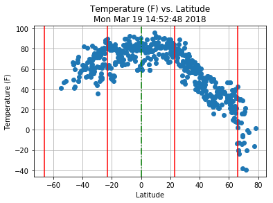
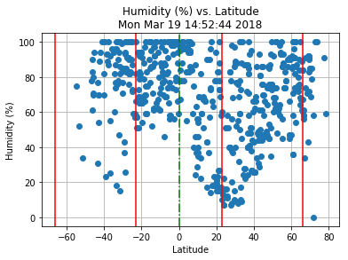
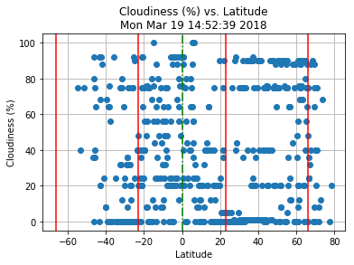
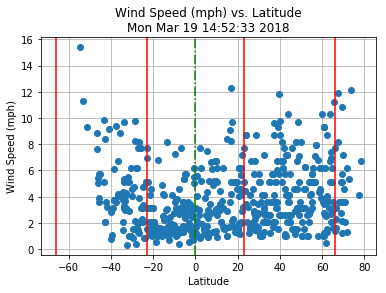

```python
# creat difrent latitude
from citipy import citipy
import numpy as np
import matplotlib.pyplot as plt
import requests, time, csv
# from sets import Set

LonList=np.linspace(-180,180,20)
LatList=np.linspace(-90,90,1000)
CityCountry=[]
weatherList = []
Lat = []
temp = []
humid = []
cloud=[]
windSpeed=[]
```


```python
with open('weatherReport.csv', 'w') as csvfile:
    dataWriter = csv.writer(csvfile, delimiter=',')
    dataWriter.writerow(['City','Country','Latitude','Longitude','Temperature','Humidity','Cloudiness','WindSpeed','URL'])
    cityCounter = 0
    for lat in LatList:
        for lon in LonList:
            city = citipy.nearest_city(lat,lon)
            City=city.city_name
            Country=city.country_code
            CityCountrySTR= "{0},{1}".format(City,Country)
            if CityCountrySTR not in CityCountry:
                CityCountry.append(CityCountrySTR)
                URL="http://api.openweathermap.org/data/2.5/weather?q={0}&appid=XXXXX".format(CityCountrySTR)
                # print(CityCountrySTR)
                r = requests.get(URL)
                data = r.json()
                if data['cod']==200:
                    weatherList.append(data)
                    Lat.append(data['coord']['lat'])
                    temp.append(data['main']['temp']*(9/5) - 459.67) #Kelvin to Fahrenheit
                    humid.append(data['main']['humidity'])
                    cloud.append(data['clouds']['all'])
                    windSpeed.append(data['wind']['speed'])
                    dataWriter.writerow([City,Country,data['coord']['lat'],data['coord']['lon'],temp[-1],humid[-1],cloud[-1],windSpeed[-1],URL])
                    cityCounter += 1
                    print("Processing Rcord {0} | {1} \n {2}".format(cityCounter,City,URL))
                break

```

    Processing Rcord 1 | vaini 
     http://api.openweathermap.org/data/2.5/weather?q=vaini,to&appid=4cc2a844092656dedc2d4db74f22bdb6
    Processing Rcord 2 | punta arenas 
     http://api.openweathermap.org/data/2.5/weather?q=punta arenas,cl&appid=4cc2a844092656dedc2d4db74f22bdb6
    Processing Rcord 3 | ushuaia 
     http://api.openweathermap.org/data/2.5/weather?q=ushuaia,ar&appid=4cc2a844092656dedc2d4db74f22bdb6
    Processing Rcord 4 | hermanus 
     http://api.openweathermap.org/data/2.5/weather?q=hermanus,za&appid=4cc2a844092656dedc2d4db74f22bdb6
    Processing Rcord 5 | bredasdorp 
     http://api.openweathermap.org/data/2.5/weather?q=bredasdorp,za&appid=4cc2a844092656dedc2d4db74f22bdb6
    Processing Rcord 6 | port alfred 
     http://api.openweathermap.org/data/2.5/weather?q=port alfred,za&appid=4cc2a844092656dedc2d4db74f22bdb6
    Processing Rcord 7 | busselton 
     http://api.openweathermap.org/data/2.5/weather?q=busselton,au&appid=4cc2a844092656dedc2d4db74f22bdb6
    Processing Rcord 8 | albany 
     http://api.openweathermap.org/data/2.5/weather?q=albany,au&appid=4cc2a844092656dedc2d4db74f22bdb6
    Processing Rcord 9 | new norfolk 
     http://api.openweathermap.org/data/2.5/weather?q=new norfolk,au&appid=4cc2a844092656dedc2d4db74f22bdb6
    Processing Rcord 10 | hobart 
     http://api.openweathermap.org/data/2.5/weather?q=hobart,au&appid=4cc2a844092656dedc2d4db74f22bdb6
    Processing Rcord 11 | bluff 
     http://api.openweathermap.org/data/2.5/weather?q=bluff,nz&appid=4cc2a844092656dedc2d4db74f22bdb6
    Processing Rcord 12 | kruisfontein 
     http://api.openweathermap.org/data/2.5/weather?q=kruisfontein,za&appid=4cc2a844092656dedc2d4db74f22bdb6
    Processing Rcord 13 | kaitangata 
     http://api.openweathermap.org/data/2.5/weather?q=kaitangata,nz&appid=4cc2a844092656dedc2d4db74f22bdb6
    Processing Rcord 14 | rikitea 
     http://api.openweathermap.org/data/2.5/weather?q=rikitea,pf&appid=4cc2a844092656dedc2d4db74f22bdb6
    Processing Rcord 15 | cape town 
     http://api.openweathermap.org/data/2.5/weather?q=cape town,za&appid=4cc2a844092656dedc2d4db74f22bdb6
    Processing Rcord 16 | mar del plata 
     http://api.openweathermap.org/data/2.5/weather?q=mar del plata,ar&appid=4cc2a844092656dedc2d4db74f22bdb6
    Processing Rcord 17 | east london 
     http://api.openweathermap.org/data/2.5/weather?q=east london,za&appid=4cc2a844092656dedc2d4db74f22bdb6
    Processing Rcord 18 | port elizabeth 
     http://api.openweathermap.org/data/2.5/weather?q=port elizabeth,za&appid=4cc2a844092656dedc2d4db74f22bdb6
    Processing Rcord 19 | chuy 
     http://api.openweathermap.org/data/2.5/weather?q=chuy,uy&appid=4cc2a844092656dedc2d4db74f22bdb6
    Processing Rcord 20 | dunedin 
     http://api.openweathermap.org/data/2.5/weather?q=dunedin,nz&appid=4cc2a844092656dedc2d4db74f22bdb6
    Processing Rcord 21 | saint-philippe 
     http://api.openweathermap.org/data/2.5/weather?q=saint-philippe,re&appid=4cc2a844092656dedc2d4db74f22bdb6
    Processing Rcord 22 | castro 
     http://api.openweathermap.org/data/2.5/weather?q=castro,cl&appid=4cc2a844092656dedc2d4db74f22bdb6
    Processing Rcord 23 | tuatapere 
     http://api.openweathermap.org/data/2.5/weather?q=tuatapere,nz&appid=4cc2a844092656dedc2d4db74f22bdb6
    Processing Rcord 24 | cidreira 
     http://api.openweathermap.org/data/2.5/weather?q=cidreira,br&appid=4cc2a844092656dedc2d4db74f22bdb6
    Processing Rcord 25 | avarua 
     http://api.openweathermap.org/data/2.5/weather?q=avarua,ck&appid=4cc2a844092656dedc2d4db74f22bdb6
    Processing Rcord 26 | rio gallegos 
     http://api.openweathermap.org/data/2.5/weather?q=rio gallegos,ar&appid=4cc2a844092656dedc2d4db74f22bdb6
    Processing Rcord 27 | christchurch 
     http://api.openweathermap.org/data/2.5/weather?q=christchurch,nz&appid=4cc2a844092656dedc2d4db74f22bdb6
    Processing Rcord 28 | coihaique 
     http://api.openweathermap.org/data/2.5/weather?q=coihaique,cl&appid=4cc2a844092656dedc2d4db74f22bdb6
    Processing Rcord 29 | waipawa 
     http://api.openweathermap.org/data/2.5/weather?q=waipawa,nz&appid=4cc2a844092656dedc2d4db74f22bdb6
    Processing Rcord 30 | comodoro rivadavia 
     http://api.openweathermap.org/data/2.5/weather?q=comodoro rivadavia,ar&appid=4cc2a844092656dedc2d4db74f22bdb6
    Processing Rcord 31 | saldanha 
     http://api.openweathermap.org/data/2.5/weather?q=saldanha,za&appid=4cc2a844092656dedc2d4db74f22bdb6
    Processing Rcord 32 | arraial do cabo 
     http://api.openweathermap.org/data/2.5/weather?q=arraial do cabo,br&appid=4cc2a844092656dedc2d4db74f22bdb6
    Processing Rcord 33 | jamestown 
     http://api.openweathermap.org/data/2.5/weather?q=jamestown,sh&appid=4cc2a844092656dedc2d4db74f22bdb6
    Processing Rcord 34 | esperance 
     http://api.openweathermap.org/data/2.5/weather?q=esperance,au&appid=4cc2a844092656dedc2d4db74f22bdb6
    Processing Rcord 35 | te anau 
     http://api.openweathermap.org/data/2.5/weather?q=te anau,nz&appid=4cc2a844092656dedc2d4db74f22bdb6
    Processing Rcord 36 | burnie 
     http://api.openweathermap.org/data/2.5/weather?q=burnie,au&appid=4cc2a844092656dedc2d4db74f22bdb6
    Processing Rcord 37 | trelew 
     http://api.openweathermap.org/data/2.5/weather?q=trelew,ar&appid=4cc2a844092656dedc2d4db74f22bdb6
    Processing Rcord 38 | rocha 
     http://api.openweathermap.org/data/2.5/weather?q=rocha,uy&appid=4cc2a844092656dedc2d4db74f22bdb6
    Processing Rcord 39 | otane 
     http://api.openweathermap.org/data/2.5/weather?q=otane,nz&appid=4cc2a844092656dedc2d4db74f22bdb6
    Processing Rcord 40 | ancud 
     http://api.openweathermap.org/data/2.5/weather?q=ancud,cl&appid=4cc2a844092656dedc2d4db74f22bdb6
    Processing Rcord 41 | hastings 
     http://api.openweathermap.org/data/2.5/weather?q=hastings,nz&appid=4cc2a844092656dedc2d4db74f22bdb6
    Processing Rcord 42 | puerto madryn 
     http://api.openweathermap.org/data/2.5/weather?q=puerto madryn,ar&appid=4cc2a844092656dedc2d4db74f22bdb6
    Processing Rcord 43 | warrnambool 
     http://api.openweathermap.org/data/2.5/weather?q=warrnambool,au&appid=4cc2a844092656dedc2d4db74f22bdb6
    Processing Rcord 44 | gisborne 
     http://api.openweathermap.org/data/2.5/weather?q=gisborne,nz&appid=4cc2a844092656dedc2d4db74f22bdb6
    Processing Rcord 45 | souillac 
     http://api.openweathermap.org/data/2.5/weather?q=souillac,mu&appid=4cc2a844092656dedc2d4db74f22bdb6
    Processing Rcord 46 | general roca 
     http://api.openweathermap.org/data/2.5/weather?q=general roca,ar&appid=4cc2a844092656dedc2d4db74f22bdb6
    Processing Rcord 47 | tolaga bay 
     http://api.openweathermap.org/data/2.5/weather?q=tolaga bay,nz&appid=4cc2a844092656dedc2d4db74f22bdb6
    Processing Rcord 48 | lebu 
     http://api.openweathermap.org/data/2.5/weather?q=lebu,cl&appid=4cc2a844092656dedc2d4db74f22bdb6
    Processing Rcord 49 | hamilton 
     http://api.openweathermap.org/data/2.5/weather?q=hamilton,au&appid=4cc2a844092656dedc2d4db74f22bdb6
    Processing Rcord 50 | nelson bay 
     http://api.openweathermap.org/data/2.5/weather?q=nelson bay,au&appid=4cc2a844092656dedc2d4db74f22bdb6
    Processing Rcord 51 | santa rosa 
     http://api.openweathermap.org/data/2.5/weather?q=santa rosa,ar&appid=4cc2a844092656dedc2d4db74f22bdb6
    Processing Rcord 52 | rio grande 
     http://api.openweathermap.org/data/2.5/weather?q=rio grande,br&appid=4cc2a844092656dedc2d4db74f22bdb6
    Processing Rcord 53 | horsham 
     http://api.openweathermap.org/data/2.5/weather?q=horsham,au&appid=4cc2a844092656dedc2d4db74f22bdb6
    Processing Rcord 54 | port macquarie 
     http://api.openweathermap.org/data/2.5/weather?q=port macquarie,au&appid=4cc2a844092656dedc2d4db74f22bdb6
    Processing Rcord 55 | mercedes 
     http://api.openweathermap.org/data/2.5/weather?q=mercedes,ar&appid=4cc2a844092656dedc2d4db74f22bdb6
    Processing Rcord 56 | geraldton 
     http://api.openweathermap.org/data/2.5/weather?q=geraldton,au&appid=4cc2a844092656dedc2d4db74f22bdb6
    Processing Rcord 57 | mildura 
     http://api.openweathermap.org/data/2.5/weather?q=mildura,au&appid=4cc2a844092656dedc2d4db74f22bdb6
    Processing Rcord 58 | mahebourg 
     http://api.openweathermap.org/data/2.5/weather?q=mahebourg,mu&appid=4cc2a844092656dedc2d4db74f22bdb6
    Processing Rcord 59 | san luis 
     http://api.openweathermap.org/data/2.5/weather?q=san luis,ar&appid=4cc2a844092656dedc2d4db74f22bdb6
    Processing Rcord 60 | carnarvon 
     http://api.openweathermap.org/data/2.5/weather?q=carnarvon,au&appid=4cc2a844092656dedc2d4db74f22bdb6
    Processing Rcord 61 | oranjemund 
     http://api.openweathermap.org/data/2.5/weather?q=oranjemund,na&appid=4cc2a844092656dedc2d4db74f22bdb6
    Processing Rcord 62 | broken hill 
     http://api.openweathermap.org/data/2.5/weather?q=broken hill,au&appid=4cc2a844092656dedc2d4db74f22bdb6
    Processing Rcord 63 | butterworth 
     http://api.openweathermap.org/data/2.5/weather?q=butterworth,za&appid=4cc2a844092656dedc2d4db74f22bdb6
    Processing Rcord 64 | ambovombe 
     http://api.openweathermap.org/data/2.5/weather?q=ambovombe,mg&appid=4cc2a844092656dedc2d4db74f22bdb6
    Processing Rcord 65 | sawtell 
     http://api.openweathermap.org/data/2.5/weather?q=sawtell,au&appid=4cc2a844092656dedc2d4db74f22bdb6
    Processing Rcord 66 | ballina 
     http://api.openweathermap.org/data/2.5/weather?q=ballina,au&appid=4cc2a844092656dedc2d4db74f22bdb6
    Processing Rcord 67 | sao joao da barra 
     http://api.openweathermap.org/data/2.5/weather?q=sao joao da barra,br&appid=4cc2a844092656dedc2d4db74f22bdb6
    Processing Rcord 68 | luderitz 
     http://api.openweathermap.org/data/2.5/weather?q=luderitz,na&appid=4cc2a844092656dedc2d4db74f22bdb6
    Processing Rcord 69 | villa carlos paz 
     http://api.openweathermap.org/data/2.5/weather?q=villa carlos paz,ar&appid=4cc2a844092656dedc2d4db74f22bdb6
    Processing Rcord 70 | umtata 
     http://api.openweathermap.org/data/2.5/weather?q=umtata,za&appid=4cc2a844092656dedc2d4db74f22bdb6
    Processing Rcord 71 | la rioja 
     http://api.openweathermap.org/data/2.5/weather?q=la rioja,ar&appid=4cc2a844092656dedc2d4db74f22bdb6
    Processing Rcord 72 | elliot 
     http://api.openweathermap.org/data/2.5/weather?q=elliot,za&appid=4cc2a844092656dedc2d4db74f22bdb6
    Processing Rcord 73 | quthing 
     http://api.openweathermap.org/data/2.5/weather?q=quthing,ls&appid=4cc2a844092656dedc2d4db74f22bdb6
    Processing Rcord 74 | ngunguru 
     http://api.openweathermap.org/data/2.5/weather?q=ngunguru,nz&appid=4cc2a844092656dedc2d4db74f22bdb6
    Processing Rcord 75 | thaba-tseka 
     http://api.openweathermap.org/data/2.5/weather?q=thaba-tseka,ls&appid=4cc2a844092656dedc2d4db74f22bdb6
    Processing Rcord 76 | talcahuano 
     http://api.openweathermap.org/data/2.5/weather?q=talcahuano,cl&appid=4cc2a844092656dedc2d4db74f22bdb6
    Processing Rcord 77 | coquimbo 
     http://api.openweathermap.org/data/2.5/weather?q=coquimbo,cl&appid=4cc2a844092656dedc2d4db74f22bdb6
    Processing Rcord 78 | byron bay 
     http://api.openweathermap.org/data/2.5/weather?q=byron bay,au&appid=4cc2a844092656dedc2d4db74f22bdb6
    Processing Rcord 79 | puerto ayora 
     http://api.openweathermap.org/data/2.5/weather?q=puerto ayora,ec&appid=4cc2a844092656dedc2d4db74f22bdb6
    Processing Rcord 80 | imbituba 
     http://api.openweathermap.org/data/2.5/weather?q=imbituba,br&appid=4cc2a844092656dedc2d4db74f22bdb6
    Processing Rcord 81 | bethlehem 
     http://api.openweathermap.org/data/2.5/weather?q=bethlehem,za&appid=4cc2a844092656dedc2d4db74f22bdb6
    Processing Rcord 82 | vila velha 
     http://api.openweathermap.org/data/2.5/weather?q=vila velha,br&appid=4cc2a844092656dedc2d4db74f22bdb6
    Processing Rcord 83 | florianopolis 
     http://api.openweathermap.org/data/2.5/weather?q=florianopolis,br&appid=4cc2a844092656dedc2d4db74f22bdb6
    Processing Rcord 84 | reitz 
     http://api.openweathermap.org/data/2.5/weather?q=reitz,za&appid=4cc2a844092656dedc2d4db74f22bdb6
    Processing Rcord 85 | bambous virieux 
     http://api.openweathermap.org/data/2.5/weather?q=bambous virieux,mu&appid=4cc2a844092656dedc2d4db74f22bdb6
    Processing Rcord 86 | frankfort 
     http://api.openweathermap.org/data/2.5/weather?q=frankfort,za&appid=4cc2a844092656dedc2d4db74f22bdb6
    Processing Rcord 87 | porto belo 
     http://api.openweathermap.org/data/2.5/weather?q=porto belo,br&appid=4cc2a844092656dedc2d4db74f22bdb6
    Processing Rcord 88 | villiers 
     http://api.openweathermap.org/data/2.5/weather?q=villiers,za&appid=4cc2a844092656dedc2d4db74f22bdb6
    Processing Rcord 89 | balfour 
     http://api.openweathermap.org/data/2.5/weather?q=balfour,za&appid=4cc2a844092656dedc2d4db74f22bdb6
    Processing Rcord 90 | penha 
     http://api.openweathermap.org/data/2.5/weather?q=penha,br&appid=4cc2a844092656dedc2d4db74f22bdb6
    Processing Rcord 91 | pontal do parana 
     http://api.openweathermap.org/data/2.5/weather?q=pontal do parana,br&appid=4cc2a844092656dedc2d4db74f22bdb6
    Processing Rcord 92 | springs 
     http://api.openweathermap.org/data/2.5/weather?q=springs,za&appid=4cc2a844092656dedc2d4db74f22bdb6
    Processing Rcord 93 | benoni 
     http://api.openweathermap.org/data/2.5/weather?q=benoni,za&appid=4cc2a844092656dedc2d4db74f22bdb6
    Processing Rcord 94 | salta 
     http://api.openweathermap.org/data/2.5/weather?q=salta,ar&appid=4cc2a844092656dedc2d4db74f22bdb6
    Processing Rcord 95 | cananeia 
     http://api.openweathermap.org/data/2.5/weather?q=cananeia,br&appid=4cc2a844092656dedc2d4db74f22bdb6
    Processing Rcord 96 | iguape 
     http://api.openweathermap.org/data/2.5/weather?q=iguape,br&appid=4cc2a844092656dedc2d4db74f22bdb6
    Processing Rcord 97 | walvis bay 
     http://api.openweathermap.org/data/2.5/weather?q=walvis bay,na&appid=4cc2a844092656dedc2d4db74f22bdb6
    Processing Rcord 98 | miracatu 
     http://api.openweathermap.org/data/2.5/weather?q=miracatu,br&appid=4cc2a844092656dedc2d4db74f22bdb6
    Processing Rcord 99 | piedade 
     http://api.openweathermap.org/data/2.5/weather?q=piedade,br&appid=4cc2a844092656dedc2d4db74f22bdb6
    Processing Rcord 100 | henties bay 
     http://api.openweathermap.org/data/2.5/weather?q=henties bay,na&appid=4cc2a844092656dedc2d4db74f22bdb6
    Processing Rcord 101 | votorantim 
     http://api.openweathermap.org/data/2.5/weather?q=votorantim,br&appid=4cc2a844092656dedc2d4db74f22bdb6
    Processing Rcord 102 | itu 
     http://api.openweathermap.org/data/2.5/weather?q=itu,br&appid=4cc2a844092656dedc2d4db74f22bdb6
    Processing Rcord 103 | monte mor 
     http://api.openweathermap.org/data/2.5/weather?q=monte mor,br&appid=4cc2a844092656dedc2d4db74f22bdb6
    Processing Rcord 104 | americana 
     http://api.openweathermap.org/data/2.5/weather?q=americana,br&appid=4cc2a844092656dedc2d4db74f22bdb6
    Processing Rcord 105 | limeira 
     http://api.openweathermap.org/data/2.5/weather?q=limeira,br&appid=4cc2a844092656dedc2d4db74f22bdb6
    Processing Rcord 106 | araras 
     http://api.openweathermap.org/data/2.5/weather?q=araras,br&appid=4cc2a844092656dedc2d4db74f22bdb6
    Processing Rcord 107 | leme 
     http://api.openweathermap.org/data/2.5/weather?q=leme,br&appid=4cc2a844092656dedc2d4db74f22bdb6
    Processing Rcord 108 | pirassununga 
     http://api.openweathermap.org/data/2.5/weather?q=pirassununga,br&appid=4cc2a844092656dedc2d4db74f22bdb6
    Processing Rcord 109 | tupiza 
     http://api.openweathermap.org/data/2.5/weather?q=tupiza,bo&appid=4cc2a844092656dedc2d4db74f22bdb6
    Processing Rcord 110 | santa rita do passa quatro 
     http://api.openweathermap.org/data/2.5/weather?q=santa rita do passa quatro,br&appid=4cc2a844092656dedc2d4db74f22bdb6
    Processing Rcord 111 | atocha 
     http://api.openweathermap.org/data/2.5/weather?q=atocha,bo&appid=4cc2a844092656dedc2d4db74f22bdb6
    Processing Rcord 112 | pisco 
     http://api.openweathermap.org/data/2.5/weather?q=pisco,pe&appid=4cc2a844092656dedc2d4db74f22bdb6
    Processing Rcord 113 | cajuru 
     http://api.openweathermap.org/data/2.5/weather?q=cajuru,br&appid=4cc2a844092656dedc2d4db74f22bdb6
    Processing Rcord 114 | altinopolis 
     http://api.openweathermap.org/data/2.5/weather?q=altinopolis,br&appid=4cc2a844092656dedc2d4db74f22bdb6
    Processing Rcord 115 | caravelas 
     http://api.openweathermap.org/data/2.5/weather?q=caravelas,br&appid=4cc2a844092656dedc2d4db74f22bdb6
    Processing Rcord 116 | franca 
     http://api.openweathermap.org/data/2.5/weather?q=franca,br&appid=4cc2a844092656dedc2d4db74f22bdb6
    Processing Rcord 117 | tautira 
     http://api.openweathermap.org/data/2.5/weather?q=tautira,pf&appid=4cc2a844092656dedc2d4db74f22bdb6
    Processing Rcord 118 | uyuni 
     http://api.openweathermap.org/data/2.5/weather?q=uyuni,bo&appid=4cc2a844092656dedc2d4db74f22bdb6
    Processing Rcord 119 | pedregulho 
     http://api.openweathermap.org/data/2.5/weather?q=pedregulho,br&appid=4cc2a844092656dedc2d4db74f22bdb6
    Processing Rcord 120 | potosi 
     http://api.openweathermap.org/data/2.5/weather?q=potosi,bo&appid=4cc2a844092656dedc2d4db74f22bdb6
    Processing Rcord 121 | sacramento 
     http://api.openweathermap.org/data/2.5/weather?q=sacramento,br&appid=4cc2a844092656dedc2d4db74f22bdb6
    Processing Rcord 122 | opuwo 
     http://api.openweathermap.org/data/2.5/weather?q=opuwo,na&appid=4cc2a844092656dedc2d4db74f22bdb6
    Processing Rcord 123 | araxa 
     http://api.openweathermap.org/data/2.5/weather?q=araxa,br&appid=4cc2a844092656dedc2d4db74f22bdb6
    Processing Rcord 124 | challapata 
     http://api.openweathermap.org/data/2.5/weather?q=challapata,bo&appid=4cc2a844092656dedc2d4db74f22bdb6
    Processing Rcord 125 | colquechaca 
     http://api.openweathermap.org/data/2.5/weather?q=colquechaca,bo&appid=4cc2a844092656dedc2d4db74f22bdb6
    Processing Rcord 126 | monte carmelo 
     http://api.openweathermap.org/data/2.5/weather?q=monte carmelo,br&appid=4cc2a844092656dedc2d4db74f22bdb6
    Processing Rcord 127 | belmonte 
     http://api.openweathermap.org/data/2.5/weather?q=belmonte,br&appid=4cc2a844092656dedc2d4db74f22bdb6
    Processing Rcord 128 | uncia 
     http://api.openweathermap.org/data/2.5/weather?q=uncia,bo&appid=4cc2a844092656dedc2d4db74f22bdb6
    Processing Rcord 129 | coromandel 
     http://api.openweathermap.org/data/2.5/weather?q=coromandel,br&appid=4cc2a844092656dedc2d4db74f22bdb6
    Processing Rcord 130 | irpa irpa 
     http://api.openweathermap.org/data/2.5/weather?q=irpa irpa,bo&appid=4cc2a844092656dedc2d4db74f22bdb6
    Processing Rcord 131 | vazante 
     http://api.openweathermap.org/data/2.5/weather?q=vazante,br&appid=4cc2a844092656dedc2d4db74f22bdb6
    Processing Rcord 132 | sipe sipe 
     http://api.openweathermap.org/data/2.5/weather?q=sipe sipe,bo&appid=4cc2a844092656dedc2d4db74f22bdb6
    Processing Rcord 133 | paracatu 
     http://api.openweathermap.org/data/2.5/weather?q=paracatu,br&appid=4cc2a844092656dedc2d4db74f22bdb6
    Processing Rcord 134 | lima 
     http://api.openweathermap.org/data/2.5/weather?q=lima,pe&appid=4cc2a844092656dedc2d4db74f22bdb6
    Processing Rcord 135 | cochabamba 
     http://api.openweathermap.org/data/2.5/weather?q=cochabamba,bo&appid=4cc2a844092656dedc2d4db74f22bdb6
    Processing Rcord 136 | cristalina 
     http://api.openweathermap.org/data/2.5/weather?q=cristalina,br&appid=4cc2a844092656dedc2d4db74f22bdb6
    Processing Rcord 137 | maceio 
     http://api.openweathermap.org/data/2.5/weather?q=maceio,br&appid=4cc2a844092656dedc2d4db74f22bdb6
    Processing Rcord 138 | namibe 
     http://api.openweathermap.org/data/2.5/weather?q=namibe,ao&appid=4cc2a844092656dedc2d4db74f22bdb6
    Processing Rcord 139 | hualmay 
     http://api.openweathermap.org/data/2.5/weather?q=hualmay,pe&appid=4cc2a844092656dedc2d4db74f22bdb6
    Processing Rcord 140 | atuona 
     http://api.openweathermap.org/data/2.5/weather?q=atuona,pf&appid=4cc2a844092656dedc2d4db74f22bdb6
    Processing Rcord 141 | caranavi 
     http://api.openweathermap.org/data/2.5/weather?q=caranavi,bo&appid=4cc2a844092656dedc2d4db74f22bdb6
    Processing Rcord 142 | san borja 
     http://api.openweathermap.org/data/2.5/weather?q=san borja,bo&appid=4cc2a844092656dedc2d4db74f22bdb6
    Processing Rcord 143 | formosa 
     http://api.openweathermap.org/data/2.5/weather?q=formosa,br&appid=4cc2a844092656dedc2d4db74f22bdb6
    Processing Rcord 144 | lusaka 
     http://api.openweathermap.org/data/2.5/weather?q=lusaka,zm&appid=4cc2a844092656dedc2d4db74f22bdb6
    Processing Rcord 145 | antsohihy 
     http://api.openweathermap.org/data/2.5/weather?q=antsohihy,mg&appid=4cc2a844092656dedc2d4db74f22bdb6
    Processing Rcord 146 | grand gaube 
     http://api.openweathermap.org/data/2.5/weather?q=grand gaube,mu&appid=4cc2a844092656dedc2d4db74f22bdb6
    Processing Rcord 147 | chibombo 
     http://api.openweathermap.org/data/2.5/weather?q=chibombo,zm&appid=4cc2a844092656dedc2d4db74f22bdb6
    Processing Rcord 148 | maragogi 
     http://api.openweathermap.org/data/2.5/weather?q=maragogi,br&appid=4cc2a844092656dedc2d4db74f22bdb6
    Processing Rcord 149 | cavalcante 
     http://api.openweathermap.org/data/2.5/weather?q=cavalcante,br&appid=4cc2a844092656dedc2d4db74f22bdb6
    Processing Rcord 150 | huarmey 
     http://api.openweathermap.org/data/2.5/weather?q=huarmey,pe&appid=4cc2a844092656dedc2d4db74f22bdb6
    Processing Rcord 151 | santa rosa 
     http://api.openweathermap.org/data/2.5/weather?q=santa rosa,bo&appid=4cc2a844092656dedc2d4db74f22bdb6
    Processing Rcord 152 | kapiri mposhi 
     http://api.openweathermap.org/data/2.5/weather?q=kapiri mposhi,zm&appid=4cc2a844092656dedc2d4db74f22bdb6
    Processing Rcord 153 | ambanja 
     http://api.openweathermap.org/data/2.5/weather?q=ambanja,mg&appid=4cc2a844092656dedc2d4db74f22bdb6
    Processing Rcord 154 | mpongwe 
     http://api.openweathermap.org/data/2.5/weather?q=mpongwe,zm&appid=4cc2a844092656dedc2d4db74f22bdb6
    Processing Rcord 155 | luanshya 
     http://api.openweathermap.org/data/2.5/weather?q=luanshya,zm&appid=4cc2a844092656dedc2d4db74f22bdb6
    Processing Rcord 156 | campos belos 
     http://api.openweathermap.org/data/2.5/weather?q=campos belos,br&appid=4cc2a844092656dedc2d4db74f22bdb6
    Processing Rcord 157 | arraias 
     http://api.openweathermap.org/data/2.5/weather?q=arraias,br&appid=4cc2a844092656dedc2d4db74f22bdb6
    Processing Rcord 158 | ndola 
     http://api.openweathermap.org/data/2.5/weather?q=ndola,zm&appid=4cc2a844092656dedc2d4db74f22bdb6
    Processing Rcord 159 | rodrigues alves 
     http://api.openweathermap.org/data/2.5/weather?q=rodrigues alves,br&appid=4cc2a844092656dedc2d4db74f22bdb6
    Processing Rcord 160 | chimbote 
     http://api.openweathermap.org/data/2.5/weather?q=chimbote,pe&appid=4cc2a844092656dedc2d4db74f22bdb6
    Processing Rcord 161 | riberalta 
     http://api.openweathermap.org/data/2.5/weather?q=riberalta,bo&appid=4cc2a844092656dedc2d4db74f22bdb6
    Processing Rcord 162 | chicama 
     http://api.openweathermap.org/data/2.5/weather?q=chicama,pe&appid=4cc2a844092656dedc2d4db74f22bdb6
    Processing Rcord 163 | sao jose da coroa grande 
     http://api.openweathermap.org/data/2.5/weather?q=sao jose da coroa grande,br&appid=4cc2a844092656dedc2d4db74f22bdb6
    Processing Rcord 164 | benguela 
     http://api.openweathermap.org/data/2.5/weather?q=benguela,ao&appid=4cc2a844092656dedc2d4db74f22bdb6
    Processing Rcord 165 | georgetown 
     http://api.openweathermap.org/data/2.5/weather?q=georgetown,sh&appid=4cc2a844092656dedc2d4db74f22bdb6
    Processing Rcord 166 | mansa 
     http://api.openweathermap.org/data/2.5/weather?q=mansa,zm&appid=4cc2a844092656dedc2d4db74f22bdb6
    Processing Rcord 167 | porto nacional 
     http://api.openweathermap.org/data/2.5/weather?q=porto nacional,br&appid=4cc2a844092656dedc2d4db74f22bdb6
    Processing Rcord 168 | tamandare 
     http://api.openweathermap.org/data/2.5/weather?q=tamandare,br&appid=4cc2a844092656dedc2d4db74f22bdb6
    Processing Rcord 169 | olinda 
     http://api.openweathermap.org/data/2.5/weather?q=olinda,br&appid=4cc2a844092656dedc2d4db74f22bdb6
    Processing Rcord 170 | pimentel 
     http://api.openweathermap.org/data/2.5/weather?q=pimentel,pe&appid=4cc2a844092656dedc2d4db74f22bdb6
    Processing Rcord 171 | placido de castro 
     http://api.openweathermap.org/data/2.5/weather?q=placido de castro,br&appid=4cc2a844092656dedc2d4db74f22bdb6
    Processing Rcord 172 | palmas 
     http://api.openweathermap.org/data/2.5/weather?q=palmas,br&appid=4cc2a844092656dedc2d4db74f22bdb6
    Processing Rcord 173 | miracema do tocantins 
     http://api.openweathermap.org/data/2.5/weather?q=miracema do tocantins,br&appid=4cc2a844092656dedc2d4db74f22bdb6
    Processing Rcord 174 | sechura 
     http://api.openweathermap.org/data/2.5/weather?q=sechura,pe&appid=4cc2a844092656dedc2d4db74f22bdb6
    Processing Rcord 175 | boca do acre 
     http://api.openweathermap.org/data/2.5/weather?q=boca do acre,br&appid=4cc2a844092656dedc2d4db74f22bdb6
    Processing Rcord 176 | luanda 
     http://api.openweathermap.org/data/2.5/weather?q=luanda,ao&appid=4cc2a844092656dedc2d4db74f22bdb6
    Processing Rcord 177 | nchelenge 
     http://api.openweathermap.org/data/2.5/weather?q=nchelenge,zm&appid=4cc2a844092656dedc2d4db74f22bdb6
    Processing Rcord 178 | santa luzia 
     http://api.openweathermap.org/data/2.5/weather?q=santa luzia,br&appid=4cc2a844092656dedc2d4db74f22bdb6
    Processing Rcord 179 | domoni 
     http://api.openweathermap.org/data/2.5/weather?q=domoni,km&appid=4cc2a844092656dedc2d4db74f22bdb6
    Processing Rcord 180 | pauini 
     http://api.openweathermap.org/data/2.5/weather?q=pauini,br&appid=4cc2a844092656dedc2d4db74f22bdb6
    Processing Rcord 181 | pitimbu 
     http://api.openweathermap.org/data/2.5/weather?q=pitimbu,br&appid=4cc2a844092656dedc2d4db74f22bdb6
    Processing Rcord 182 | soyo 
     http://api.openweathermap.org/data/2.5/weather?q=soyo,ao&appid=4cc2a844092656dedc2d4db74f22bdb6
    Processing Rcord 183 | paita 
     http://api.openweathermap.org/data/2.5/weather?q=paita,pe&appid=4cc2a844092656dedc2d4db74f22bdb6
    Processing Rcord 184 | manono 
     http://api.openweathermap.org/data/2.5/weather?q=manono,cd&appid=4cc2a844092656dedc2d4db74f22bdb6
    Processing Rcord 185 | carolina 
     http://api.openweathermap.org/data/2.5/weather?q=carolina,br&appid=4cc2a844092656dedc2d4db74f22bdb6
    Processing Rcord 186 | hithadhoo 
     http://api.openweathermap.org/data/2.5/weather?q=hithadhoo,mv&appid=4cc2a844092656dedc2d4db74f22bdb6
    Processing Rcord 187 | hambantota 
     http://api.openweathermap.org/data/2.5/weather?q=hambantota,lk&appid=4cc2a844092656dedc2d4db74f22bdb6
    Processing Rcord 188 | porto franco 
     http://api.openweathermap.org/data/2.5/weather?q=porto franco,br&appid=4cc2a844092656dedc2d4db74f22bdb6
    Processing Rcord 189 | cabedelo 
     http://api.openweathermap.org/data/2.5/weather?q=cabedelo,br&appid=4cc2a844092656dedc2d4db74f22bdb6
    Processing Rcord 190 | cabinda 
     http://api.openweathermap.org/data/2.5/weather?q=cabinda,ao&appid=4cc2a844092656dedc2d4db74f22bdb6
    Processing Rcord 191 | carauari 
     http://api.openweathermap.org/data/2.5/weather?q=carauari,br&appid=4cc2a844092656dedc2d4db74f22bdb6
    Processing Rcord 192 | talara 
     http://api.openweathermap.org/data/2.5/weather?q=talara,pe&appid=4cc2a844092656dedc2d4db74f22bdb6
    Processing Rcord 193 | montes altos 
     http://api.openweathermap.org/data/2.5/weather?q=montes altos,br&appid=4cc2a844092656dedc2d4db74f22bdb6
    Processing Rcord 194 | mayumba 
     http://api.openweathermap.org/data/2.5/weather?q=mayumba,ga&appid=4cc2a844092656dedc2d4db74f22bdb6
    Processing Rcord 195 | kalemie 
     http://api.openweathermap.org/data/2.5/weather?q=kalemie,cd&appid=4cc2a844092656dedc2d4db74f22bdb6
    Processing Rcord 196 | kigoma 
     http://api.openweathermap.org/data/2.5/weather?q=kigoma,tz&appid=4cc2a844092656dedc2d4db74f22bdb6
    Processing Rcord 197 | rumonge 
     http://api.openweathermap.org/data/2.5/weather?q=rumonge,bi&appid=4cc2a844092656dedc2d4db74f22bdb6
    Processing Rcord 198 | baturaja 
     http://api.openweathermap.org/data/2.5/weather?q=baturaja,id&appid=4cc2a844092656dedc2d4db74f22bdb6
    Processing Rcord 199 | paragominas 
     http://api.openweathermap.org/data/2.5/weather?q=paragominas,br&appid=4cc2a844092656dedc2d4db74f22bdb6
    Processing Rcord 200 | nisia floresta 
     http://api.openweathermap.org/data/2.5/weather?q=nisia floresta,br&appid=4cc2a844092656dedc2d4db74f22bdb6
    Processing Rcord 201 | natal 
     http://api.openweathermap.org/data/2.5/weather?q=natal,br&appid=4cc2a844092656dedc2d4db74f22bdb6
    Processing Rcord 202 | fonte boa 
     http://api.openweathermap.org/data/2.5/weather?q=fonte boa,br&appid=4cc2a844092656dedc2d4db74f22bdb6
    Processing Rcord 203 | gamba 
     http://api.openweathermap.org/data/2.5/weather?q=gamba,ga&appid=4cc2a844092656dedc2d4db74f22bdb6
    Processing Rcord 204 | cibitoke 
     http://api.openweathermap.org/data/2.5/weather?q=cibitoke,bi&appid=4cc2a844092656dedc2d4db74f22bdb6
    Processing Rcord 205 | bukavu 
     http://api.openweathermap.org/data/2.5/weather?q=bukavu,cd&appid=4cc2a844092656dedc2d4db74f22bdb6
    Processing Rcord 206 | salinas 
     http://api.openweathermap.org/data/2.5/weather?q=salinas,ec&appid=4cc2a844092656dedc2d4db74f22bdb6
    Processing Rcord 207 | touros 
     http://api.openweathermap.org/data/2.5/weather?q=touros,br&appid=4cc2a844092656dedc2d4db74f22bdb6
    Processing Rcord 208 | irituia 
     http://api.openweathermap.org/data/2.5/weather?q=irituia,br&appid=4cc2a844092656dedc2d4db74f22bdb6
    Processing Rcord 209 | harper 
     http://api.openweathermap.org/data/2.5/weather?q=harper,lr&appid=4cc2a844092656dedc2d4db74f22bdb6
    Processing Rcord 210 | omboue 
     http://api.openweathermap.org/data/2.5/weather?q=omboue,ga&appid=4cc2a844092656dedc2d4db74f22bdb6
    Processing Rcord 211 | goma 
     http://api.openweathermap.org/data/2.5/weather?q=goma,cd&appid=4cc2a844092656dedc2d4db74f22bdb6
    Processing Rcord 212 | san cristobal 
     http://api.openweathermap.org/data/2.5/weather?q=san cristobal,ec&appid=4cc2a844092656dedc2d4db74f22bdb6
    Processing Rcord 213 | maraa 
     http://api.openweathermap.org/data/2.5/weather?q=maraa,br&appid=4cc2a844092656dedc2d4db74f22bdb6
    Processing Rcord 214 | capanema 
     http://api.openweathermap.org/data/2.5/weather?q=capanema,br&appid=4cc2a844092656dedc2d4db74f22bdb6
    Processing Rcord 215 | sao gabriel da cachoeira 
     http://api.openweathermap.org/data/2.5/weather?q=sao gabriel da cachoeira,br&appid=4cc2a844092656dedc2d4db74f22bdb6
    Processing Rcord 216 | salinopolis 
     http://api.openweathermap.org/data/2.5/weather?q=salinopolis,br&appid=4cc2a844092656dedc2d4db74f22bdb6
    Processing Rcord 217 | port-gentil 
     http://api.openweathermap.org/data/2.5/weather?q=port-gentil,ga&appid=4cc2a844092656dedc2d4db74f22bdb6
    Processing Rcord 218 | libreville 
     http://api.openweathermap.org/data/2.5/weather?q=libreville,ga&appid=4cc2a844092656dedc2d4db74f22bdb6
    Processing Rcord 219 | butembo 
     http://api.openweathermap.org/data/2.5/weather?q=butembo,cd&appid=4cc2a844092656dedc2d4db74f22bdb6
    Processing Rcord 220 | mogadishu 
     http://api.openweathermap.org/data/2.5/weather?q=mogadishu,so&appid=4cc2a844092656dedc2d4db74f22bdb6
    Processing Rcord 221 | thinadhoo 
     http://api.openweathermap.org/data/2.5/weather?q=thinadhoo,mv&appid=4cc2a844092656dedc2d4db74f22bdb6
    Processing Rcord 222 | kijang 
     http://api.openweathermap.org/data/2.5/weather?q=kijang,id&appid=4cc2a844092656dedc2d4db74f22bdb6
    Processing Rcord 223 | cocobeach 
     http://api.openweathermap.org/data/2.5/weather?q=cocobeach,ga&appid=4cc2a844092656dedc2d4db74f22bdb6
    Processing Rcord 224 | beni 
     http://api.openweathermap.org/data/2.5/weather?q=beni,cd&appid=4cc2a844092656dedc2d4db74f22bdb6
    Processing Rcord 225 | wamba 
     http://api.openweathermap.org/data/2.5/weather?q=wamba,cd&appid=4cc2a844092656dedc2d4db74f22bdb6
    Processing Rcord 226 | mbini 
     http://api.openweathermap.org/data/2.5/weather?q=mbini,gq&appid=4cc2a844092656dedc2d4db74f22bdb6
    Processing Rcord 227 | kudahuvadhoo 
     http://api.openweathermap.org/data/2.5/weather?q=kudahuvadhoo,mv&appid=4cc2a844092656dedc2d4db74f22bdb6
    Processing Rcord 228 | kota tinggi 
     http://api.openweathermap.org/data/2.5/weather?q=kota tinggi,my&appid=4cc2a844092656dedc2d4db74f22bdb6
    Processing Rcord 229 | hilo 
     http://api.openweathermap.org/data/2.5/weather?q=hilo,us&appid=4cc2a844092656dedc2d4db74f22bdb6
    Processing Rcord 230 | bata 
     http://api.openweathermap.org/data/2.5/weather?q=bata,gq&appid=4cc2a844092656dedc2d4db74f22bdb6
    Processing Rcord 231 | inirida 
     http://api.openweathermap.org/data/2.5/weather?q=inirida,co&appid=4cc2a844092656dedc2d4db74f22bdb6
    Processing Rcord 232 | jawhar 
     http://api.openweathermap.org/data/2.5/weather?q=jawhar,so&appid=4cc2a844092656dedc2d4db74f22bdb6
    Processing Rcord 233 | kribi 
     http://api.openweathermap.org/data/2.5/weather?q=kribi,cm&appid=4cc2a844092656dedc2d4db74f22bdb6
    Processing Rcord 234 | muisne 
     http://api.openweathermap.org/data/2.5/weather?q=muisne,ec&appid=4cc2a844092656dedc2d4db74f22bdb6
    Processing Rcord 235 | acapulco 
     http://api.openweathermap.org/data/2.5/weather?q=acapulco,mx&appid=4cc2a844092656dedc2d4db74f22bdb6
    Processing Rcord 236 | amapa 
     http://api.openweathermap.org/data/2.5/weather?q=amapa,br&appid=4cc2a844092656dedc2d4db74f22bdb6
    Processing Rcord 237 | limbe 
     http://api.openweathermap.org/data/2.5/weather?q=limbe,cm&appid=4cc2a844092656dedc2d4db74f22bdb6
    Processing Rcord 238 | tiko 
     http://api.openweathermap.org/data/2.5/weather?q=tiko,cm&appid=4cc2a844092656dedc2d4db74f22bdb6
    Processing Rcord 239 | sao filipe 
     http://api.openweathermap.org/data/2.5/weather?q=sao filipe,cv&appid=4cc2a844092656dedc2d4db74f22bdb6
    Processing Rcord 240 | buchanan 
     http://api.openweathermap.org/data/2.5/weather?q=buchanan,lr&appid=4cc2a844092656dedc2d4db74f22bdb6
    Processing Rcord 241 | muyuka 
     http://api.openweathermap.org/data/2.5/weather?q=muyuka,cm&appid=4cc2a844092656dedc2d4db74f22bdb6
    Processing Rcord 242 | puerto ayacucho 
     http://api.openweathermap.org/data/2.5/weather?q=puerto ayacucho,ve&appid=4cc2a844092656dedc2d4db74f22bdb6
    Processing Rcord 243 | kumba 
     http://api.openweathermap.org/data/2.5/weather?q=kumba,cm&appid=4cc2a844092656dedc2d4db74f22bdb6
    Processing Rcord 244 | hobyo 
     http://api.openweathermap.org/data/2.5/weather?q=hobyo,so&appid=4cc2a844092656dedc2d4db74f22bdb6
    Processing Rcord 245 | fontem 
     http://api.openweathermap.org/data/2.5/weather?q=fontem,cm&appid=4cc2a844092656dedc2d4db74f22bdb6
    Processing Rcord 246 | cabo san lucas 
     http://api.openweathermap.org/data/2.5/weather?q=cabo san lucas,mx&appid=4cc2a844092656dedc2d4db74f22bdb6
    Processing Rcord 247 | puerto carreno 
     http://api.openweathermap.org/data/2.5/weather?q=puerto carreno,co&appid=4cc2a844092656dedc2d4db74f22bdb6
    Processing Rcord 248 | bali 
     http://api.openweathermap.org/data/2.5/weather?q=bali,cm&appid=4cc2a844092656dedc2d4db74f22bdb6
    Processing Rcord 249 | mbengwi 
     http://api.openweathermap.org/data/2.5/weather?q=mbengwi,cm&appid=4cc2a844092656dedc2d4db74f22bdb6
    Processing Rcord 250 | gbarnga 
     http://api.openweathermap.org/data/2.5/weather?q=gbarnga,lr&appid=4cc2a844092656dedc2d4db74f22bdb6
    Processing Rcord 251 | wum 
     http://api.openweathermap.org/data/2.5/weather?q=wum,cm&appid=4cc2a844092656dedc2d4db74f22bdb6
    Processing Rcord 252 | kulhudhuffushi 
     http://api.openweathermap.org/data/2.5/weather?q=kulhudhuffushi,mv&appid=4cc2a844092656dedc2d4db74f22bdb6
    Processing Rcord 253 | buenos aires 
     http://api.openweathermap.org/data/2.5/weather?q=buenos aires,cr&appid=4cc2a844092656dedc2d4db74f22bdb6
    Processing Rcord 254 | cayenne 
     http://api.openweathermap.org/data/2.5/weather?q=cayenne,gf&appid=4cc2a844092656dedc2d4db74f22bdb6
    Processing Rcord 255 | gboko 
     http://api.openweathermap.org/data/2.5/weather?q=gboko,ng&appid=4cc2a844092656dedc2d4db74f22bdb6
    Processing Rcord 256 | quepos 
     http://api.openweathermap.org/data/2.5/weather?q=quepos,cr&appid=4cc2a844092656dedc2d4db74f22bdb6
    Processing Rcord 257 | calabozo 
     http://api.openweathermap.org/data/2.5/weather?q=calabozo,ve&appid=4cc2a844092656dedc2d4db74f22bdb6
    Processing Rcord 258 | parrita 
     http://api.openweathermap.org/data/2.5/weather?q=parrita,cr&appid=4cc2a844092656dedc2d4db74f22bdb6
    Processing Rcord 259 | yomou 
     http://api.openweathermap.org/data/2.5/weather?q=yomou,gn&appid=4cc2a844092656dedc2d4db74f22bdb6
    Processing Rcord 260 | macenta 
     http://api.openweathermap.org/data/2.5/weather?q=macenta,gn&appid=4cc2a844092656dedc2d4db74f22bdb6
    Processing Rcord 261 | wukari 
     http://api.openweathermap.org/data/2.5/weather?q=wukari,ng&appid=4cc2a844092656dedc2d4db74f22bdb6
    Processing Rcord 262 | altagracia de orituco 
     http://api.openweathermap.org/data/2.5/weather?q=altagracia de orituco,ve&appid=4cc2a844092656dedc2d4db74f22bdb6
    Processing Rcord 263 | lafia 
     http://api.openweathermap.org/data/2.5/weather?q=lafia,ng&appid=4cc2a844092656dedc2d4db74f22bdb6
    Processing Rcord 264 | puntarenas 
     http://api.openweathermap.org/data/2.5/weather?q=puntarenas,cr&appid=4cc2a844092656dedc2d4db74f22bdb6
    Processing Rcord 265 | san jeronimo 
     http://api.openweathermap.org/data/2.5/weather?q=san jeronimo,mx&appid=4cc2a844092656dedc2d4db74f22bdb6
    Processing Rcord 266 | tokonou 
     http://api.openweathermap.org/data/2.5/weather?q=tokonou,gn&appid=4cc2a844092656dedc2d4db74f22bdb6
    Processing Rcord 267 | jos 
     http://api.openweathermap.org/data/2.5/weather?q=jos,ng&appid=4cc2a844092656dedc2d4db74f22bdb6
    Processing Rcord 268 | nicoya 
     http://api.openweathermap.org/data/2.5/weather?q=nicoya,cr&appid=4cc2a844092656dedc2d4db74f22bdb6
    Processing Rcord 269 | kankan 
     http://api.openweathermap.org/data/2.5/weather?q=kankan,gn&appid=4cc2a844092656dedc2d4db74f22bdb6
    Processing Rcord 270 | bauchi 
     http://api.openweathermap.org/data/2.5/weather?q=bauchi,ng&appid=4cc2a844092656dedc2d4db74f22bdb6
    Processing Rcord 271 | kapaa 
     http://api.openweathermap.org/data/2.5/weather?q=kapaa,us&appid=4cc2a844092656dedc2d4db74f22bdb6
    Processing Rcord 272 | petatlan 
     http://api.openweathermap.org/data/2.5/weather?q=petatlan,mx&appid=4cc2a844092656dedc2d4db74f22bdb6
    Processing Rcord 273 | ixtapa 
     http://api.openweathermap.org/data/2.5/weather?q=ixtapa,mx&appid=4cc2a844092656dedc2d4db74f22bdb6
    Processing Rcord 274 | san jose 
     http://api.openweathermap.org/data/2.5/weather?q=san jose,cr&appid=4cc2a844092656dedc2d4db74f22bdb6
    Processing Rcord 275 | guatire 
     http://api.openweathermap.org/data/2.5/weather?q=guatire,ve&appid=4cc2a844092656dedc2d4db74f22bdb6
    Processing Rcord 276 | siguiri 
     http://api.openweathermap.org/data/2.5/weather?q=siguiri,gn&appid=4cc2a844092656dedc2d4db74f22bdb6
    Processing Rcord 277 | san miguelito 
     http://api.openweathermap.org/data/2.5/weather?q=san miguelito,ni&appid=4cc2a844092656dedc2d4db74f22bdb6
    Processing Rcord 278 | acoyapa 
     http://api.openweathermap.org/data/2.5/weather?q=acoyapa,ni&appid=4cc2a844092656dedc2d4db74f22bdb6
    Processing Rcord 279 | caraballeda 
     http://api.openweathermap.org/data/2.5/weather?q=caraballeda,ve&appid=4cc2a844092656dedc2d4db74f22bdb6
    Processing Rcord 280 | dutse 
     http://api.openweathermap.org/data/2.5/weather?q=dutse,ng&appid=4cc2a844092656dedc2d4db74f22bdb6
    Processing Rcord 281 | juigalpa 
     http://api.openweathermap.org/data/2.5/weather?q=juigalpa,ni&appid=4cc2a844092656dedc2d4db74f22bdb6
    Processing Rcord 282 | ewa beach 
     http://api.openweathermap.org/data/2.5/weather?q=ewa beach,us&appid=4cc2a844092656dedc2d4db74f22bdb6
    Processing Rcord 283 | san isidro 
     http://api.openweathermap.org/data/2.5/weather?q=san isidro,ni&appid=4cc2a844092656dedc2d4db74f22bdb6
    Processing Rcord 284 | bocana de paiwas 
     http://api.openweathermap.org/data/2.5/weather?q=bocana de paiwas,ni&appid=4cc2a844092656dedc2d4db74f22bdb6
    Processing Rcord 285 | rio blanco 
     http://api.openweathermap.org/data/2.5/weather?q=rio blanco,ni&appid=4cc2a844092656dedc2d4db74f22bdb6
    Processing Rcord 286 | waslala 
     http://api.openweathermap.org/data/2.5/weather?q=waslala,ni&appid=4cc2a844092656dedc2d4db74f22bdb6
    Processing Rcord 287 | sinnamary 
     http://api.openweathermap.org/data/2.5/weather?q=sinnamary,gf&appid=4cc2a844092656dedc2d4db74f22bdb6
    Processing Rcord 288 | lazaro cardenas 
     http://api.openweathermap.org/data/2.5/weather?q=lazaro cardenas,mx&appid=4cc2a844092656dedc2d4db74f22bdb6
    Processing Rcord 289 | siuna 
     http://api.openweathermap.org/data/2.5/weather?q=siuna,ni&appid=4cc2a844092656dedc2d4db74f22bdb6
    Processing Rcord 290 | makakilo city 
     http://api.openweathermap.org/data/2.5/weather?q=makakilo city,us&appid=4cc2a844092656dedc2d4db74f22bdb6
    Processing Rcord 291 | constitucion 
     http://api.openweathermap.org/data/2.5/weather?q=constitucion,mx&appid=4cc2a844092656dedc2d4db74f22bdb6
    Processing Rcord 292 | bonanza 
     http://api.openweathermap.org/data/2.5/weather?q=bonanza,ni&appid=4cc2a844092656dedc2d4db74f22bdb6
    Processing Rcord 293 | san jose de rio tinto 
     http://api.openweathermap.org/data/2.5/weather?q=san jose de rio tinto,hn&appid=4cc2a844092656dedc2d4db74f22bdb6
    Processing Rcord 294 | dulce nombre de culmi 
     http://api.openweathermap.org/data/2.5/weather?q=dulce nombre de culmi,hn&appid=4cc2a844092656dedc2d4db74f22bdb6
    Processing Rcord 295 | mindelo 
     http://api.openweathermap.org/data/2.5/weather?q=mindelo,cv&appid=4cc2a844092656dedc2d4db74f22bdb6
    Processing Rcord 296 | la orilla 
     http://api.openweathermap.org/data/2.5/weather?q=la orilla,mx&appid=4cc2a844092656dedc2d4db74f22bdb6
    Processing Rcord 297 | cusuna 
     http://api.openweathermap.org/data/2.5/weather?q=cusuna,hn&appid=4cc2a844092656dedc2d4db74f22bdb6
    Processing Rcord 298 | porto novo 
     http://api.openweathermap.org/data/2.5/weather?q=porto novo,cv&appid=4cc2a844092656dedc2d4db74f22bdb6
    Processing Rcord 299 | coahuayana 
     http://api.openweathermap.org/data/2.5/weather?q=coahuayana,mx&appid=4cc2a844092656dedc2d4db74f22bdb6
    Processing Rcord 300 | tanout 
     http://api.openweathermap.org/data/2.5/weather?q=tanout,ne&appid=4cc2a844092656dedc2d4db74f22bdb6
    Processing Rcord 301 | ponta do sol 
     http://api.openweathermap.org/data/2.5/weather?q=ponta do sol,cv&appid=4cc2a844092656dedc2d4db74f22bdb6
    Processing Rcord 302 | savannah bight 
     http://api.openweathermap.org/data/2.5/weather?q=savannah bight,hn&appid=4cc2a844092656dedc2d4db74f22bdb6
    Processing Rcord 303 | nanakuli 
     http://api.openweathermap.org/data/2.5/weather?q=nanakuli,us&appid=4cc2a844092656dedc2d4db74f22bdb6
    Processing Rcord 304 | bathsheba 
     http://api.openweathermap.org/data/2.5/weather?q=bathsheba,bb&appid=4cc2a844092656dedc2d4db74f22bdb6
    Processing Rcord 305 | agadez 
     http://api.openweathermap.org/data/2.5/weather?q=agadez,ne&appid=4cc2a844092656dedc2d4db74f22bdb6
    Processing Rcord 306 | marawi 
     http://api.openweathermap.org/data/2.5/weather?q=marawi,sd&appid=4cc2a844092656dedc2d4db74f22bdb6
    Processing Rcord 307 | najran 
     http://api.openweathermap.org/data/2.5/weather?q=najran,sa&appid=4cc2a844092656dedc2d4db74f22bdb6
    Processing Rcord 308 | salinas 
     http://api.openweathermap.org/data/2.5/weather?q=salinas,us&appid=4cc2a844092656dedc2d4db74f22bdb6
    Processing Rcord 309 | porbandar 
     http://api.openweathermap.org/data/2.5/weather?q=porbandar,in&appid=4cc2a844092656dedc2d4db74f22bdb6
    Processing Rcord 310 | guerrero negro 
     http://api.openweathermap.org/data/2.5/weather?q=guerrero negro,mx&appid=4cc2a844092656dedc2d4db74f22bdb6
    Processing Rcord 311 | armeria 
     http://api.openweathermap.org/data/2.5/weather?q=armeria,mx&appid=4cc2a844092656dedc2d4db74f22bdb6
    Processing Rcord 312 | dorado 
     http://api.openweathermap.org/data/2.5/weather?q=dorado,us&appid=4cc2a844092656dedc2d4db74f22bdb6
    Processing Rcord 313 | el colomo 
     http://api.openweathermap.org/data/2.5/weather?q=el colomo,mx&appid=4cc2a844092656dedc2d4db74f22bdb6
    Processing Rcord 314 | atar 
     http://api.openweathermap.org/data/2.5/weather?q=atar,mr&appid=4cc2a844092656dedc2d4db74f22bdb6
    Processing Rcord 315 | minatitlan 
     http://api.openweathermap.org/data/2.5/weather?q=minatitlan,mx&appid=4cc2a844092656dedc2d4db74f22bdb6
    Processing Rcord 316 | casimiro castillo 
     http://api.openweathermap.org/data/2.5/weather?q=casimiro castillo,mx&appid=4cc2a844092656dedc2d4db74f22bdb6
    Processing Rcord 317 | el grullo 
     http://api.openweathermap.org/data/2.5/weather?q=el grullo,mx&appid=4cc2a844092656dedc2d4db74f22bdb6
    Processing Rcord 318 | union de tula 
     http://api.openweathermap.org/data/2.5/weather?q=union de tula,mx&appid=4cc2a844092656dedc2d4db74f22bdb6
    Processing Rcord 319 | juchitlan 
     http://api.openweathermap.org/data/2.5/weather?q=juchitlan,mx&appid=4cc2a844092656dedc2d4db74f22bdb6
    Processing Rcord 320 | tenamaxtlan 
     http://api.openweathermap.org/data/2.5/weather?q=tenamaxtlan,mx&appid=4cc2a844092656dedc2d4db74f22bdb6
    Processing Rcord 321 | ameca 
     http://api.openweathermap.org/data/2.5/weather?q=ameca,mx&appid=4cc2a844092656dedc2d4db74f22bdb6
    Processing Rcord 322 | san marcos 
     http://api.openweathermap.org/data/2.5/weather?q=san marcos,mx&appid=4cc2a844092656dedc2d4db74f22bdb6
    Processing Rcord 323 | ixtlan del rio 
     http://api.openweathermap.org/data/2.5/weather?q=ixtlan del rio,mx&appid=4cc2a844092656dedc2d4db74f22bdb6
    Processing Rcord 324 | hostotipaquillo 
     http://api.openweathermap.org/data/2.5/weather?q=hostotipaquillo,mx&appid=4cc2a844092656dedc2d4db74f22bdb6
    Processing Rcord 325 | mantua 
     http://api.openweathermap.org/data/2.5/weather?q=mantua,cu&appid=4cc2a844092656dedc2d4db74f22bdb6
    Processing Rcord 326 | santa maria del oro 
     http://api.openweathermap.org/data/2.5/weather?q=santa maria del oro,mx&appid=4cc2a844092656dedc2d4db74f22bdb6
    Processing Rcord 327 | san juan 
     http://api.openweathermap.org/data/2.5/weather?q=san juan,us&appid=4cc2a844092656dedc2d4db74f22bdb6
    Processing Rcord 328 | villa guerrero 
     http://api.openweathermap.org/data/2.5/weather?q=villa guerrero,mx&appid=4cc2a844092656dedc2d4db74f22bdb6
    Processing Rcord 329 | huejuquilla el alto 
     http://api.openweathermap.org/data/2.5/weather?q=huejuquilla el alto,mx&appid=4cc2a844092656dedc2d4db74f22bdb6
    Processing Rcord 330 | saint-francois 
     http://api.openweathermap.org/data/2.5/weather?q=saint-francois,gp&appid=4cc2a844092656dedc2d4db74f22bdb6
    Processing Rcord 331 | aswan 
     http://api.openweathermap.org/data/2.5/weather?q=aswan,eg&appid=4cc2a844092656dedc2d4db74f22bdb6
    Processing Rcord 332 | riyadh 
     http://api.openweathermap.org/data/2.5/weather?q=riyadh,sa&appid=4cc2a844092656dedc2d4db74f22bdb6
    Processing Rcord 333 | chalchihuites 
     http://api.openweathermap.org/data/2.5/weather?q=chalchihuites,mx&appid=4cc2a844092656dedc2d4db74f22bdb6
    Processing Rcord 334 | suchil 
     http://api.openweathermap.org/data/2.5/weather?q=suchil,mx&appid=4cc2a844092656dedc2d4db74f22bdb6
    Processing Rcord 335 | nombre de dios 
     http://api.openweathermap.org/data/2.5/weather?q=nombre de dios,mx&appid=4cc2a844092656dedc2d4db74f22bdb6
    Processing Rcord 336 | cockburn town 
     http://api.openweathermap.org/data/2.5/weather?q=cockburn town,tc&appid=4cc2a844092656dedc2d4db74f22bdb6
    Processing Rcord 337 | tahta 
     http://api.openweathermap.org/data/2.5/weather?q=tahta,eg&appid=4cc2a844092656dedc2d4db74f22bdb6
    Processing Rcord 338 | guadalupe victoria 
     http://api.openweathermap.org/data/2.5/weather?q=guadalupe victoria,mx&appid=4cc2a844092656dedc2d4db74f22bdb6
    Processing Rcord 339 | tiznit 
     http://api.openweathermap.org/data/2.5/weather?q=tiznit,ma&appid=4cc2a844092656dedc2d4db74f22bdb6
    Processing Rcord 340 | panuco 
     http://api.openweathermap.org/data/2.5/weather?q=panuco,mx&appid=4cc2a844092656dedc2d4db74f22bdb6
    Processing Rcord 341 | penon blanco 
     http://api.openweathermap.org/data/2.5/weather?q=penon blanco,mx&appid=4cc2a844092656dedc2d4db74f22bdb6
    Processing Rcord 342 | nazas 
     http://api.openweathermap.org/data/2.5/weather?q=nazas,mx&appid=4cc2a844092656dedc2d4db74f22bdb6
    Processing Rcord 343 | asyut 
     http://api.openweathermap.org/data/2.5/weather?q=asyut,eg&appid=4cc2a844092656dedc2d4db74f22bdb6
    Processing Rcord 344 | venice 
     http://api.openweathermap.org/data/2.5/weather?q=venice,us&appid=4cc2a844092656dedc2d4db74f22bdb6
    Processing Rcord 345 | mapimi 
     http://api.openweathermap.org/data/2.5/weather?q=mapimi,mx&appid=4cc2a844092656dedc2d4db74f22bdb6
    Processing Rcord 346 | uthal 
     http://api.openweathermap.org/data/2.5/weather?q=uthal,pk&appid=4cc2a844092656dedc2d4db74f22bdb6
    Processing Rcord 347 | hamilton 
     http://api.openweathermap.org/data/2.5/weather?q=hamilton,bm&appid=4cc2a844092656dedc2d4db74f22bdb6
    Processing Rcord 348 | bayshore gardens 
     http://api.openweathermap.org/data/2.5/weather?q=bayshore gardens,us&appid=4cc2a844092656dedc2d4db74f22bdb6
    Processing Rcord 349 | saint pete beach 
     http://api.openweathermap.org/data/2.5/weather?q=saint pete beach,us&appid=4cc2a844092656dedc2d4db74f22bdb6
    Processing Rcord 350 | abnub 
     http://api.openweathermap.org/data/2.5/weather?q=abnub,eg&appid=4cc2a844092656dedc2d4db74f22bdb6
    Processing Rcord 351 | seminole 
     http://api.openweathermap.org/data/2.5/weather?q=seminole,us&appid=4cc2a844092656dedc2d4db74f22bdb6
    Processing Rcord 352 | camargo 
     http://api.openweathermap.org/data/2.5/weather?q=camargo,mx&appid=4cc2a844092656dedc2d4db74f22bdb6
    Processing Rcord 353 | lompoc 
     http://api.openweathermap.org/data/2.5/weather?q=lompoc,us&appid=4cc2a844092656dedc2d4db74f22bdb6
    Processing Rcord 354 | los llanos de aridane 
     http://api.openweathermap.org/data/2.5/weather?q=los llanos de aridane,es&appid=4cc2a844092656dedc2d4db74f22bdb6
    Processing Rcord 355 | ponta delgada 
     http://api.openweathermap.org/data/2.5/weather?q=ponta delgada,pt&appid=4cc2a844092656dedc2d4db74f22bdb6
    Processing Rcord 356 | callaway 
     http://api.openweathermap.org/data/2.5/weather?q=callaway,us&appid=4cc2a844092656dedc2d4db74f22bdb6
    Processing Rcord 357 | matay 
     http://api.openweathermap.org/data/2.5/weather?q=matay,eg&appid=4cc2a844092656dedc2d4db74f22bdb6
    Processing Rcord 358 | saucillo 
     http://api.openweathermap.org/data/2.5/weather?q=saucillo,mx&appid=4cc2a844092656dedc2d4db74f22bdb6
    Processing Rcord 359 | saint george 
     http://api.openweathermap.org/data/2.5/weather?q=saint george,bm&appid=4cc2a844092656dedc2d4db74f22bdb6
    Processing Rcord 360 | ojinaga 
     http://api.openweathermap.org/data/2.5/weather?q=ojinaga,mx&appid=4cc2a844092656dedc2d4db74f22bdb6
    Processing Rcord 361 | nalut 
     http://api.openweathermap.org/data/2.5/weather?q=nalut,ly&appid=4cc2a844092656dedc2d4db74f22bdb6
    Processing Rcord 362 | marsa matruh 
     http://api.openweathermap.org/data/2.5/weather?q=marsa matruh,eg&appid=4cc2a844092656dedc2d4db74f22bdb6
    Processing Rcord 363 | nushki 
     http://api.openweathermap.org/data/2.5/weather?q=nushki,pk&appid=4cc2a844092656dedc2d4db74f22bdb6
    Processing Rcord 364 | pokhara 
     http://api.openweathermap.org/data/2.5/weather?q=pokhara,np&appid=4cc2a844092656dedc2d4db74f22bdb6
    Processing Rcord 365 | luocheng 
     http://api.openweathermap.org/data/2.5/weather?q=luocheng,cn&appid=4cc2a844092656dedc2d4db74f22bdb6
    Processing Rcord 366 | ziyang 
     http://api.openweathermap.org/data/2.5/weather?q=ziyang,cn&appid=4cc2a844092656dedc2d4db74f22bdb6
    Processing Rcord 367 | agadir 
     http://api.openweathermap.org/data/2.5/weather?q=agadir,ma&appid=4cc2a844092656dedc2d4db74f22bdb6
    Processing Rcord 368 | khorramshahr 
     http://api.openweathermap.org/data/2.5/weather?q=khorramshahr,ir&appid=4cc2a844092656dedc2d4db74f22bdb6
    Processing Rcord 369 | lynn haven 
     http://api.openweathermap.org/data/2.5/weather?q=lynn haven,us&appid=4cc2a844092656dedc2d4db74f22bdb6
    Processing Rcord 370 | pecos 
     http://api.openweathermap.org/data/2.5/weather?q=pecos,us&appid=4cc2a844092656dedc2d4db74f22bdb6
    Processing Rcord 371 | dothan 
     http://api.openweathermap.org/data/2.5/weather?q=dothan,us&appid=4cc2a844092656dedc2d4db74f22bdb6
    Processing Rcord 372 | susangerd 
     http://api.openweathermap.org/data/2.5/weather?q=susangerd,ir&appid=4cc2a844092656dedc2d4db74f22bdb6
    Processing Rcord 373 | torbay 
     http://api.openweathermap.org/data/2.5/weather?q=torbay,ca&appid=4cc2a844092656dedc2d4db74f22bdb6
    Processing Rcord 374 | eufaula 
     http://api.openweathermap.org/data/2.5/weather?q=eufaula,us&appid=4cc2a844092656dedc2d4db74f22bdb6
    Processing Rcord 375 | carlsbad 
     http://api.openweathermap.org/data/2.5/weather?q=carlsbad,us&appid=4cc2a844092656dedc2d4db74f22bdb6
    Processing Rcord 376 | dehloran 
     http://api.openweathermap.org/data/2.5/weather?q=dehloran,ir&appid=4cc2a844092656dedc2d4db74f22bdb6
    Processing Rcord 377 | phenix city 
     http://api.openweathermap.org/data/2.5/weather?q=phenix city,us&appid=4cc2a844092656dedc2d4db74f22bdb6
    Processing Rcord 378 | opelika 
     http://api.openweathermap.org/data/2.5/weather?q=opelika,us&appid=4cc2a844092656dedc2d4db74f22bdb6
    Processing Rcord 379 | artesia 
     http://api.openweathermap.org/data/2.5/weather?q=artesia,us&appid=4cc2a844092656dedc2d4db74f22bdb6
    Processing Rcord 380 | valley 
     http://api.openweathermap.org/data/2.5/weather?q=valley,us&appid=4cc2a844092656dedc2d4db74f22bdb6
    Processing Rcord 381 | roswell 
     http://api.openweathermap.org/data/2.5/weather?q=roswell,us&appid=4cc2a844092656dedc2d4db74f22bdb6
    Processing Rcord 382 | carrollton 
     http://api.openweathermap.org/data/2.5/weather?q=carrollton,us&appid=4cc2a844092656dedc2d4db74f22bdb6
    Processing Rcord 383 | ribeira grande 
     http://api.openweathermap.org/data/2.5/weather?q=ribeira grande,pt&appid=4cc2a844092656dedc2d4db74f22bdb6
    Processing Rcord 384 | morro bay 
     http://api.openweathermap.org/data/2.5/weather?q=morro bay,us&appid=4cc2a844092656dedc2d4db74f22bdb6
    Processing Rcord 385 | fortuna 
     http://api.openweathermap.org/data/2.5/weather?q=fortuna,us&appid=4cc2a844092656dedc2d4db74f22bdb6
    Processing Rcord 386 | cedartown 
     http://api.openweathermap.org/data/2.5/weather?q=cedartown,us&appid=4cc2a844092656dedc2d4db74f22bdb6
    Processing Rcord 387 | portales 
     http://api.openweathermap.org/data/2.5/weather?q=portales,us&appid=4cc2a844092656dedc2d4db74f22bdb6
    Processing Rcord 388 | monterey 
     http://api.openweathermap.org/data/2.5/weather?q=monterey,us&appid=4cc2a844092656dedc2d4db74f22bdb6
    Processing Rcord 389 | tucumcari 
     http://api.openweathermap.org/data/2.5/weather?q=tucumcari,us&appid=4cc2a844092656dedc2d4db74f22bdb6
    Processing Rcord 390 | fort oglethorpe 
     http://api.openweathermap.org/data/2.5/weather?q=fort oglethorpe,us&appid=4cc2a844092656dedc2d4db74f22bdb6
    Processing Rcord 391 | pacific grove 
     http://api.openweathermap.org/data/2.5/weather?q=pacific grove,us&appid=4cc2a844092656dedc2d4db74f22bdb6
    Processing Rcord 392 | soddy-daisy 
     http://api.openweathermap.org/data/2.5/weather?q=soddy-daisy,us&appid=4cc2a844092656dedc2d4db74f22bdb6
    Processing Rcord 393 | lagos 
     http://api.openweathermap.org/data/2.5/weather?q=lagos,pt&appid=4cc2a844092656dedc2d4db74f22bdb6
    Processing Rcord 394 | crossville 
     http://api.openweathermap.org/data/2.5/weather?q=crossville,us&appid=4cc2a844092656dedc2d4db74f22bdb6
    Processing Rcord 395 | raton 
     http://api.openweathermap.org/data/2.5/weather?q=raton,us&appid=4cc2a844092656dedc2d4db74f22bdb6
    Processing Rcord 396 | cookeville 
     http://api.openweathermap.org/data/2.5/weather?q=cookeville,us&appid=4cc2a844092656dedc2d4db74f22bdb6
    Processing Rcord 397 | half moon bay 
     http://api.openweathermap.org/data/2.5/weather?q=half moon bay,us&appid=4cc2a844092656dedc2d4db74f22bdb6
    Processing Rcord 398 | tastur 
     http://api.openweathermap.org/data/2.5/weather?q=tastur,tn&appid=4cc2a844092656dedc2d4db74f22bdb6
    Processing Rcord 399 | campbellsville 
     http://api.openweathermap.org/data/2.5/weather?q=campbellsville,us&appid=4cc2a844092656dedc2d4db74f22bdb6
    Processing Rcord 400 | aljezur 
     http://api.openweathermap.org/data/2.5/weather?q=aljezur,pt&appid=4cc2a844092656dedc2d4db74f22bdb6
    Processing Rcord 401 | trinidad 
     http://api.openweathermap.org/data/2.5/weather?q=trinidad,us&appid=4cc2a844092656dedc2d4db74f22bdb6
    Processing Rcord 402 | pacifica 
     http://api.openweathermap.org/data/2.5/weather?q=pacifica,us&appid=4cc2a844092656dedc2d4db74f22bdb6
    Processing Rcord 403 | nantucket 
     http://api.openweathermap.org/data/2.5/weather?q=nantucket,us&appid=4cc2a844092656dedc2d4db74f22bdb6
    Processing Rcord 404 | mill valley 
     http://api.openweathermap.org/data/2.5/weather?q=mill valley,us&appid=4cc2a844092656dedc2d4db74f22bdb6
    Processing Rcord 405 | san anselmo 
     http://api.openweathermap.org/data/2.5/weather?q=san anselmo,us&appid=4cc2a844092656dedc2d4db74f22bdb6
    Processing Rcord 406 | rohnert park 
     http://api.openweathermap.org/data/2.5/weather?q=rohnert park,us&appid=4cc2a844092656dedc2d4db74f22bdb6
    Processing Rcord 407 | windsor 
     http://api.openweathermap.org/data/2.5/weather?q=windsor,us&appid=4cc2a844092656dedc2d4db74f22bdb6
    Processing Rcord 408 | healdsburg 
     http://api.openweathermap.org/data/2.5/weather?q=healdsburg,us&appid=4cc2a844092656dedc2d4db74f22bdb6
    Processing Rcord 409 | fountain 
     http://api.openweathermap.org/data/2.5/weather?q=fountain,us&appid=4cc2a844092656dedc2d4db74f22bdb6
    Processing Rcord 410 | provideniya 
     http://api.openweathermap.org/data/2.5/weather?q=provideniya,ru&appid=4cc2a844092656dedc2d4db74f22bdb6
    Processing Rcord 411 | ukiah 
     http://api.openweathermap.org/data/2.5/weather?q=ukiah,us&appid=4cc2a844092656dedc2d4db74f22bdb6
    Processing Rcord 412 | black forest 
     http://api.openweathermap.org/data/2.5/weather?q=black forest,us&appid=4cc2a844092656dedc2d4db74f22bdb6
    Processing Rcord 413 | parker 
     http://api.openweathermap.org/data/2.5/weather?q=parker,us&appid=4cc2a844092656dedc2d4db74f22bdb6
    Processing Rcord 414 | connersville 
     http://api.openweathermap.org/data/2.5/weather?q=connersville,us&appid=4cc2a844092656dedc2d4db74f22bdb6
    Processing Rcord 415 | lagoa 
     http://api.openweathermap.org/data/2.5/weather?q=lagoa,pt&appid=4cc2a844092656dedc2d4db74f22bdb6
    Processing Rcord 416 | fort morgan 
     http://api.openweathermap.org/data/2.5/weather?q=fort morgan,us&appid=4cc2a844092656dedc2d4db74f22bdb6
    Processing Rcord 417 | redding 
     http://api.openweathermap.org/data/2.5/weather?q=redding,us&appid=4cc2a844092656dedc2d4db74f22bdb6
    Processing Rcord 418 | eureka 
     http://api.openweathermap.org/data/2.5/weather?q=eureka,us&appid=4cc2a844092656dedc2d4db74f22bdb6
    Processing Rcord 419 | port hardy 
     http://api.openweathermap.org/data/2.5/weather?q=port hardy,ca&appid=4cc2a844092656dedc2d4db74f22bdb6
    Processing Rcord 420 | greeley 
     http://api.openweathermap.org/data/2.5/weather?q=greeley,us&appid=4cc2a844092656dedc2d4db74f22bdb6
    Processing Rcord 421 | sitka 
     http://api.openweathermap.org/data/2.5/weather?q=sitka,us&appid=4cc2a844092656dedc2d4db74f22bdb6
    Processing Rcord 422 | kodiak 
     http://api.openweathermap.org/data/2.5/weather?q=kodiak,us&appid=4cc2a844092656dedc2d4db74f22bdb6
    Processing Rcord 423 | shasta lake 
     http://api.openweathermap.org/data/2.5/weather?q=shasta lake,us&appid=4cc2a844092656dedc2d4db74f22bdb6
    Processing Rcord 424 | ashland 
     http://api.openweathermap.org/data/2.5/weather?q=ashland,us&appid=4cc2a844092656dedc2d4db74f22bdb6
    Processing Rcord 425 | torrington 
     http://api.openweathermap.org/data/2.5/weather?q=torrington,us&appid=4cc2a844092656dedc2d4db74f22bdb6
    Processing Rcord 426 | sturgis 
     http://api.openweathermap.org/data/2.5/weather?q=sturgis,us&appid=4cc2a844092656dedc2d4db74f22bdb6
    Processing Rcord 427 | medford 
     http://api.openweathermap.org/data/2.5/weather?q=medford,us&appid=4cc2a844092656dedc2d4db74f22bdb6
    Processing Rcord 428 | battle creek 
     http://api.openweathermap.org/data/2.5/weather?q=battle creek,us&appid=4cc2a844092656dedc2d4db74f22bdb6
    Processing Rcord 429 | grants pass 
     http://api.openweathermap.org/data/2.5/weather?q=grants pass,us&appid=4cc2a844092656dedc2d4db74f22bdb6
    Processing Rcord 430 | yarmouth 
     http://api.openweathermap.org/data/2.5/weather?q=yarmouth,ca&appid=4cc2a844092656dedc2d4db74f22bdb6
    Processing Rcord 431 | muros 
     http://api.openweathermap.org/data/2.5/weather?q=muros,es&appid=4cc2a844092656dedc2d4db74f22bdb6
    Processing Rcord 432 | ionia 
     http://api.openweathermap.org/data/2.5/weather?q=ionia,us&appid=4cc2a844092656dedc2d4db74f22bdb6
    Processing Rcord 433 | roseburg 
     http://api.openweathermap.org/data/2.5/weather?q=roseburg,us&appid=4cc2a844092656dedc2d4db74f22bdb6
    Processing Rcord 434 | bastia 
     http://api.openweathermap.org/data/2.5/weather?q=bastia,fr&appid=4cc2a844092656dedc2d4db74f22bdb6
    Processing Rcord 435 | spearfish 
     http://api.openweathermap.org/data/2.5/weather?q=spearfish,us&appid=4cc2a844092656dedc2d4db74f22bdb6
    Processing Rcord 436 | big rapids 
     http://api.openweathermap.org/data/2.5/weather?q=big rapids,us&appid=4cc2a844092656dedc2d4db74f22bdb6
    Processing Rcord 437 | eugene 
     http://api.openweathermap.org/data/2.5/weather?q=eugene,us&appid=4cc2a844092656dedc2d4db74f22bdb6
    Processing Rcord 438 | carballo 
     http://api.openweathermap.org/data/2.5/weather?q=carballo,es&appid=4cc2a844092656dedc2d4db74f22bdb6
    Processing Rcord 439 | cadillac 
     http://api.openweathermap.org/data/2.5/weather?q=cadillac,us&appid=4cc2a844092656dedc2d4db74f22bdb6
    Processing Rcord 440 | sestri levante 
     http://api.openweathermap.org/data/2.5/weather?q=sestri levante,it&appid=4cc2a844092656dedc2d4db74f22bdb6
    Processing Rcord 441 | corvallis 
     http://api.openweathermap.org/data/2.5/weather?q=corvallis,us&appid=4cc2a844092656dedc2d4db74f22bdb6
    Processing Rcord 442 | albany 
     http://api.openweathermap.org/data/2.5/weather?q=albany,us&appid=4cc2a844092656dedc2d4db74f22bdb6
    Processing Rcord 443 | belle fourche 
     http://api.openweathermap.org/data/2.5/weather?q=belle fourche,us&appid=4cc2a844092656dedc2d4db74f22bdb6
    Processing Rcord 444 | salem 
     http://api.openweathermap.org/data/2.5/weather?q=salem,us&appid=4cc2a844092656dedc2d4db74f22bdb6
    Processing Rcord 445 | keizer 
     http://api.openweathermap.org/data/2.5/weather?q=keizer,us&appid=4cc2a844092656dedc2d4db74f22bdb6
    Processing Rcord 446 | newberg 
     http://api.openweathermap.org/data/2.5/weather?q=newberg,us&appid=4cc2a844092656dedc2d4db74f22bdb6
    Processing Rcord 447 | forest grove 
     http://api.openweathermap.org/data/2.5/weather?q=forest grove,us&appid=4cc2a844092656dedc2d4db74f22bdb6
    Processing Rcord 448 | traverse city 
     http://api.openweathermap.org/data/2.5/weather?q=traverse city,us&appid=4cc2a844092656dedc2d4db74f22bdb6
    Processing Rcord 449 | sault sainte marie 
     http://api.openweathermap.org/data/2.5/weather?q=sault sainte marie,ca&appid=4cc2a844092656dedc2d4db74f22bdb6
    Processing Rcord 450 | longview 
     http://api.openweathermap.org/data/2.5/weather?q=longview,us&appid=4cc2a844092656dedc2d4db74f22bdb6
    Processing Rcord 451 | glendive 
     http://api.openweathermap.org/data/2.5/weather?q=glendive,us&appid=4cc2a844092656dedc2d4db74f22bdb6
    Processing Rcord 452 | fredericton 
     http://api.openweathermap.org/data/2.5/weather?q=fredericton,ca&appid=4cc2a844092656dedc2d4db74f22bdb6
    Processing Rcord 453 | centralia 
     http://api.openweathermap.org/data/2.5/weather?q=centralia,us&appid=4cc2a844092656dedc2d4db74f22bdb6
    Processing Rcord 454 | naron 
     http://api.openweathermap.org/data/2.5/weather?q=naron,es&appid=4cc2a844092656dedc2d4db74f22bdb6
    Processing Rcord 455 | bethel 
     http://api.openweathermap.org/data/2.5/weather?q=bethel,us&appid=4cc2a844092656dedc2d4db74f22bdb6
    Processing Rcord 456 | shelton 
     http://api.openweathermap.org/data/2.5/weather?q=shelton,us&appid=4cc2a844092656dedc2d4db74f22bdb6
    Processing Rcord 457 | sidney 
     http://api.openweathermap.org/data/2.5/weather?q=sidney,us&appid=4cc2a844092656dedc2d4db74f22bdb6
    Processing Rcord 458 | wawa 
     http://api.openweathermap.org/data/2.5/weather?q=wawa,ca&appid=4cc2a844092656dedc2d4db74f22bdb6
    Processing Rcord 459 | dalhousie 
     http://api.openweathermap.org/data/2.5/weather?q=dalhousie,ca&appid=4cc2a844092656dedc2d4db74f22bdb6
    Processing Rcord 460 | port angeles 
     http://api.openweathermap.org/data/2.5/weather?q=port angeles,us&appid=4cc2a844092656dedc2d4db74f22bdb6
    Processing Rcord 461 | skibbereen 
     http://api.openweathermap.org/data/2.5/weather?q=skibbereen,ie&appid=4cc2a844092656dedc2d4db74f22bdb6
    Processing Rcord 462 | riedlingen 
     http://api.openweathermap.org/data/2.5/weather?q=riedlingen,de&appid=4cc2a844092656dedc2d4db74f22bdb6
    Processing Rcord 463 | victoria 
     http://api.openweathermap.org/data/2.5/weather?q=victoria,ca&appid=4cc2a844092656dedc2d4db74f22bdb6
    Processing Rcord 464 | williston 
     http://api.openweathermap.org/data/2.5/weather?q=williston,us&appid=4cc2a844092656dedc2d4db74f22bdb6
    Processing Rcord 465 | manitouwadge 
     http://api.openweathermap.org/data/2.5/weather?q=manitouwadge,ca&appid=4cc2a844092656dedc2d4db74f22bdb6
    Processing Rcord 466 | vancouver 
     http://api.openweathermap.org/data/2.5/weather?q=vancouver,ca&appid=4cc2a844092656dedc2d4db74f22bdb6
    Processing Rcord 467 | weyburn 
     http://api.openweathermap.org/data/2.5/weather?q=weyburn,ca&appid=4cc2a844092656dedc2d4db74f22bdb6
    Processing Rcord 468 | hornepayne 
     http://api.openweathermap.org/data/2.5/weather?q=hornepayne,ca&appid=4cc2a844092656dedc2d4db74f22bdb6
    Processing Rcord 469 | sainte-anne-des-monts 
     http://api.openweathermap.org/data/2.5/weather?q=sainte-anne-des-monts,ca&appid=4cc2a844092656dedc2d4db74f22bdb6
    Processing Rcord 470 | walldurn 
     http://api.openweathermap.org/data/2.5/weather?q=walldurn,de&appid=4cc2a844092656dedc2d4db74f22bdb6
    Processing Rcord 471 | gibsons 
     http://api.openweathermap.org/data/2.5/weather?q=gibsons,ca&appid=4cc2a844092656dedc2d4db74f22bdb6
    Processing Rcord 472 | pemberton 
     http://api.openweathermap.org/data/2.5/weather?q=pemberton,ca&appid=4cc2a844092656dedc2d4db74f22bdb6
    Processing Rcord 473 | pilot butte 
     http://api.openweathermap.org/data/2.5/weather?q=pilot butte,ca&appid=4cc2a844092656dedc2d4db74f22bdb6
    Processing Rcord 474 | sept-iles 
     http://api.openweathermap.org/data/2.5/weather?q=sept-iles,ca&appid=4cc2a844092656dedc2d4db74f22bdb6
    Processing Rcord 475 | bonavista 
     http://api.openweathermap.org/data/2.5/weather?q=bonavista,ca&appid=4cc2a844092656dedc2d4db74f22bdb6
    Processing Rcord 476 | schlitz 
     http://api.openweathermap.org/data/2.5/weather?q=schlitz,de&appid=4cc2a844092656dedc2d4db74f22bdb6
    Processing Rcord 477 | felsberg 
     http://api.openweathermap.org/data/2.5/weather?q=felsberg,de&appid=4cc2a844092656dedc2d4db74f22bdb6
    Processing Rcord 478 | wynyard 
     http://api.openweathermap.org/data/2.5/weather?q=wynyard,ca&appid=4cc2a844092656dedc2d4db74f22bdb6
    Processing Rcord 479 | hofgeismar 
     http://api.openweathermap.org/data/2.5/weather?q=hofgeismar,de&appid=4cc2a844092656dedc2d4db74f22bdb6
    Processing Rcord 480 | williams lake 
     http://api.openweathermap.org/data/2.5/weather?q=williams lake,ca&appid=4cc2a844092656dedc2d4db74f22bdb6
    Processing Rcord 481 | bantry 
     http://api.openweathermap.org/data/2.5/weather?q=bantry,ie&appid=4cc2a844092656dedc2d4db74f22bdb6
    Processing Rcord 482 | kenmare 
     http://api.openweathermap.org/data/2.5/weather?q=kenmare,ie&appid=4cc2a844092656dedc2d4db74f22bdb6
    Processing Rcord 483 | grindavik 
     http://api.openweathermap.org/data/2.5/weather?q=grindavik,is&appid=4cc2a844092656dedc2d4db74f22bdb6
    Processing Rcord 484 | quesnel 
     http://api.openweathermap.org/data/2.5/weather?q=quesnel,ca&appid=4cc2a844092656dedc2d4db74f22bdb6
    Processing Rcord 485 | melfort 
     http://api.openweathermap.org/data/2.5/weather?q=melfort,ca&appid=4cc2a844092656dedc2d4db74f22bdb6
    Processing Rcord 486 | kilrush 
     http://api.openweathermap.org/data/2.5/weather?q=kilrush,ie&appid=4cc2a844092656dedc2d4db74f22bdb6
    Processing Rcord 487 | nipawin 
     http://api.openweathermap.org/data/2.5/weather?q=nipawin,ca&appid=4cc2a844092656dedc2d4db74f22bdb6
    Processing Rcord 488 | nanortalik 
     http://api.openweathermap.org/data/2.5/weather?q=nanortalik,gl&appid=4cc2a844092656dedc2d4db74f22bdb6
    Processing Rcord 489 | prince george 
     http://api.openweathermap.org/data/2.5/weather?q=prince george,ca&appid=4cc2a844092656dedc2d4db74f22bdb6
    Processing Rcord 490 | westport 
     http://api.openweathermap.org/data/2.5/weather?q=westport,ie&appid=4cc2a844092656dedc2d4db74f22bdb6
    Processing Rcord 491 | gluckstadt 
     http://api.openweathermap.org/data/2.5/weather?q=gluckstadt,de&appid=4cc2a844092656dedc2d4db74f22bdb6
    Processing Rcord 492 | egvekinot 
     http://api.openweathermap.org/data/2.5/weather?q=egvekinot,ru&appid=4cc2a844092656dedc2d4db74f22bdb6
    Processing Rcord 493 | ballina 
     http://api.openweathermap.org/data/2.5/weather?q=ballina,ie&appid=4cc2a844092656dedc2d4db74f22bdb6
    Processing Rcord 494 | rendsburg 
     http://api.openweathermap.org/data/2.5/weather?q=rendsburg,de&appid=4cc2a844092656dedc2d4db74f22bdb6
    Processing Rcord 495 | schleswig 
     http://api.openweathermap.org/data/2.5/weather?q=schleswig,de&appid=4cc2a844092656dedc2d4db74f22bdb6
    Processing Rcord 496 | mackenzie 
     http://api.openweathermap.org/data/2.5/weather?q=mackenzie,ca&appid=4cc2a844092656dedc2d4db74f22bdb6
    Processing Rcord 497 | la ronge 
     http://api.openweathermap.org/data/2.5/weather?q=la ronge,ca&appid=4cc2a844092656dedc2d4db74f22bdb6
    Processing Rcord 498 | lojt kirkeby 
     http://api.openweathermap.org/data/2.5/weather?q=lojt kirkeby,dk&appid=4cc2a844092656dedc2d4db74f22bdb6
    Processing Rcord 499 | haderslev 
     http://api.openweathermap.org/data/2.5/weather?q=haderslev,dk&appid=4cc2a844092656dedc2d4db74f22bdb6
    Processing Rcord 500 | killybegs 
     http://api.openweathermap.org/data/2.5/weather?q=killybegs,ie&appid=4cc2a844092656dedc2d4db74f22bdb6
    Processing Rcord 501 | haines junction 
     http://api.openweathermap.org/data/2.5/weather?q=haines junction,ca&appid=4cc2a844092656dedc2d4db74f22bdb6
    Processing Rcord 502 | jelling 
     http://api.openweathermap.org/data/2.5/weather?q=jelling,dk&appid=4cc2a844092656dedc2d4db74f22bdb6
    Processing Rcord 503 | torring 
     http://api.openweathermap.org/data/2.5/weather?q=torring,dk&appid=4cc2a844092656dedc2d4db74f22bdb6
    Processing Rcord 504 | virklund 
     http://api.openweathermap.org/data/2.5/weather?q=virklund,dk&appid=4cc2a844092656dedc2d4db74f22bdb6
    Processing Rcord 505 | kjellerup 
     http://api.openweathermap.org/data/2.5/weather?q=kjellerup,dk&appid=4cc2a844092656dedc2d4db74f22bdb6
    Processing Rcord 506 | viborg 
     http://api.openweathermap.org/data/2.5/weather?q=viborg,dk&appid=4cc2a844092656dedc2d4db74f22bdb6
    Processing Rcord 507 | aars 
     http://api.openweathermap.org/data/2.5/weather?q=aars,dk&appid=4cc2a844092656dedc2d4db74f22bdb6
    Processing Rcord 508 | brovst 
     http://api.openweathermap.org/data/2.5/weather?q=brovst,dk&appid=4cc2a844092656dedc2d4db74f22bdb6
    Processing Rcord 509 | fort nelson 
     http://api.openweathermap.org/data/2.5/weather?q=fort nelson,ca&appid=4cc2a844092656dedc2d4db74f22bdb6
    Processing Rcord 510 | iqaluit 
     http://api.openweathermap.org/data/2.5/weather?q=iqaluit,ca&appid=4cc2a844092656dedc2d4db74f22bdb6
    Processing Rcord 511 | pandrup 
     http://api.openweathermap.org/data/2.5/weather?q=pandrup,dk&appid=4cc2a844092656dedc2d4db74f22bdb6
    Processing Rcord 512 | stornoway 
     http://api.openweathermap.org/data/2.5/weather?q=stornoway,gb&appid=4cc2a844092656dedc2d4db74f22bdb6
    Processing Rcord 513 | qaqortoq 
     http://api.openweathermap.org/data/2.5/weather?q=qaqortoq,gl&appid=4cc2a844092656dedc2d4db74f22bdb6
    Processing Rcord 514 | risor 
     http://api.openweathermap.org/data/2.5/weather?q=risor,no&appid=4cc2a844092656dedc2d4db74f22bdb6
    Processing Rcord 515 | seredka 
     http://api.openweathermap.org/data/2.5/weather?q=seredka,ru&appid=4cc2a844092656dedc2d4db74f22bdb6
    Processing Rcord 516 | kragero 
     http://api.openweathermap.org/data/2.5/weather?q=kragero,no&appid=4cc2a844092656dedc2d4db74f22bdb6
    Processing Rcord 517 | slantsy 
     http://api.openweathermap.org/data/2.5/weather?q=slantsy,ru&appid=4cc2a844092656dedc2d4db74f22bdb6
    Processing Rcord 518 | herre 
     http://api.openweathermap.org/data/2.5/weather?q=herre,no&appid=4cc2a844092656dedc2d4db74f22bdb6
    Processing Rcord 519 | kingisepp 
     http://api.openweathermap.org/data/2.5/weather?q=kingisepp,ru&appid=4cc2a844092656dedc2d4db74f22bdb6
    Processing Rcord 520 | ulefoss 
     http://api.openweathermap.org/data/2.5/weather?q=ulefoss,no&appid=4cc2a844092656dedc2d4db74f22bdb6
    Processing Rcord 521 | kongsberg 
     http://api.openweathermap.org/data/2.5/weather?q=kongsberg,no&appid=4cc2a844092656dedc2d4db74f22bdb6
    Processing Rcord 522 | primorsk 
     http://api.openweathermap.org/data/2.5/weather?q=primorsk,ru&appid=4cc2a844092656dedc2d4db74f22bdb6
    Processing Rcord 523 | bagn 
     http://api.openweathermap.org/data/2.5/weather?q=bagn,no&appid=4cc2a844092656dedc2d4db74f22bdb6
    Processing Rcord 524 | vysotsk 
     http://api.openweathermap.org/data/2.5/weather?q=vysotsk,ru&appid=4cc2a844092656dedc2d4db74f22bdb6
    Processing Rcord 525 | aurdal 
     http://api.openweathermap.org/data/2.5/weather?q=aurdal,no&appid=4cc2a844092656dedc2d4db74f22bdb6
    Processing Rcord 526 | joutseno 
     http://api.openweathermap.org/data/2.5/weather?q=joutseno,fi&appid=4cc2a844092656dedc2d4db74f22bdb6
    Processing Rcord 527 | vinstra 
     http://api.openweathermap.org/data/2.5/weather?q=vinstra,no&appid=4cc2a844092656dedc2d4db74f22bdb6
    Processing Rcord 528 | otta 
     http://api.openweathermap.org/data/2.5/weather?q=otta,no&appid=4cc2a844092656dedc2d4db74f22bdb6
    Processing Rcord 529 | dale 
     http://api.openweathermap.org/data/2.5/weather?q=dale,no&appid=4cc2a844092656dedc2d4db74f22bdb6
    Processing Rcord 530 | savonlinna 
     http://api.openweathermap.org/data/2.5/weather?q=savonlinna,fi&appid=4cc2a844092656dedc2d4db74f22bdb6
    Processing Rcord 531 | kharitonovo 
     http://api.openweathermap.org/data/2.5/weather?q=kharitonovo,ru&appid=4cc2a844092656dedc2d4db74f22bdb6
    Processing Rcord 532 | dombas 
     http://api.openweathermap.org/data/2.5/weather?q=dombas,no&appid=4cc2a844092656dedc2d4db74f22bdb6
    Processing Rcord 533 | oppdal 
     http://api.openweathermap.org/data/2.5/weather?q=oppdal,no&appid=4cc2a844092656dedc2d4db74f22bdb6
    Processing Rcord 534 | varkaus 
     http://api.openweathermap.org/data/2.5/weather?q=varkaus,fi&appid=4cc2a844092656dedc2d4db74f22bdb6
    Processing Rcord 535 | blagoyevo 
     http://api.openweathermap.org/data/2.5/weather?q=blagoyevo,ru&appid=4cc2a844092656dedc2d4db74f22bdb6
    Processing Rcord 536 | paamiut 
     http://api.openweathermap.org/data/2.5/weather?q=paamiut,gl&appid=4cc2a844092656dedc2d4db74f22bdb6
    Processing Rcord 537 | norman wells 
     http://api.openweathermap.org/data/2.5/weather?q=norman wells,ca&appid=4cc2a844092656dedc2d4db74f22bdb6
    Processing Rcord 538 | brekstad 
     http://api.openweathermap.org/data/2.5/weather?q=brekstad,no&appid=4cc2a844092656dedc2d4db74f22bdb6
    Processing Rcord 539 | kajaani 
     http://api.openweathermap.org/data/2.5/weather?q=kajaani,fi&appid=4cc2a844092656dedc2d4db74f22bdb6
    Processing Rcord 540 | andra 
     http://api.openweathermap.org/data/2.5/weather?q=andra,ru&appid=4cc2a844092656dedc2d4db74f22bdb6
    Processing Rcord 541 | fairbanks 
     http://api.openweathermap.org/data/2.5/weather?q=fairbanks,us&appid=4cc2a844092656dedc2d4db74f22bdb6
    Processing Rcord 542 | pangnirtung 
     http://api.openweathermap.org/data/2.5/weather?q=pangnirtung,ca&appid=4cc2a844092656dedc2d4db74f22bdb6
    Processing Rcord 543 | olden 
     http://api.openweathermap.org/data/2.5/weather?q=olden,no&appid=4cc2a844092656dedc2d4db74f22bdb6
    Processing Rcord 544 | muzhi 
     http://api.openweathermap.org/data/2.5/weather?q=muzhi,ru&appid=4cc2a844092656dedc2d4db74f22bdb6
    Processing Rcord 545 | turukhansk 
     http://api.openweathermap.org/data/2.5/weather?q=turukhansk,ru&appid=4cc2a844092656dedc2d4db74f22bdb6
    Processing Rcord 546 | leshukonskoye 
     http://api.openweathermap.org/data/2.5/weather?q=leshukonskoye,ru&appid=4cc2a844092656dedc2d4db74f22bdb6
    Processing Rcord 547 | kuusamo 
     http://api.openweathermap.org/data/2.5/weather?q=kuusamo,fi&appid=4cc2a844092656dedc2d4db74f22bdb6
    Processing Rcord 548 | nome 
     http://api.openweathermap.org/data/2.5/weather?q=nome,us&appid=4cc2a844092656dedc2d4db74f22bdb6
    Processing Rcord 549 | salekhard 
     http://api.openweathermap.org/data/2.5/weather?q=salekhard,ru&appid=4cc2a844092656dedc2d4db74f22bdb6
    Processing Rcord 550 | yellowknife 
     http://api.openweathermap.org/data/2.5/weather?q=yellowknife,ca&appid=4cc2a844092656dedc2d4db74f22bdb6
    Processing Rcord 551 | vestmanna 
     http://api.openweathermap.org/data/2.5/weather?q=vestmanna,fo&appid=4cc2a844092656dedc2d4db74f22bdb6
    Processing Rcord 552 | qasigiannguit 
     http://api.openweathermap.org/data/2.5/weather?q=qasigiannguit,gl&appid=4cc2a844092656dedc2d4db74f22bdb6
    Processing Rcord 553 | rorvik 
     http://api.openweathermap.org/data/2.5/weather?q=rorvik,no&appid=4cc2a844092656dedc2d4db74f22bdb6
    Processing Rcord 554 | labytnangi 
     http://api.openweathermap.org/data/2.5/weather?q=labytnangi,ru&appid=4cc2a844092656dedc2d4db74f22bdb6
    Processing Rcord 555 | igarka 
     http://api.openweathermap.org/data/2.5/weather?q=igarka,ru&appid=4cc2a844092656dedc2d4db74f22bdb6
    Processing Rcord 556 | tura 
     http://api.openweathermap.org/data/2.5/weather?q=tura,ru&appid=4cc2a844092656dedc2d4db74f22bdb6
    Processing Rcord 557 | khatanga 
     http://api.openweathermap.org/data/2.5/weather?q=khatanga,ru&appid=4cc2a844092656dedc2d4db74f22bdb6
    Processing Rcord 558 | sorland 
     http://api.openweathermap.org/data/2.5/weather?q=sorland,no&appid=4cc2a844092656dedc2d4db74f22bdb6
    Processing Rcord 559 | barrow 
     http://api.openweathermap.org/data/2.5/weather?q=barrow,us&appid=4cc2a844092656dedc2d4db74f22bdb6
    Processing Rcord 560 | kharp 
     http://api.openweathermap.org/data/2.5/weather?q=kharp,ru&appid=4cc2a844092656dedc2d4db74f22bdb6
    Processing Rcord 561 | ilulissat 
     http://api.openweathermap.org/data/2.5/weather?q=ilulissat,gl&appid=4cc2a844092656dedc2d4db74f22bdb6
    Processing Rcord 562 | bjornevatn 
     http://api.openweathermap.org/data/2.5/weather?q=bjornevatn,no&appid=4cc2a844092656dedc2d4db74f22bdb6
    Processing Rcord 563 | dudinka 
     http://api.openweathermap.org/data/2.5/weather?q=dudinka,ru&appid=4cc2a844092656dedc2d4db74f22bdb6
    Processing Rcord 564 | clyde river 
     http://api.openweathermap.org/data/2.5/weather?q=clyde river,ca&appid=4cc2a844092656dedc2d4db74f22bdb6
    Processing Rcord 565 | vadso 
     http://api.openweathermap.org/data/2.5/weather?q=vadso,no&appid=4cc2a844092656dedc2d4db74f22bdb6
    Processing Rcord 566 | mezen 
     http://api.openweathermap.org/data/2.5/weather?q=mezen,ru&appid=4cc2a844092656dedc2d4db74f22bdb6
    Processing Rcord 567 | aklavik 
     http://api.openweathermap.org/data/2.5/weather?q=aklavik,ca&appid=4cc2a844092656dedc2d4db74f22bdb6
    Processing Rcord 568 | berlevag 
     http://api.openweathermap.org/data/2.5/weather?q=berlevag,no&appid=4cc2a844092656dedc2d4db74f22bdb6
    Processing Rcord 569 | hofn 
     http://api.openweathermap.org/data/2.5/weather?q=hofn,is&appid=4cc2a844092656dedc2d4db74f22bdb6
    Processing Rcord 570 | sovetskiy 
     http://api.openweathermap.org/data/2.5/weather?q=sovetskiy,ru&appid=4cc2a844092656dedc2d4db74f22bdb6
    Processing Rcord 571 | zhigansk 
     http://api.openweathermap.org/data/2.5/weather?q=zhigansk,ru&appid=4cc2a844092656dedc2d4db74f22bdb6
    Processing Rcord 572 | mehamn 
     http://api.openweathermap.org/data/2.5/weather?q=mehamn,no&appid=4cc2a844092656dedc2d4db74f22bdb6
    Processing Rcord 573 | deputatskiy 
     http://api.openweathermap.org/data/2.5/weather?q=deputatskiy,ru&appid=4cc2a844092656dedc2d4db74f22bdb6
    Processing Rcord 574 | cherskiy 
     http://api.openweathermap.org/data/2.5/weather?q=cherskiy,ru&appid=4cc2a844092656dedc2d4db74f22bdb6
    Processing Rcord 575 | leningradskiy 
     http://api.openweathermap.org/data/2.5/weather?q=leningradskiy,ru&appid=4cc2a844092656dedc2d4db74f22bdb6
    Processing Rcord 576 | qaanaaq 
     http://api.openweathermap.org/data/2.5/weather?q=qaanaaq,gl&appid=4cc2a844092656dedc2d4db74f22bdb6
    Processing Rcord 577 | tiksi 
     http://api.openweathermap.org/data/2.5/weather?q=tiksi,ru&appid=4cc2a844092656dedc2d4db74f22bdb6
    Processing Rcord 578 | husavik 
     http://api.openweathermap.org/data/2.5/weather?q=husavik,is&appid=4cc2a844092656dedc2d4db74f22bdb6
    Processing Rcord 579 | narsaq 
     http://api.openweathermap.org/data/2.5/weather?q=narsaq,gl&appid=4cc2a844092656dedc2d4db74f22bdb6
    Processing Rcord 580 | dikson 
     http://api.openweathermap.org/data/2.5/weather?q=dikson,ru&appid=4cc2a844092656dedc2d4db74f22bdb6
    Processing Rcord 581 | tuktoyaktuk 
     http://api.openweathermap.org/data/2.5/weather?q=tuktoyaktuk,ca&appid=4cc2a844092656dedc2d4db74f22bdb6
    Processing Rcord 582 | upernavik 
     http://api.openweathermap.org/data/2.5/weather?q=upernavik,gl&appid=4cc2a844092656dedc2d4db74f22bdb6
    Processing Rcord 583 | longyearbyen 
     http://api.openweathermap.org/data/2.5/weather?q=longyearbyen,sj&appid=4cc2a844092656dedc2d4db74f22bdb6


```python
plt.plot(Lat,temp,'o')
plt.title('Temperature (F) vs. Latitude\n{0}'.format(time.ctime()))
plt.xlabel('Latitude')
plt.ylabel('Temperature (F)')
plt.axvline(x=66,color='r')
plt.axvline(x=-66,color='r')
plt.axvline(x=-23,color='r')
plt.axvline(x=23,color='r')
plt.axvline(x=0,color='g',linestyle='-.')
plt.grid()
plt.savefig('Lat_vs_Temp')
plt.show()
plt.clf()
```





    <Figure size 432x288 with 0 Axes>


```python
plt.plot(Lat,humid,'o')
plt.title('Humidity (%) vs. Latitude\n{0}'.format(time.ctime()))
plt.xlabel('Latitude')
plt.ylabel('Humidity (%)')
plt.axvline(x=66,color='r')
plt.axvline(x=-66,color='r')
plt.axvline(x=-23,color='r')
plt.axvline(x=23,color='r')
plt.axvline(x=0,color='g',linestyle='-.')
plt.grid()
plt.savefig('Lat_vs_Humidity')
plt.show()
plt.clf()
```





    <Figure size 432x288 with 0 Axes>


```python
plt.plot(Lat,cloud,'o')
plt.title('Cloudiness (%) vs. Latitude\n{0}'.format(time.ctime()))
plt.xlabel('Latitude')
plt.ylabel('Cloudiness (%)')
plt.axvline(x=66,color='r')
plt.axvline(x=-66,color='r')
plt.axvline(x=-23,color='r')
plt.axvline(x=23,color='r')
plt.axvline(x=0,color='g',linestyle='-.')
plt.grid()
plt.savefig('Lat_vs_Cloudiness')
plt.show()
plt.clf()
```





    <Figure size 432x288 with 0 Axes>


```python
plt.plot(Lat,windSpeed,'o')
plt.title('Wind Speed (mph) vs. Latitude\n{0}'.format(time.ctime()))
plt.xlabel('Latitude')
plt.ylabel('Wind Speed (mph)')
plt.axvline(x=66,color='r')
plt.axvline(x=-66,color='r')
plt.axvline(x=-23,color='r')
plt.axvline(x=23,color='r')
plt.axvline(x=0,color='g',linestyle='-.')
plt.grid()
plt.savefig('Lat_vs_Wind-Speed')
plt.show()
plt.clf()
```





    <Figure size 432x288 with 0 Axes>


```python
#The data tells us: 
#1. As we get closer to the poles the wind speed increses
#2. The tempreture decreases with the distance from the Equator (green dashed line)
#3. Seasons is the reason for the warmer weather in south hemisphere compared to the north hemisphere.
#4. The humidity is lower close to the Tropic of Cancer (first vertical red line on the right side of 
#   the Equator in the figures) compared to the other parts of the Earth.
```
