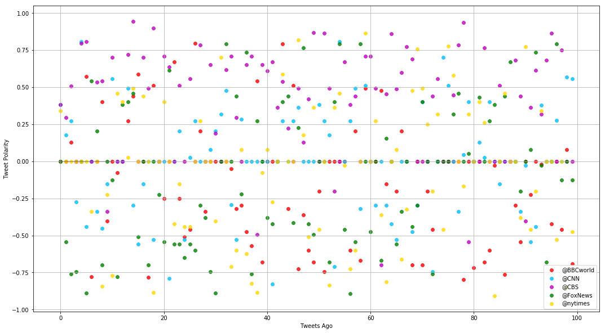
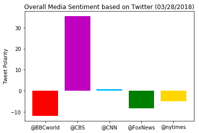

```python
# Dependencies
import numpy as np
import pandas as pd
import matplotlib.pyplot as plt
import json
import tweepy
import time
import seaborn as sns

# Initialize Sentiment Analyzer
from vaderSentiment.vaderSentiment import SentimentIntensityAnalyzer
analyzer = SentimentIntensityAnalyzer()

# Twitter API Keys
consumer_key = "XXYY"
consumer_secret = "YYXX"
access_token = "XXXX"
access_token_secret = "YYYY"

# Setup Tweepy API Authentication
auth = tweepy.OAuthHandler(consumer_key, consumer_secret)
auth.set_access_token(access_token, access_token_secret)
api = tweepy.API(auth, parser=tweepy.parsers.JSONParser())
```


```python
# Target Account
target_user =["@BBCworld","@CNN", "@CBS", "@FoxNews", "@nytimes"] 
#BBC, CBS, CNN, Fox, and New York times

# Counter
counter = 1


tweetDict = {}
for user in target_user:
# Loop through 5 pages of tweets (total 100 tweets)
    tweetDict[user] = []
    for x in range(5):
        # Get all tweets from home feed
        Tweets = api.user_timeline(user,page=x+1)
        for tweet in Tweets:
            tweetDict[user].append(tweet['text'])
print(tweetDict)
```

    {'@BBCworld': ['Utah trooper hit by skidding car https://t.co/sgr0ZHWwX3', "Kim in Beijing: Why Xi's still the one he needs to see https://t.co/PefHB8UprZ", 'Trèbes attack: Paris ceremony for hero policeman Arnaud Beltrame https://t.co/6naeoAd4HT', "Australia's indigenous languages have one source, study says https://t.co/7QoMFrTeBU", 'Tesla and Nvidia shares fall amid driverless car doubts https://t.co/ZvAPiF6wgd', 'Canada teen wins $1000 a week for life on 18th birthday https://t.co/NeTuIPmXby', 'Alton Sterling: No charges in 2016 fatal police shooting https://t.co/ahSn5LVRLc', "N Korea's Kim Jong-un visits China's Xi https://t.co/SEc2LT35DA", "RT @BBCNewsAsia: Definitely not something you see every day. 🐘\n\nA video of a 'smoking' wild elephant in India is baffling scientists and wi…", 'RT @BBCNewsAsia: Vietnamese singer and activist Mai Khoi has been detained in Hanoi on her return home from a European tour.\n\nShe was held…', "Letter from Africa: Will age be a factor in Zimbabwe's poll? https://t.co/4UunbFffbZ", "The world's toughest place to study? https://t.co/JdkkQo8XtQ", 'Can the ad industry persuade us to eat more vegetables? https://t.co/Jtss2hwwHd', "5 pop songs you didn't know were about God https://t.co/lL4RlGDqWc", "Kim Jong-un's Beijing visit is considered a significant step in North Korea's preparation for talks agreed in princ… https://t.co/eD7Xv8h709", '@BBCBreaking North Korea\'s leader Kim Jong-un has visited Beijing and held "successful talks" with Chinese leader X… https://t.co/bvNkLb8m89', 'China confirms Kim Jong-un visit https://t.co/eRxfJKgLZc', 'Fired Vancouver waiter case: Are the French really rude? https://t.co/ETb72MasiY', 'RT @BBCDanielS: BBC Exclusive interview with Sergei Skripal’s niece: “I would really like to know how they are” https://t.co/UQHT7fZv2y', "This 'smoking' elephant in India is baffling experts\n\nhttps://t.co/4oBCX8OR7q https://t.co/5nVKiPNUZF", "Spy poisoning: 'I would really like to know how they are' https://t.co/6hK6i3Co1S", 'Brazilian sports reporters tackle on-air groping https://t.co/MOxFd4yreE', 'RT @BBCNews: Owl ring-bearer attacks best man at wedding... prompting hoots of laughter 🦉\n\nhttps://t.co/DjhjEdoYhy https://t.co/2x3bedxedn', 'Nearly a million watch cat stuck up pole https://t.co/aw9PbAliF3', 'RT @BBCSport: Australia coach Darren Lehmann denied ball-tampering during the Ashes when questioned at Johannesburg airport by @danroan \n\nW…', 'RT @richard_conway: Sanctions announced against the three players within 24 hours by Cricket Australia. \nA nation is incensed, a Prime Mini…', 'I want to apologise to "kids who love cricket and idolise the players" - Cricket Australia boss James Sutherland on… https://t.co/evTGNOU23c', 'RT @richard_conway: Smith, Bancroft and Warner said to be only players with knowledge of ball tampering intentions... significant words in…', 'Russia fire: Protester spoke on the phone to dying wife https://t.co/YDLIjNDGNg', 'RT @bbctms: James Sutherland says only 3 people involved in ball tampering incident. \n\nSteve Smith, David Warner &amp; Cameron Bancroft. \n\n"Ser…', 'RT @richard_conway: Full statement from Cricket Australia: https://t.co/GqIh4ynYtE', 'Australia ball-tampering: Steve Smith, David Warner, Cameron Bancroft sent home https://t.co/gBTooWUkS4', 'RT @richard_conway: Cricket Australia to conduct review into conduct and culture of team.\nSanctions to be announced within 24 hours.', 'RT @richard_conway: Breaking:\nCricket Australia say Steve Smith, David Warner, Cameron Bancroft to leave South Africa tomorrow.\nHead coach…', "JWST: Hubble 'successor' faces new delay https://t.co/eXx0Vxqfb6", 'France to lower school starting age from six to three https://t.co/Us998C0PsN', 'William Strampel: Michigan supervisor of Larry Nassar arrested https://t.co/1dROZkhAjO', 'Kemerovo fire: Who are the victims in the Russia leisure centre blaze? https://t.co/tX0BjbjBtL', 'RT @BBC_HaveYourSay: Chicago superior? The phenomenon of the media-savvy slam-dunk nun\nhttps://t.co/p6WqsUEDY7', 'Kemerovo fire damage seen from inside gutted mall https://t.co/O75q4RgqPx', 'Twenty million Indians apply for 100,000 railway jobs https://t.co/DzmNwTG5wQ', 'When is a diplomat really just a spy? https://t.co/b8C7t86gI5', 'Why bear cubs are spending longer with their mothers https://t.co/LabQd7LPk3', 'US teen author wins Astrid Lindgren prize https://t.co/X7PfD88XPo', 'Argentine government mocked over heterosexuality tweet https://t.co/Ve8pBTidUa', '.@NATO is reducing the size of the Russian mission to the organisation, in a "strong message" to Moscow after Salis… https://t.co/VKb4QKoy1a', 'Kemerovo fire: Crowds direct fury at Putin https://t.co/kfzgKL64BQ', 'RT @BBCNews: "I was on my own. Just trying to do my best"\n\nRob Grew - who helped in the aftermath of the Manchester Arena attack last year…', "It's 50 years since the death of Yuri Gagarin, the Russian cosmonaut who was the first man to travel into space 👨\u200d🚀 https://t.co/DB917VJ2Fl", "Saying goodbye to 'hell on earth'\n\nAfter weeks of heavy bombardment thousands of people are being bussed from Easte… https://t.co/2hpW6mVKE2", 'Census 2020: US adds controversial citizenship question https://t.co/NZh16MUPM5', 'Olivia de Havilland: Acting legend loses court battle over TV drama Feud https://t.co/TjsJ9zIHPc', 'This 98-year-old sports mascot nun is captivating Americans https://t.co/C6FSNOZQqi', 'Uber barred from resuming Arizona self-drive trial https://t.co/YTVM9Z0xbM', 'Mai Khoi: Vietnam detains activist singer after Europe tour https://t.co/x3ls91zSMd', 'Stephane Audran: French actress dies at 85 https://t.co/ojweEMIH5N', 'Eurovision-style scoring or new Cold War? https://t.co/uDPu5RHrFX', 'A mountain lion goes for a casual prowl through some homes in California. 🦁 https://t.co/iOXBdnaXRC', 'RT @BBCBreaking: Fire crews were "out of the loop" and took two hours to attend after the Manchester Arena attack, a report says https://t.…', "Nelson Mandela's golden hand casts sell for $10m in bitcoin https://t.co/4Pcaukiv2X", 'RT @BBC_HaveYourSay: The debate online: Where were you for #BlackLivesMatter?\nhttps://t.co/C8aCx0i91W', '"Mad" Mike Hughes flew his home-made rocket to try and \'prove\' the earth is flat. 🚀🌎 https://t.co/WSkHpfDAcc', 'Porn stars call for respect after spate of deaths https://t.co/fB8VVLFLBj', 'Air New Zealand calls for drone legislation after near miss https://t.co/z9xU80ZNdo', "Tiangong-1: Chinese space station may hit Earth 'in days' https://t.co/gbl4e9CBvS", 'Keith Raniere: Leader of Nxivm group charged with sex trafficking https://t.co/9aDhP2YhUu', "Justin Trudeau apologises for Canada Tsilhqot'in hangings https://t.co/dCObSz45ZO", 'Finding closure in the Falkland Islands https://t.co/WqBmBCN1LU', 'Going from slavery to being a millionaire https://t.co/cDww32MCeT', "'Smoking' elephant in India baffles experts https://t.co/ciP6a0gr2z", "Russia Kemerovo fire: Putin cites 'criminal negligence' https://t.co/JcMnGFEUce", 'Mummy found in Egyptian coffin that was thought to be empty https://t.co/6pufGA6aHK', 'Asia stocks follow US shares up as trade war fears ease https://t.co/jbl00g4Yad', 'Scientists in Australia have discovered the remains of a mummy in a 2,500-year-old coffin that was previously class… https://t.co/rThVYjYHr9', 'Mountain lion roams California backyards https://t.co/MdK4WoHdHJ', 'DR Congo: How one village massacre unfolded https://t.co/p6yOicjleI', 'Anthony Wong: Hong Kong actor finds brothers after BBC report https://t.co/nKdB4DUm7Z', 'Flat-Earther launches DIY rocket https://t.co/DUqeiDpE67', "Spy poisoning: Australian PM condemns Russian 'recklessness' in UK https://t.co/KtbpyIfeqB", 'RT @BBCNewsAsia: Veteran Hong Kong actor Anthony Wong spent decades looking for the father who left him as child. https://t.co/f2WXL7vvfr…', 'RT @BBCNewsAsia: Young women in South Korea are fighting for a new future. \n\nThe #MeToo movement which has highlighted sexual harassment an…', 'RT @BBCNewsAsia: A train believed to be carrying a senior North Korean official has arrived in Beijing, Japanese media report.\n\nCould it be…', "Eastern Ghouta: Saying goodbye to 'hell on earth' https://t.co/A0Q5B8v5Zv", 'Did Martin Luther King predict his own death? https://t.co/VcEoblW4OY', "Lindi Ortega: 'Music helps me cope with body dysmorphic disorder' https://t.co/IiIj5TsiWg", 'Linda Brown, centre of Brown v Board civil rights case, dies https://t.co/MunLzyWxC0', 'Cold War: How do Russia tensions compare to Soviet era? https://t.co/baUYyv2YvF', 'Actor Anthony Wong finds family who never knew him, after BBC report https://t.co/74P0yJj51s', "James Packer: Resignation puts focus on 'high-flier' mental health https://t.co/5hytkACnVu", "Brazil's female sports reporters call time on sexual harassment https://t.co/AgJGTDXOiT", 'Yuri Gagarin: First man in space https://t.co/TgmvpPgK1N', "DR Congo massacre: 'My daughter was slashed with a machete' https://t.co/78bzi0x7qp", 'RT @danroan: Here’s Cricket Australia ball-tampering investigators Iain Roy &amp; Pat Howard arriving at team’s luxury Cape Town hotel where pl…', "RT @BBCSport: 'It doesn't matter what they achieve in their careers, this Australia team will be remembered for cheating.' 👉 https://t.co/q…", "'North Korean train' in Beijing fuels rumours of Kim Jong-un visit https://t.co/iOWYdx3eTI", "Stormy Daniels: White House 'strongly' denies Trump's alleged affair https://t.co/zUuenyOO0v", 'RT @BBCJonSopel: More than a Stormy in a tea cup - my blog on the #StormyDanielsInterview on #60 minutes  https://t.co/xGroTNbBCH', "RT @BBCJamesCook: The White House says the president doesn't believe that Stormy Daniels was threatened. Asked why not, his spokesman repli…", 'Kemerovo mall fire: How party turned into nightmare https://t.co/A4fz582Aau', "Paris murder of woman, 85, investigated as 'anti-Semitic' https://t.co/nWaZHYUKM9"], '@CNN': ["Stunning photos capture Egypt's ancient underworld https://t.co/dGrCOQxEex https://t.co/AqKFFSZOCe", 'Heineken has pulled an ad with the tagline "Sometimes lighter is better" after critics slammed it as racist.… https://t.co/cJ3fWyLp4y', 'Former President Barack Obama says he aspires to create "a million young Barack Obamas or Michelle Obamas" who will… https://t.co/1QpomqEwNc', "Apple co-founder Steve Jobs warned about privacy issues in tech at a conference in 2010. Facebook's Mark Zuckerberg… https://t.co/z4A3NW8cBb", '"They didn\'t have to kill him like that. They didn\'t have to shoot him that many times." The grandmother of Stephon… https://t.co/4pvJGbpw9J', "Facebook's stock has plunged 18% amid its data scandal, wiping out nearly $80 billion in market value… https://t.co/qm59i14Pq0", 'Democrats may already be 35% of the way to a House majority https://t.co/Ya3cFVnqud | Analysis by Harry Enten https://t.co/PKanQAjkpg', "England's health agency is warning parents to be aware of the signs and symptoms of scarlet fever as infections con… https://t.co/vKJ6QOKqmv", "Blue states are far more likely to lose money and power over Census citizenship question | Analysis by CNN's Harry… https://t.co/13EWDxnd6X", 'An Ohio fertility clinic says more than 4,000 eggs and embryos were affected by a freezer malfunction, double the n… https://t.co/0EZ5F2Ua6p', 'Wall Street bonuses soar 17% to an average of $184,200 https://t.co/qlOQGfehL8 https://t.co/1bw7FWYwwl', 'Waymo and Jaguar unveil a self-driving, electric SUV https://t.co/DTylJKCuML https://t.co/2aD3JXwfGM', '11 reasons (besides the NCAA Final Four) to visit San Antonio https://t.co/1YGqpmrZKz via @CNNTravel https://t.co/Vi45YehYXR', 'Former Disney Channel star Caroline Sunshine is joining the White House press team https://t.co/rOYDj2tPs1 https://t.co/xamwbkWP7h', 'Walmart says it will stop selling Cosmopolitan magazine in checkout lines \n\nThe National Center on Sexual Exploitat… https://t.co/oJWSfJKGk2', 'Prince had a "exceedingly high" concentration of fentanyl in his body when he died https://t.co/xzXGWvrqky https://t.co/5CBfqJYBNs', 'An Ohio fertility clinic says more than 4,000 eggs and embryos were affected by a freezer malfunction, double the n… https://t.co/2kUalNEtFo', 'President Trump has privately floated the idea of funding construction of a border wall with Mexico through the US… https://t.co/OVJnG1Arkl', 'Sean Penn, who has done work in Haiti for years, says he felt "deep hurt" following the controversy over Pres. Trum… https://t.co/jkTdsZtERk', 'Actor Sean Penn smoked a cigarette during an interview on "The Late Show With Stephen Colbert," and viewers had a s… https://t.co/DYMvSOouIc', "RT @CNNTonight: The White House defends President Trump's silence on allegations leveled against him by Stormy Daniels https://t.co/xPKWwph…", "Larry Nassar's former boss at Michigan State University used his power to sexually assault, harass, and solicit nud… https://t.co/X7BiNzGTGV", 'RT @AC360: As his administration doubles down on building a border wall, President Trump suggests the US military may foot the bill https:/…', 'Progressives, states and civil rights advocates are preparing a flurry of legal challenges to the Trump administrat… https://t.co/COBpw3wtor', "How Russian President Vladimir Putin's arrogance handed UK Prime Minister Theresa May a diplomatic coup… https://t.co/Nub4iViDPH", 'Is bread crust more nutritious than its inner crumb? The variety you choose may matter more than whether you eat th… https://t.co/clki6ZwPYZ', "North Korean leader Kim Jong Un met with the China's Xi Jinping during a surprise trip to Beijing this week, state… https://t.co/UHIZDKXeob", "In Trump's world, once you check in, you rarely check out https://t.co/bHZg0WgmkX https://t.co/uWZA9cEJu8", "The children are Democrats' future | By Jesse Ferguson via @CNNOpinion https://t.co/xBaMfKTzhZ https://t.co/3iFNq6BHav", 'FBI Director Christopher Wray said he is doubling the number of FBI personnel tasked with reviewing a large set of… https://t.co/EJynfU7wlW', 'Attorney for brother of slain DNC staffer Seth Rich: Internet activists are spreading lies "as far and wide" as the… https://t.co/XUbhZLGXtJ', 'Government ethics lawyers advised Ivanka Trump to make sure to keep her White House role separate as she planned to… https://t.co/eeBfMRZNs5', "Michael Cohen — President Trump's loyal fixer https://t.co/I3QjtsNaAZ https://t.co/vEdKQK669d", "Is the White House Counsel's Office looking into Jared Kushner? The answer isn't clear. https://t.co/lbQxxFZlPX https://t.co/Fdas6E1nO6", "RT @AC360: Seth Rich's brother sues right-wing activists, Washington Times over conspiracy theories: @GaryTuchmanCNN reports https://t.co/1…", 'Keeping Them Honest: The President sees himself as a “counter-puncher,” but when it comes to Stormy Daniels, all we… https://t.co/i7sXcnh0mI', 'The US needs to borrow almost $300 billion this week https://t.co/ZYuVjMl9H5 https://t.co/xqpI8iWojN', 'China raised eyebrows this month by announcing it will give the Economic Community of West African States a $31.6 m… https://t.co/dgRkS4pNdV', 'RT @AC360: China confirms: Kim Jong Un made a visit to Beijing https://t.co/mCREpkhOLd https://t.co/qoCsm4ZYzD', "Former President George W. Bush may have retired his political penny loafers, but his dancing shoes? Those haven't… https://t.co/K4DjLuftKI", '"Tonight, the President, still uncharacteristically silent." With the news dominated by stories of alleged affairs… https://t.co/ywrY4xrHbh', "After spending 23 years in prison for a crime he didn't commit, Nevest Coleman is back working as a groundskeeper f… https://t.co/3wnuYj9ZXQ", "North Atlantic right whales may be on edge of extinction. There's been zero births this year.… https://t.co/wkHa5e2fwD", 'Presidential misspellings create a spike in dictionary searches https://t.co/clvvRb4A5j https://t.co/jChXBtd8qI', "President Trump has appointed to his cabinet several people who've served as conservative TV pundits, many on Fox N… https://t.co/ENk3znOZj5", 'Former President Barack Obama says he aspires to create "a million young Barack Obamas or Michelle Obamas" who will… https://t.co/l7yBatqodJ', 'The brother of slain Democratic National Committee staffer Seth Rich is suing right-wing activists and the Washingt… https://t.co/R4cs9PSQVQ', 'Cops in Tempe, Arizona, now have AR-15s strapped to the back of their motorcycles https://t.co/olcEquajNB https://t.co/xGVdtixqVC', 'RT @OutFrontCNN: "Tonight, the President, still uncharacteristically silent." - Amid a news cycle dominated by stories of alleged affairs w…', 'Three members of the Australian cricket team will be sent home from Johannesburg after admitting during a post-matc… https://t.co/1UMvm0nLLv', "Stunning photos capture Egypt's ancient underworld https://t.co/bW90Z7OZ7o https://t.co/8abhSDTKEu", 'JUST IN: North Korea leader Kim Jong Un made a surprise two-day trip to Beijing, Chinese state media has confirmed… https://t.co/IW7YZvzjLR', 'Heineken has pulled an ad with the tagline "Sometimes lighter is better" after critics slammed it as racist.… https://t.co/8LXiHLTqQH', 'A new NYPD internal investigation criticizes the way the department handles sexual assaults https://t.co/UALy5XvuiA https://t.co/TNF0zTBLjm', '"They didn\'t have to kill him like that. They didn\'t have to shoot him that many times." The grandmother of Stephon… https://t.co/WqdgsJQJs6', 'Veterans Affairs Secretary David Shulkin appears to be on thin ice with the White House, but some major veterans gr… https://t.co/Tz47JBpTW1', 'Former President Barack Obama says he aspires to create "a million young Barack Obamas or Michelle Obamas" who will… https://t.co/Dk8k01daZO', 'Former Disney Channel star Caroline Sunshine is joining the White House press team https://t.co/3kRTmq4lYC https://t.co/EyFCp1K3v3', '"The widespread prevalence of endometriosis — and the lack of any long-term treatment options — is nothing short of… https://t.co/qygfw6aVFD', 'RT @CNNSitRoom: An official with deep knowledge of North Korea told CNN there was a "strong possibility" that North Korean leader Kim Jong…', "Uber's self-driving permit in California goes until March 31 -- and the company said it will let the permit expire… https://t.co/sJWdSR2uTu", 'RT @CNNOpinion: Learn from the Holocaust and stop the massacre in Syria, write @EvaMozesKor and @MhdAGhanem https://t.co/urdH6TeosD', "The CEO of Waymo, the driverless car division of Google parent company Alphabet, said his company's driverless cars… https://t.co/BSqPEppylZ", 'Some Aetna customers could see lower drug prices next year https://t.co/lYDhNfdyxU https://t.co/WFnbBn5HhA', "Don't be an April fool and miss out on what's streaming on Netflix, Hulu and Amazon Prime next month https://t.co/sf2jB37GxA", "An appeals court said Google violated copyright laws when it used Oracle's open-source Java software to build the A… https://t.co/MEw6qBehlk", 'Researchers have detailed the structure and distribution of spaces in your body that they say represent a newfound… https://t.co/QAaCP21k8T', 'The NFL and Nike just announced that they would be extending their partnership for another eight years https://t.co/bAROWhKLHg', "Six days after a ransomware attack shut down the City of Atlanta's online systems, officials are telling employees… https://t.co/okyUlZFUM5", "The census has always been a weapon of political power | Analysis by CNN's Gregory Krieg https://t.co/2eHizX8TE7 https://t.co/Cr6gCfy237", 'Steven Spielberg nixes Carl\'s Jr.\'s "SpielBurgers" dreams https://t.co/iz5DyMTxUD https://t.co/K5Vu9d4yHm', 'A former professional clown is running for Congress in South Carolina https://t.co/GMfVUgWMob https://t.co/pSpDLGTqgX', "There's not a 'snowflake's chance in hell' of repealing the Second Amendment | Analysis by CNN's Z. Byron Wolf… https://t.co/yzVur4ZfQ0", "White House press secretary Sarah Sanders defended President Trump's silence on allegations leveled against him by… https://t.co/oycTPyBTn1", 'Secretary of Defense James Mattis on President Trump’s newly named national security adviser John Bolton: “I hope t… https://t.co/WHpD4xHuTI', 'Warren Buffett swooped in to rescue General Electric once. Could he do it again? https://t.co/0aW43nOaAa', "Why the Trump administration's plan to put a citizenship question back on the US census is a big deal… https://t.co/TD01oqVqva", "The US general in charge of the nation's nuclear arsenal has issued a stark warning that Russia and China are aggre… https://t.co/wFSuV1etYq", 'Michael Phelps calls on the US Olympic Committee to do more to help athletes struggling with depression… https://t.co/Y9pZFED1vl', "RT @CNNSitRoom: Most Americans say US President Trump isn't doing enough to cooperate with special counsel Robert Mueller's investigation i…", "Nearly two thirds of Americans approve of President Trump's plan to meet with North Korean leader Kim Jong Un, acco… https://t.co/6I0Ao6SyVw", 'New CNN/SSRS poll: Should Robert Mueller be able to investigate Trump’s finances?\n- Yes 67%\n- No 28%… https://t.co/Q8waAySeZj', 'Hormone replacement may prevent belly fat in postmenopausal women, according to a new study https://t.co/fyYbOSWWfc', "Most Americans say President Trump isn't doing enough to cooperate with special counsel Robert Mueller's investigat… https://t.co/IzArFrCj0M", "JUST IN: Nearly two thirds of Americans approve of President Trump's plan to meet with North Korean leader Kim Jong… https://t.co/E8p8cpdLWD", '"Never mind that an undereducated population is bad for democracy -- it\'s good for the GOP, and so Republicans are… https://t.co/eGgtXnaEP5', "Stormy Daniels' lawyer: Donald Trump isn’t speaking out about the affair allegations because “my client is telling… https://t.co/UHS6v2Mc2c", "The White House defends President Trump's silence on allegations leveled against him by Stormy Daniels… https://t.co/GGtqrtq5lh", 'The NRA insisted it did not use foreign funds for election-related purposes, even as the group acknowledged it acce… https://t.co/wFcSX2AffF', "Why dismissing Stormy Daniels' story would be a mistake | By Carol Costello via @CNNOpinion https://t.co/Rw77AFywo2 https://t.co/sPuNqi1TOF", 'RT @TheLeadCNN: Rep. Lieu: I support US move to expel Russian diplomats, but we have a long way to go for the Trump Administration to “[sto…', "Tesla stock slid 8% following a string of bad news, including the NTSB's announcement that it's investigating a fat… https://t.co/8v3hjShQv4", "Facebook's stock has plunged 18% amid its data scandal, wiping out nearly $80 billion in market value… https://t.co/Y7l6pDeZwJ", 'RT @TheLeadCNN: Rep. Lieu: People need to have faith that the census data is accurate, “and if you’re an immigrant, you might not want to t…', 'Israeli Prime Minister Benjamin Netanyahu hospitalized for a high fever and cough, his office says… https://t.co/nobdnlqqEi', 'Nvidia is temporarily pausing its self-driving car tests on public roads a week after a car from Uber, which incorp… https://t.co/VzWph7rVGz', "Secretary Zinke, we can't afford to ignore diversity | By Andre Perry via @CNNOpinion https://t.co/Z0mq8ZggbN https://t.co/npCcdgkRrl", 'US Ambassador to the UN Nikki Haley on Russia: Their “blatantly false narratives will not keep us from telling the… https://t.co/FMnyi5lmL6', 'The Dow drops about 345 points, completely reversing a 244-point gain from early in the day, as tech stocks get cru… https://t.co/dwEBWWjmkA', 'The US Supreme Court prepares for a right turn https://t.co/5XsbK13Nhx https://t.co/RS21gJQV4X'], '@CBS': ['Count on Entertainer Of The Year nominee @LukeBryanOnline to crash the party with an epic performance at the 53rd… https://t.co/27ua60HTqu', "Join @eltonofficial and some of today's hottest names in music when they take the stage to perform his most memorab… https://t.co/jz0jaShZIj", 'RT @ACMawards: The ACM for New Vocal Group of the Year goes to @MidlandOfficial! And yes, that really was @Reba on the phone! #ACMawards ht…', 'RT @ACMawards: In case you didn’t know, the ACM for New Male Vocalist of the Year goes to @BrettYoungMusic. Check out his reaction when @Re…', 'RT @ACMawards: Over the weekend @Reba called the ACM New Artist of the Year winners to let them know they had won! Let’s just say our New F…', 'Congratulations to the 53rd #ACMawards New Artist winners @Lauren_Alaina, @MidlandOfficial, and @BrettYoungMusic! W… https://t.co/Fr8H4arwGj', 'New start times in East/Central Time Zones #60Minutes 7:35ET/6:35CT #Instinct  8:35ET/7:35CT #NCISLA 9:35ET/8:35CT… https://t.co/8W5hAeLrvs', 'Don’t miss a minute of the action. Stream the\xa0Elite Eight®\xa0games LIVE today starting at 2PM ET with a FREE trial of… https://t.co/8NwU8HdiHR', "RT @MomCBS: That's a wrap on the #Mom panel at #PaleyFest! Thanks for following along! https://t.co/we4JgqPt6P", 'RT @MomCBS: A fan just commented that #Mom helped bring him out of a deep depression. 💜💜💜 #PaleyFest', 'RT @MomCBS: "Go out for it anyway. If you\'re good for the role, you\'re good for the role." @theJaimePressly\'s advice for aspiring actors wi…', 'RT @MomCBS: Mom Co-Creator @GemmaRBaker just pointed out her own #Mom in the audience at #PaleyFest! 💜', 'RT @MomCBS: "I\'m not someone in recovery who goes to AA, but I have taken so much away from it...to take one day at a time." - @theJaimePre…', 'RT @MomCBS: "You get to appreciate working with such talented people." - @AnnaKFaris #Mom #PaleyFest', 'RT @MomCBS: “I love this job. I love working with these women. I love working in front of the live audience… It’s alive and it’s fun.” - @A…', 'Get on your feet for @Jason_Aldean, @ThomasRhett, @ChrisStapleton, @KeithUrban, and @ChrisYoungMusic, the five nomi… https://t.co/oT5ogjdj4x', 'Get ready for some sweet games! Stream #5 Clemson vs #1 Kansas LIVE at 7PM ET and #11 Syracuse vs #2 Duke LIVE at 9… https://t.co/4WstgrKNnW', 'RT @SEALTeamCBS: In honor of #NationalPuppyDay... 😍 #SEALTeam https://t.co/4mIZPpiRlU', 'RT @HawaiiFive0CBS: Nothing like a man and his dog! 😍🐶 Happy #NationalPuppyDay to Eddie, the best pup on the Five-0 Task Force! #H50 https:…', 'Game on! 16 teams left and the race to the finish continues tonight. Stream #11 Loyola-Chicago vs #7 Nevada LIVE at… https://t.co/W374rmzzoC', "Save the date! These are season finales you do NOT want to miss. RT if you're excited! https://t.co/UUQoWsPPSh https://t.co/cDl4WmxMtU", 'Congratulations to all of the @CBSDaytime nominees for the #DaytimeEmmys! See the full list of #DaytimeEmmy nominee… https://t.co/ivJVJWvfsf', 'Female Vocalist Of The Year nominee @MarenMorris will show her fans how it’s done when she takes the stage to showc… https://t.co/PITjmAoFT8', 'The legendary @Reba returns to host the 53rd #ACMawards and she’s proving just how comfortable she is behind the mi… https://t.co/XPXcSPRXqC', "RT @nancyodell: Told my daughter I'd be presenting at @ACMawards again this year. (Woot woot!We both luv country music!)She took this pic o…", "RT @ladyantebellum: Ecstatic to announce we'll be performing at the #ACMawards in Las Vegas again this year! https://t.co/Qfhs94j6FR", 'Country superstars @kennychesney, @ladyantebellum, @blakeshelton, and @KeithUrban have just been added to the stell… https://t.co/bJ4If7MacP', 'RT @YandR_CBS: Forever evolving, Forever inspiring, Forever Young and Restless. ❤️ Get ready to celebrate 45 years of #YR starting in just…', 'New start times in East/Central Time Zones: #60Minutes 7:37ET/6:37CT #Instinct series premiere 8:37ET/7:37CT… https://t.co/xT3YKqmu2M', 'Spend your Sunday streaming Second Round games LIVE with a FREE trial of CBS All Access! https://t.co/3P85rXLy4b https://t.co/zbWfirD9Ju', "RT @instinctcbs: TONIGHT, Dr. Dylan Reinhart rewrites the book on abnormal behavior. Don't miss the premiere of #Instinct at 8/7c! https://…", "If any duo knows how to rock the stage, it's @FLAGALine. The Vocal Duo Of The Year nominee will perform live at the… https://t.co/FknabB8NQp", 'How is your bracket looking after last night? Stream Second Round games LIVE today with a FREE trial of CBS All Acc… https://t.co/25JlIpgwog', 'Where better to spend #StPatricksDay than the place everybody knows your name? It’s just your luck that every singl… https://t.co/Fom5wmdENL', 'Stars @JakeMcDorman and Nik Dodani will join the cast in the upcoming revival of Murphy Brown coming to CBS.… https://t.co/JCAx29lo0i', 'RT @thegoodfight: Go behind the scenes with costume designer @DanLawsonStyle in "Behind The Style," a new weekly video series all about the…', 'The games have just begun! Continue to stream First Round games LIVE today with a FREE trial of CBS All Access:… https://t.co/YTGsJ48zYP', 'RT @TheTalkCBS: You asked, we answered! The fun never ends when the ladies #KeepTalking and answer your fan questions 🗣💬➡️ https://t.co/ie1…', 'RT @instinctcbs: Dr. Dylan Reinhart is lured back into the field from his life of quiet academia when a certain serial killer makes things…', 'Stream First Round games LIVE today starting at 12PM ET with a FREE trial of CBS All Access! https://t.co/3P85rXLy4b https://t.co/vZow3YD8cb', "RT @CBSSports: It's the most wonderful time of the year. #MarchMadness https://t.co/e4c9qohqSR", 'Give these ladies some love! @Lauren_Alaina, @DBradbery, @carlypearce, and @RaeLynn are nominated for New Female Vo… https://t.co/IVhwURfJ3S', 'RT @ManWithAPlan: Hungry for more #ManWithAPlan bloopers and behind-the-scenes videos featuring cast like @matt_leblanc, @thelizasnyder, @k…', 'Music stars @MileyCyrus, @edsheeran, @ladygaga, and more will honor the legendary @eltonofficial and his hit songs… https://t.co/UzxARCCLnI', 'RT @thegoodfight: The verdict is in. The new season of #TheGoodFight is 🔥🔥🔥! Stream it now on CBS All Access: https://t.co/FkYSNSXlRb https…', "RT @MadamSecretary: In less than an hour, #MadamSecretary's Keith Carradine will be taking over the @MadamSecretary Twitter page! Tweet alo…", 'RT @DierksBentley: Take and post a photo of the woman in your life who inspires you daily! Use the hashtag #WomanAmenACM in your post for a…', 'RT @MomCBS: If you missed guest star @KChenoweth in the latest episode of #Mom, not to worry! Watch now: https://t.co/RlvXoGOZ0l https://t.…', 'Give a round of applause to @KelseaBallerini, @MirandaLambert, @Reba, @MarenMorris, and @CarrieUnderwood, the five… https://t.co/Ncp1BTXx6N', "RT @thegoodfight: Smart, sexy, and sophisticated. See what's coming this season on #TheGoodFight. https://t.co/CuKhx2G50P https://t.co/ygTI…", 'RT @BlueBloods_CBS: Even stand-up guys fall down sometimes. #BlueBloods is new tonight at 10/9c! https://t.co/UOlDm22wWW', 'Today and every day we celebrate the women in our lives who empower and inspire us. Share a story about an\xa0influent… https://t.co/9rVtqrElvT', 'Take and post a photo of the woman in your life who inspires you daily! Use the hashtag #WomanAmenACM in your post… https://t.co/7ShhvE48zy', "RT @thegoodfight: Meticulously constructed. Soapy &amp; sexy. Intoxicating, savage television. 🔥 Here's what critics are saying about #TheGoodF…", 'This just in! @Jason_Aldean, @mirandalambert, @LukeBryanOnline, and many more are set to perform at the 53rd Academ… https://t.co/mfxw2VxzU4', 'Meet the ensemble of talented actors slated to join $1, a new mystery series coming to CBS All Access:… https://t.co/QoyYv7vxwg', 'Will @Jason_Aldean, @garthbrooks, @LukeBryanOnline, @ChrisStapleton, or @KeithUrban be named Entertainer Of The Yea… https://t.co/rMD8zjeX3s', 'RT @thegoodfight: It feels good to be back. 👠💄🔥 The season 2 premiere of #TheGoodFight is now streaming, exclusively on CBS All Access: htt…', 'RT @thegoodfight: Tomorrow, #TheGoodFight is back. Stream the season 2 premiere only on CBS All Access: https://t.co/tNFR8LBJO2 https://t.c…', "Who are the trailblazing women in your life that inspire you? Join CBS and the ANA's #SeeHer initiative, celebratin… https://t.co/M0KqZ41Bes", 'Join @maria_bello, @aishatyler and @TeaLeoni in celebrating the accomplishments of women who have contributed to th… https://t.co/MefESBeFL3', "In honor of Women's History Month, CBS and the Association of National Advertisers' (ANA) #SeeHer initiative will p… https://t.co/2wtYxKJVuO", 'RT @ZoeListerJones: Tonight’s an all new Life In Pieces and it’s directed by my ride or die @nataliaanderson!!!… https://t.co/2LPfmyLWrY', 'RT @MarenMorris: Hot damn! Woke up from my post-wisdom teeth haze to find out I’m up for 4 @ACMawards ! So honored, especially for the Dear…', 'RT @KelseaBallerini: Ohhhhh goodness. Incredible. Thank you thank you thank you. #female https://t.co/1ZTYjNfQeF', 'RT @KeithUrban: ACMs...... HOLY SMOKES!!!!! MAD LOVE TO U ALL THIS MORNING  FOR THESE INCREDIBLE NOMINATIONS. I’M EXTREMELY GRATEFUL!!!!!!!…', 'RT @ACMawards: Congratulations to this year’s #ACMawards Video of the Year nominees:\n“Black” - @DierksBentley\n“It Ain’t My Fault” - @Brothe…', 'RT @ACMawards: Please give a round of applause to this year’s #ACMawards Entertainer of the Year nominees: @Jason_Aldean, @GarthBrooks, @Lu…', ".@ChrisStapleton, @ThomasRhett, @mirandalambert and more are all nominated for awards at Country Music's Party of t… https://t.co/Vm1vXRUDYJ", 'The Queen of Country, @Reba, is returning to host the 53rd #ACMawards on Sunday, April 15 at 8/7c. Here are a few o… https://t.co/Iqzz6Gql01', 'RT @survivorcbs: It’s time! #Survivor https://t.co/YPk6cGWrUA', 'RT @CBSThisMorning: TOMORROW: The nominees for the 2018 @ACMawards will be announced live by the one-and-only, @Reba! \n\nWatch on @CBS in ou…', 'RT @thegoodfight: From the set design and costumes to hair and makeup, the production quality is truly next-level. Take a peek inside the u…', 'RT @LivinBiblically: The fun continues on Facebook! The #LivingBiblically cast is live to talk about tonight’s premiere. Tune in here: http…', 'RT @KevinCanWaitCBS: Can you get all the way through these #KevinCanWait bloopers without laughing?! @KevinJames,@LeahRemini and the rest o…', "RT @ACMawards: That’s right! @Reba is headed to @CBSThisMorning on Thursday, March 1 to announce this year’s #ACMAwards' nominees. Tune in…", "RT @ScorpionCBS: You can't hack your way to a 197 IQ, but you are well on your way with these Genius Facts from #TeamScorpion! 💻 You can be…", 'RT @SuperiorDonuts: You can always count on @DavidKoechner for a laugh! Did your favorite Tush moment make the list? Catch a new #SuperiorD…', "RT @TheTalkCBS: TODAY: We loved them together then &amp; we love seeing them together now! Welcome back to the show @THESaraGilbert\u200b's good fri…", "RT @thegoodfight: As foundations begin to crumble, our characters struggle to make sense of this new dystopian world. The cast teases what'…", "#LivingBiblically's @linzkraft and @jrfergjr appeared on @KCBS's Facebook Live this morning, talking all about what… https://t.co/4RebcHuuMQ", 'RT @CBSSports: Introducing CBS Sports HQ, a New 24/7 Direct-to-Consumer Streaming Network for Sports News, Highlights, &amp; Analysis.\n\nStream…', 'RT @CBSBigBrother: It’s down to the final 5 celebrity Houseguests, and anyone could take home the grand prize! Tune in NOW to watch the #BB…', 'RT @startrekcbs: Binge the entire first season of #StarTrekDiscovery. All episodes now streaming exclusively on CBS All Access: https://t.c…', 'RT @thegoodfight: #TheGoodFight returns in 1 week. Season 2 premieres Sunday, March 4. https://t.co/nomCao1GWp https://t.co/BOn6bOe9Tb', 'RT @thegoodfight: This is our new favorite thing. Christine Baranski debuted #TheGoodFight the Musical on @colbertlateshow last night! 🎵🎤…', 'RT @LivinBiblically: Confession time: have YOU ever hit the "close door" button in an elevator while somebody was approaching? The cast of…', 'RT @CBSEyeSpeak: Mark your calendars! #CBSEyeSpeak kicks off March 14 with The EYE Speak Summit. Follow our page for more details! https://…', 'RT @CBSEyeSpeak: Proud to announce a new CBS initiative, promoting female empowerment and developing the next generation of leaders through…', "RT @LivinBiblically: When you're living by the Bible, it's good to have a priest and a rabbi on call (provided they answer their phones, th…", 'RT @thegoodfight: Chicago lawyers are being hunted and the world is going insane. \n\nThe new season of #TheGoodFight premieres Sunday, March…', 'Ready for some larger than life competition? This new series from @MarkBurnettTV will premiere in summer 2018.… https://t.co/gDXHLdIJ5v', 'With tournament dreams on the line, make sure to stream these college basketball matchups on CBS All Access:… https://t.co/SGkYUZrQWB', "RT @LivinBiblically: While Chip's sticking to the Bible's original rules, the cast of #LivingBiblically has given them a more modern makeov…", 'Casting News! Peter Mark Kendall, Michael Gaston, Greg Wise, Rade Šerbedžija, Zack Pearlman, and Keye Chen join the… https://t.co/GFob2KrD8H', 'RT @BullCBS: The verdict is in...#Bull is the perfect Valentine! ❤️ Happy #ValentinesDay! https://t.co/poEejI4AnC', 'RT @NoActivityCBS: Car 27 reporting: Season 2 of #NoActivity coming soon!\n\nBinge season one now on CBS All Access: https://t.co/yvxoQMeyhN…', 'RT @LivinBiblically: Against all odds (and the advice of his God Squad), Chip is determined to live life by the Good Book. Think you could…', "RT @thegoodfight: Christine Baranski reflects upon the spectacular metamorphosis of her character in #TheGoodFight's first season. Revisit…", 'RT @startrekcbs: Binge the entire first season of #StarTrekDiscovery. All 15 episodes now streaming on CBS All Access: https://t.co/lKLaptP…'], '@FoxNews': ['.@LindseyGrahamSC on dealing with North Korea: “We’ve tried it the Jimmy Carter way for about 30 years. Let’s try i… https://t.co/N0U5OcrIJ7', 'Veteran kills himself in St. Louis VA hospital waiting room, report says https://t.co/dhJledu3EH', '.@cvpayne: “We’ve been in a trade war with China for a very long time… and we have been losing mightily.” https://t.co/7mIzoOvo3o', '"It is a tragedy."\n\nSandy Best, sister of a woman killed by an illegal immigrant who was drunk driving, speaks out.… https://t.co/xru7EGV5CA', 'Shawn Nelson, Orange County Supervisor, on sanctuary status: “It is unconstitutional.” https://t.co/Wm0g8elAio', "Illegal immigrant Luis Bracamontes gets death penalty for slaying 2 California sheriff's deputies https://t.co/t08Kd4PUbq", 'Political analyst Ron Meyer: "Democrats really care about getting services to people who are here illegally more th… https://t.co/MN2bnL0FXx', 'An American flag flies from a Westhampton Beach Fire Department ladder following a dignified arrival of the repatri… https://t.co/ltur5AVBv8', 'Vegas police say 5 arrests in MS-13 case solves 10 murders https://t.co/d9QfRG2Zpm https://t.co/GV7NWP48jA', '.@TomiLahren: “The wall is common sense. The left has dominated this conversation, and they’ve made the wall some k… https://t.co/EQB0LdVwQ0', 'This baby orangutan at the Phoenix Zoo got a front-row seat when a young boy began performing tricks with his yo-yo. https://t.co/TlX7RStMvx', 'Funeral plans set for Iowa family found dead in Mexico https://t.co/VERjFXZRhk', '.@JohnJamesMI: “Donald #Trump is delivering on his promises and the people in the state of Michigan are benefiting… https://t.co/DpM9blM1m3', 'Elizabeth Smart claims in new book her kidnapper tried to abduct another girl https://t.co/JhZBVDzVLt', 'George Rodriguez: "Democrats are more interested in sanctuary cities and protecting people that enter the country i… https://t.co/ErlddWXyvm', 'New York Magazine reporter doubles down as outrage grows over alleged home invasion of Corey Lewandowski’s DC crash… https://t.co/LwODxt8F6Z', 'Dad holds “Say No” sign during proposal https://t.co/OJOXoWr9Hf', 'Auto crash at Oakland airport injures 2; unlicensed driver arrested, police say https://t.co/Nfmbv1Yvd1', '"Live a purposeful life."\n\n99-year-old WWII vet Sidney Walton and his son Paul are on a cross-country tour to meet… https://t.co/Hvq273kSzw', 'Protesters for Stephon Clark disrupt Sacramento City Council meeting, march to arena https://t.co/YkP3Zbj1au', '"The ones that are bad need to be weeded out."\n\nAmerican who escaped Al Qaeda captivity says @FBI, under Mueller an… https://t.co/1f20Ml9oDd', '.@RepKinzinger: “[President @realDonaldTrump’s] actions have been outstanding up to this point. He’s been probably… https://t.co/3ZkMEuYqlF', 'Capri Cafaro on proposed legislation that would ban work email after hours in NYC: “This is not part of American cu… https://t.co/Q1geHLagLU', "FBI boss Wray 'doubling' agents responding to subpoena on Clinton, McCabe, FISA abuses https://t.co/dYwvae0Gjj", 'Shawn Nelson, Orange County supervisor on California: “It’s time to end this nonsense, and stop being a breakaway r… https://t.co/4k3IXQeVYi', 'Senator Jim Inhofe will introduce bill that would send illegal border crossers immediately back to home country https://t.co/fNDmf1SRf9', '.@MonicaCrowley: "The left has long been at war with the Constitution." @IngrahamAngle https://t.co/aRMZlVg2Ji', "Harvey Weinstein's former assistant claims she tried to stop him in 1998 https://t.co/0i8gLOn6Vt", "Orange County votes to fight California's sanctuary city laws, joining sheriff's pushback https://t.co/H4moAuUf6J", '"It is a tragedy."\n\nSandy Best, sister of a woman killed by an illegal immigrant who was drunk driving, speaks out.… https://t.co/TeHZTTEQAO', 'Illegal immigrant who tortured dog gets prison time, to be deported https://t.co/pko5ae1c7c', 'Kansas considers making schools liable for not arming staff https://t.co/3mbhnz8n7T', '.@JesseBWatters on former Supreme Court justice who called for repealing the 2nd Amendment: “This is a slippery slo… https://t.co/774MeSLA9A', '.@TomiLahren: “The wall is common sense. The left has dominated this conversation, and they’ve made the wall some k… https://t.co/KiRDOM5rZN', "Owl gets loose at wedding, leaves best man 'terrified' https://t.co/FRyLScDdUA", '.@dbongino: “You don’t enact a law for the purpose of absolutely black-and-white stopping an activity. You make it… https://t.co/HQlaF971Me', '.@candacecbure credits Jesus and the Bible for her happy, 22-year marriage https://t.co/0yGdWqlzPD https://t.co/Mz6DFjVq62', "Al Sharpton's half brother charged with capital murder in Alabama shooting https://t.co/mmEopztFIb", "'Roseanne' Is Now a Big #Trump Supporter in Reboot of Hit 1990s Sitcom https://t.co/dqClNtgxD2", 'OPINION: #Trump is right -- California is out of control https://t.co/WY1OICe9P5', "Orange County votes to fight California's sanctuary city laws, joining sheriff's pushback https://t.co/mXpvYoNZRa", "HAVING A 'RUFF' TIME: Does Charlie look guilty of getting into the trash? https://t.co/VE5XpXOktM", "Kim Jong Un meets with Chinese leader on 'unofficial visit,' state media says https://t.co/l36PkMXVE3", 'Orange County Sheriff Sandra Hutchens on her dept. publishing a “who’s in jail” database to help cooperation with I… https://t.co/z4dp6M6lu5', '.@Harvard psychologist @sapinker explains how the world is moving in a better direction in a variety of ways… https://t.co/S6N0OicAkb', 'EXCLUSIVE: Matthew Schrier, the American who escaped Al Qaeda, and says FBI under Mueller &amp; Comey, betrayed him, te… https://t.co/iVOQhcEitR', 'Oklahoma Senator @JimInhofe says he plans to introduce legislation that would allow immigration agents to send thos… https://t.co/Yjgr7WnVVh', '.@MZHemingway on retired Supreme Court justice calling for repealing 2nd Amendment: “It’s absolutely chilling to se… https://t.co/l2xCyd4wKG', '.@TheJuanWilliams on 2020 census asking respondents if they are U.S. citizens: “It will, in fact, discourage people… https://t.co/qHXSzvx0bo', '.@LindseyGrahamSC: “We need that $650 billion to repair the damage done during the Obama administration to our mili… https://t.co/Q6b3ivubWL', '.@LindseyGrahamSC on dealing with North Korea: “We’ve tried it the Jimmy Carter way for about 30 years. Let’s try i… https://t.co/cZsqGvpOKr', 'US Olympians who plan to skip White House visit https://t.co/YpsyVsFvAs', 'Man arrested in connection to suspicious packages found at DC-area military bases https://t.co/KrkVVLyIMy', "'Gator King' uses live alligator for gender reveal party in viral video https://t.co/dJKjDmHqzG", 'Retired Supreme Court Justice Stevens says Second Amendment should be repealed https://t.co/jVAjREXcMQ', "OPINION: Sexism didn’t defeat @HillaryClinton -- Wild untruths about emails are why she's not Madam President (via… https://t.co/6iCEC5WeFc", 'Twice-deported illegal immigrant accused of raping young girl in Oregon https://t.co/3dGxykyEGg', "Rocker who survived Paris attack says gun control marchers 'exploiting' victims https://t.co/3OzG9OzYnT", '.@JesseBWatters on former Supreme Court justice who called for repealing the 2nd Amendment: “This is a slippery slo… https://t.co/kx7rkidaqa', '.@ElizSmart claims in new book her kidnapper tried to abduct another girl https://t.co/p63MuLdRDL', '.@netanyahu hospitalized after suffering from fever, cough: officials https://t.co/VZ22Pq6DwO', '.@TheJuanWilliams: “I think people have a right, and the sheriffs and the folks in Orange County have a right to sa… https://t.co/hdHEaUS5EB', 'North Carolina boy, 13, suspended after drawing stick figures holding a gun and knives, report says https://t.co/AvvvaxgGqh', "Manafort seeks dismissal of special counsel charges; lawyers say Mueller isn't investigating him for collusion - vi… https://t.co/K25oq3RL9U", '.@MittRomney says he is more conservative on immigration than #Trump https://t.co/uPMV34tEYt', 'Senator @JimInhofe will introduce bill that would send illegal border crossers immediately back to home country https://t.co/fNDmf1SRf9', 'Kentucky teen used money mom gave him for tattoo to buy AR-15 to shoot up school, police say https://t.co/wljhdqrOEw', 'RT @FoxBusiness: AT THE CLOSE: Stocks reversed course and posted red ink Tuesday, with the Dow Jones Industrial Average plunging more than…', "2 officers in Alton Sterling's fatal shooting won't be charged https://t.co/j8oVmnIiDn", 'RT @FoxBusiness: .@VP Mike Pence delivers remarks at an America First Policies: “Tax Cuts to Put America First” event. [Courtesy: KXJB/Farg…', 'Vegas-bound plane diverted after bachelor party gets into midflight brawl https://t.co/gjBr27zs4r', 'OPINION: #Trump is right -- California is out of control https://t.co/SBzqnBJeGF', "Al Sharpton's half brother charged with capital murder in Alabama shooting https://t.co/aoZDlVtvwc", 'RT @FoxBusiness: #BreakingNews: Israeli Prime Minister @netanyahu has been taken to the hospital for examination. https://t.co/UQYgVHIbfx', 'Former Army major tells of his efforts to halt use of hazardous burn pits at Iraq military base https://t.co/4bjUtfEEkB', "Facebook thinks it knows whether you're liberal or conservative: Here's how to find out https://t.co/0G6hHJBJzx", '.@PressSec: “The president’s priority is going to be protecting American workers and making sure that there’s a goo… https://t.co/krHX4q7Xl9', '.@PressSec: “The president and the administration still fully support the Second Amendment.” https://t.co/vqjvJb04ES', '.@PressSec: “The wall is continuing to be built currently and we’re going to keep pushing forward until it’s fully… https://t.co/qpXbKZ72fs', '.@PressSec: ”We’re certainly applying pressure on Russia.” https://t.co/kSlyHr6fkt', '.@PressSec on census citizenship question: This is something that has been part of the census for decades and somet… https://t.co/JXWKYMH0PY', '.@PressSec: “The United States is open to building a better relationship with Russia, but the Russian government mu… https://t.co/pz7eGj1rHH', '.@PressSec Sarah Sanders holds a briefing  https://t.co/fBqAzIX9CL', "'Roseanne' Is Now a Big #Trump Supporter in Reboot of Hit 1990s Sitcom https://t.co/ERjH7TkucL", '.@JohnJamesMI on @foxandfriends: “#DonaldTrump is delivering on his promises and the people in the state of Michiga… https://t.co/AgzExVdjYa', 'Awaiting: @WhiteHouse briefing https://t.co/9fT8Fn3XPw', "Owl gets loose at wedding, leaves best man 'terrified' https://t.co/Q5SCAfmm4w", 'RT @FoxBusiness: McCormick offers employee bonuses on tax cut benefit https://t.co/hJRwSAl9bM https://t.co/ZkWw9YAtPD', 'The casket of New York City firefighter Lieutenant Michael Davidson is carried on a firetruck down Fifth Avenue as… https://t.co/7AodGGQsld', 'Mummy discovery: 2,500-year-old Egyptian coffin was thought to be empty https://t.co/VCtJ3sSO2p', "Georgia mom makes 'entitled' teenage son shop at Goodwill to learn lesson in humility https://t.co/49IjH2zuWI", 'Hofstra activists want to remove Thomas Jefferson statue https://t.co/6Wzh9D9Fms', '.@candacecbure credits Jesus and the Bible for her happy, 22-year marriage https://t.co/0yGdWqDbed https://t.co/wHlBXrJXOb', 'Mural honoring officers in Dallas police massacre removed due to code violations https://t.co/nGwbEwkTVf', 'Person arrested in connection to suspicious packages found at DC-area military bases https://t.co/DBrp0Jc5MU', 'Facebook CEO Mark Zuckerberg to testify before Congress: report https://t.co/b4uBdpwin3 https://t.co/gKuK3BtGvs', 'Retired Supreme Court Justice Stevens says Second Amendment should be repealed https://t.co/PE13PgJSin https://t.co/siqsenZTgv', 'Bill Richardson: “My view is that it’s going to be a tough year for Republicans in midterms.” https://t.co/8Q7JG4su2W', 'Mystery train rumored to carry Kim Jong Un leaves China after secretive stay https://t.co/SSCtuGrIcE', 'This baby orangutan at the Phoenix Zoo got a front-row seat when a young boy began performing tricks with his yo-yo. https://t.co/4BxVRADuVB'], '@nytimes': ['RT @NeilMacFarquhar: Articulate whistle-blower says data miners took “colonial” delight in secretly manipulating other countries via @NYTim…', 'Uber said it is not renewing its permit to test self-driving vehicles in California because it wants to wait for th… https://t.co/8QlITPricx', 'A combination of weather phenomena whipped up and swept Saharan dust north, bringing a sepia tint to parts of easte… https://t.co/WL5g75ZvCd', 'RT @nytopinion: Despite the ubiquity of dogs in our culture, there is much we don’t know about them and how they experience the world. Thei…', 'RT @jdelreal: For those catching up on the events here in Sacramento: https://t.co/vgSOvghxF3', 'The idea of cosmetic surgery for a fish may sound extreme. But the Asian arowana is not your average pet store fish. https://t.co/RacPmqymCs', 'Arrest of Catalan Leader Tests Spain, Separatists and E.U. https://t.co/jW8JlTkZyq', "Atlanta’s city government has been partially paralyzed for days by a cyberattack. Traffic tickets can't be paid onl… https://t.co/e8ITt2Pien", 'RT @NYTStyles: "How can I get over my sense of betrayal, my rage and my desire to punish this man for the disrespectful way he treated me?"…', 'Detectives in Los Angeles searching for an actress who disappeared last month found a body they believe is hers, th… https://t.co/UctTxeFEo6', '"We have created a double tragedy for these people." Chronic pain patients treated with high doses of opioids are c… https://t.co/O2ZPgi7gM5', 'RT @nytopinion: John Paul Stevens: Rarely in my lifetime have I seen the type of civic engagement school children demonstrated throughout t…', "Before harvesting millions of users' Facebook data, Cambridge Analytica had help from an employee at Peter Thiel's… https://t.co/yq5T0MfyyH", 'Investors pummeled tech stocks again on Tuesday as they hurried to drop shares in the very sector that once drove a… https://t.co/55Ge3ZrTLI', 'RT @PamelaPaulNYT: Everyone except Sean Penn will enjoy reading this book review. https://t.co/RliFDhdK2o', 'In Opinion,\nIsabelle Robinson, a senior at Marjory Stoneman Douglas High School, writes, "The idea that we are to b… https://t.co/cVB0DGRzd0', 'Bill Cunningham left us one final gift: a memoir https://t.co/jNLxToxSrK', "RT @nickconfessore: NEW w/@AllMattNYT &amp; @carolecadwalla: interviews &amp; documents reveal how an employee at Peter Thiel's Silicon Valley inte…", 'He was wrongfully convicted of rape and murder and spent 23 years behind bars. This week, he returned to work as a… https://t.co/I6ujPJ625a', 'RT @jdelreal: Hundreds of people who were waiting outside have made their way into the city hall foyer, where they are chanting Stephon Cla…', 'Breaking News: President Trump secured his first major trade deal: a pact with South Korea. It may have been driven… https://t.co/ie34rULVmY', "Evening Briefing: Here's what you need to know at the end of the day\nhttps://t.co/viDImohrSe", 'Dr. John Cacioppo, who bridged biology and psychology in exploring the health effects of loneliness, dies at 66 https://t.co/Czq6evXOGX', 'RT @jdelreal: Stephon Clark’s brother is interrupting the city council meeting. “They don’t care about you!” he screamed. https://t.co/GrXi…', 'Some might find the idea of speed-solving @nytimes crossword puzzles intimidating. Not this group.… https://t.co/bfSPo3yCxa', 'At least 12 states signaled that they would sue to block the Trump administration from adding a question about citi… https://t.co/C4Pn782AFc', 'RT @jdelreal: Packed house today at the Sacramento City Council meeting to discuss the Stephon Clark shooting. The room is at capacity and…', 'The surprise discussions added another layer of complexity to the rush of global diplomacy around North Korea’s nuc… https://t.co/fkwmip5h3Z', "Breaking News: North Korea's leader is said to have met secretly with China's president. It was Kim Jong-un’s first… https://t.co/Mw0YpWvfbC", 'As you walk into a room at University of California, Irvine, the first thing you notice are the fruit and vegetable… https://t.co/c7KTBOf2dZ', 'H&amp;M is a "fast fashion" giant. But it has a big problem: A $4.3 billion pile of unsold clothes. https://t.co/xkjuVRmCJT', "It's pretty clear how birds, even dinosaurs, got their wings. But how insects got theirs has been a mystery -- unti… https://t.co/izgS59NtxG", "Evening Briefing: Here's what you need to know at the end of the day\nhttps://t.co/v54i6wg4pj", 'RT @jdelreal: About two dozen people are gathered here at the Sacramento County District Attorney’s Office to protest the death of Stephon…', 'Apple is introducing a new iPad, trying to become a force again in classrooms, a battle fought against Google and M… https://t.co/AAPH4kWu1N', 'The 2020 census is a snapshot of America that will affect the number of congressional seats and how state and feder… https://t.co/HcGCEs7ftP', 'RT @cliffordlevy: Some Republicans fear the midterms may come down to one thing: Trump’s conduct. (Including Stormy.)\n"He blocks everything…', 'A fatal helicopter crash in New York’s East River may have been caused by a passenger’s harness accidentally trippi… https://t.co/ilkS6nx9rz', 'He was wrongfully convicted of rape and murder and spent 23 years behind bars. This week, he returned to work as a… https://t.co/zIGxzZlm4E', 'Here are 11 movies you won’t want to miss https://t.co/DeWdoxFniP', 'If President Trump actually meets Kim Jong-un, his challenge will be much larger than merely persuading North Korea… https://t.co/7JveTkU9oD', '“The Americans” has always been as much about marriage and partnership as about geopolitics, our critic writes https://t.co/UXPe1hO5R1', 'Roseanne believes President Trump doesn\'t oppose same-sex marriage. "He has said it several times, you know, that h… https://t.co/E7ThXtFRAn', 'If it is successful, the Trump administration could come closer than any Republican White House has to achieving a… https://t.co/edKynbq7K7', 'These almond cookies need just 4 ingredients https://t.co/gY9TpfJdjd', 'In Opinion,\nIsabelle Robinson, a senior at Marjory Stoneman Douglas High School, writes, "The idea that we are to b… https://t.co/uxs0El114r', '"A strong case could be made for [Gerald] Murnane, who recently turned 79, as the greatest living English-language… https://t.co/7ESwrnkrfv', 'Two graphic designers founded Turbo without fully knowing what it would be. Now, the studio is part of a growing de… https://t.co/xmZNfQqdZX', 'The attorney general is responding to public outcry over a police shooting in which an unarmed black man was killed… https://t.co/64nSNabytF', 'The photos are surreal, like a Martian ski slope or a toasted marshmallow sky https://t.co/VFHIgBVETa', 'By branching into public forums, Breitbart is taking a cue from one of its perennial foes: the mainstream media https://t.co/8wS7IUFeQU', 'Check out our new animations about race and mobility, or make one of your own https://t.co/FNt0PtuI8l', 'Horrific accounts of children struggling to escape the blazing shopping mall distracted public attention from a dip… https://t.co/0ngky3p6Km', 'Fair housing groups filed a lawsuit saying that Facebook continues to discriminate against certain groups, includin… https://t.co/cBbsa2X9BK', 'RT @nytimesworld: “Spain is creating a situation where Europe’s judges rather than its politicians are being asked to solve Catalonia,” one…', 'Under pressure, Mark Zuckerberg agreed to testify before Congress over Facebook’s handling of user data, people fam… https://t.co/MvIygDFq9u', 'Critics say the rule could throw patients who lost access to the drugs into withdrawal or even provoke them to buy… https://t.co/06RkHiijim', "Tempest in an egg spoon: How Alice Waters's fancy utensil set off a culinary culture war that touches on class and… https://t.co/g0XvIB6ABy", 'Lieutenant Davidson left behind a wife and four young children, and came from a family of firefighters, with his fa… https://t.co/qoREudBKjp', '“It’s like a beauty pageant. The fish cannot be fat. It must look strong and have personality." https://t.co/nSKiuU0x9i', 'RT @amyfiscus: "Bulletproof, Slow and Full of Wine” is also the title of my autobiography https://t.co/JthIHU4sY5', 'Roseanne has become a Trump supporter https://t.co/bs6NXUo6mr', 'Tanzina Vega is the new host of “The Takeaway,” succeeding John Hockenberry, who was accused of sexual harassment a… https://t.co/zrO7bNE7I5', 'Why are the Parkland students being attacked? “Together we kind of form an unstoppable force that terrifies them." https://t.co/wTnnc2IOLq', 'RT @KevinQ: New today in Upshot-land, income mobility ladders for girls, Asian-Americans and other groups. Or make your own – there are tho…', '"I got back to something I’d been missing over a month of solo travel: the joy of getting lost with someone whose c… https://t.co/uTaaAFEJSa', '"Being crazy isn\'t enough." A Manhattan nanny charged with killing two children in her care is pursuing an insanity… https://t.co/ro78pJw85B', 'Two white police officers in Baton Rouge, La., will not be prosecuted in the fatal 2016 shooting of Alton Sterling,… https://t.co/kRzukrAMDy', 'The former dean, William D. Strampel, was accused not only of failing to protect women and girls from Larry Nassar,… https://t.co/saN2IbTMhc', 'RT @nytimesbusiness: “Trump has been a godsend for China.” The potential cost of moving away from institutions and alliances in favor of a…', 'The Rev. Samuel Rodriguez thinks of himself as a modern-day Joseph in Pharaoh’s court, placed there to save his peo… https://t.co/ajpHlmGwE4', 'RT @patrickhealynyt: Roseanne Barr &amp; I got into it when she claimed Trump favors same-sex marriage: "Yes, he does. He has said it several t…', 'Federal authorities charged Keith Raniere, the head of the Albany-area group Nxivm, with forcing women to have sex… https://t.co/L5xGmbNUfG', 'In Opinion,\nOp-Ed columnist @PaulKrugman writes, "The simple truth is that ever since Reagan, Republicans have basi… https://t.co/2xROYOSesk', 'RT @nytopinion: Stormy Daniels is not the first person who claims to have been threatened after crossing Donald Trump https://t.co/jq4XA1hs…', 'RT @nytimesarts: Chris Evans makes a terrific Broadway debut in "Lobby Hero" https://t.co/RSHFjyp02o', 'On U.S. involvement in the Syrian war, one operative said: “Russia is more honorable and trustworthy than the Unite… https://t.co/j4nPJbWm4Q', 'RT @nytimesbusiness: Waymo says it will buy up to 20,000 electric cars from Jaguar Land Rover as it strives to put a ride service into oper…', 'Stephen Colbert and other late-night hosts were not surprised by Stephanie Clifford\'s "60 Minutes" interview https://t.co/i7tEE6rroE', '"I\'m sure there are other Cambridge Analyticas out there," Senator John Kennedy said. "Facebook isn\'t just a compan… https://t.co/q02W3HcwDe', 'RT @nytopinion: John Paul Stevens: Repealing the Second Amendment would move Saturday’s marchers closer to their objective than any other p…', 'Polls and recent elections show that Trump has galvanized liberal and moderate voters to oppose his party. Yet at t… https://t.co/hj0feZkpk5', 'RT @nytgraphics: All 435 House seats are up for election this November, but just 48 are considered competitive: 41 held by Republicans, 7 b…', "Morning Briefing: Here's what you need to know to start your day https://t.co/1cL3jRvE6f https://t.co/DZGs6ucJlW", 'The Maryland school shooter who fatally shot his ex-girlfriend and injured another student last week killed himself… https://t.co/n7N1XpSNsB', 'Linda Brown came to symbolize one of the most transformative court proceedings in American history https://t.co/vUcEP99A3g', 'A housemate of the Austin bomber has become a "person of interest" in the investigation https://t.co/thNrBdpcJM', 'Your daily @DealBook Briefing:\n\n• Citigroup became the biggest Wall Street firm thus far to take actions to limit g… https://t.co/trOfabkKIY', 'Lobster, wine and "lady conductors": What we know about North Korea\'s mystery train https://t.co/PCuXFczwwb', '"From a European perspective, the shock comes from the fact that the U.S. is now seen as a destabilizing force, lik… https://t.co/IMDcz7Nj2v', 'Eight years ago, the United States and Russia agreed to a spy swap that sent a Russian double agent to safety in Br… https://t.co/5Dv7DOef5y', 'The former dean of Michigan State University’s medical school, who supervised the disgraced physician Lawrence Nass… https://t.co/zvJMTgrnB7', 'Within 30 seconds of arriving, Deputy Brewer had exited his car, confronted a man in the street whose pants were ar… https://t.co/LzNamOCMQf', 'The 2020 census will ask respondents whether they are U.S. citizens, the Commerce Department announced, agreeing to… https://t.co/zz1aqLKqAT', 'A video that appeared to show the arrival in Beijing of an old-style green train fueled speculation that a high-lev… https://t.co/nB2RJVVDYe', "Morning\xa0Briefing: Here's what you need to know to start your day https://t.co/C4v9hpi3Ye https://t.co/QLK2dlg5qA", 'Others have come at President Trump with indignation, righteousness and appeals to decency. Stormy Daniels swatted… https://t.co/iq3gZcZzNd', '"She called me at 4:11 p.m. the last time and told me that everything was in flames, and that the doors were blocke… https://t.co/T2XmtaoKxp', 'A woman who survived the Holocaust was murdered in Paris, in what the authorities are calling a hate crime https://t.co/PCfeDQFPrz', 'After 61 weeks in the White House, President Trump has found 2 people he won’t attack on Twitter: Stormy Daniels an… https://t.co/5VpaR8vviN']}


```python
# Variables for holding sentiments
sentiments = {}
Numbers=[]
for k in tweetDict:
    public_tweets = tweetDict[k]
    sentiments[k] = []
    SumOfCoumpound[k]=[]
    for tweet in public_tweets:
        compound = analyzer.polarity_scores(tweet)["compound"]
        pos = analyzer.polarity_scores(tweet)["pos"]
        neu = analyzer.polarity_scores(tweet)["neu"]
        neg = analyzer.polarity_scores(tweet)["neg"]
        tweets_ago = counter
        
        # Add sentiments for each tweet into an array
        sentiments[k].append({"Source": k,
                               "Compound": compound,
                               "Positive": pos,
                               "Negative": neu,
                               "Neutral": neg,
                               "Date": "03/28/2018",
                               "Text": tweet})
        
color = ['r', 'deepskyblue', 'm', 'g','gold']
i = 0
fig = plt.figure(figsize=(18,10))
listPD = []
for k in sentiments:
    A=0
    # Convert sentiments to DataFrame
    sentiments_pd = pd.DataFrame.from_dict(sentiments[k])
    listPD.append(sentiments_pd)
            
    
    A=sentiments_pd['Compound'].sum()
    Numbers.append(A)
    #print(k)
    #print(sentiments_pd.head())

    # Create plot
    plt.scatter(np.arange(len(sentiments_pd["Compound"])),
         sentiments_pd["Compound"], color=color[i], marker="o", linewidth=0.8,
         alpha=0.8, label=k)
    i += 1
plt.ylabel("Tweet Polarity")
plt.xlabel("Tweets Ago")
plt.legend()
plt.grid()
plt.hlines(0, 0, 10, alpha=0.25)

plt.savefig("Twitter.png")    
plt.show()

sentiments_pd_all = pd.concat(listPD)
sentiments_pd_all.to_csv('./sentiments.csv',sep=',')
print(sentiments_pd_all.head())

 


```





       Compound        Date  Negative  Neutral  Positive     Source  \
    0     0.000  03/28/2018     1.000    0.000     0.000  @BBCworld   
    1     0.000  03/28/2018     1.000    0.000     0.000  @BBCworld   
    2     0.128  03/28/2018     0.544    0.211     0.245  @BBCworld   
    3     0.000  03/28/2018     1.000    0.000     0.000  @BBCworld   
    4     0.000  03/28/2018     0.645    0.177     0.177  @BBCworld   
    
                                                    Text  
    0  Utah trooper hit by skidding car https://t.co/...  
    1  Kim in Beijing: Why Xi's still the one he need...  
    2  Trèbes attack: Paris ceremony for hero policem...  
    3  Australia's indigenous languages have one sour...  
    4  Tesla and Nvidia shares fall amid driverless c...  


```python
plt.bar(target_user, Numbers,color=color)
plt.title('Overall Media Sentiment based on Twitter (03/28/2018)')
plt.ylabel("Tweet Polarity")
plt.savefig('Twitter2.png')

```





```python
# Observations
#1- Fox News and BBC are mostly reporting on Negative news stories
#2- CBS is mostly reporting positive stories
#3- CNN is in the neutral zone when it comes to news reports
#4- New York Times is slightly negative, but it could have been only for one day (since the data is for the last 100 tweets)

```
